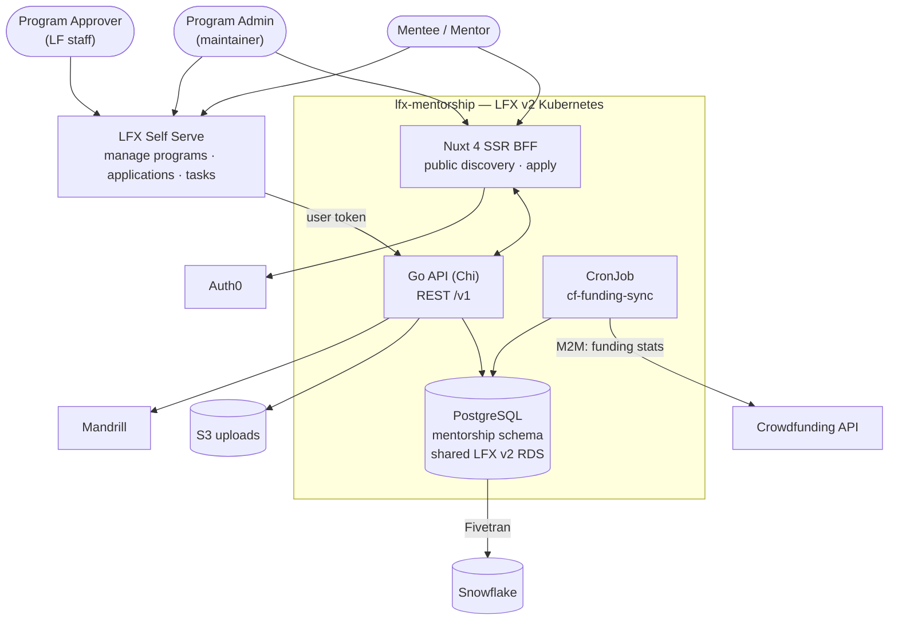

<!--
Copyright The Linux Foundation and each contributor to LFX.
SPDX-License-Identifier: CC-BY-4.0
-->

# LFX Mentorship — Architecture

**Scope of this file.** This is not the internal design of the Go service or the Nuxt app — it is
the **cross-component contract**: how Mentorship plugs into the rest of the LFX platform, who is
allowed to do what, and which of those contracts are agreed but not yet built.

Companion documents, all narrower than this one:

| Document | Purpose |
|---|---|
| [`docs/rewrite/01-current-system.md`](docs/rewrite/01-current-system.md) | The legacy platform being replaced |
| [`docs/rewrite/02-target-architecture.md`](docs/rewrite/02-target-architecture.md) | Full rewrite proposal (data model, repo layout, scope exclusions) |
| [`docs/rewrite/03-migration-plan.md`](docs/rewrite/03-migration-plan.md) | Migration phases |
| [`CLAUDE.md`](CLAUDE.md) | Conventions for working in this repo |

This file is a **roll-up of current state**, in the same spirit as `README.md`. Where the code,
the spec directory, or `docs/rewrite/` disagree with this file, that is a defect in one of them —
say so in review rather than letting the drift stand.

**Last verified against the code**: 2026-09-04 (`f5970d1`).

---

## 1. System context



**Two front ends, one API.** The public Nuxt site owns unauthenticated discovery and the apply
flow. Everything authenticated and management-shaped lives in LFX Self Serve. Both talk to the
same `/v1` surface; there is no separate admin API.

---

## 2. Components owned by this repo

| Component | Runtime | Responsibility |
|---|---|---|
| `mentorship-api` | Go 1.25, Chi v5, pgx v5 | The entire REST surface (`/v1`) and all business rules |
| `mentorship-frontend` | Nuxt 4 SSR | Public site + BFF session handling |
| `cf-funding-sync` | Go CronJob | Hourly refresh of cached Crowdfunding stats |
| `mentorship` schema | PostgreSQL | System of record |

Deployed by in-repo Helm charts through ArgoCD ([lfx-v2-argocd](https://github.com/linuxfoundation/lfx-v2-argocd)).
As of 2026-09-04 the ArgoCD wiring for `lfx-mentorship-backend` and `lfx-mentorship-frontend` lives
only on the unmerged branch `feat/mentorship-dev-deployment` (`values/dev` + `values/global`);
nothing mentorship-related is on `main`. **No environment is deployed via GitOps yet**, and
staging/prod values do not exist.

---

## 3. Authorization — the contract, and where it actually stands

This is the part of the architecture with the largest gap between agreed and built. It is stated
plainly here rather than buried, because everything else in the platform depends on getting it right.

### 3.1 Agreed direction

Mentorship goes **behind the LFX v2 API Gateway (Heimdall), authorizing against OpenFGA**, from the
start — rather than shipping bespoke auth and retrofitting later. Decided in architecture review on
2026-09-03 with Eric Searcy and Jordan Evans. Consequences agreed in that review:

- **Applications are their own FGA type.** Not an attribute of a program.
- **There is no `mentorship_super_admin`.** LF staff reach everything through the existing
  project `writer` relation. A new global role for the same population would be redundant, and
  `writer` is already the population that can grant roles to others.
- **Program approval is not project-scoped.** Approval is performed by a single global population
  (currently one person), so it is a **global team membership check** on the approve endpoint —
  the same pattern used for SurveyMonkey template managers — not a relation on `project`.
- **A project-level program admin relation is needed.** Someone who can manage *all* mentorship
  programs for a project, including creating new ones, without being a full project admin. This
  must surface in the Self Serve project permissions page alongside viewer/manager, not in a
  separate mentorship-only UI. Naming to be confirmed with the project-lens owners.
- **`task` may not need to be its own FGA type.** It only earns one if a task can be assigned to
  someone who is not already a mentor or mentee on the parent application. Currently it cannot,
  so task permissions can derive from `application`. Revisit if assignment widens.

### 3.2 Proposed FGA types

Not yet in [`model.fga`](https://github.com/linuxfoundation/lfx-v2-helm/blob/main/charts/lfx-platform/files/model.fga) — this is the shape to review, and it is
deliberately consistent with how `survey` derives from `project`:

```
type mentorship_program
  relations
    define project: [project]
    # project writers manage every program on the project; program_admin is the
    # narrower, mentorship-only grant surfaced in the project permissions page.
    define program_admin: [user] or writer from project
    define mentor: [user]
    define writer: program_admin
    define auditor: writer or mentor or auditor from project
    define viewer: [user:*] or auditor

type mentorship_application
  relations
    define program: [mentorship_program]
    # the mentee who submitted it
    define owner: [user]
    define writer: writer from program
    # mentors evaluate applications; the applicant sees their own
    define auditor: owner or writer or mentor from program
```

Program approval is **not** modelled above by design: it is a global team check on
`POST /v1/programs/{id}/approve`.

### 3.3 What is actually implemented today

The running service **authenticates but barely authorizes**. Verified in `f5970d1`:

- `backend/internal/infrastructure/auth/jwt.go` validates Auth0 JWTs and populates a principal.
  Its `Middleware` performs **no scope check and no object check** — `ScopeMe` is declared and
  `HasScope` exists, but no route calls it.
- `backend/cmd/mentorship-api/server.go` guards the write routes with nothing but that middleware.
  Handlers null-check the principal and return 401; none compares it to the resource.
- Real authorization exists in exactly two services, hand-rolled: `task_service.go` (assignee vs.
  reviewer, program membership) and `application_service.go` (only the applicant may withdraw).
- `program_service.go`, `program_term_service.go`, `program_member_service.go`,
  `user_service.go` and `user_profile_service.go` contain **no authorization at all**.
  `ProgramService.Delete(ctx, id)` does not receive a principal, so it structurally cannot check one.
- The Helm chart exposes a plain `ingress.yaml`. There is **no Heimdall ruleset, no HTTPRoute, and
  no OpenFGA client** anywhere in the repo.

**Therefore, as deployed to dev: any authenticated LF user can create, modify, or delete any
program, term, member, or user profile.** This is acceptable only for a dev environment with no
real data. It is a release blocker for staging and prod, and it is the single most important
thing to close.

### 3.4 Authentication (built, and unchanged)

- Users: OAuth2 PKCE via Auth0; tokens in HTTP-only session cookies, never exposed to JS.
- LFID from the `https://sso.linuxfoundation.org/claims/username` claim.
- Self Serve obtains a token for the Mentorship audience and forwards it — the mechanism it
  already uses for Crowdfunding.
- Mentor invite acceptance (`POST /v1/mentor-invites/{token}/accept`) is deliberately
  **unauthenticated**: the token in the path is the credential. Review its entropy, single-use
  semantics, and expiry as part of the authorization work.

---

## 4. External contracts

| Counterparty | Direction | Mechanism | Failure behavior |
|---|---|---|---|
| **Auth0** | inbound | PKCE for users, client-credentials for M2M, JWKS validation | Requests rejected 401 |
| **Crowdfunding API** | Mentorship → CF | Hourly CronJob, M2M token, caches stats in `program_funding_stats` | Last cached values served |
| **Snowflake** | Mentorship → SF | Fivetran Postgres connector; `fivetran_mentorship_*` dbt models repointed | Analytics-plane only — never in the serving path |
| **Mandrill** | Mentorship → Mandrill | All transactional email. SES is dropped | Email lost; no retry queue today |
| **S3** | Mentorship → S3 | Program logos, task submissions via presigned URLs | — |
| **LFX Self Serve** | SS → Mentorship | User token against `/v1` | — |

**Direction of dependency matters:** Mentorship reads from Crowdfunding, never the reverse.
Crowdfunding consumes Mentorship data only through Snowflake, so nothing in Mentorship's serving
path may depend on Crowdfunding being up.

---

## 5. Data ownership

PostgreSQL (`mentorship` schema, shared LFX v2 RDS) is the system of record, replacing 8 DynamoDB
tables and 30 GSIs. Full ERD in
[`docs/rewrite/02-target-architecture.md`](docs/rewrite/02-target-architecture.md#data-model-proposal-level-erd).

Cross-component notes:

- **Users are mirrored, not owned.** `users.username` holds the LFID. Auth0/LF SSO remains
  authoritative for identity.
- **`programs.cf_initiative_id`** is the only foreign reference into Crowdfunding.
- **`program_funding_stats`** is a cache, never authoritative. It may be stale.
- **Search is Postgres FTS** (`tsvector` + GIN). Elasticsearch is dropped.
- Mentorship publishes **no NATS messages** and registers **nothing with the indexer or
  fga-sync services**. If Mentorship objects should be searchable in the v2 platform, that is
  unbuilt work, not an oversight in this document.

---

## 6. Known gaps

Tracked here so no one builds against a contract that does not exist yet.

| Gap | Status |
|---|---|
| **No Heimdall ruleset, no OpenFGA integration** | Agreed direction, nothing built. Blocks staging/prod. See §3.3 |
| **Write endpoints have no object-level authorization** | Blocks staging/prod. See §3.3 |
| **`mentorship_program` / `mentorship_application` types absent from `model.fga`** | Needs a PR to [lfx-v2-helm](https://github.com/linuxfoundation/lfx-v2-helm) |
| **Project-level program-admin relation** | Needs the `project` type extended and the Self Serve permissions page updated |
| **Program-approval global team** | Team not created; no approve endpoint exists |
| **ArgoCD wiring unmerged** | Dev values exist only on branch `feat/mentorship-dev-deployment`; nothing on `main`. Staging/prod values do not exist |
| **`term-status` and `task-submission-status` CronJobs** | Planned in `02-target-architecture.md`; only `cf-funding-sync` is built |
| **No architecture-review label on this repo** | `lfx-self-serve` has `architecture-review`; the mentorship repos have none |

---

## 7. Changing this file

This file is owned by the architecture review team. `CODEOWNERS` carries a line that overrides the
`*` rule, so any PR touching cross-component contracts, authorization, or external dependencies
gets an architecture review through the normal PR process:

```
*                 @linuxfoundation/lfx-mentorship
/ARCHITECTURE.md  @linuxfoundation/lfx-architecture-team
```

Two practical limits worth knowing: a code owner cannot approve their own PR, so the team needs
more than one member for the guard to function; and the guard only bites if code-owner review is
required by branch protection.

Update this file in the **same PR** as the change it describes. A contract change that lands
without the corresponding edit here is incomplete.
