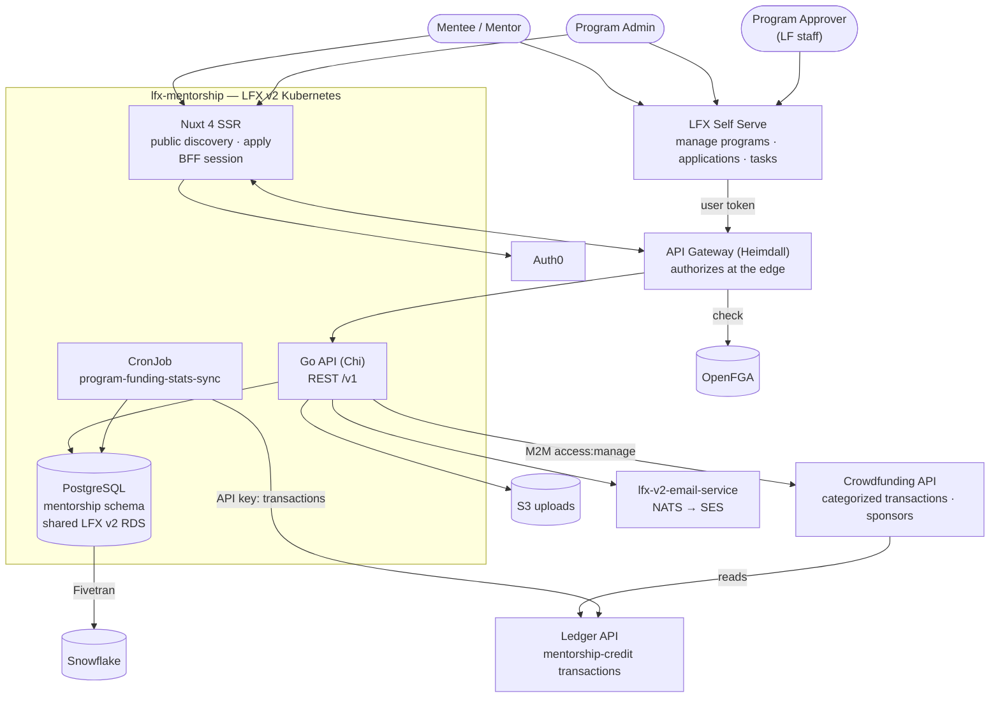

<!--
Copyright The Linux Foundation and each contributor to LFX.
SPDX-License-Identifier: MIT
-->

# LFX Mentorship — Architecture

**Scope of this file.** This is not the internal design of the Go service or the Nuxt app — it is
the **cross-component contract**: how Mentorship plugs into the rest of the LFX platform, who is
allowed to do what, and which services own what.

**This file describes the target architecture**, not the current state of the build. It is the
contract to build against. Implementation status — what is built, what is half-built, and what is a
live defect — belongs in issues and PRs, not here, so that this file stays stable as the code moves.
The one exception is §6, which records contracts that do **not** exist yet, precisely so that nobody
builds against them.

> **Authorization is the largest gap between this document and the running service.** The write
> paths do not yet perform object-level authorization, and the edge described in §3 is not deployed.
> Treat §3 as the specification, not a description of today's behavior.

Companion documents, all narrower than this one:

| Document | Purpose |
|---|---|
| [`docs/rewrite/00-current-authz-relations.md`](docs/rewrite/00-current-authz-relations.md) | The legacy authorization baseline the new model is validated against |
| [`docs/rewrite/01-current-system.md`](docs/rewrite/01-current-system.md) | The legacy platform being replaced |
| [`docs/rewrite/02-target-architecture.md`](docs/rewrite/02-target-architecture.md) | Full rewrite proposal (data model, repo layout, scope exclusions) |
| [`docs/rewrite/03-migration-plan.md`](docs/rewrite/03-migration-plan.md) | Migration phases |
| [`docs/rewrite/04-authorization-model.md`](docs/rewrite/04-authorization-model.md) | **The FGA model** — types, relations, and the Postgres/FGA split |
| [`docs/rewrite/05-heimdall-gateway.md`](docs/rewrite/05-heimdall-gateway.md) | The gateway edge that consumes it, and the cutover sequence |
| [`docs/rewrite/06-route-matrix.md`](docs/rewrite/06-route-matrix.md) | **The per-route matrix** — every route's authenticator, authorizer, object extraction and relation; the implementation contract for the RuleSets |
| [`CLAUDE.md`](CLAUDE.md) | Conventions for working in this repo |

`00`, `04`, `05` and `06` were added by
[lfx-mentorship#119](https://github.com/linuxfoundation/lfx-mentorship/pull/119), which merged on
2026-09-15. `04`, `05` and `06` record decisions the Architecture team has resolved, but the model
they describe is not yet deployed; §3 below records the decisions they rest on and does not restate
the model.

Where the code, the spec directory, or `docs/rewrite/` contradict the *contract* stated here, that is
a defect in one of them — say so in review rather than letting the drift stand.

---

## 1. System context

**Two front ends, one API.** The public Nuxt site owns unauthenticated discovery and the apply flow;
everything authenticated and management-shaped lives in LFX Self Serve. Both talk to the same API
surface, and there is no separate admin API. This split is the reason the FGA model carries a public
wildcard on programs (§3.2) — one of the two front ends does not authenticate.

**The external path is `/mentorship/v1`, not `/v1`.** On the shared gateway host, `/v1/users` and
`/v1/programs` are too generic to claim at the root alongside project-service's `/projects/*` and
meeting-service's `/itx/*`, so the platform surface is
`https://lfx-api.{domain}/mentorship/v1/...`. The service is to mount that prefix itself — no Traefik
rewrite, matching every other v2 service — serving the bare `/v1` mount alongside it only until the
interim ingress is retired (`05` GW-1). **`/mentorship/v1` is the path to integrate against once it
is served; today the router mounts only `/v1` (§6).**

---

## 2. Components owned by this repo

| Component | Runtime | Responsibility |
|---|---|---|
| `mentorship-api` | Go 1.25, Chi v5, pgx v5 | The entire REST surface, mounted at `/mentorship/v1` (§1), and all business rules |
| `mentorship-frontend` | Nuxt 4 SSR | Public site, including BFF session handling for the apply flow |
| `program-funding-stats-sync` | Go CronJob | Hourly refresh of `program_funding_stats` from the Ledger API |
| `mentorship` schema | PostgreSQL | System of record |

Both services ship as in-repo Helm charts and are deployed by ArgoCD from
[lfx-v2-argocd](https://github.com/linuxfoundation/lfx-v2-argocd)
(`values/{global,dev,staging,prod}/lfx-mentorship-{backend,frontend}.yaml`). A push to `main`
publishes `:development` images that dev tracks by digest; a `v*.*.*` tag publishes semver images and
signed OCI charts, which staging and prod pin.

---

## 3. Authorization

This is the part of the architecture the rest of the platform most depends on getting right.

### 3.1 Agreed direction

Mentorship sits **behind the LFX v2 API Gateway (Heimdall), authorizing against OpenFGA**, from the
start — rather than shipping bespoke auth and retrofitting later. Decided in architecture review on
2026-09-03 with Eric Searcy and Jordan Evans. Consequences agreed in that review:

- **Applications are their own FGA type.** Not an attribute of a program.
- **There is no `mentorship_super_admin`.** LF staff reach everything through the existing
  project `writer` relation. A new global role for the same population would be redundant, and
  `writer` is already the population that can grant roles to others.
- **Program approval is not project-scoped.** Approval is performed by a single global population
  (currently one person), so it is a **global team membership check** on the approve endpoint —
  the same pattern used for SurveyMonkey template managers — not a relation on `project`.
- **A project-level program admin relation is needed.** Someone who can manage *all* mentorship
  programs for a project, including creating new ones, without being a full project admin. This
  must surface in the Self Serve project permissions page alongside viewer/manager, not in a
  separate mentorship-only UI. Naming to be confirmed with the project-lens owners.
- **`task` is its own FGA type, parented on the application.** The 2026-09-03 call left this open —
  a task would earn a type only if it could be assigned to someone who is not already a mentor or
  mentee on the parent application. A second Architecture review settled it the other way: tasks get
  `mentorship_task`, whose parent reference is the **application**, completing one inheritance chain
  project → program → application → task. See [`04` decision 2](docs/rewrite/04-authorization-model.md).

### 3.2 The FGA model lives in `04` and `06`, not here

**[`docs/rewrite/04-authorization-model.md`](docs/rewrite/04-authorization-model.md) is the single
source of truth for the types, relations, and lifecycle emissions, and
[`06-route-matrix.md`](docs/rewrite/06-route-matrix.md) is the single source of truth for the
route-by-route mapping the RuleSets implement.** Neither is restated here: the model has already been
revised three times across two Architecture reviews, and a second copy maintained separately would
drift from it. Four mentorship-owned types are proposed there — `mentorship_program`,
`mentorship_application`, `mentorship_task`,
`mentorship_approver_team` — plus two relations appended to the existing `project` type
(`mentorship_program_admin`, `mentorship_program_creator`). Landing them in
[`model.fga`](https://github.com/linuxfoundation/lfx-v2-helm/blob/main/charts/lfx-platform/files/model.fga)
is PR 1 of the five-PR path in `04 §implementation path`, gated on `tests.yaml` passing.

What belongs in *this* document is the handful of model properties that are cross-component contracts
rather than schema:

- **Program `viewer` carries a `[user:*]` wildcard, and it is load-bearing.** It is not "always
  public" — fga-sync writes it as a **per-object tuple** only while the program is `published`, and
  re-emits without it on the way back down to `archived`/`hidden`. It exists because Mentorship ships
  two front ends and only one of them authenticates: drop the wildcard and every request the public
  Nuxt site makes is denied at the edge. Any model variant that removes it loses one of the two UIs.
- **Approval is held deliberately outside the program's own relations.** The decision route checks
  `member` on the static object `mentorship_approver_team:global`. Folding it into `writer` would let
  every program admin approve their own program, so `PATCH /programs/{uid}` must reject a `status`
  field rather than silently ignoring it.
- **Project `writer` reaches everything by inheritance**, three levels down to tasks. There is no
  `mentorship_super_admin`, per §3.1.
- **`mentorship_program_admin` is written by this service, but only project-service can keep it
  alive.** It sits on the `project` type, and project-service emits full-state `update_access` for
  `project` objects — so a tuple Mentorship writes is deleted by the next project update unless
  project-service names the relation in `exclude_relations`. That one field is the whole ask (`04`
  AQ-4): project-service does not own, store or expose the grant, and Mentorship continues to write
  and remove the tuple itself via `member_put`/`member_remove`, which touch only the relations they
  name. Adding the relation to `model.fga` is necessary but not sufficient; the exclusion is the one
  item a model merge alone does not make functional. Its sibling `mentorship_program_creator` is a
  pure computed union, so it needs no tuples at all.

### 3.3 Service-side invariants the edge cannot enforce

Heimdall authorizes the object named in the request. Three classes of check therefore stay in the
service, and they are contracts rather than implementation details:

- **Parent-child invariants on parent-authorized routes.** Wherever the edge checks a relation on a
  *parent* object while the mutation targets a *child* by its own ID, the service must verify the
  child belongs to that parent — otherwise the edge authorized a different object than the one being
  mutated. Without it, a `writer` on program A passes the edge check and then mutates a member or
  skill of program B. This is referential integrity on the request, not an access decision, which is
  why FGA holds no tuple for it (`04` decision 7). It applies to every parent-authorized route,
  including any child resource added later.
- **Canonical UIDs on authorized routes.** Tuples are keyed by UID, so a RuleSet built from a raw
  `{id}` capture that may be a slug would check a nonexistent object and deny a valid URL.
  `GET /v1/programs/resolve/{id}` returns the canonical `program.ID` for this purpose — a
  prerequisite for the RuleSets (`05` GW-2), not a cutover detail.
- **The raw user, profile, application and task reads are gated, not filtered.** They leave the
  public group entirely rather than having fields stripped, because a blocklist rots the first time
  a column is added (`05` GW-8). `User.email`, `User.lfid` and `UserProfile.phone`, `address`,
  `demographics`, `socioeconomics` therefore never reach an unauthenticated route at all. A future
  public profile page gets its own allowlist DTO, the way the mentor catalog does.
- **The anonymous route list is `06`, not a rule of thumb.** It is wider than the catalog: program
  reads by uid, terms, funding-stats, transactions, sponsors and the `GET /mentees/{id}` /
  `/mentors/{id}` directory details are all anonymous too (`06` §route matrix, and §4 below on the
  Crowdfunding-backed pair). The catalog routes serve purpose-built DTOs — `MenteeItem` and its
  mentor equivalent select `user_id`, name, avatar, introduction and skills; the `*Detail` DTOs add
  `github_url`, `linkedin_url` and program history, which are public by intent.
- **Where a route is public but one field is not, redaction in the handler is correct.**
  `GET /v1/programs/{uid}/members` stays public with `Email` nil'd in the handler (`05` GW-9): the
  field is withheld from every caller the route admits, so splitting the route by audience would be
  wrong (`06`). Redaction is the exception for a single legacy invite artifact, not the general
  pattern — the general pattern is the two bullets above.

### 3.4 Authentication

- Users: OAuth2 PKCE via Auth0, tokens in HTTP-only session cookies, never exposed to JS.
- LFID from the `https://sso.linuxfoundation.org/claims/username` claim (the claim name; the column
  that stores it is `users.lfid` — §5).
- Self Serve obtains a token for the Mentorship audience and forwards it — the mechanism it
  already uses for Crowdfunding.
- Mentor invite acceptance (`POST /v1/mentor-invites/{token}/accept`) **requires authentication**,
  and carries no FGA check — `allow_all` at the edge, because the invitee holds no relation on the
  program yet. Ownership is enforced in the service: the token HMACs the `(programID, userID)` pair,
  so it names its own subject, and the handler **rejects the request unless that subject matches the
  authenticated principal** (`04` AQ-7, `06`). Without that binding, `allow_all` would let any
  authenticated caller accept a known invitation. The token's entropy, single-use semantics, and
  expiry back the binding; they do not replace it.
- **There is a total authentication bypass for local development, and it must never reach a deployed
  environment.** `DISABLED_MOCK_LOCAL_PRINCIPAL` sets a static principal and
  `ALLOW_MOCK_LOCAL_PRINCIPAL_BYPASS=true` arms it
  ([`jwt.go:40-96,143`](backend/internal/infrastructure/auth/jwt.go)); together they skip JWT
  validation entirely and every request runs as that principal. Both are required, the principal is
  whitespace-normalised so a blank-ish value cannot arm it, and
  [lfx-mentorship#148](https://github.com/linuxfoundation/lfx-mentorship/pull/148) adds a chart
  render-time guard that refuses to template unless `allowLocalAuthBypass=true` is passed explicitly —
  checked in both `config:` and `env:`. The guard is the only thing standing between a stray values
  entry and an unauthenticated production API, so it is a cross-component contract, not a local
  convenience: **never set either key in an ArgoCD values file.**

---

## 4. External contracts

| Counterparty | Direction | Mechanism | Failure behavior |
|---|---|---|---|
| **Auth0** | inbound | Inbound token validation only: OAuth2 PKCE for users, JWKS signature and audience checks. Outbound M2M token acquisition belongs to the Crowdfunding row below | Requests rejected 401 |
| **Ledger API** | Mentorship → Ledger | Hourly CronJob, `LEDGER_API_KEY` bearer token; reads mentorship-credit transactions and caches them in `program_funding_stats`. **Direct, not proxied** — `LEDGER_BASE_URL` points at the Ledger service itself (`https://ledger.dev.platform.linuxfoundation.org` in dev), and this repo has its own client ([`clients/ledger.go`](backend/internal/infrastructure/clients/ledger.go)) | Last cached values served |
| **Crowdfunding API** | Mentorship → CF → Ledger | Request-time call from `ProgramService`, Auth0 M2M token (`access:manage`); fetches categorized transactions and sponsors. **Crowdfunding is a proxy for the Ledger on this path**: `GET /v1/initiatives/{id}/transactions` is served by CF's `InitiativeService` calling the Ledger's `/transactions` ([`initiative_service.go`](https://github.com/linuxfoundation/lfx-crowdfunding/blob/main/backend/internal/service/initiative_service.go)), and `ProgramService.GetCategorizedTransactions` proxies that contract. The categorization and sponsor resolution are CF's own, which is why this does not collapse into the direct Ledger call above | `ErrUpstreamUnavailable` |
| **Snowflake** | Mentorship → SF | Fivetran Postgres connector; `fivetran_mentorship_*` dbt models repointed | Analytics-plane only — never in the serving path |
| **lfx-v2-email-service** | Mentorship → NATS `lfx.email-service.send_email` | The platform rail for all transactional email: a request/reply relay over Amazon SES, imported as `lfx-v2-email-service/pkg/api`. It accepts **pre-rendered** `html`/`text` only — no templating — so Mentorship owns and renders its own templates. Not Mandrill: that is the legacy rail and is out of scope ([linuxfoundation/lfx-self-serve#2188](https://github.com/linuxfoundation/lfx-self-serve/issues/2188)) | Log and continue — a failed send must not fail the business operation |
| **S3** | Mentorship → S3 | Program logos and task submissions via presigned URLs | — |
| **LFX Self Serve** | SS → Mentorship | User token against `/mentorship/v1` on the shared gateway host (§1) | — |

Two Ledger upstreams, not one: the cache job and the request-time call go to **different services
with different credentials**. Do not implement against the wrong one.

**Direction of dependency matters, and it is asymmetric — state both halves:**

- **Crowdfunding does not depend on Mentorship at request time.** It consumes Mentorship data only
  through Snowflake, so nothing in *Crowdfunding's* serving path waits on this service.
- **Mentorship does depend on Crowdfunding at request time.** `GET /v1/programs/{id}/transactions`
  and `/sponsors` call Crowdfunding synchronously and return `ErrUpstreamUnavailable` when it is
  absent. Both are **public** routes, so a Crowdfunding outage degrades unauthenticated pages.

Treat Crowdfunding as a live serving-path dependency for those two endpoints, and keep it out of the
path for everything else. Funding *stats* are the safe pattern — cached by the CronJob and served
stale rather than fetched inline.

---

## 5. Data ownership

PostgreSQL (shared LFX v2 RDS) is the system of record, replacing 8 DynamoDB tables and 30 GSIs.
Full ERD in
[`docs/rewrite/02-target-architecture.md`](docs/rewrite/02-target-architecture.md#data-model-proposal-level-erd).

Cross-component notes:

- **Users are mirrored, not owned.** `users.lfid` holds the LFID
  ([`001_initial.up.sql:38`](backend/db/migrations/001_initial.up.sql)). Auth0/LF SSO remains
  authoritative for identity.
- **`programs.project_uid` is the project join key**, and the FGA parent tuple
  `mentorship_program#project@project:{uid}` is derived from it — so every inherited permission in
  §3.2 depends on it. The column does not exist yet and its backfill is unowned (§6);
  `cii_project_id` is a *different*, legacy identifier and is not a substitute for it.
- **Crowdfunding is joined on program id, not on either project reference.**
  `ProgramService.GetCategorizedTransactions` passes the mentorship `programID` straight through as
  the initiative id, so the two systems are coupled on program id. Worth settling deliberately
  rather than inheriting.
- **`program_funding_stats`** is a cache, never authoritative. It may be stale.
- **Search is Postgres full-text** (`tsvector` + GIN) and Elasticsearch is dropped from scope — but
  the `tsvector` column and GIN index are not in any migration yet (§6), so nothing may assume
  full-text semantics such as ranking or stemming today.
- **FGA tuples are emitted through a transactional outbox.** A Postgres commit and a NATS publish
  cannot be made atomic, so each state change records a dirty-object marker in the same transaction
  and a relay re-derives the payload from current Postgres state at send time. It never replays a
  stored one: the `GenericFGAMessage` envelope carries no object version, so a stale full-state
  payload retried after a newer revocation would restore exactly the tuple that was revoked.
  fga-sync registration is PR 2 of the five-PR path in `04`.

---

## 6. Contracts that do not exist yet

Listed so that nobody builds against them. Each is agreed in principle and unowned or unbuilt in
practice — which makes them different from ordinary backlog items.

| Contract | What is missing |
|---|---|
| **The four `mentorship_*` FGA types** | Absent from `model.fga`. PR 1 of the five-PR path in [`04 §implementation path`](docs/rewrite/04-authorization-model.md); the merge gate is `tests.yaml` passing, not that the DSL parses |
| **Project-level program-admin relation** | Needs the `project` type extended *and* project-service to add `mentorship_program_admin` to its `update_access` `exclude_relations` — Mentorship writes the tuple itself, but without the exclusion the next project update deletes it (`04` AQ-4, mandatory PR 5). The Self Serve permissions page also needs updating |
| **Program-approval global team** | The team does not exist and there is no approve endpoint. `04` AQ-8 leaves the roster owner open — "no owner re-checks that a global tuple still exists" is the operational risk on the one guard protecting publication |
| **`/mentorship/v1` mount** | The router serves only `/v1` (`backend/cmd/mentorship-api/server.go`); the platform prefix lands with cutover step 2 (`05` GW-1). §1 names it as the integration target, so nothing should be pointed at it yet |
| **`tasks.application_id` as a parent** | The column is nullable with `ON DELETE SET NULL` ([`001_initial.up.sql:208`](backend/db/migrations/001_initial.up.sql)), but task permissions inherit through the parent application (`04` decision 2). Needs an unmapped-task report, then `NOT NULL` and `ON DELETE CASCADE` ([`02`](docs/rewrite/02-target-architecture.md)); until then an orphaned task inherits no reviewer access |
| **`programs.project_uid`** | The column does not exist; only the unrelated legacy `cii_project_id` does. Needs a nullable-first migration, an ETL from the legacy `lfProjectId`, and an unmapped-program report before it can be `NOT NULL` ([`03 §migration plan`](docs/rewrite/03-migration-plan.md)). Until it lands, the project → program FGA parent tuple cannot be derived and no inherited permission in §3.2 resolves |
| **Postgres full-text search** | No `tsvector` column or GIN index in any migration, so §5's full-text contract is a target with no schema behind it |
| **Indexer registration** | Mentorship registers nothing with the indexer. If Mentorship objects should be searchable platform-wide, that work has no owner |
| **Staging and prod ArgoCD values** | Only `values/{global,dev}` exist for this service |
| **`term-status` and `task-submission-status` CronJobs** | Planned in `02-target-architecture.md`; only `program-funding-stats-sync` is specified in detail |
