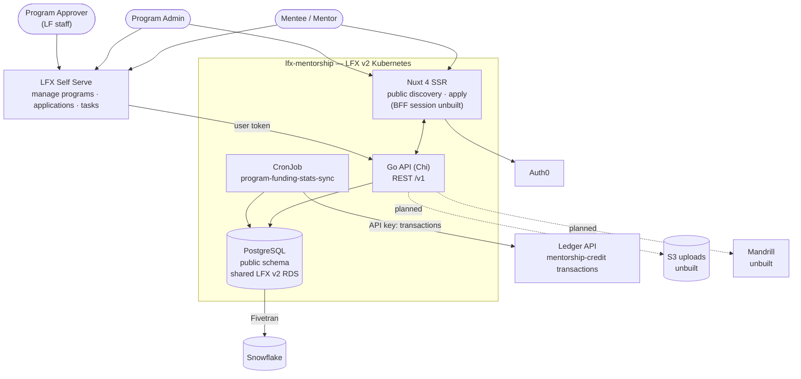

<!--
Copyright The Linux Foundation and each contributor to LFX.
SPDX-License-Identifier: MIT
-->

# LFX Mentorship — Architecture

**Scope of this file.** This is not the internal design of the Go service or the Nuxt app — it is
the **cross-component contract**: how Mentorship plugs into the rest of the LFX platform, who is
allowed to do what, and which of those contracts are agreed but not yet built.

Companion documents, all narrower than this one:

| Document | Purpose |
|---|---|
| [`docs/rewrite/00-current-authz-relations.md`](docs/rewrite/00-current-authz-relations.md) | The legacy authorization baseline the new model is validated against |
| [`docs/rewrite/01-current-system.md`](docs/rewrite/01-current-system.md) | The legacy platform being replaced |
| [`docs/rewrite/02-target-architecture.md`](docs/rewrite/02-target-architecture.md) | Full rewrite proposal (data model, repo layout, scope exclusions) |
| [`docs/rewrite/03-migration-plan.md`](docs/rewrite/03-migration-plan.md) | Migration phases |
| [`docs/rewrite/04-authorization-model.md`](docs/rewrite/04-authorization-model.md) | **The FGA model** — types, relations, the Postgres/FGA split, and which relation each route checks |
| [`docs/rewrite/05-heimdall-gateway.md`](docs/rewrite/05-heimdall-gateway.md) | The gateway edge that consumes it, and the cutover sequence |
| [`CLAUDE.md`](CLAUDE.md) | Conventions for working in this repo |

`00`, `04` and `05` are added by [lfx-mentorship#119](https://github.com/linuxfoundation/lfx-mentorship/pull/119),
which is still under Architecture-team review — **so the links to them above and in §3 resolve only
once that PR merges, and it should merge first.** `04` and `05` remain proposals even then; §3 below
records the decisions they rest on and does not restate the model.

This file is a **roll-up of current state**, in the same spirit as `README.md`. Where the code,
the spec directory, or `docs/rewrite/` disagree with this file, that is a defect in one of them —
say so in review rather than letting the drift stand.

**Last verified against the code**: 2026-09-10 (`f951be1`), including the §4 external contracts and
the §5 column names against `001_initial.up.sql`. Cross-repo state (ArgoCD, Auth0) verified the same
day.

---

## 1. System context



**Two front ends, one API — as intended.** The public Nuxt site is to own unauthenticated
discovery and the apply flow; everything authenticated and management-shaped is to live in LFX
Self Serve. Both talk to the same `/v1` surface, and there is no separate admin API.

That is the target split, not today's behavior. The Nuxt app has no session handling yet
(`frontend/app/composables/useAuth.ts` sets `isAuthEnabled = false` and the auth plugin forces a
signed-out state), so the authenticated apply flow does not exist there. And the API does not yet
enforce the split in the other direction either — several application and task reads are served
unauthenticated (§3.3).

---

## 2. Components owned by this repo

| Component | Runtime | Responsibility |
|---|---|---|
| `mentorship-api` | Go 1.25, Chi v5, pgx v5 | The entire REST surface (`/v1`) and all business rules |
| `mentorship-frontend` | Nuxt 4 SSR | Public site. BFF session handling is planned, not built — see §1 |
| `program-funding-stats-sync` | Go CronJob | Hourly refresh of `program_funding_stats` from the Ledger API |
| `public` schema | PostgreSQL | System of record. A dedicated `mentorship` schema is the target (`02-target-architecture.md`); the migration creates no schema, so the tables are in `public` today |

Deployed by in-repo Helm charts through ArgoCD ([lfx-v2-argocd](https://github.com/linuxfoundation/lfx-v2-argocd)).

**The dev wiring is half-landed, and the two halves are in different repos.** On the ArgoCD side,
[lfx-v2-argocd#1453](https://github.com/linuxfoundation/lfx-v2-argocd/pull/1453) merged on 2026-09-10:
`values/{dev,global}/lfx-mentorship-{backend,frontend}.yaml`, the backend's ExternalSecret/SecretStore,
the image-updater configs, and both entries in `apps/dev/lfx-v2-applications.yaml` are on `main`.
Those entries point at chart paths in *this* repo — and only `backend/charts/lfx-mentorship-backend`
exists on `main` today. `frontend/charts/lfx-mentorship-frontend` arrives with
[lfx-mentorship#148](https://github.com/linuxfoundation/lfx-mentorship/pull/148), still open, so dev is
currently wired to a frontend chart path that does not resolve. Staging/prod values do not exist.

---

## 3. Authorization — the contract, and where it actually stands

This is the part of the architecture with the largest gap between agreed and built. It is stated
plainly here rather than buried, because everything else in the platform depends on getting it right.

### 3.1 Agreed direction

Mentorship goes **behind the LFX v2 API Gateway (Heimdall), authorizing against OpenFGA**, from the
start — rather than shipping bespoke auth and retrofitting later. Decided in architecture review on
2026-09-03 with Eric Searcy and Jordan Evans. Consequences agreed in that review:

- **Applications are their own FGA type.** Not an attribute of a program.
- **There is no `mentorship_super_admin`.** LF staff reach everything through the existing
  project `writer` relation. A new global role for the same population would be redundant, and
  `writer` is already the population that can grant roles to others.
- **Program approval is not project-scoped.** Approval is performed by a single global population
  (currently one person), so it is a **global team membership check** on the approve endpoint —
  the same pattern used for SurveyMonkey template managers — not a relation on `project`.
- **A project-level program admin relation is needed.** Someone who can manage *all* mentorship
  programs for a project, including creating new ones, without being a full project admin. This
  must surface in the Self Serve project permissions page alongside viewer/manager, not in a
  separate mentorship-only UI. Naming to be confirmed with the project-lens owners.
- **`task` is its own FGA type, parented on the application.** The 2026-09-03 call left this open —
  a task would earn a type only if it could be assigned to someone who is not already a mentor or
  mentee on the parent application. A second Architecture review settled it the other way: tasks get
  `mentorship_task`, whose parent reference is the **application**, completing one inheritance chain
  project → program → application → task. See [`04` decision 2](docs/rewrite/04-authorization-model.md).

### 3.2 The FGA model lives in `04`, not here

**[`docs/rewrite/04-authorization-model.md`](docs/rewrite/04-authorization-model.md) is the single
source of truth for the types, relations, route-to-relation mapping, and lifecycle emissions.** It is
not restated here: the model has already been revised three times across two Architecture reviews, and
a second copy under a different `CODEOWNERS` owner would drift from it — the failure mode §7 warns
about. Four mentorship-owned types are proposed there — `mentorship_program`,
`mentorship_application`, `mentorship_task`, `mentorship_approver_team` — plus two relations appended
to the existing `project` type (`mentorship_program_admin`, `mentorship_program_creator`). None are in
[`model.fga`](https://github.com/linuxfoundation/lfx-v2-helm/blob/main/charts/lfx-platform/files/model.fga)
yet; landing them is PR 1 of the four-PR path in `04 §implementation path`, gated on `tests.yaml`
passing.

What belongs in *this* document is the handful of model properties that are cross-component contracts
rather than schema:

- **Program `viewer` carries a `[user:*]` wildcard, and it is load-bearing.** It is not "always
  public" — fga-sync writes it as a **per-object tuple** only while the program is `published`, and
  re-emits without it on the way back down to `archived`/`hidden`. It exists because Mentorship ships
  two front ends and only one of them authenticates: drop the wildcard and every request the public
  Nuxt site makes is denied at the edge. Any model variant that removes it loses one of the two UIs.
- **Approval is held deliberately outside the program's own relations.** The decision route checks
  `member` on the static object `mentorship_approver_team:global`. Folding it into `writer` would let
  every program admin approve their own program, so `PATCH /programs/{uid}` must reject a `status`
  field rather than silently ignoring it.
- **Project `writer` reaches everything by inheritance**, three levels down to tasks. There is no
  `mentorship_super_admin`, per §3.1.
- **`mentorship_program_admin` must be owned by project-service, not this service.** It sits on the
  `project` type, and project-service emits full-state `update_access` for `project` objects — so a
  tuple written independently by Mentorship is deleted by the next project update. Adding the relation
  to `model.fga` is necessary but not sufficient; it needs an owner (`04` AQ-4), and it is the one item
  a model merge alone does not make functional. Its sibling `mentorship_program_creator` is a pure
  computed union, so it needs no tuples and no owner.

### 3.3 What is actually implemented today

The running service **authenticates but barely authorizes**. Re-verified in `f951be1`
(`program_service.go` has grown since `f5970d1` but still contains no principal or authorization check;
`ProgramService.Delete(ctx, id)` is unchanged):

- `backend/internal/infrastructure/auth/jwt.go` validates Auth0 JWTs and populates a principal.
  Its `Middleware` performs **no scope check and no object check** — `ScopeMe` is declared and
  `HasScope` exists, but no route calls it.
- `backend/cmd/mentorship-api/server.go` guards the write routes with nothing but that middleware.
  Handlers null-check the principal and return 401. A few go further: `application_handler.go`
  rejects a cross-user application listing with `ErrForbidden`
  ([`:70`](backend/internal/handler/application_handler.go)) and binds application ownership and the
  update actor to the principal rather than the request body ([`:116`, `:140`](backend/internal/handler/application_handler.go)).
  Those are the exceptions, not the rule.
- Hand-rolled checks exist in two services, and cover **selected transitions only, not the resource**:
  `task_service.go` (assignee vs. reviewer, program membership) and `application_service.go` (only the
  applicant may withdraw). The two delete paths differ, and the difference matters:
  - **Application deletion is guarded.** `ApplicationHandler.Delete` never calls
    `ApplicationService.Delete`; it routes through `Update` with the authenticated `ActorID`
    ([`application_handler.go:161`](backend/internal/handler/application_handler.go)), and the
    withdrawal guard rejects anyone but the applicant
    ([`application_service.go:255`](backend/internal/service/application_service.go)).
    `ApplicationService.Delete(ctx, id)` takes no actor but is **unreachable** — no route calls it.
    Dead code that looks like an exposed hole; worth deleting so it stops reading as one.
  - **Task deletion is open.** `TaskHandler.Delete` null-checks the principal and then calls
    `TaskService.Delete(ctx, id)`, which takes no actor
    ([`task_handler.go:141`](backend/internal/handler/task_handler.go)), so any authenticated user can
    delete any task.
- `program_service.go`, `program_term_service.go`, `program_member_service.go`,
  `user_service.go` and `user_profile_service.go` contain **no authorization at all**.
  `ProgramService.Delete(ctx, id)` does not receive a principal, so it structurally cannot check one.
- The Helm chart exposes a plain `ingress.yaml`. There is **no Heimdall ruleset, no HTTPRoute, and
  no OpenFGA client** anywhere in the repo.

**Therefore, as deployed to dev: any authenticated LF user can create, modify, or delete any
program, term, member, user profile, or task** — and can modify applications, though not withdraw
someone else's. This is acceptable only for a dev environment with no
real data. It is a release blocker for staging and prod, and it is the single most important
thing to close.

Three further gaps are specified in `04`/`05` and are **not** waiting on Heimdall — they are defects in
the service today, and two of them leak data:

- **Parent-authorized routes have no parent-child invariant.** `ProgramMemberHandler.Update` and
  `.Delete` act on `{memberId}` and discard the program `{id}`
  ([`program_member_handler.go:98,121`](backend/internal/handler/program_member_handler.go)); so does
  `ProgramHandler.DeleteSkill` on `{skillId}` alone
  ([`program_handler.go:262`](backend/internal/handler/program_handler.go)). Once a RuleSet checks `mentorship_program:{id}`, a
  `writer` on program A passes the edge check and then mutates a member or skill of program B. The
  check is referential integrity on the request, so it stays in the service — FGA holds no tuple
  saying "this member row belongs to that program" (`04` decision 7).
- **The unauthenticated read surface serves PII, and it is wider than single-record lookups.** The
  public group holds 29 `GET` routes ([`server.go:124-162`](backend/cmd/mentorship-api/server.go)).
  The PII-bearing ones:
  - **Bulk enumeration, no UID needed.** `GET /v1/users` and `/v1/user-profiles`
    ([`:126`, `:129`](backend/cmd/mentorship-api/server.go)) are *list* routes — anyone can page the
    whole directory. The serialized models carry `email` and `lfid`, and on the profile also `phone`,
    `address`, `demographics` and `socioeconomics`
    ([`user_profile.go:19-27`](backend/internal/domain/models/user_profile.go)). This is the most
    serious item on this page.
  - **Single-record lookups.** `/v1/users/{id}`, `/v1/user-profiles/{id}`, and
    `/v1/user-profiles/slug/{slug}` ([`:127`, `:130`, `:131`](backend/cmd/mentorship-api/server.go)) —
    the slug form needs no UID guess at all.
  - **Term-wide application and task listings.** `/v1/program-terms/{id}/applications` and
    `/v1/program-terms/{id}/tasks` ([`:154`, `:155`](backend/cmd/mentorship-api/server.go)) expose every
    application and task in a term, plus `/v1/applications/{id}`, `/v1/applications/{id}/tasks` and
    `/v1/tasks/{id}` ([`:157-159`](backend/cmd/mentorship-api/server.go)) — contradicting the
    applicant/admin/mentor-only rule.

  `05` GW-8 resolves these as "not yet gated — gate them". Remediation scope is the list routes and the
  term-wide listings, not only the by-UID reads; whichever way the public-directory product question
  goes, the public shape needs an explicit redaction contract rather than today's implicit exposure.
- **Program IDs resolve as UUID *or* slug, but tuples are keyed by UID.** A RuleSet built from the raw
  `{id}` capture would check `mentorship_program:{slug}`, find no tuple, and deny a valid URL. Slug
  resolution has to happen ahead of any check, via a public resolver route (`05` GW-2). This is a
  prerequisite for the RuleSets, not a cutover detail.

### 3.4 Authentication

Token validation is built; the browser-facing half is not.

- Users: OAuth2 PKCE via Auth0, tokens in HTTP-only session cookies, never exposed to JS. **This is
  the intended shape, and it is unbuilt in this repo** — the Nuxt app has no session handling and no
  `server/api/auth/*` routes (§1). Today the API is reached with a token minted elsewhere.
- LFID from the `https://sso.linuxfoundation.org/claims/username` claim (the claim name; the column
  that stores it is `users.lfid` — §5).
- Self Serve obtains a token for the Mentorship audience and forwards it — the mechanism it
  already uses for Crowdfunding.
- Mentor invite acceptance (`POST /v1/mentor-invites/{token}/accept`) is deliberately
  **unauthenticated**: the token in the path is the credential. Review its entropy, single-use
  semantics, and expiry as part of the authorization work.
- **There is a total authentication bypass for local development, and it must never reach a deployed
  environment.** `DISABLED_MOCK_LOCAL_PRINCIPAL` sets a static principal and
  `ALLOW_MOCK_LOCAL_PRINCIPAL_BYPASS=true` arms it
  ([`jwt.go:40-96,143`](backend/internal/infrastructure/auth/jwt.go)); together they skip JWT
  validation entirely and every request runs as that principal. Both are required, the principal is
  whitespace-normalised so a blank-ish value cannot arm it, and
  [lfx-mentorship#148](https://github.com/linuxfoundation/lfx-mentorship/pull/148) adds a chart
  render-time guard that refuses to template unless `allowLocalAuthBypass=true` is passed explicitly —
  checked in both `config:` and `env:`. The guard is the only thing standing between a stray values
  entry and an unauthenticated production API, so it is a cross-component contract, not a local
  convenience: **never set either key in an ArgoCD values file.**

---

## 4. External contracts

| Counterparty | Direction | Mechanism | Failure behavior |
|---|---|---|---|
| **Auth0** | inbound | PKCE for users, client-credentials for M2M, JWKS validation | Requests rejected 401 |
| **Ledger API** | Mentorship → Ledger | Hourly CronJob, `LEDGER_API_KEY` bearer token; reads mentorship-credit transactions and caches them in `program_funding_stats` | Last cached values served |
| **Crowdfunding API** | Mentorship → CF | Request-time call from `ProgramService`, Auth0 M2M token (`access:manage`); fetches categorized transactions and sponsors | Optional — the client is wired only when configured (`server.go:66`) |
| **Snowflake** | Mentorship → SF | Fivetran Postgres connector; `fivetran_mentorship_*` dbt models repointed | Analytics-plane only — never in the serving path |
| **Mandrill** | Mentorship → Mandrill | **Unbuilt.** Intended for all transactional email; SES is dropped. Today `server.go:60` wires `LogNotifier`, which only logs the event | No email is sent at all — see §6 |
| **S3** | Mentorship → S3 | **Unbuilt.** Intended for program logos and task submissions via presigned URLs. No S3 client, upload route, or presigner exists | — see §6 |
| **LFX Self Serve** | SS → Mentorship | User token against `/v1` | — |

Two upstreams, not one: the cache job and the request-time call go to **different services with
different credentials**. Do not implement against the wrong one.

**Direction of dependency matters, and it is asymmetric — state both halves:**

- **Crowdfunding does not depend on Mentorship at request time.** It consumes Mentorship data only
  through Snowflake, so nothing in *Crowdfunding's* serving path waits on this service.
- **Mentorship does depend on Crowdfunding at request time.** `GET /v1/programs/{id}/transactions`
  and `/sponsors` ([`server.go:148-149`](backend/cmd/mentorship-api/server.go)) call Crowdfunding
  synchronously and return `ErrUpstreamUnavailable` when it is absent
  ([`program_service.go:366`](backend/internal/service/program_service.go)). Both are **public**
  routes, so a Crowdfunding outage degrades unauthenticated pages.

Treat Crowdfunding as a live serving-path dependency for those two endpoints, and keep it out of the
path for everything else. Funding *stats* are the safe pattern — cached by the CronJob and served
stale rather than fetched inline.

---

## 5. Data ownership

PostgreSQL (shared LFX v2 RDS) is the system of record, replacing 8 DynamoDB
tables and 30 GSIs. The tables live in the `public` schema today; the dedicated `mentorship` schema
is a target the migration does not yet create (§2). Full ERD in
[`docs/rewrite/02-target-architecture.md`](docs/rewrite/02-target-architecture.md#data-model-proposal-level-erd).

Cross-component notes:

- **Users are mirrored, not owned.** `users.lfid` holds the LFID
  ([`001_initial.up.sql:30`](backend/db/migrations/001_initial.up.sql)). Auth0/LF SSO remains
  authoritative for identity.
- **`programs.cii_project_id`** is the only foreign project reference on a program. It is *not* the
  Crowdfunding join key: `ProgramService.GetCategorizedTransactions` passes the mentorship
  `programID` straight through as the initiative id
  ([`program_service.go:373`](backend/internal/service/program_service.go)), so the two systems are
  coupled on program id. Worth settling deliberately rather than inheriting.
- **`program_funding_stats`** is a cache, never authoritative. It may be stale.
- **Search is `ILIKE`, not full-text.** Postgres FTS (`tsvector` + GIN) is the target and
  Elasticsearch is dropped, but no migration defines a `tsvector` column or GIN index; repositories
  filter with `ILIKE` ([`program_repository.go:125`](backend/internal/infrastructure/db/program_repository.go),
  `user_repository.go:73`). Planned, not built — see §6.
- Mentorship publishes **no NATS messages** and registers **nothing with the indexer or
  fga-sync services** *today*. This is a statement of current state, not a target: `04` makes
  fga-sync registration PR 2 of its four-PR path, and specifies the emission path as a
  **transactional outbox** — a Postgres commit and a NATS publish cannot be made atomic, so each
  state change records a dirty-object marker in the same transaction and a relay re-derives the
  payload from current Postgres state at send time. It never replays a stored one: the
  `GenericFGAMessage` envelope carries no object version, so a stale full-state payload retried after
  a newer revocation would restore exactly the tuple that was revoked. If Mentorship objects should
  also be **searchable**, that remains unbuilt work with no owner.

---

## 6. Known gaps

Tracked here so no one builds against a contract that does not exist yet.

| Gap | Status |
|---|---|
| **No Heimdall ruleset, no OpenFGA integration** | Agreed direction, nothing built. Blocks staging/prod. See §3.3 |
| **Write endpoints have no object-level authorization** | Blocks staging/prod. See §3.3 |
| **The four `mentorship_*` types are absent from `model.fga`** | PR 1 of the four-PR path in [`04 §implementation path`](docs/rewrite/04-authorization-model.md); merge gate is `tests.yaml` passing, not that the DSL parses |
| **Project-level program-admin relation has no owner** | Needs the `project` type extended *and* project-service to emit it — it cannot be durably written by this service (`04` AQ-4). The Self Serve permissions page also needs updating |
| **Program-approval global team** | Team not created; no approve endpoint exists. `04` AQ-8 leaves the roster owner open — "no owner re-checks that a global tuple still exists" is the operational risk on the one guard protecting publication |
| **Parent-child invariant missing on parent-authorized routes** | Live defect, not blocked on Heimdall. See §3.3 |
| **Unauthenticated reads serve PII** | Live defect, and the largest one. `GET /v1/users` and `/v1/user-profiles` are unauthenticated **list** routes, so the whole directory (email, LFID, phone, address, demographics, socioeconomics) is pageable without a token; term-wide application/task listings are public too. Needs gating plus a redaction contract. See §3.3 |
| **Slug-or-UID program IDs are incompatible with FGA tuple keys** | Prerequisite for the RuleSets; needs a public slug-to-UID resolver. See §3.3 |
| **ArgoCD dev wiring is half-landed** | [lfx-v2-argocd#1453](https://github.com/linuxfoundation/lfx-v2-argocd/pull/1453) merged 2026-09-10, but its ApplicationSet entries point at a frontend chart path that only exists on [lfx-mentorship#148](https://github.com/linuxfoundation/lfx-mentorship/pull/148). Staging/prod values do not exist |
| **No transactional email** | `LogNotifier` logs every notification and sends nothing (`server.go:60`); no Mandrill adapter exists. Every invite, decline, and acceptance notice is silently dropped. See §4 |
| **No file uploads** | Program logos and task submissions need S3 presigned URLs; no S3 client, upload route, or presigner exists anywhere in the repo. See §4 |
| **Frontend has no session handling** | `isAuthEnabled = false` in `frontend/app/composables/useAuth.ts`; the authenticated apply flow does not exist on the public site. See §1 |
| **Search is `ILIKE`, not Postgres FTS** | No `tsvector` column or GIN index in any migration. Acceptable at current data volumes; revisit before launch. See §5 |
| **Tables are in `public`, not a `mentorship` schema** | The migration creates no schema. Cosmetic today, but it contradicts `02-target-architecture.md` and affects any cross-schema grant or Fivetran config. See §2 |
| **`term-status` and `task-submission-status` CronJobs** | Planned in `02-target-architecture.md`; only `program-funding-stats-sync` is built |
| **No architecture-review label on this repo** | `lfx-self-serve` has `architecture-review`; the mentorship repos have none |

---

## 7. Changing this file

This file is owned by the architecture review team. `CODEOWNERS` carries a line that overrides the
`*` rule:

```
*                 @linuxfoundation/lfx-mentorship
/ARCHITECTURE.md  @linuxfoundation/lfx-architecture-team
```

**Be clear about what that does and does not buy.** The pattern matches this file's path, so it
requests architecture-team review when *this file* changes. It does **not** fire on a
contract-changing code PR that omits this file — that PR matches only `*`. So the guard enforces
"review the doc when it is edited", not "review every contract change"; the rule below is a
convention the guard cannot enforce on its own. Extending ownership to the contract-bearing code
(the auth middleware, the outbound clients, the chart's routing) would close that hole, at the cost
of pulling the architecture team into routine PRs — worth deciding explicitly rather than assuming
the current line already covers it.

Two further limits: a code owner cannot approve their own PR, so the team needs more than one
member for the guard to function; and the guard only bites if code-owner review is required by
branch protection.

Update this file in the **same PR** as the change it describes. A contract change that lands
without the corresponding edit here is incomplete.
