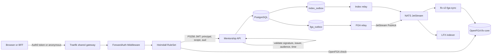

<!-- Copyright The Linux Foundation and each contributor to LFX. -->
<!-- SPDX-License-Identifier: MIT -->

# Heimdall and OpenFGA Implementation

This document is the operational README for Mentorship authentication and
authorization. It describes the implementation that exists in this repository,
the LFX product-service patterns it follows, the required configuration, the
current validation level, and the work remaining before gateway cutover.

For the detailed relation model and route-by-route decisions, see the
[authorization model](rewrite/04-authorization-model.md),
[gateway design](rewrite/05-heimdall-gateway.md),
[route matrix](rewrite/06-route-matrix.md), and
[FGA message contract](fga-contract.md).

## Current Status

| Area | Status | Evidence or remaining condition |
| --- | --- | --- |
| Heimdall JWT validation in the backend | **Implemented and tested** | PS256, issuer, audience, time claims, and `principal` are validated in-process |
| Heimdall RuleSet | **Implemented in chart** | Route rules exist, but no Mentorship RuleSet is deployed in the dev environment yet |
| Shared-gateway HTTPRoute and Middleware | **Implemented in chart** | Rendered successfully with live-shaped dev values; environment activation is pending |
| FGA transactional outbox | **Implemented and tested** | Generation-guarded claim, retry, acknowledgement, and dead-letter behavior |
| FGA NATS/JetStream relay | **Implemented and dev-validated** | A program marker was acknowledged and its tuple was verified in the live `lfx-core` store |
| Index relay authentication and retry | **Implemented and tested** | Service-token stamping, JetStream publish acknowledgement, delayed single-count retries, generation guards, and relay metrics |
| Program/application/task tuple lifecycle | **Implemented** | Full-state updates, precise membership changes, and hard-delete messages use fga-sync subjects |
| Approver-team membership lifecycle | **Partially implemented** | PostgreSQL storage and precise markers exist; administration stays off the gateway until a platform staff relation is approved |
| Initial FGA and index seeding | **Implemented in importer** | Environment seed still needs to be run after all reported data gaps are resolved or quarantined |
| Dead-letter recovery | **Implemented** | Exact retained markers can be requeued through `/app/outbox-repair` |
| Full dev tuple coverage verification | **Not complete** | PostgreSQL-derived expectations have not yet been reconciled with every live tuple |
| Heimdall end-to-end gateway smoke | **Not complete** | Dev does not yet have the Mentorship HTTPRoute, Middleware, and RuleSet enabled |
| Frontend/BFF gateway cutover | **Not started** | BFF URL and gateway audience must move atomically with gateway activation |
| Query Service collection migration | **Not complete** | Programs are partially indexed; applications/tasks and collection consumers still need migration |

The implementation does **not** include a periodic service-side reconciler.
State changes and explicit backfill seeds publish through the normal outboxes.
Failed messages remain retained for exact operator repair.

## Ownership Boundaries

| Owner | Responsibility |
| --- | --- |
| Mentorship PostgreSQL | Business state, program membership, approver roster, and durable outbox markers |
| Mentorship backend | Rebuild current FGA/index payloads, publish them, validate Heimdall JWTs, and enforce workflow invariants |
| Heimdall | Authenticate the incoming Auth0 token and authorize UID-addressed routes at the edge |
| OpenFGA | Derived authorization index queried by Heimdall and Query Service |
| `lfx-v2-fga-sync` | Consume generic mutation messages and apply tuples to OpenFGA |
| Project Service | Own and emit `project#mentorship_program_admin`; Mentorship only consumes the inherited relation |
| `lfx-v2-argocd` and platform owners | Supply environment values and activate shared-gateway routing |
| Frontend/Nuxt BFF | Call the shared gateway with the gateway-audience token after cutover |

The backend does not query OpenFGA on request paths and does not make role-based
allow/deny decisions for ID-addressed resources. Heimdall performs those checks
before forwarding the request. The service still validates the Heimdall token
and enforces domain invariants such as state transitions, parent-child
associations, and self-scoped `/me` behavior.

## Architecture



### Request Path

1. The client calls `lfx-api.{lfx.domain}/mentorship/v1/...`.
2. The Mentorship `HTTPRoute` sends `/mentorship/` traffic through its Heimdall
   forward-auth `Middleware`.
3. Heimdall matches one RuleSet rule.
4. The public slug resolver uses `allow_all`; UID-addressed routes use an
  OpenFGA relation from the route matrix.
5. Heimdall creates a PS256 JWT with audience `lfx-mentorship-backend` and a
   `principal` claim.
6. The backend validates the JWT against the cluster-internal Heimdall JWKS.
7. Handlers execute workflow logic without repeating the edge authorization
   decision.

Anonymous object reads still pass through OpenFGA. Published programs carry
`viewer@user:*`; unpublished programs do not. Resource collections do not pass
through the Mentorship RuleSet: callers use Query Service `GET /query/resources?v=1`,
which applies access filtering over indexed objects.

### Write and Derived-State Path

1. A service transaction changes PostgreSQL business state.
2. The same transaction coalesces an object or membership marker in
   `fga_outbox` and, for programs, a snapshot in `index_outbox`.
3. The FGA relay claims one generation, rebuilds the payload from current
   PostgreSQL state, and publishes to JetStream.
4. A JetStream publish acknowledgement is the durable handoff boundary.
5. The marker is deleted only when the claimed generation is still current.
6. A newer generation committed during publication remains pending.
7. Repeated failures move the retained marker to `dead_letter`.

The relay never replays a frozen full-state payload. Rebuilding from current
state prevents a stale retry from restoring revoked access.

## FGA Object and Message Model

| Object type | Parent/reference | Direct relations emitted by Mentorship |
| --- | --- | --- |
| `mentorship_program` | `project:{project_uid}` | `writer`, `mentor`, wildcard `viewer`, approver-team userset |
| `mentorship_application` | `mentorship_program:{program_uid}` | `mentee` |
| `mentorship_task` | `mentorship_application:{application_uid}` | `assignee` |
| `mentorship_approver_team:global` | None | `member` |

The service publishes the standard fga-sync operations:

| Operation | NATS subject | Usage |
| --- | --- | --- |
| `update_access` | `lfx.fga-sync.update_access` | Complete current-state snapshot for programs, applications, and tasks |
| `delete_access` | `lfx.fga-sync.delete_access` | Hard-deleted object cleanup |
| `member_put` | `lfx.fga-sync.member_put` | Precise program or approver membership grant |
| `member_remove` | `lfx.fga-sync.member_remove` | Precise relation removal |

## Product-Service Patterns

### Patterns Followed

- Shared Traefik gateway and Heimdall RuleSets, not service-side OpenFGA checks.
- Generic fga-sync messages over shared NATS subjects.
- PostgreSQL remains the source of truth; OpenFGA and OpenSearch are derived.
- Transactional outboxes bridge PostgreSQL commits and asynchronous messaging.
- Full-state object updates are idempotent and rebuilt at send time.
- Membership removals name the exact relation.
- Generation guards prevent an old acknowledgement from clearing newer work.
- JetStream acknowledgement is required before an FGA marker is cleared.
- Initial data uses explicit outbox seeding rather than a periodic reconciler.
- Dead letters are retained and repaired by exact key through the normal relay.
- Project-level relations remain owned by Project Service.

### Deliberate Exceptions

- PostgreSQL is used instead of NATS KV because Mentorship has relational
  lifecycle data, migration requirements, and analytics feeds.
- `/me/*` endpoints resolve the validated `principal` to the caller's local
  user row. This is self-scoping, not an arbitrary resource authorization path.
- Mentor invite acceptance retains its signed-token ownership check because no
  FGA invite object is created.

### Transitional Collection Gap

Service-owned top-level program, mentor, mentee, and summary collections remain in the
backend for migration compatibility, but they are not an accepted v2 exception
and are absent from the shared-gateway RuleSet. Query Service must hold all
Mentorship resource objects before cutover.

Nested views such as a program's terms or members may remain service-owned when
every returned item shares the path parent's permission; Heimdall checks that
parent and the repository enforces the parent-child association.

Caller-owned resources use the verified direct-grant contract:

```text
GET /query/resources?v=1&type=mentorship_program&filter_grants=direct
```

The caller identity comes from the bearer token; no user ID is passed as a
query parameter. `filter_grants=direct` requires `type` and returns only objects
with direct tuples for that principal. Indexed resources therefore require a
stable `object_ref` in `{type}:{id}` form in addition to normal access-check
metadata.

### Patterns Explicitly Rejected

- Handler or service calls to FGA for ID-addressed request authorization.
- A periodic service reconciler that republishes every object.
- Frozen-payload replay after state has changed.
- A competing Mentorship-owned project-admin roster.
- Empty-relation membership removals that can delete unrelated grants.
- Authentication bypass in any deployed environment.
- Service-owned top-level resource collections at gateway cutover.

## Implementation Map

| Concern | Primary implementation |
| --- | --- |
| Heimdall JWT validation | `backend/internal/infrastructure/auth/jwt.go` |
| Runtime configuration | `backend/cmd/mentorship-api/config.go` |
| Relay wiring | `backend/cmd/mentorship-api/server.go` |
| FGA payload construction | `backend/internal/infrastructure/fga/payload.go` |
| Database-backed payload rebuilding | `backend/internal/infrastructure/fga/database_builder.go` |
| JetStream publishing | `backend/internal/infrastructure/fga/publisher.go` |
| FGA outbox state machine | `backend/internal/infrastructure/db/fga_outbox_repository.go` |
| Index outbox state machine | `backend/internal/infrastructure/db/index_outbox_repository.go` |
| Initial migration and tables | `backend/db/migrations/001_initial.up.sql` |
| Backfill and derived-state seed | `backend/db/scripts/migrate_dynamo_to_postgres.py` |
| Exact dead-letter repair | `backend/cmd/outbox-repair/main.go` |
| Heimdall RuleSet | `backend/charts/lfx-mentorship-backend/templates/ruleset.yaml` |
| Shared-gateway HTTPRoute | `backend/charts/lfx-mentorship-backend/templates/httproute.yaml` |
| Forward-auth Middleware | `backend/charts/lfx-mentorship-backend/templates/heimdall-middleware.yaml` |

## Environment Variables

### Required in a Deployed Environment

| Variable | Example or contract | Purpose |
| --- | --- | --- |
| `DB_HOST` | RDS hostname | PostgreSQL host |
| `DB_PORT` | `5432` | PostgreSQL port; defaults to `5432` when omitted |
| `DB_USER` | `mentorship` | PostgreSQL user |
| `DB_PASSWORD` | Secret value | PostgreSQL password |
| `DB_NAME` | `mentorship` | PostgreSQL database |
| `DB_SSLMODE` | `require` or `verify-full` | PostgreSQL TLS mode; defaults to `require` |
| `HEIMDALL_JWKS_URL` | `http://lfx-platform-heimdall.lfx.svc.cluster.local:4457/.well-known/jwks` | Cluster-internal Heimdall signing keys |
| `HEIMDALL_JWT_AUDIENCE` | `lfx-mentorship-backend` | Required backend token audience |
| `HEIMDALL_JWT_ISSUER` | `heimdall` | Required issuer; this is a literal string |
| `FGA_NATS_URL` | `nats://lfx-platform-nats.lfx.svc.cluster.local:4222` | Enables both FGA and index outbox relays |
| `MENTOR_INVITE_SECRET` | Secret value | HMAC signing key for mentor invite tokens |

For local development and CI, `DATABASE_DSN` may replace the discrete `DB_*`
variables. If any discrete database variable is set, discrete mode wins and all
required components must be present.

### Relay and JWT Tuning

| Variable | Default | Purpose |
| --- | --- | --- |
| `FGA_RELAY_BATCH_SIZE` | `50` | Maximum markers claimed per relay pass |
| `FGA_RELAY_INTERVAL` | `1s` | Poll interval for FGA and index relays |
| `FGA_RELAY_RETRY_DELAY` | `1m` | Delay before retrying an FGA marker |
| `FGA_RELAY_MAX_ATTEMPTS` | `10` | Attempts before FGA dead letter |
| `INDEXER_SERVICE_TOKEN` | None | Service credential stamped on index messages; secret value. Without it the index relay idles |
| `INDEX_RELAY_RETRY_DELAY` | `1m` | Delay after a failed index publish |
| `INDEX_RELAY_MAX_ATTEMPTS` | `10` | Failed index publishes before dead letter |
| `JWT_CLOCK_SKEW` | `5s` | Allowed Heimdall JWT clock skew |
| `DB_MAX_CONNS` | `10` | PostgreSQL pool maximum |
| `DB_MIN_CONNS` | `2` | PostgreSQL pool minimum |

The index relay shares `FGA_NATS_URL` and stamps `INDEXER_SERVICE_TOKEN` over the
redacted stored authorization placeholder, as lfx-v2-campaign-service does. It
marks a record sent once JetStream acknowledges the publish; the indexer
consumes a durable stream and NAKs messages it fails to process. Client-supplied
`x-on-behalf-of` metadata is discarded; index
records currently carry no actor attribution because the request metadata
middleware runs before the validated Heimdall principal is available.

### Helm Values Required for Gateway Activation

These are Helm values, not process environment variables:

| Helm value | Required value or meaning |
| --- | --- |
| `heimdall.enabled` | `true` to render the RuleSet and HTTPRoute |
| `heimdall.addMiddleware` | `true` to render the service forward-auth Middleware |
| `heimdall.url` | Platform Heimdall main endpoint, normally port `4456` |
| `openfga.enabled` | `true`; chart consistency gate for Heimdall activation |
| `app.audience` | `lfx-mentorship-backend` |
| `lfx.domain` | Environment domain used to form `lfx-api.{domain}` |
| `traefik.gateway.name` | Shared gateway name |
| `traefik.gateway.namespace` | Shared gateway namespace |
| `secretName` | Existing externally managed Kubernetes Secret |
| `createPlaceholderSecret` | `false` outside local clusters |
| `allowLocalAuthBypass` | Always `false` in deployed environments |

The chart refuses partial Heimdall activation. JWT settings must be supplied as
a complete trio; gateway/domain values, Middleware, OpenFGA gate, and NATS must
also be present.

### Local-Only Authentication Bypass

`DISABLED_MOCK_LOCAL_PRINCIPAL` and
`ALLOW_MOCK_LOCAL_PRINCIPAL_BYPASS=true` disable authentication and set a fixed
principal. They are only for isolated local kind/minikube development. The
chart rejects these values unless `allowLocalAuthBypass=true` is explicitly set.
Never place any of these values in ArgoCD environment configuration.

## Backfill and Seed Operations

The DynamoDB importer writes business rows and queues derived state in the same
PostgreSQL transaction. It queues:

- FGA object markers for reconstructable programs, applications, and tasks;
- approver-team membership markers for roster users with LFIDs; and
- one program snapshot per program in `index_outbox`.

Seeding now indexes eligible programs, applications, and tasks. Applications
and tasks with missing parents or LFIDs remain excluded and are reported by the
existing migration audit; those rows must be repaired or explicitly quarantined
before their collections or caller-owned views move to Query Service.

The importer is idempotent. Re-running it coalesces markers and increments their
generation rather than creating duplicate outbox rows.

Before enabling Heimdall, operators must resolve or explicitly quarantine every
reported row. Reports include:

- `UNMAPPED_PROGRAM`;
- `UNMAPPED_PROGRAM_MEMBER`;
- `UNMAPPED_MEMBER_TYPE`, `UNMAPPED_MEMBER_STATUS`, and
  `UNMAPPED_MENTOR_MEMBER`;
- `UNMAPPED_APPLICATION_USER`;
- `UNMAPPED_TASK` and `UNMAPPED_TASK_ASSIGNEE`; and
- `UNMAPPED_APPROVER_USER`.

The most recent dev import observed at least 34 programs without `project_uid`
and 366 tasks without `application_id`. Those objects cannot have complete
authorization inheritance and must not be treated as cutover-ready. Migration
004 moves parentless tasks into `quarantined_tasks` and makes
`tasks.application_id` `NOT NULL`; the importer writes unmatched tasks there
too. A repaired task is restored by inserting it into `tasks` with its
application and deleting its quarantine row.

The relays must be running before the seed commits so that new writes and seed
markers converge through the same path.

## Dead-Letter Recovery

After correcting the source data or platform dependency, requeue one exact
retained marker:

```bash
/app/outbox-repair \
  --outbox=fga \
  --object-type=mentorship_program \
  --object-uid=<uuid>
```

Membership markers require both additional selectors:

```bash
/app/outbox-repair \
  --outbox=fga \
  --object-type=mentorship_program \
  --object-uid=<uuid> \
  --relation=mentor \
  --username=<lfid>
```

Index records use `--outbox=index`. The command only changes a matching
`dead_letter` row back to `pending`; it never publishes directly. This permits
recovery of `delete_access` after the source row has been hard-deleted because
the outbox marker retains the operation and object key.

## Observability

The backend exposes relay counters through its internal metrics surface:

- `fga_relay_claimed`;
- `fga_relay_published`;
- `fga_relay_retried`;
- `fga_relay_ack_failures`;
- `fga_relay_claim_failures`; and
- `fga_relay_dead_lettered`;
- `fga_outbox_stale_dead_lettered` (markers dead-lettered after the relay crashed mid-delivery);
- `index_relay_claimed`;
- `index_relay_published`;
- `index_relay_retried`;
- `index_relay_claim_failures`;
- `index_relay_ack_failures`;
- `index_relay_dead_lettered`; and
- `index_outbox_stale_dead_lettered` (records dead-lettered after the relay crashed mid-delivery).

Metrics are served on cluster-local `/internal/metrics`, outside the
`/mentorship/` HTTPRoute and Heimdall JWT middleware. They are not exposed on
the shared gateway host.

Operational monitoring must also cover:

- oldest pending marker age;
- pending, in-flight, sent, and dead-letter counts;
- retry exhaustion;
- NATS/JetStream publication failures;
- PostgreSQL-derived versus OpenFGA tuple mismatches; and
- revocation lag.

A successful JetStream acknowledgement proves durable handoff, not that
fga-sync has already applied the tuple. Post-seed verification must query
OpenFGA independently.

## Validation Completed So Far

- Unit tests cover payload shapes, relay retry behavior, relation-specific
  removals, and generation guards.
- PostgreSQL integration tests cover outbox claims, stale-claim recovery,
  acknowledgement races, dead letters, and exact repair.
- The importer seed was run twice against an isolated database; FGA/index row
  counts stayed stable and generations incremented.
- Importer reruns were verified to preserve FGA object, FGA membership, and
  index dead-letter state, attempts, and diagnostics.
- Legacy term-scoped member aliases were reconciled against canonical
  applications by program and user; only unmatched rows were reported.
- Legacy member migration was validated against the dev source distribution so
  legacy mentee aliases cannot become mentor grants.
- The backend and Docker image build successfully with `outbox-repair`.
- The chart renders a Deployment, Service, Middleware, RuleSet, HTTPRoute, and
  migration Job with live-shaped dev values and no authentication bypass.
- In dev, an FGA outbox marker received a JetStream acknowledgement and the
  expected `viewer@user:*` tuple was verified in the live `lfx-core` store.

Not yet validated end to end:

- a real request through the deployed Mentorship HTTPRoute and Heimdall;
- a real user token allowed by inherited project/program relations;
- an authenticated denial and cross-program denial;
- complete post-seed tuple coverage; and
- stale-tuple/dead-letter repair against the live environment.

## Remaining Tasks Before Cutover

### 1. Repair and Quarantine Migration Gaps

- [ ] Resolve every missing program `project_uid` or explicitly quarantine the
  program from gateway-backed workflows.
- [ ] Repair or accept the tasks migration 004 moves into `quarantined_tasks`.
- [ ] Resolve all missing LFIDs reported for members, applicants, assignees, and
  approvers.
- [ ] Resolve historical ambiguous mentor rows; do not turn pending invitations
  into access-granting memberships.
- [ ] Produce and retain the final zero-gap or approved-quarantine report.

### 2. Verify External Authorization Dependencies

- [ ] Verify the deployed OpenFGA model ID includes all Mentorship types and
  relations.
- [ ] Verify fga-sync protects and accepts every Mentorship object type.
- [ ] Verify Project Service's `project#mentorship_program_admin` storage,
  emission, revocation, and inheritance in the live environment.
- [ ] Name and seed the initial approver roster through an approved LF-staff
  authority.
- [ ] Confirm the platform-owned OpenFGA relation used to administer the global
  approver roster; only then add those routes to the Heimdall RuleSet.
- [ ] Remove the unused `project#mentorship_program_creator` relation from
  `lfx-v2-helm`; program creation is intentionally `allow_all` for authenticated
  callers.
- [ ] After the RuleSet is live, run the platform `populate-jtbds` workflow and
  regenerate `PERMISSIONS.md` in `lfx-v2-helm`.
- [x] Index `mentorship_application` and `mentorship_task` with stable
  indexer-derived `object_ref` and `object_type`, parent references,
  access-check metadata, and the fields required by their collection views.
  Runtime lifecycle writes and importer seed upserts use the same
  generation-guarded index outbox.
- [ ] Define Query Service resource projections for mentor/mentee directories
  and replace service-owned summary aggregation with Query Service count/group
  queries where supported.
- [ ] Move all top-level collection consumers to `GET /query/resources?v=1`.
- [ ] Use `filter_grants=direct` with an explicit `type` for caller-owned
  initiative views; forward the caller bearer token rather than a user ID.
- [ ] Remove or retire the superseded Mentorship collection endpoints after all
  frontend/BFF consumers have moved.

### 3. Deploy Relays and Seed Derived State

- [ ] Deploy the final backend image with FGA/index relays enabled.
- [ ] Run the importer seed after the relay is healthy.
- [ ] Wait for all eligible seed markers to leave pending/in-flight state.
- [ ] Confirm no unexplained dead letters remain.
- [ ] Compare PostgreSQL-derived expectations with OpenFGA for every eligible
  program, application, task, membership, wildcard, and parent reference.
- [ ] Verify program documents and access metadata in Query Service/OpenSearch.
- [ ] Verify application/task documents, parent filters, and direct-grant
  queries in Query Service/OpenSearch after the projections are enabled.

### 4. Land Environment Configuration

- [ ] Add reviewed per-environment values in `lfx-v2-argocd` for Heimdall JWKS,
  issuer, audience, shared gateway, domain, Heimdall URL, NATS, and Secret.
- [ ] Render each environment and confirm no local-auth bypass values.
- [ ] Deploy Middleware, RuleSet, and HTTPRoute in dev.
- [ ] Confirm the backend validates a real Heimdall PS256 token.
- [ ] Keep `/internal/metrics` cluster-local and verify the scraper reaches the
  Service directly rather than through Heimdall.

### 5. Run Gateway Authorization Smokes

- [ ] Anonymous public collection succeeds.
- [ ] Anonymous published-program read succeeds through `viewer@user:*`.
- [ ] Anonymous unpublished-program read is denied.
- [ ] Applicant, mentor, Program Admin, project-level admin, and approver paths
  each allow only their documented operations.
- [ ] Cross-program and parent-path substitution attempts are denied.
- [ ] Revocation and hard deletion remove access.
- [ ] A retained dead-letter marker can be repaired without direct publishing.

### 6. Cut Over Clients and Remove Bypass Paths

- [ ] Point the Nuxt BFF at the cluster-internal shared gateway URL.
- [ ] Request the shared gateway audience rather than a standalone Mentorship
  audience.
- [ ] Move browser traffic to `lfx-api.{lfx.domain}/mentorship/v1/...`.
- [ ] Disable any interim direct backend hostname or route that bypasses
  Heimdall.
- [ ] Enable gateway traffic and client configuration in one controlled window.
- [ ] Document and test rollback by disabling the shared route and reverting
  client values.

### 7. Operational Readiness

- [ ] Add dashboards and alerts for outbox age, retries, dead letters, publish
  failures, tuple mismatches, and revocation lag.
- [ ] Assign an operator and review cadence for the global approver roster.
- [ ] Document environment-specific seed, verification, repair, and rollback
  commands in the release runbook.
- [ ] Soak in dev before repeating the process in staging and production.

## Cutover Gate

Do not enable Mentorship shared-gateway traffic until all of the following are
true:

1. the model and external ownership dependencies are live;
2. migration gaps are resolved or explicitly quarantined;
3. relays are healthy and initial seeding is complete;
4. PostgreSQL-to-OpenFGA coverage verification passes;
5. Heimdall environment values and resources are deployed;
6. authenticated, anonymous, denied, cross-program, revocation, and deletion
   smokes pass;
7. clients use the shared gateway; and
8. resource collections are served by Query Service; and
9. direct bypass routes are disabled.

Until then, keep `heimdall.enabled=false` in environment values.
