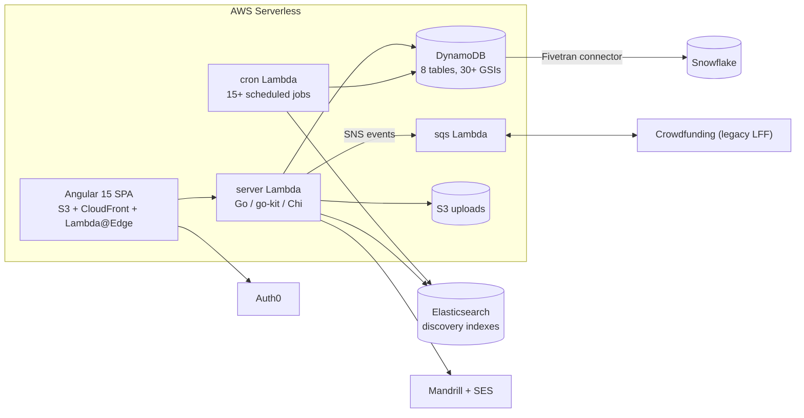
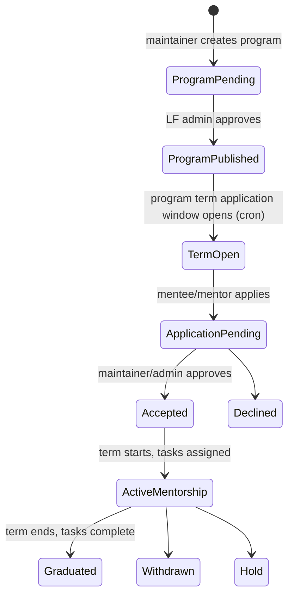

<!-- Copyright The Linux Foundation and each contributor to LFX. -->
<!-- SPDX-License-Identifier: MIT -->

# Mentorship Rewrite — 01: Current System

Status: Proposal — for Architecture team review
Related: [02-target-architecture.md](./02-target-architecture.md), [03-migration-plan.md](./03-migration-plan.md)

This document inventories the current LFX Mentorship platform. It is the "before" picture for the rewrite proposal, mirroring the structure used for the Crowdfunding rewrite ([lfx-crowdfunding/backend/docs/rewrite/01-current-system.md](https://github.com/linuxfoundation/lfx-crowdfunding/blob/main/backend/docs/rewrite/01-current-system.md)).

## Repositories

| Repo                                                                                | Role     | Stack                                                                             | Size                          |
| ----------------------------------------------------------------------------------- | -------- | --------------------------------------------------------------------------------- | ----------------------------- |
| [jobspring](https://github.com/linuxfoundation/jobspring)                           | Backend  | Go, go-kit, Chi, AWS Lambda (Serverless Framework v3), DynamoDB                   | ~64K LOC, ~117 REST endpoints |
| [lfx-mentorship-upgrade](https://github.com/linuxfoundation/lfx-mentorship-upgrade) | Frontend | Angular 15 (upgraded from 6), NgRx 14, Bootstrap 4, S3 + CloudFront + Lambda@Edge | ~37K LOC                      |

Environments: dev `https://people.dev.platform.linuxfoundation.org/`, prod `https://mentorship.lfx.linuxfoundation.org/`.

## Architecture overview

## Domain model

Core entities (DynamoDB tables, prefix `jobspring-{stage}-`):

| Table             | Purpose                                                                                                                                     |
| ----------------- | ------------------------------------------------------------------------------------------------------------------------------------------- |
| `users`           | Accounts linked to Auth0/LFID (id, lfid, email, name, avatar)                                                                               |
| `projects`        | Mentorship programs: metadata, acceptance settings, **program terms embedded as nested documents**, materialized mentor/opportunity lists   |
| `project-members` | Many-to-many user↔program: memberType (mentor / maintainer / apprentice), status lifecycle                                                  |
| `tasks`           | Mentee tasks/milestones: owner, assignee, status, due date, submissions                                                                     |
| `user-profiles`   | Extended mentor/mentee profiles: skills, address, employment authorization                                                                  |
| `project-skills`  | Denormalized skill→program mapping for search                                                                                               |
| `tokens`          | JWT invitation tokens (mentor invites, approvals), 1-week expiry                                                                            |
| `employers`       | Employer orgs with interview/funding opportunities — **not reachable from the production UI** (no entry point on `/participate`); vestigial |

### Mentorship lifecycle

Roles: **maintainer** (creates/manages programs, approves applications, assigns tasks), **mentor** (applies or is invited, reviews task submissions), **mentee/apprentice** (discovers, applies, completes tasks, graduates), **LF admin** (approves programs, manages platform).

## Background jobs (15+ Lambda cron jobs)

Grouped by why they exist:

1. **DynamoDB denormalization** (compensating for lack of joins): `update-project-skills`, `update-project-mentors`, `update-project-opportunities`, `update-mentor-projects`, `update-mentee-mentors` — every 6 hours.
2. **Elasticsearch sync** (discovery/search): 8 jobs (`sync-projects/mentees/mentors/users/user-profiles/project-members/mentees-download-elasticsearch`, `sync-elastic-mentorship-counts`) — every 10–50 minutes.
3. **Status transitions**: `update-program-terms-active`, `update-project-program-term-status`, `update-tasks-submission-status`.
4. **Crowdfunding data**: `update-amount-raised-projects`, `sync-donor-stats-elasticsearch`.

## Integrations

| Service                    | Use                                                                                                                                                                   |
| -------------------------- | --------------------------------------------------------------------------------------------------------------------------------------------------------------------- |
| Auth0                      | JWT validation (JWKS), login                                                                                                                                          |
| Elasticsearch              | Program/mentee/mentor discovery and search                                                                                                                            |
| Mandrill + SES             | 25+ transactional email templates (invitations, application status, task notifications)                                                                               |
| Crowdfunding (legacy LFF)  | SNS→SQS eventing on program creation; `amountRaised`/`fundDistributed` sync; programs store a `FundspringProjectID`                                                   |
| Snowflake                  | Fivetran DynamoDB connector → `fivetran_mentorship_*` bronze models in [lf-dbt](https://github.com/linuxfoundation/lf-dbt); feeds dashboards and the new Crowdfunding |
| Slack                      | Ops alerts on sync jobs and metrics                                                                                                                                   |
| Sentry / Datadog RUM       | Error tracking (BE) / frontend telemetry                                                                                                                              |
| OpenSSF Best Practices API | Project badge fetch for program pages                                                                                                                                 |

## Pain points motivating the rewrite

1. **DynamoDB working against the access patterns.** 30+ GSIs and five denormalization cron jobs exist only because the data is relational (programs ↔ terms ↔ members ↔ tasks) but the store is not. Program terms are nested documents inside `projects`, making term-level queries and updates awkward and error-prone.
2. **Elasticsearch is heavyweight for the data size.** A full search cluster plus 8 sync jobs (with 10–50 min staleness) to search a few thousand rows.
3. **Aging frontend stack.** Angular 15 + NgRx with a legacy webpack build; no SSR (poor SEO for a public discovery site); S3/CloudFront/Lambda@Edge deployment diverges from the LFX v2 Kubernetes platform.
4. **Serverless operational drift.** Serverless Framework version inconsistencies across package.json files; Lambda cold starts; logs/config split across CloudWatch and SSM.
5. **Two email providers** (Mandrill and SES) with duplicated template concerns.
6. **Legacy integration seams.** SNS/SQS eventing with the legacy Crowdfunding (LFF), which is itself being decommissioned in favor of [lfx-crowdfunding](https://github.com/linuxfoundation/lfx-crowdfunding).

The Crowdfunding rewrite faced the same list (Lambda + DynamoDB + aging SPA) and resolved it with Go + PostgreSQL + Nuxt on Kubernetes. This proposal applies the same, now-proven approach to Mentorship — see [02-target-architecture.md](./02-target-architecture.md).
