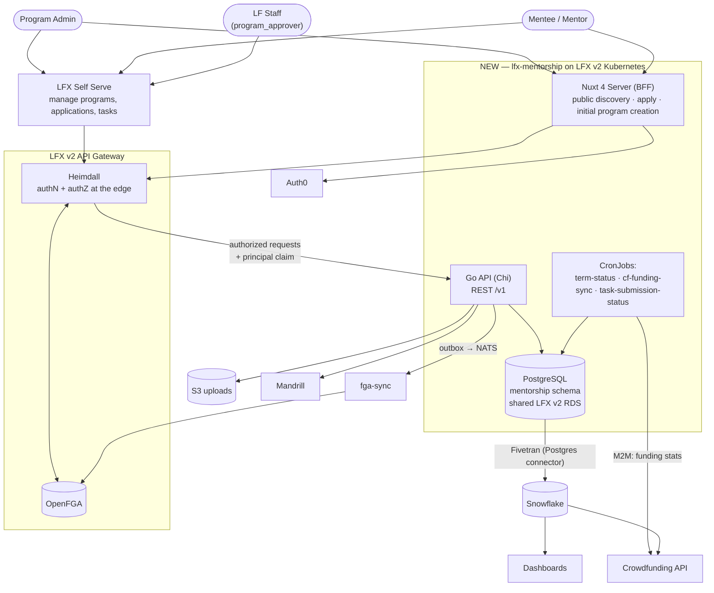
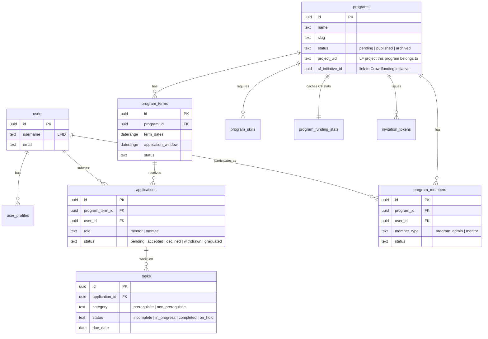

<!-- Copyright The Linux Foundation and each contributor to LFX. -->
<!-- SPDX-License-Identifier: MIT -->

# Mentorship Rewrite — 02: Target Architecture

Status: Proposal — for Architecture team review
Related: [01-current-system.md](./01-current-system.md), [03-migration-plan.md](./03-migration-plan.md), [04-authorization-model.md](./04-authorization-model.md)

## Summary

Rewrite LFX Mentorship following the pattern proven by the Crowdfunding rewrite ([lfx-crowdfunding](https://github.com/linuxfoundation/lfx-crowdfunding)):

- **This repo (`lfx-mentorship`)** — public monorepo, Go backend + Nuxt frontend, same layout as `lfx-crowdfunding`.
- **PostgreSQL** (own `mentorship` schema on the shared LFX v2 RDS) replaces DynamoDB + Elasticsearch.
- **Kubernetes** (LFX v2 cluster, Helm charts, ArgoCD GitOps) replaces Lambda + Serverless Framework.
- **Behind the v2 API Gateway**, with Heimdall + OpenFGA authorizing at the edge — the idiomatic v2 pattern, since Mentorship programs are always subordinated under LF projects. See [04](./04-authorization-model.md).
- **Nuxt 4 SSR BFF** replaces the Angular 15 SPA for the public site; management moves to **LFX Self Serve**.
- **Feature parity** with today's user-facing behavior (with the explicit exclusions listed below). Milestone 1 epic: [linuxfoundation/lfx-self-serve#1477](https://github.com/linuxfoundation/lfx-self-serve/issues/1477) (Mentee public site).

## System context



Every request carrying a resource ID is authorized by Heimdall against OpenFGA before it reaches the API; the service itself makes no authorization decisions. Tuples flow the other way — the API emits them via a transactional outbox to fga-sync. See [04](./04-authorization-model.md) for the model and the emission contract.

## Repository layout

```
lfx-mentorship/
├── backend/
│   ├── cmd/                # mentorship-api + cron binaries
│   ├── internal/
│   │   ├── domain/         # models, repository interfaces
│   │   ├── service/        # business logic
│   │   ├── handler/        # Chi routes, request/response
│   │   └── infrastructure/ # postgres repos, auth0 middleware, clients (crowdfunding, mandrill, s3)
│   ├── db/migrations/      # golang-migrate SQL
│   └── charts/             # Helm chart
├── frontend/
│   ├── app/                # Nuxt 4: pages, components, composables
│   ├── server/             # BFF: auth routes, middleware
│   └── charts/             # Helm chart
└── docs/
```

Same layered architecture, DI-by-constructor, and repository-interface pattern as the Crowdfunding backend.

## Data model (proposal-level ERD)

Relational schema replaces 8 DynamoDB tables + 30 GSIs. Program terms become first-class rows instead of documents nested in projects.



Notes:

- **Search**: PostgreSQL full-text search (`tsvector` + GIN indexes) over programs, skills, and profiles replaces the Elasticsearch cluster and its 8 sync jobs. Data volume (thousands of rows) is far below where a dedicated search engine pays for itself.
- **Denormalization jobs eliminated**: mentor lists, skill mappings, and counts become queries/views instead of cron-materialized copies.
- **Funding stats**: `program_funding_stats` is an hourly-refreshed local cache of Crowdfunding data (see Integrations) — the same pattern Crowdfunding uses for Ledger stats.
- **No enrollment entity, and no mentor assignment.** The application *is* the lifecycle object — one row per user per term, whose status runs `pending → accepted → active → graduated`. This matches legacy, where acceptance and graduation are status changes on a single `project-members` row and mentors relate to the **program**, not to individual mentees (the legacy per-mentee "mentors" list is a cron-denormalized copy of the program's approved mentors). Tasks therefore hang off the application, with `category` distinguishing `prerequisite` from `non_prerequisite` tasks. Introducing `enrollments` + `enrollment_mentors` would add a parity feature nobody asked for; see decision 1 in [04](./04-authorization-model.md).
- Exact column-level schema is an implementation-phase deliverable; this ERD fixes the entity boundaries.

## Frontend split: Nuxt public site + Self Serve management

Same split as Crowdfunding (public site + `app.lfx.dev` lenses):

| Surface                                                                                  | Audience                                            | Scope                                                                                                                                                                                                                                                                                                                                                     |
| ---------------------------------------------------------------------------------------- | --------------------------------------------------- | --------------------------------------------------------------------------------------------------------------------------------------------------------------------------------------------------------------------------------------------------------------------------------------------------------------------------------------------------------- |
| **Nuxt 4 public site** (new, in this repo)                                               | Unauthenticated visitors, applicants                | Marketing/overview, program discovery & search, program detail, apply flow, initial program creation. SSR for SEO. LFX Insights design language (per crowdfunding.linuxfoundation.org). Milestone 1 epic: [lfx-self-serve#1477](https://github.com/linuxfoundation/lfx-self-serve/issues/1477) (Mentee public site — tracked in the lfx-self-serve repo). |
| **LFX Self Serve** ([lfx-self-serve](https://github.com/linuxfoundation/lfx-self-serve)) | Authenticated program admins, mentors, mentees, admins | Manage programs, review applications, tasks/milestones, admin approvals. Delivered as separate Admin/Mentor/Mentee management epics tracked in [lfx-self-serve](https://github.com/linuxfoundation/lfx-self-serve).                                                                                                                                       |

Frontend stack mirrors Crowdfunding: Nuxt 4 + Vue 3, TypeScript, Tailwind + PrimeVue, Pinia + Vue Query, Vitest + Playwright.

## Authentication and authorization

**Authorization happens at the edge, not in the service.** Mentorship programs are always subordinated under LF projects, so this service adopts the idiomatic v2 pattern — behind the API Gateway, with Heimdall authorizing each route against OpenFGA — rather than Crowdfunding's interim standalone-API model. [04-authorization-model.md](./04-authorization-model.md) is the detailed proposal; the summary:

### Authentication

- **Users**: OAuth2 PKCE via Auth0; tokens in HTTP-only session cookies (never exposed to JS).
- **Identity**: the **`principal`** claim on the Heimdall-issued JWT, populated by the platform's `create_jwt` finalizer. The upstream Auth0 `sub` is deliberately not forwarded to services, so `principal` is both the caller's identity and the key for `user:{lfid}` tuples.
- **M2M**: client-credentials for `/v1/internal/*` (the CF funding-stats sync).
- **Self Serve**: silent secondary auth for the Mentorship audience, same mechanism it already uses for Crowdfunding.

### Authorization

- **Every route carrying a resource ID gets a Heimdall RuleSet** checking a single FGA relation. The service performs no ownership or role checks.
- **Relations live in OpenFGA, derived from Postgres.** Postgres remains the system of record for membership; the API emits tuples through a transactional outbox to fga-sync at each state transition.
- **`programs.project_uid` is what makes the project link derivable.** Inherited permissions depend on a `mentorship_program#project@project:{uid}` tuple, so the owning LF project must be a persisted column — the outbox re-derives payloads from current Postgres state and cannot invent it. Legacy already carries this as `lfProjectId`, and `CreateProject` requires it (`project/service.go:195`), but programs created before that rule predate it — legacy has a dedicated `GetProgramsWithLFProjectID` query precisely because the field is not universally populated. The backfill must therefore report unmapped programs rather than silently importing them: a program with no `project_uid` has no parent to inherit from and would be authorized only by its direct grants. Making the column `NOT NULL` is the forcing function; resolving the stragglers is a Backfill-phase task ([03](./03-migration-plan.md)).
- **The one residue** is `/me/*` **list** endpoints, where the service filters rows by the caller's `principal` — data scoping on the caller's own records, not a grant/deny decision. `/me/*` is never a second way to fetch an individual object.

Three things this replaces from the Crowdfunding-derived design:

| Was | Now |
| --- | --- |
| Service-layer role checks against `program_members` / `enrollments` | Heimdall + FGA relations at the edge |
| Super-admin LFID allowlist injected at deploy time | `program_approver` relation on the program (AQ-5 in [04](./04-authorization-model.md)) |
| HMAC-signed email approval links, no login | Authenticated approval in Self Serve, gated on `program_approver` |

The allowlist and the HMAC links were each a second authorization mechanism outside the model; both are retired.

## Integrations

| Service        | Direction             | Mechanism                                                                                                                                                                                                                                                                    |
| -------------- | --------------------- | ---------------------------------------------------------------------------------------------------------------------------------------------------------------------------------------------------------------------------------------------------------------------------- |
| Crowdfunding   | Mentorship → CF       | **CronJob calls CF API (M2M `access:manage`), caches funding stats (`amountRaised`, etc.) in `program_funding_stats`.** Replaces legacy SNS/SQS eventing and the Snowflake round-trip for serving-path data. If CF is unavailable, Mentorship serves the last cached values. The funding-stats endpoint is a **new Crowdfunding-repo deliverable** (no such M2M route exists in CF today): exposed under `access:manage`, keyed by `cf_initiative_id`, contract defined with the CF team during Build. |
| Snowflake      | Mentorship → SF       | Fivetran **Postgres** connector (replacing the DynamoDB connector); existing `fivetran_mentorship_*` dbt models repointed. Feeds dashboards and CF analytics. Analytics-plane only — never in the serving path.                                                              |
| Auth0          | both                  | PKCE (users), client-credentials (M2M), JWKS validation in API middleware                                                                                                                                                                                                    |
| Mandrill       | Mentorship → Mandrill | All transactional email (invitations, application status, task notifications, program-submission notification to LF staff — a notification only, no longer a signed approval link). **SES is dropped**; existing Mandrill templates are audited and migrated.                                                                    |
| S3             | Mentorship → S3       | Program logos, task submission files (presigned URLs, as in CF)                                                                                                                                                                                                              |
| LFX Self Serve | SS → Mentorship       | User tokens through the API Gateway; Heimdall authorizes each route against FGA before it reaches the service                                                                                                                                                                |

## Kubernetes resources

- **Deployments**: `mentorship-api` (Go), `mentorship-frontend` (Nuxt) — each with Service + Ingress, Helm charts in-repo, deployed via ArgoCD ([lfx-v2-argocd](https://github.com/linuxfoundation/lfx-v2-argocd)).
- **CronJobs** (3, down from 15+ Lambda jobs):
  1. `term-status` — open/close program terms and application windows by date.
  2. `cf-funding-sync` — hourly funding-stats cache refresh from the Crowdfunding API.
  3. `task-submission-status` — task submission status rollups.
- **Database**: shared LFX v2 RDS, `mentorship` schema, credentials via K8s secrets ([lfx-secrets-management](https://github.com/linuxfoundation/lfx-secrets-management)).
- CI/CD mirrors Crowdfunding: GitHub Actions (test, lint, image build → GHCR), MegaLinter, Trivy.

## Explicitly out of scope (initial release)

| Dropped                                | Rationale                                                                                                                                                                                              |
| -------------------------------------- | ------------------------------------------------------------------------------------------------------------------------------------------------------------------------------------------------------ |
| **Employer portal**                    | Not reachable from the production UI (no entry point on `/participate`); vestigial. Pre-decommission data check in the migration plan. Related marketing copy ("referred to employers") to be removed. |
| **Elasticsearch**                      | Replaced by Postgres FTS.                                                                                                                                                                              |
| **SES**                                | Mandrill only.                                                                                                                                                                                         |
| **Slack ops alerts**                   | Ops signal moves to standard K8s/CI channels.                                                                                                                                                          |
| **OpenSSF badge fetch**                | Cosmetic; can return later if wanted.                                                                                                                                                                  |
| **Observability stack**                | Deferred; not part of the initial release.                                                                                                                                                             |
| **SNS/SQS eventing with Crowdfunding** | Replaced by the CF API sync + Snowflake analytics path.                                                                                                                                                |

Everything else is **feature parity**: same roles, same program/term/application/task lifecycle, same email notifications, same discovery capability.
