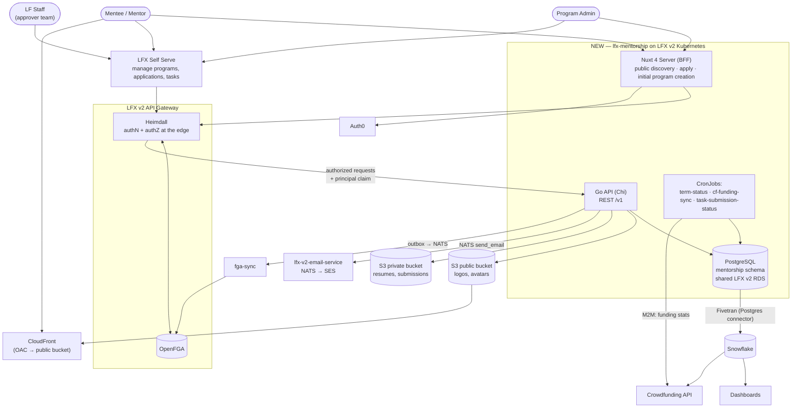
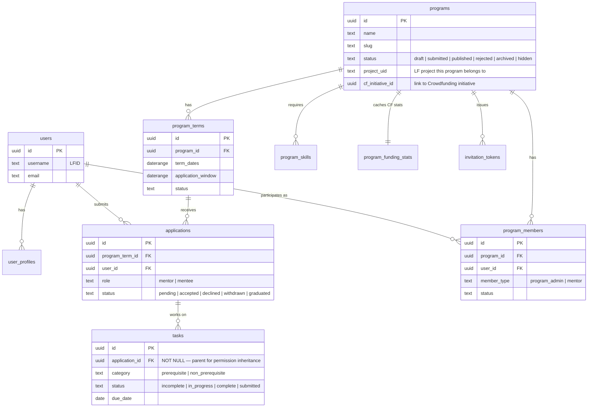

<!-- Copyright The Linux Foundation and each contributor to LFX. -->
<!-- SPDX-License-Identifier: MIT -->

# Mentorship Rewrite — 02: Target Architecture

Status: Proposal — for Architecture team review
Related: [01-current-system.md](./01-current-system.md), [03-migration-plan.md](./03-migration-plan.md), [04-authorization-model.md](./04-authorization-model.md)

## Summary

Rewrite LFX Mentorship following the pattern proven by the Crowdfunding rewrite ([lfx-crowdfunding](https://github.com/linuxfoundation/lfx-crowdfunding)):

- **This repo (`lfx-mentorship`)** — public monorepo, Go backend + Nuxt frontend, same layout as `lfx-crowdfunding`.
- **PostgreSQL** (own `mentorship` schema on the shared LFX v2 RDS) replaces DynamoDB + Elasticsearch.
- **Kubernetes** (LFX v2 cluster, Helm charts, ArgoCD GitOps) replaces Lambda + Serverless Framework.
- **Behind the v2 API Gateway**, with Heimdall + OpenFGA authorizing at the edge — the idiomatic v2 pattern, since Mentorship programs are always subordinated under LF projects. See [04](./04-authorization-model.md).
- **Nuxt 4 SSR BFF** replaces the Angular 15 SPA for the public site; management moves to **LFX Self Serve**.
- **Feature parity** with today's user-facing behavior (with the explicit exclusions listed below). Milestone 1 epic: [linuxfoundation/lfx-self-serve#1477](https://github.com/linuxfoundation/lfx-self-serve/issues/1477) (Mentee public site).

## System context



Every request carrying the UID of a modelled object is authorized by Heimdall against OpenFGA before it reaches the API; the service itself makes no authorization decisions. The qualifier is load-bearing: a few current routes carry an ID whose type is not in the model (program terms, self-service user writes) and so have nothing to check — decision 7 in [04](./04-authorization-model.md) reshapes them rather than leaving them authentication-only. Tuples flow the other way — the API emits them via a transactional outbox to fga-sync. See [04](./04-authorization-model.md) for the model and the emission contract.

## Repository layout

```
lfx-mentorship/
├── backend/
│   ├── cmd/                # mentorship-api + cron binaries
│   ├── internal/
│   │   ├── domain/         # models, repository interfaces
│   │   ├── service/        # business logic
│   │   ├── handler/        # Chi routes, request/response
│   │   └── infrastructure/ # postgres repos, auth0 middleware, clients (crowdfunding, email, s3)
│   ├── db/migrations/      # golang-migrate SQL
│   └── charts/             # Helm chart
├── frontend/
│   ├── app/                # Nuxt 4: pages, components, composables
│   ├── server/             # BFF: auth routes, middleware
│   └── charts/             # Helm chart
└── docs/
```

Same layered architecture, DI-by-constructor, and repository-interface pattern as the Crowdfunding backend.

## Data model (proposal-level ERD)

Relational schema replaces 8 DynamoDB tables + 30 GSIs. Program terms become first-class rows instead of documents nested in projects.



Notes:

- **Search**: PostgreSQL full-text search (`tsvector` + GIN indexes) over programs, skills, and profiles replaces the Elasticsearch cluster and its 8 sync jobs. Data volume (thousands of rows) is far below where a dedicated search engine pays for itself.
- **Denormalization jobs eliminated**: mentor lists, skill mappings, and counts become queries/views instead of cron-materialized copies.
- **Funding stats**: `program_funding_stats` is an hourly-refreshed local cache of Crowdfunding data (see Integrations) — the same pattern Crowdfunding uses for Ledger stats.
- **No enrollment entity, and no mentor assignment.** The application *is* the lifecycle object — one row per user per term, whose status runs `pending → accepted → graduated` (there is no `active` application status; AQ-10 in [04](./04-authorization-model.md) resolved it as dropped). This matches legacy, where acceptance and graduation are status changes on a single `program-term-mentees` row — the term-keyed mentee source ([00](./00-current-authz-relations.md)); `project-members` is the program-level membership table and carries no term identity — and mentors relate to the **program**, not to individual mentees (the legacy per-mentee "mentors" list is a cron-denormalized copy of the program's approved mentors). Tasks therefore hang off the application, with `category` distinguishing `prerequisite` from `non_prerequisite` tasks. Introducing `enrollments` + `enrollment_mentors` would add a parity feature nobody asked for; see "No enrollment entity" and decision 2 in [04](./04-authorization-model.md).
- **`hold` is not a valid application status.** The merged schema's `applications_status_check` still permits it today (`backend/db/migrations/001_initial.up.sql:184`), but it describes a *paused accepted mentorship*, not an application outcome, and does not belong in this enum — a follow-up migration drops it from the constraint. The ERD above omits it accordingly.
- Exact column-level schema is an implementation-phase deliverable; this ERD fixes the entity boundaries.

## Frontend split: Nuxt public site + Self Serve management

Same split as Crowdfunding (public site + `app.lfx.dev` lenses):

| Surface                                                                                  | Audience                                            | Scope                                                                                                                                                                                                                                                                                                                                                     |
| ---------------------------------------------------------------------------------------- | --------------------------------------------------- | --------------------------------------------------------------------------------------------------------------------------------------------------------------------------------------------------------------------------------------------------------------------------------------------------------------------------------------------------------- |
| **Nuxt 4 public site** (new, in this repo)                                               | Unauthenticated visitors, applicants                | Marketing/overview, program discovery & search, program detail, apply flow, initial program creation. SSR for SEO. LFX Insights design language (per crowdfunding.linuxfoundation.org). Milestone 1 epic: [lfx-self-serve#1477](https://github.com/linuxfoundation/lfx-self-serve/issues/1477) (Mentee public site — tracked in the lfx-self-serve repo). |
| **LFX Self Serve** ([lfx-self-serve](https://github.com/linuxfoundation/lfx-self-serve)) | Authenticated program admins, mentors, mentees, admins | Manage programs, review applications, tasks/milestones, admin approvals. Delivered as separate Admin/Mentor/Mentee management epics tracked in [lfx-self-serve](https://github.com/linuxfoundation/lfx-self-serve).                                                                                                                                       |

Frontend stack mirrors Crowdfunding: Nuxt 4 + Vue 3, TypeScript, Tailwind + PrimeVue, Pinia + Vue Query, Vitest + Playwright.

## Authentication and authorization

**Authorization happens at the edge, not in the service.** Mentorship programs are always subordinated under LF projects, so this service adopts the idiomatic v2 pattern — behind the API Gateway, with Heimdall authorizing each route against OpenFGA — rather than Crowdfunding's interim standalone-API model. [04-authorization-model.md](./04-authorization-model.md) is the detailed proposal; the summary:

### Authentication

- **Users**: OAuth2 PKCE via Auth0; tokens in HTTP-only session cookies (never exposed to JS).
- **Identity**: the **`principal`** claim on the Heimdall-issued JWT, populated by the platform's `create_jwt` finalizer. The upstream Auth0 `sub` is deliberately not forwarded to services, so `principal` is both the caller's identity and the key for `user:{lfid}` tuples.
- **M2M**: client-credentials for the CF funding-stats sync. The credential is **outbound** — the CronJob calls Crowdfunding's API with it (see Integrations). Mentorship serves no inbound `/v1/internal/*` route today, and should not grow one: an internal API on the shared gateway host would need its own authorization story (see [05](./05-heimdall-gateway.md)).
- **Self Serve**: silent secondary auth for the shared gateway audience (`https://lfx-api.{lfx.domain}/`), same mechanism it already uses for Crowdfunding. Behind Heimdall there is no per-service Auth0 audience to acquire — the gateway audience covers every service on the shared host, and the service-specific audience appears only on the Heimdall-issued token (`lfx-mentorship-backend`), which the caller never requests. See [05](./05-heimdall-gateway.md).

### Authorization

- **Every route carrying the ID of a modelled object gets a Heimdall RuleSet** checking a single FGA relation. The service performs no ownership or role checks. The qualifier is the same one as above: routes whose ID names an unmodelled type (program terms, self-service user and profile writes) have no relation to check, so decision 7 in [04](./04-authorization-model.md) reshapes them — nesting them under a modelled parent or moving them to `/me` — rather than leaving them authentication-only.
- **Relations live in OpenFGA, derived from Postgres.** Postgres remains the system of record for membership; the API emits tuples through a transactional outbox to fga-sync at each state transition.
- **`programs.project_uid` is what makes the project link derivable.** Inherited permissions depend on a `mentorship_program#project@project:{uid}` tuple, so the owning LF project must be a persisted column — the outbox re-derives payloads from current Postgres state and cannot invent it. Legacy already carries this as `lfProjectId`, and `CreateProject` requires it (`project/service.go:195`), but programs created before that rule predate it — legacy has a dedicated `GetProgramsWithLFProjectID` query precisely because the field is not universally populated. The backfill must therefore report unmapped programs rather than silently importing them: a program with no `project_uid` has no parent to inherit from and would be authorized only by its direct grants. Making the column `NOT NULL` is the forcing function; resolving the stragglers is a Backfill-phase task ([03](./03-migration-plan.md)).
- **`tasks.application_id` must become `NOT NULL` for the same reason.** Task permissions derive from the parent application (decision 2 in [04](./04-authorization-model.md)), so a task with no parent has nothing to inherit from. The merged schema makes the column nullable — `application_id UUID REFERENCES applications(id) ON DELETE SET NULL` (`backend/db/migrations/001_initial.up.sql:199`) — and the migration script deliberately imports legacy tasks it cannot match to an application with a NULL parent rather than dropping them (`backend/db/scripts/migrate_dynamo_to_postgres.py:899-901`, counted as `unresolved`). Those rows emit no `mentorship_task#mentorship_application@mentorship_application:{id}` tuple, so `manager` — which resolves only as `reviewer from mentorship_application` — finds nothing and every review check on the task fails closed. Same three parts as `project_uid`, in the same order: an **unmapped-task report** from the Backfill phase, resolution of the stragglers, then `NOT NULL` as the forcing function ([03](./03-migration-plan.md)). `ON DELETE SET NULL` also has to go — orphaning a task on application deletion reintroduces the same hole at runtime, so the constraint becomes `ON DELETE CASCADE`.
- **The residue is `/me/*`, and it is self-scoping rather than authorization.** For **list** endpoints the service filters rows by the caller's `principal` — data scoping on the caller's own records, not a grant/deny decision. GW-5 in [05](./05-heimdall-gateway.md) extends the same shape to **self-service writes** on the caller's own user and profile, which become `/me` routes rather than the ID-addressed `PATCH/DELETE /v1/users/{id}` they are today: the target is derived from `principal`, never from request input or a path ID. The invariant is therefore that `/me/*` **never addresses another subject's object** — it is not a second way to reach an arbitrary object by ID, which is what would need an edge check.

Three things this replaces from the Crowdfunding-derived design:

| Was | Now |
| --- | --- |
| Service-layer role checks against `program_members` / `enrollments` | Heimdall + FGA relations at the edge |
| Super-admin LFID allowlist injected at deploy time | `member` on `mentorship_approver_team:global`, a dedicated approver-team type this service owns (AQ-5 in [04](./04-authorization-model.md), resolved; the type and how approvers read a non-public program are settled — AQ-8's type, AQ-9 — but AQ-8's roster provisioning and administration authority remain an open blocker) |
| HMAC-signed email approval links, no login | Authenticated approval in Self Serve, gated on approver-team membership |

The allowlist and the HMAC links were each a second authorization mechanism outside the model; both are retired.

## Integrations

| Service        | Direction             | Mechanism                                                                                                                                                                                                                                                                    |
| -------------- | --------------------- | ---------------------------------------------------------------------------------------------------------------------------------------------------------------------------------------------------------------------------------------------------------------------------- |
| Crowdfunding   | Mentorship → CF       | **CronJob calls CF API (M2M `access:manage`), caches funding stats (`amountRaised`, etc.) in `program_funding_stats`.** Replaces legacy SNS/SQS eventing and the Snowflake round-trip for serving-path data. If CF is unavailable, Mentorship serves the last cached values. The funding-stats endpoint is a **new Crowdfunding-repo deliverable** (no such M2M route exists in CF today): exposed under `access:manage`, keyed by `cf_initiative_id`, contract defined with the CF team during Build. |
| Snowflake      | Mentorship → SF       | Fivetran **Postgres** connector (replacing the DynamoDB connector); existing `fivetran_mentorship_*` dbt models repointed. Feeds dashboards and CF analytics. Analytics-plane only — never in the serving path.                                                              |
| Auth0          | both                  | PKCE (users), client-credentials (M2M). After the gateway cutover Auth0 sits **in front of Heimdall** and its token never reaches this service — the API middleware validates the **Heimdall**-issued JWT against the cluster-internal Heimdall JWKS, not Auth0's. See [05](./05-heimdall-gateway.md) for the two token contracts and the dual-accept window. |
| Email          | Mentorship → NATS     | All transactional email (invitations, application status, task notifications, program-submission notification to LF staff — a notification only, no longer a signed approval link) goes through **[lfx-v2-email-service](https://github.com/linuxfoundation/lfx-v2-email-service)** — NATS request/reply on `lfx.email-service.send_email` over Amazon SES, via its Go client `pkg/api`. No service sends its own email, so Mentorship holds no SMTP or provider credentials. The relay is **pre-rendered only** (no templating), so this repo owns the templates and the Go backend renders `html` and `text` per notification — replacing the legacy Mandrill arrangement, where ~47 templates lived in Mailchimp's editor and were hand-synced. Mandrill is legacy-only and out of scope; the rail decision is recorded in [linuxfoundation/lfx-self-serve#2188](https://github.com/linuxfoundation/lfx-self-serve/issues/2188). Known limits to design around: **no send retry** in the relay, no attachments, no CC/BCC, and a non-prod recipient-domain allowlist. `Notifier` stays fire-and-forget — a failed send must never fail the business operation. |
| S3             | Mentorship → S3       | Program logos, profile logos and avatars (public); resumes and task submission files (private). **Uploads go through the API, not presigned URLs** — see [Object storage](#object-storage) below. This supersedes the earlier "presigned URLs, as in CF" note: CF's pattern stores every object in one world-readable bucket, which is wrong for the resumes and submissions Mentorship holds. |
| LFX Self Serve | SS → Mentorship       | User tokens through the API Gateway; Heimdall authorizes each route against FGA before it reaches the service                                                                                                                                                                |

## Object storage

Mentorship follows the platform object-store design ([lfx-object-store-design](https://github.com/linuxfoundation/lfx-skills/blob/main/skills/lfx-object-store-design/SKILL.md), provisioned per [lfx-object-store-ops](https://github.com/linuxfoundation/lfx-skills/blob/main/skills/lfx-object-store-ops/SKILL.md)) rather than Crowdfunding's presigned-PUT pattern. Two rules drive everything below: **uploads go through the API** (browsers never write to S3 directly), and **public and private files live in separate buckets** — a CDN's origin authorization can read every key in its origin bucket, so one mixed bucket would make resumes anonymously retrievable to anyone who knows the key.

Crowdfunding's objects are initiative logos, public either way, so a single world-readable bucket costs it nothing. Mentorship stores resumes and task submissions, and that difference is the whole reason the pattern is not copied.

**Implementers: read both skills before writing code or HCL.** This section states what Mentorship stores and where; it does not restate the platform baseline. [lfx-object-store-design](https://github.com/linuxfoundation/lfx-skills/blob/main/skills/lfx-object-store-design/SKILL.md) owns the application side — SDK wiring and the credential chain, `EnsureBucket`, the chart contract (`s3.endpointURL`, `s3.createMissingBucket`, `cdnURLPrefix`, the nats-s3 sidecar), and the local stack. [lfx-object-store-ops](https://github.com/linuxfoundation/lfx-skills/blob/main/skills/lfx-object-store-ops/SKILL.md) owns provisioning, in [lfx-v2-opentofu](https://github.com/linuxfoundation/lfx-v2-opentofu) rather than this repo. Where this document and a skill disagree, the skill is the baseline and the difference is a bug in this document — raise it rather than diverging silently.

### File classes

| Class | Columns | Bucket | Served by |
| --- | --- | --- | --- |
| Program logos | `programs.logo_url` | public | CDN (`CDN_URL_PREFIX`) |
| Profile logos and avatars | `user_profiles.logo_url`, `users.avatar_url` | public | CDN |
| Resumes | `user_profiles.profile_links.resumeLink` | **private** | service download route |
| Task submissions | `tasks.file` | **private** | service download route |

`tasks.submit_file` is not a file reference — it is the template flag (`required` / unset) saying whether a task demands an upload. The schema comment on `001_initial.up.sql:219` suggesting it may hold a URL is wrong and should be corrected when that column is next touched.

### Stored value and delivery

What the column stores differs by class — and the difference is deliberate:

- **Public files** are addressed by their **S3 object key**, and the CDN URL `{CDN_URL_PREFIX}/{key}?v={upload-unix-timestamp}` is what callers receive. The key is the locator the service resolves for its own download route — which has to work when `CDN_URL_PREFIX` is unset, and there is then no URL to parse a key back out of. So **the key is what is stored, and the CDN URL is composed at response time** from the configured prefix. Storing the URL instead would make the object unnameable whenever the prefix is unset or changes, and would bake a deployment-specific hostname into a data column. The `?v=` parameter is a cache-busting hint and must be in the CloudFront cache key; it is **not** the S3 `VersionId`. `Cache-Control: public, max-age=86400` is set as object metadata at upload, so a persisted copy of the URL converges to the current object within a day. `CopyObject` preserves source metadata by default, so the migration copy must pass `MetadataDirective: REPLACE` to set `ContentType` and `Cache-Control` rather than inheriting whatever the legacy bucket happened to store.
- **Private files** store the **S3 object key** (for example `resumes/{user_uid}/{uuid}.pdf`), not a URL and not a route. The download route is derived from the owning entity, so a stored route would carry an entity ID and no key — leaving the handler nothing to pass `GetObject`. The bucket has no CDN attached.

  **The key is repository-internal and must never appear in a response body.** This is a requirement on the API, not a property it has today: `tasks.file` and `user_profiles.profile_links` are currently serialized straight to the client (`Task.File`, `UserProfile.ProfileLinks`), so adopting this mapping without also projecting those fields out would replace a public URL with an internal locator in the same response — strictly worse than what it replaces. Responses carry the **download route** for callers the ruleset admits, and omit the field entirely for everyone else. Whether that is done with response DTOs or by narrowing the models is an implementation choice; the contract is only that the key does not leave the service.

Per-file cap is **20 MB**; no presigned uploads and no resumable/chunked uploads. Buckets are private with versioning, SSE, and lifecycle rules. Write access in **deployed** environments is via IRSA; the local `nats-s3` sidecar uses a locally generated static SigV4 pair, which is the platform's documented local mode and must never appear in a deployed values file.

### Routes

Upload and download are ordinary API routes, authorized by Heimdall like any other — the full rows are in [06](./06-route-matrix.md). Private downloads stream from S3 after the ruleset authorizes the request, with `Content-Disposition: attachment` and `Range` pass-through, and **`Cache-Control: private, no-store`** on both the response and the stored object metadata — resumes and submissions are PII, and the default would otherwise let a browser or an intermediary retain an authenticated response. The migration copy sets it explicitly for the same reason it sets `ContentType`: legacy objects predate the split and may carry a public policy.

**Every file class has a service download route, public ones included.** The CDN does not replace that route, it only supplements it for public reads: when `CDN_URL_PREFIX` is set, the API returns the CDN URL as `public_url` and clients fetch the bytes from the edge; when it is unset — local development without the `nginx-s3-gateway` stand-in, or a CDN outage — the service route is the only path. The public download routes carry the same relation as the record that holds the URL, but that does not make the two paths equivalent: the CDN serves the object to anyone holding the URL, with no relation check at all. The service route is the authorized path; the CDN is an unauthenticated cache in front of the same bytes, which is why only classes that are public by intent may be CDN-fronted (RM-6).

Traefik needs `maxRequestBodyBytes` above `20971520`, with margin for multipart overhead, on the upload routes. Attach that `Buffering` middleware to the **upload routers only** — the platform skill phrases the download side as `responseBuffering: false`, but Traefik's `Buffering` CRD has no such field, so the way to keep downloads streaming is simply not to attach the middleware to them. Buffering a 20 MB response would also defeat the `Range` pass-through the private download routes rely on.

## Kubernetes resources

- **Deployments**: `mentorship-api` (Go), `mentorship-frontend` (Nuxt) — each with Service + Ingress, Helm charts in-repo, deployed via ArgoCD ([lfx-v2-argocd](https://github.com/linuxfoundation/lfx-v2-argocd)).
- **CronJobs** (3, down from 15+ Lambda jobs):
  1. `term-status` — open/close program terms and application windows by date.
  2. `cf-funding-sync` — hourly funding-stats cache refresh from the Crowdfunding API.
  3. `task-submission-status` — task submission status rollups.
- **Database**: shared LFX v2 RDS, `mentorship` schema, credentials via K8s secrets ([lfx-secrets-management](https://github.com/linuxfoundation/lfx-secrets-management)).
- CI/CD mirrors Crowdfunding: GitHub Actions (test, lint, image build → GHCR), MegaLinter, Trivy.

## Explicitly out of scope (initial release)

| Dropped                                | Rationale                                                                                                                                                                                              |
| -------------------------------------- | ------------------------------------------------------------------------------------------------------------------------------------------------------------------------------------------------------ |
| **Employer portal**                    | Not reachable from the production UI (no entry point on `/participate`); vestigial. Pre-decommission data check in the migration plan. Related marketing copy ("referred to employers") to be removed. |
| **Elasticsearch**                      | Replaced by Postgres FTS.                                                                                                                                                                              |
| **A Mentorship-owned email sender**    | No direct Mandrill, SES, or SendGrid client in this repo. Sending is delegated to `lfx-v2-email-service` (see Integrations), which reaches SES on our behalf; the ~47 legacy Mandrill templates are a parity *checklist*, not a porting target.                                                                              |
| **Slack ops alerts**                   | Ops signal moves to standard K8s/CI channels.                                                                                                                                                          |
| **OpenSSF badge fetch**                | Cosmetic; can return later if wanted.                                                                                                                                                                  |
| **Observability stack**                | Deferred; not part of the initial release.                                                                                                                                                             |
| **SNS/SQS eventing with Crowdfunding** | Replaced by the CF API sync + Snowflake analytics path.                                                                                                                                                |

Everything else is **feature parity**: same roles, same program/term/application/task lifecycle, same email notifications, same discovery capability.
