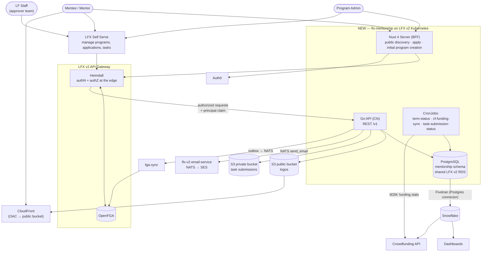
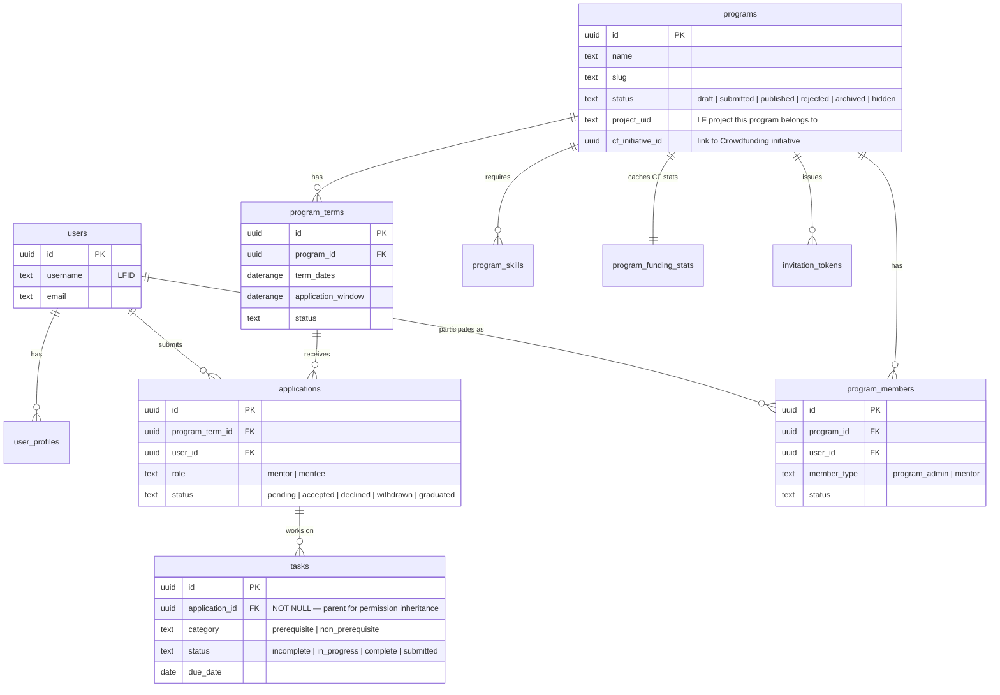

<!-- Copyright The Linux Foundation and each contributor to LFX. -->
<!-- SPDX-License-Identifier: MIT -->

# Mentorship Rewrite — 02: Target Architecture

Status: Proposal — for Architecture team review
Related: [01-current-system.md](./01-current-system.md), [03-migration-plan.md](./03-migration-plan.md), [04-authorization-model.md](./04-authorization-model.md)

## Summary

Rewrite LFX Mentorship following the pattern proven by the Crowdfunding rewrite ([lfx-crowdfunding](https://github.com/linuxfoundation/lfx-crowdfunding)):

- **This repo (`lfx-mentorship`)** — public monorepo, Go backend + Nuxt frontend, same layout as `lfx-crowdfunding`.
- **PostgreSQL** (own `mentorship` schema on the shared LFX v2 RDS) replaces DynamoDB + Elasticsearch.
- **Kubernetes** (LFX v2 cluster, Helm charts, ArgoCD GitOps) replaces Lambda + Serverless Framework.
- **Behind the v2 API Gateway**, with Heimdall + OpenFGA authorizing at the edge — the idiomatic v2 pattern, since Mentorship programs are always subordinated under LF projects. See [04](./04-authorization-model.md).
- **Nuxt 4 SSR BFF** replaces the Angular 15 SPA for the public site; management moves to **LFX Self Serve**.
- **Feature parity** with today's user-facing behavior (with the explicit exclusions listed below). Milestone 1 epic: [linuxfoundation/lfx-self-serve#1477](https://github.com/linuxfoundation/lfx-self-serve/issues/1477) (Mentee public site).

## System context


```mermaid
flowchart TB
    ADMIN(["Program Admin"])
    USERS(["Mentee / Mentor"])
    SUPER(["LF Staff<br/>(approver team)"])

    subgraph GW["LFX v2 API Gateway"]
        HEIMDALL["Heimdall<br/>authN + authZ at the edge"]
        FGA[("OpenFGA")]
    end

    subgraph K8S["NEW — lfx-mentorship on LFX v2 Kubernetes"]
        NUXT["Nuxt 4 Server (BFF)<br/>public discovery · apply · initial program creation"]
        API["Go API (Chi)<br/>REST /v1"]
        PG[("PostgreSQL<br/>mentorship schema<br/>shared LFX v2 RDS")]
        CRONS["CronJobs:<br/>term-status · cf-funding-sync · task-submission-status"]
    end

    SS["LFX Self Serve<br/>manage programs, applications, tasks"]
    SYNC["fga-sync"]
    AUTH0["Auth0"]
    S3PUB[("S3 public bucket<br/>logos")]
    S3PRIV[("S3 private bucket<br/>task submissions")]
    CDN["CloudFront<br/>(OAC → public bucket)"]
    EMAIL["lfx-v2-email-service<br/>NATS → SES"]
    CFAPI["Crowdfunding API"]
    SF[("Snowflake")]
    DASH["Dashboards"]

    ADMIN & USERS --> NUXT
    ADMIN & USERS & SUPER --> SS
    NUXT --> HEIMDALL
    SS --> HEIMDALL
    HEIMDALL <--> FGA
    HEIMDALL -- "authorized requests<br/>+ principal claim" --> API
    NUXT --> AUTH0
    API --> PG
    API --> S3PUB
    API --> S3PRIV
    S3PUB --> CDN
    USERS --> CDN
    API -- "NATS send_email" --> EMAIL
    API -- "outbox → NATS" --> SYNC
    SYNC --> FGA
    CRONS --> PG
    CRONS -- "M2M: funding stats" --> CFAPI
    PG -- "Fivetran (Postgres connector)" --> SF
    SF --> DASH
    SF --> CFAPI
```

Every request carrying the UID of a modelled object is authorized by Heimdall against OpenFGA before it reaches the API; the service itself makes no authorization decisions. The qualifier is load-bearing: a few current routes carry an ID whose type is not in the model (program terms, self-service user writes) and so have nothing to check — decision 7 in [04](./04-authorization-model.md) reshapes them rather than leaving them authentication-only. Tuples flow the other way — the API emits them via a transactional outbox to fga-sync. See [04](./04-authorization-model.md) for the model and the emission contract.

## Repository layout

```
lfx-mentorship/
├── backend/
│   ├── cmd/                # mentorship-api + cron binaries
│   ├── internal/
│   │   ├── domain/         # models, repository interfaces
│   │   ├── service/        # business logic
│   │   ├── handler/        # Chi routes, request/response
│   │   └── infrastructure/ # postgres repos, auth0 middleware, clients (crowdfunding, email, s3)
│   ├── db/migrations/      # golang-migrate SQL
│   └── charts/             # Helm chart
├── frontend/
│   ├── app/                # Nuxt 4: pages, components, composables
│   ├── server/             # BFF: auth routes, middleware
│   └── charts/             # Helm chart
└── docs/
```

Same layered architecture, DI-by-constructor, and repository-interface pattern as the Crowdfunding backend.

## Data model (proposal-level ERD)

Relational schema replaces 8 DynamoDB tables + 30 GSIs. Program terms become first-class rows instead of documents nested in projects.


```mermaid
erDiagram
    users ||--o{ user_profiles : has
    users ||--o{ applications : submits
    users ||--o{ program_members : "participates as"
    programs ||--o{ program_terms : has
    programs ||--o{ program_members : has
    programs ||--o{ program_skills : requires
    programs ||--|| program_funding_stats : "caches CF stats"
    program_terms ||--o{ applications : receives
    applications ||--o{ tasks : "works on"
    programs ||--o{ invitation_tokens : issues

    users {
        uuid id PK
        text username "LFID"
        text email
    }
    programs {
        uuid id PK
        text name
        text slug
        text status "draft | submitted | published | rejected | archived | hidden"
        text project_uid "LF project this program belongs to"
        uuid cf_initiative_id "link to Crowdfunding initiative"
    }
    program_terms {
        uuid id PK
        uuid program_id FK
        daterange term_dates
        daterange application_window
        text status
    }
    applications {
        uuid id PK
        uuid program_term_id FK
        uuid user_id FK
        text role "mentor | mentee"
        text status "pending | accepted | declined | withdrawn | graduated"
    }
    program_members {
        uuid id PK
        uuid program_id FK
        uuid user_id FK
        text member_type "program_admin | mentor"
        text status
    }
    tasks {
        uuid id PK
        uuid application_id FK "NOT NULL — parent for permission inheritance"
        text category "prerequisite | non_prerequisite"
        text status "incomplete | in_progress | complete | submitted"
        date due_date
    }
```

Notes:

- **Search**: PostgreSQL full-text search (`tsvector` + GIN indexes) over programs, skills, and profiles replaces the Elasticsearch cluster and its 8 sync jobs. Data volume (thousands of rows) is far below where a dedicated search engine pays for itself.
- **Denormalization jobs eliminated**: mentor lists, skill mappings, and counts become queries/views instead of cron-materialized copies.
- **Funding stats**: `program_funding_stats` is an hourly-refreshed local cache of Crowdfunding data (see Integrations) — the same pattern Crowdfunding uses for Ledger stats.
- **No enrollment entity, and no mentor assignment.** The application *is* the lifecycle object — one row per user per term, whose status runs `pending → accepted → graduated` (there is no `active` application status; AQ-10 in [04](./04-authorization-model.md) resolved it as dropped). This matches legacy, where acceptance and graduation are status changes on a single `program-term-mentees` row — the term-keyed mentee source ([00](./00-current-authz-relations.md)); `project-members` is the program-level membership table and carries no term identity — and mentors relate to the **program**, not to individual mentees (the legacy per-mentee "mentors" list is a cron-denormalized copy of the program's approved mentors). Tasks therefore hang off the application, with `category` distinguishing `prerequisite` from `non_prerequisite` tasks. Introducing `enrollments` + `enrollment_mentors` would add a parity feature nobody asked for; see "No enrollment entity" and decision 2 in [04](./04-authorization-model.md).
- **`hold` is not a valid application status.** The merged schema's `applications_status_check` still permits it today (`backend/db/migrations/001_initial.up.sql:201`), but it describes a *paused accepted mentorship*, not an application outcome, and does not belong in this enum — a follow-up migration drops it from the constraint. The ERD above omits it accordingly.
- Exact column-level schema is an implementation-phase deliverable; this ERD fixes the entity boundaries.

## Frontend split: Nuxt public site + Self Serve management

Same split as Crowdfunding (public site + `app.lfx.dev` lenses):

| Surface                                                                                  | Audience                                            | Scope                                                                                                                                                                                                                                                                                                                                                     |
| ---------------------------------------------------------------------------------------- | --------------------------------------------------- | --------------------------------------------------------------------------------------------------------------------------------------------------------------------------------------------------------------------------------------------------------------------------------------------------------------------------------------------------------- |
| **Nuxt 4 public site** (new, in this repo)                                               | Unauthenticated visitors, applicants                | Marketing/overview, program discovery & search, program detail, apply flow, initial program creation. SSR for SEO. LFX Insights design language (per crowdfunding.linuxfoundation.org). Milestone 1 epic: [lfx-self-serve#1477](https://github.com/linuxfoundation/lfx-self-serve/issues/1477) (Mentee public site — tracked in the lfx-self-serve repo). |
| **LFX Self Serve** ([lfx-self-serve](https://github.com/linuxfoundation/lfx-self-serve)) | Authenticated program admins, mentors, mentees, admins | Manage programs, review applications, tasks/milestones, admin approvals. Delivered as separate Admin/Mentor/Mentee management epics tracked in [lfx-self-serve](https://github.com/linuxfoundation/lfx-self-serve).                                                                                                                                       |

Frontend stack mirrors Crowdfunding: Nuxt 4 + Vue 3, TypeScript, Tailwind + PrimeVue, Pinia + Vue Query, Vitest + Playwright.

## Authentication and authorization

**Authorization happens at the edge, not in the service.** Mentorship programs are always subordinated under LF projects, so this service adopts the idiomatic v2 pattern — behind the API Gateway, with Heimdall authorizing each route against OpenFGA — rather than Crowdfunding's interim standalone-API model. [04-authorization-model.md](./04-authorization-model.md) is the detailed proposal; the summary:

### Authentication

- **Users**: OAuth2 PKCE via Auth0; tokens in HTTP-only session cookies (never exposed to JS).
- **Identity**: the **`principal`** claim on the Heimdall-issued JWT, populated by the platform's `create_jwt` finalizer. The upstream Auth0 `sub` is deliberately not forwarded to services, so `principal` is both the caller's identity and the key for `user:{lfid}` tuples.
- **M2M**: client-credentials for the CF funding-stats sync. The credential is **outbound** — the CronJob calls Crowdfunding's API with it (see Integrations). Mentorship serves no inbound `/v1/internal/*` route today, and should not grow one: an internal API on the shared gateway host would need its own authorization story (see [05](./05-heimdall-gateway.md)).
- **Self Serve**: silent secondary auth for the shared gateway audience (`https://lfx-api.{lfx.domain}/`), same mechanism it already uses for Crowdfunding. Behind Heimdall there is no per-service Auth0 audience to acquire — the gateway audience covers every service on the shared host, and the service-specific audience appears only on the Heimdall-issued token (`lfx-mentorship-backend`), which the caller never requests. See [05](./05-heimdall-gateway.md).

### Authorization

- **Every route carrying the ID of a modelled object gets a Heimdall RuleSet** checking a single FGA relation. The service performs no ownership or role checks. The qualifier is the same one as above: routes whose ID names an unmodelled type (program terms, self-service user and profile writes) have no relation to check, so decision 7 in [04](./04-authorization-model.md) reshapes them — nesting them under a modelled parent or moving them to `/me` — rather than leaving them authentication-only.
- **Relations live in OpenFGA, derived from Postgres.** Postgres remains the system of record for membership; the API emits tuples through a transactional outbox to fga-sync at each state transition.
- **`programs.project_uid` is what makes the project link derivable.** Inherited permissions depend on a `mentorship_program#project@project:{uid}` tuple, so the owning LF project must be a persisted column — the outbox re-derives payloads from current Postgres state and cannot invent it. Legacy already carries this as `lfProjectId`, and `CreateProject` requires it (`project/service.go:195`), but programs created before that rule predate it — legacy has a dedicated `GetProgramsWithLFProjectID` query precisely because the field is not universally populated. The backfill must therefore report unmapped programs rather than silently importing them: a program with no `project_uid` has no parent to inherit from and would be authorized only by its direct grants. Making the column `NOT NULL` is the forcing function; resolving the stragglers is a Backfill-phase task ([03](./03-migration-plan.md)).
- **`tasks.application_id` is `NOT NULL` for the same reason.** Task permissions derive from the parent application (decision 2 in [04](./04-authorization-model.md)), so a task with no parent has nothing to inherit from: it emits no `mentorship_task#mentorship_application@mentorship_application:{id}` tuple, so `manager` — which resolves only as `reviewer from mentorship_application` — finds nothing and every review check fails closed. The column is `NOT NULL` and `ON DELETE CASCADE` (`backend/db/migrations/001_initial.up.sql:218`), and the importer quarantines legacy tasks it cannot match to an application instead of importing them without a parent ([03 §migration-specific tasks](./03-migration-plan.md#migration-specific-tasks)).
- **The residue is `/me/*`, and it is self-scoping rather than authorization.** For **list** endpoints the service filters rows by the caller's `principal` — data scoping on the caller's own records, not a grant/deny decision. GW-5 in [05](./05-heimdall-gateway.md) extends the same shape to **self-service writes** on the caller's own user and profile, which become `/me` routes rather than the ID-addressed `PATCH/DELETE /v1/users/{id}` they are today: the target is derived from `principal`, never from request input or a path ID. The invariant is therefore that `/me/*` **never addresses another subject's object** — it is not a second way to reach an arbitrary object by ID, which is what would need an edge check. **The one exception is `/v1/me/profiles/by-id/{id}`**, which takes a path ID because a user can hold several profiles and a by-type path cannot name one row. Its handler loads the row and returns `403` unless the row's `user_id` is the principal (`backend/internal/handler/user_profile_handler.go:195`) — a service-side ownership check, approved because the model has no profile type for the edge to check. The profile file routes under it inherit that check ([06 §file routes](./06-route-matrix.md#file-routes)).

Three things this replaces from the Crowdfunding-derived design:

| Was | Now |
| --- | --- |
| Service-layer role checks against `program_members` / `enrollments` | Heimdall + FGA relations at the edge |
| Super-admin LFID allowlist injected at deploy time | `member` on `mentorship_approver_team:global`, a dedicated approver-team type this service owns (AQ-5 in [04](./04-authorization-model.md), resolved; the type and how approvers read a non-public program are settled — AQ-8's type, AQ-9 — but AQ-8's roster provisioning and administration authority remain an open blocker) |
| HMAC-signed email approval links, no login | Authenticated approval in Self Serve, gated on approver-team membership |

The allowlist and the HMAC links were each a second authorization mechanism outside the model; both are retired.

## Integrations

| Service        | Direction             | Mechanism                                                                                                                                                                                                                                                                    |
| -------------- | --------------------- | ---------------------------------------------------------------------------------------------------------------------------------------------------------------------------------------------------------------------------------------------------------------------------- |
| Crowdfunding   | Mentorship → CF       | **CronJob calls CF API (M2M `access:manage`), caches funding stats (`amountRaised`, etc.) in `program_funding_stats`.** Replaces legacy SNS/SQS eventing and the Snowflake round-trip for serving-path data. If CF is unavailable, Mentorship serves the last cached values. The funding-stats endpoint is a **new Crowdfunding-repo deliverable** (no such M2M route exists in CF today): exposed under `access:manage`, keyed by `cf_initiative_id`, contract defined with the CF team during Build. |
| Snowflake      | Mentorship → SF       | Fivetran **Postgres** connector (replacing the DynamoDB connector); existing `fivetran_mentorship_*` dbt models repointed. Feeds dashboards and CF analytics. Analytics-plane only — never in the serving path.                                                              |
| Auth0          | both                  | PKCE (users), client-credentials (M2M). After the gateway cutover Auth0 sits **in front of Heimdall** and its token never reaches this service — the API middleware validates the **Heimdall**-issued JWT against the cluster-internal Heimdall JWKS, not Auth0's. See [05](./05-heimdall-gateway.md) for the two token contracts and the dual-accept window. |
| Email          | Mentorship → NATS     | All transactional email (invitations, application status, task notifications, program-submission notification to LF staff — a notification only, no longer a signed approval link) goes through **[lfx-v2-email-service](https://github.com/linuxfoundation/lfx-v2-email-service)** — NATS request/reply on `lfx.email-service.send_email` over Amazon SES, via its Go client `pkg/api`. No service sends its own email, so Mentorship holds no SMTP or provider credentials. The relay is **pre-rendered only** (no templating), so this repo owns the templates and the Go backend renders `html` and `text` per notification — replacing the legacy Mandrill arrangement, where ~47 templates lived in Mailchimp's editor and were hand-synced. Mandrill is legacy-only and out of scope; the rail decision is recorded in [07-email-delivery.md](./07-email-delivery.md) ([linuxfoundation/lfx-self-serve#2188](https://github.com/linuxfoundation/lfx-self-serve/issues/2188)). Known limits to design around: **no send retry** in the relay, no attachments, no CC/BCC, and a non-prod recipient-domain allowlist. `Notifier` stays fire-and-forget — a failed send must never fail the business operation. |
| S3             | Mentorship → S3       | Program logos and profile logos (public); task submission files (private). **Uploads go through the API, not presigned URLs** — see [Object storage](#object-storage) below. This supersedes the earlier "presigned URLs, as in CF" note: CF's pattern stores every object in one world-readable bucket, which is wrong for the task submissions Mentorship holds. |
| LFX Self Serve | SS → Mentorship       | User tokens through the API Gateway; Heimdall authorizes each route against FGA before it reaches the service                                                                                                                                                                |

## Object storage

Mentorship follows the platform object-store design ([lfx-object-store-design](https://github.com/linuxfoundation/lfx-skills/blob/main/skills/lfx-object-store-design/SKILL.md), provisioned per [lfx-object-store-ops](https://github.com/linuxfoundation/lfx-skills/blob/main/skills/lfx-object-store-ops/SKILL.md)) rather than Crowdfunding's presigned-PUT pattern: **uploads go through the API**, and **public and private files live in separate buckets**, because a CDN's origin authorization can read every key in its origin bucket. Crowdfunding's objects are all public logos; Mentorship also stores task submissions, which is the whole reason the pattern is not copied.

**Implementers: read both skills first.** They are the baseline for everything this section does not state — SDK wiring, `EnsureBucket`, the chart contract and local stack, cache headers, private-download streaming, BFF proxying, gateway limits, and provisioning in [lfx-v2-opentofu](https://github.com/linuxfoundation/lfx-v2-opentofu). This section records only Mentorship's choices on top. With two buckets, the chart values repeat per bucket under the skill's namespacing — `LOGOS_S3_BUCKET` / `ATTACHMENTS_S3_BUCKET`, and `LOGOS_CDN_URL_PREFIX` on the public bucket only (written `CDN_URL_PREFIX` below). Where this document and a skill disagree, the skill is the baseline and the difference is a bug here, unless it is named here as a departure, as IAM provisioning is, where the ops skill's text predates the `access:` grants ([03 §S3 objects](./03-migration-plan.md#migration-specific-tasks), step 1).

### File classes

| Class | Column | Bucket | Served by |
| --- | --- | --- | --- |
| Program logos | `programs.logo_url` | public | CDN (`CDN_URL_PREFIX`) |
| Profile logos | `user_profiles.logo_url` | public | CDN |
| Task submissions | `tasks.file` | **private** | service download route |

**Avatars are not a file class.** Nothing uploads to `users.avatar_url`: the service sets it from the OIDC `picture` claim at login, and legacy also overwrote it with the profile logo on profile save (`jobspring/backend/auth/handler.go:104`, `jobspring/backend/user/service.go:376`). Directory reads prefer it over the logo (`COALESCE(u.avatar_url, up.logo_url)`, `backend/internal/infrastructure/db/mentee_repository.go:85`), so the profile-logo routes keep that alias in the same transaction — an upload sets `avatar_url` to the new logo URL; removing a logo nulls `avatar_url` if it still holds that URL — or the directory would show a stale, then dangling, logo. For the alias to survive the next login, the login upsert fills `avatar_url` only when it is `NULL`, as legacy did (`jobspring/backend/user/service.go:96-110`); today's `UpsertByLFID` overwrites it from the `picture` claim on every login (`backend/internal/infrastructure/db/user_repository.go:84`) and changes with this work.

**Resumes are not a file class.** Decision (Mentorship product manager, 2026-09-30): the rewrite has no resume upload, display or download on mentee or mentor profiles, and legacy resumes are **not migrated**. In legacy the "View Resume" link is commented out on the public mentee and mentor pages, no admin screen renders it, and only the owner ever sees it, on their own edit form. A program that needs a resume asks for it as a prerequisite task with a required upload — a task submission, and already a legacy task type. `profile_links.resumeLink` is dropped from the API and the ETL never writes it ([03 §S3 objects](./03-migration-plan.md#migration-specific-tasks)); the objects stay in `jobspring-prod-uploads`, locked, for six months after cutover ([03 §phases](./03-migration-plan.md#phases), Decommission), so the decision is reversible until then.

`tasks.submit_file` is not a file reference — it is the template flag (`required` / unset) saying whether a task demands an upload. The schema comment on `001_initial.up.sql:229` suggesting it may hold a URL is wrong, as is `specs/001-mentorship-core-workflow/data-model.md:196`; both are corrected under [linuxfoundation/lfx-self-serve#1539](https://github.com/linuxfoundation/lfx-self-serve/issues/1539).

### Stored value and delivery

**Every upload writes a new object under a fresh key and never overwrites.** The key is `{uuid}-{filename}` at the bucket root — a random UUID (36 characters, itself hyphenated), a hyphen, and the client's filename sanitised to `[A-Za-z0-9._-]` and length-capped, extension kept — with the sniffed `Content-Type` set on the object. Task-file uploads are `multipart/form-data` so the file part can carry that filename — the skill's client-supplied-filename case; logo uploads take the skill's default raw body, which carries no name, so a new logo's key is `{uuid}-logo.{ext}` from the sniffed type. This is the legacy scheme (`jobspring/backend/upload/service.go:47-49`), kept so that migrated and new objects are one population and the migration keeps every key. The skill's `?v=` cache-busting parameter exists for services that overwrite a stable key; with a fresh key per upload a stored URL is either current or dangling, never stale, so there is no version hint and no CDN query-string configuration. The cost is that a URL copied elsewhere breaks on replace instead of converging, so the upload route publishes the owning record's indexing event, as the skill's upload flow already requires.

- **Public files** store the **full CDN URL**, `{CDN_URL_PREFIX}/{key}` with the key percent-encoded, written once at upload and returned verbatim as `public_url` — the shape [lfx-v2-member-service](https://github.com/linuxfoundation/lfx-v2-member-service) already persists. That makes `CDN_URL_PREFIX` **required configuration**, stricter than the skill's optional: `templates/validate.yaml` refuses to render without it, and changing the CDN hostname is a prefix-substitution pass over the public columns. A public column may also hold a **foreign URL** (an LF project logo, an Auth0 picture) carried through by the migration; it is returned as stored and is never a delete target.
- **Private files** store the **object key**, not a URL. The download route follows the skill's private-download rules; its `Content-Disposition` filename is the key minus the leading `{uuid}-` (37 characters), sanitised to `[A-Za-z0-9._-]` again before it reaches the header, since legacy keys carry the client's raw name — falling back to a generated name when a legacy key carries only an extension, which the legacy frontend has produced since it began stripping names (`lfx-mentorship-upgrade/src/app/core/file-upload.service.ts:38`). Its extension is always the one for the object's stored `Content-Type` — the type the upload route or the migration copy identified from the bytes — replacing whatever the key carries, since the allowlist identifies a format, not the client's name: an `x.bat` that passes as plain text downloads as `x.txt`, and an `x.msi`, which shares DOC's compound-file signature, as `x.doc`. No metadata columns: the name comes from the key, the type and size from the object. **The key never appears in a response body.** `tasks.file` is serialized straight to the client today (`Task.File`); every response that carries it — including the program-admin mentee listing's per-task uploads — returns the download route instead, and omits it for callers the ruleset does not admit. Nor does the key leave through the index: `NewTaskIndexDocument` copies `tasks.file` into the document published on `lfx.index.mentorship_task` (`backend/internal/infrastructure/db/application_task_index.go:77,97`, `backend/docs/indexer-contract.md:108-114`); the document carries a `has_file` flag instead, and migrated tasks are reindexed after the column rewrite.

**Replace is three steps, in order**, every delete going through the deletion queue ([§deleting the bytes](#deleting-the-bytes)): (1) queue the new key for deletion, due after a grace period longer than the upload timeout, and commit; (2) `PutObject` the new key; (3) in one transaction, update the row with a conditional `WHERE` on the previous value and on the route's state rule (a task still before review closes), cancel the new key's queue entry **only while it is still `pending`**, and queue the previous key — **only a locator this service minted** (a URL under `CDN_URL_PREFIX`, or a private key), never a foreign URL. If the cancel matches nothing, the relay has already claimed the entry (claiming takes the row with `FOR UPDATE SKIP LOCKED` and sets it `in_flight`, as the index relay does, `backend/internal/infrastructure/db/index_outbox_repository.go:84-100`) and is deleting the new key: roll step 3 back and fail the upload, so no row ever points at deleted bytes. If step 3 matches nothing (a concurrent replace won), fails, or never runs, the step-1 entry removes the orphan when it falls due. A file `DELETE` is the same conditional update — it nulls the column only if it still holds the value read, and queues that value in the same transaction — so it can never drop a replacement's locator without queueing its key.

**Image classes cap at 2 MB**, under the skill's 20 MB ceiling, matching member-service's org logo (`pkg/constants/logo.go:13`) and `lfx-self-serve`'s avatar, which shipped at 20 MB and was rolled back (LFXV2-2628). The cap is a reject, not a resize; server-side downscaling is out of scope. The local `nats-s3` sidecar's static SigV4 pair must never appear in a deployed values file.

### Deleting the bytes

**Every path that drops a file's locator must also remove the object; bucket lifecycle is not a substitute.** Lifecycle expires *noncurrent* versions; a current object whose last reference is gone is unreferenced, not noncurrent, and nothing reaps it. Three paths: the previous key on **replacement**; the new key on a **half-succeeded write**; and **parent deletion** — `DELETE /v1/programs/{uid}`, `DELETE /v1/tasks/{uid}`, `DELETE /v1/me`, `DELETE /v1/me/profiles/...`, plus application and term deletes, which cascade to `tasks` (`001_initial.up.sql:218`) without touching a file route. Each must enumerate the keys the deleted rows held and queue them in the same transaction. Deleting a profile also nulls `users.avatar_url` in that transaction if it still holds the profile's logo URL, as the logo `DELETE` route does; `DELETE /v1/me` needs no such step, since the user row goes too.

**Deletes go through a transactional queue, never inline.** An `object_deletions` table holds bucket, key and due time, with the same `state` / `attempts` / `next_attempt_at` / `last_error` retry columns as `index_outbox`. Entries are written in the transaction that drops the locator, so a crash or an S3 outage delays a delete but never loses it, and a cascade no file route sees still queues its keys. A relay, like the index relay, claims due entries and issues a plain `DeleteObject`, which is idempotent; a dead-lettered entry is PII left behind and must alert. Before each delete the relay checks that no file column — `programs.logo_url`, `user_profiles.logo_url`, `users.avatar_url`, `tasks.file`, `quarantined_tasks.file` — still holds the entry's locator, and completes the entry without deleting if one does: migrated rows can share a key, since legacy's create-program form can inherit an existing program, logo URL included (`lfx-mentorship-upgrade/src/app/pages/participate/maintainer/maintainer/maintainer.component.ts:328-342`), and the migration keeps every key. The check cannot race a new reference, because nothing attaches an existing key: uploads mint fresh keys, the generic routes reject file fields ([06 §file routes](./06-route-matrix.md#file-routes)), login writes only the OIDC URL, and the profile-logo routes alias `avatar_url` only to the key they just minted. On a versioned bucket `DeleteObject` leaves a noncurrent version for 30 days (`noncurrent_days: 30` in `object-store-definitions.yaml`), readable only with `s3:GetObjectVersion`, which neither the service role nor the CDN has. That lag is accepted rather than widening the IAM baseline.

### Routes

Upload and download are ordinary API routes, authorized by Heimdall, spelled per the skill's singleton pattern (`POST …/logo-upload`, `GET …/logo-download`, `DELETE …/logo`); the rows are in [06 §file routes](./06-route-matrix.md#file-routes). The BFF that fronts an upload — LFX Self Serve, or the Nuxt BFF during initial program creation — proxies it per the skill's SSR/BFF rules. Private objects carry `Cache-Control: private, no-store` (the skill's `private` value, made specific); the migration copy sets it too, since legacy objects predate the split. **The CDN is not an authorized path**: it serves to anyone holding the URL, which is why only classes public by intent are CDN-fronted (RM-6).

Gateway limits are the skill's, with one correction when applying them: Traefik's `Buffering` CRD has no `responseBuffering` field, so attach the `Buffering` middleware to the **upload routers only** — not attaching it is what keeps downloads streaming and `Range` working.

## Kubernetes resources

- **Deployments**: `mentorship-api` (Go), `mentorship-frontend` (Nuxt) — each with Service + Ingress, Helm charts in-repo, deployed via ArgoCD ([lfx-v2-argocd](https://github.com/linuxfoundation/lfx-v2-argocd)).
- **CronJobs** (3, down from 15+ Lambda jobs):
  1. `term-status` — open/close program terms and application windows by date.
  2. `cf-funding-sync` — hourly funding-stats cache refresh from the Crowdfunding API.
  3. `task-submission-status` — task submission status rollups.
- **Database**: shared LFX v2 RDS, `mentorship` schema, credentials via K8s secrets ([lfx-secrets-management](https://github.com/linuxfoundation/lfx-secrets-management)).
- CI/CD mirrors Crowdfunding: GitHub Actions (test, lint, image build → GHCR), MegaLinter, Trivy.

## Explicitly out of scope (initial release)

| Dropped                                | Rationale                                                                                                                                                                                              |
| -------------------------------------- | ------------------------------------------------------------------------------------------------------------------------------------------------------------------------------------------------------ |
| **Employer portal**                    | Not reachable from the production UI (no entry point on `/participate`); vestigial. Pre-decommission data check in the migration plan. Related marketing copy ("referred to employers") to be removed. |
| **Elasticsearch**                      | Replaced by Postgres FTS.                                                                                                                                                                              |
| **A Mentorship-owned email sender**    | No direct Mandrill, SES, or SendGrid client in this repo. Sending is delegated to `lfx-v2-email-service` (see Integrations), which reaches SES on our behalf; the ~47 legacy Mandrill templates are a parity *checklist*, not a porting target.                                                                              |
| **Slack ops alerts**                   | Ops signal moves to standard K8s/CI channels.                                                                                                                                                          |
| **OpenSSF badge fetch**                | Cosmetic; can return later if wanted.                                                                                                                                                                  |
| **Observability stack**                | Deferred; not part of the initial release.                                                                                                                                                             |
| **SNS/SQS eventing with Crowdfunding** | Replaced by the CF API sync + Snowflake analytics path.                                                                                                                                                |

Everything else is **feature parity**: same roles, same program/term/application/task lifecycle, same email notifications, same discovery capability.
