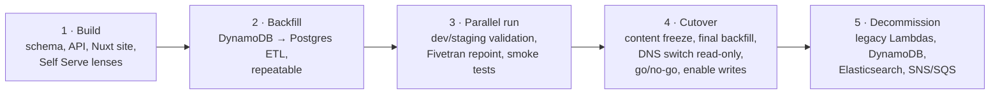

<!-- Copyright The Linux Foundation and each contributor to LFX. -->
<!-- SPDX-License-Identifier: MIT -->

# Mentorship Rewrite — 03: Migration Plan & Open Questions

Status: Proposal — for Architecture team review
Related: [01-current-system.md](./01-current-system.md), [02-target-architecture.md](./02-target-architecture.md)

Proposal-level plan, modeled on the Crowdfunding cutover ([lfx-crowdfunding/backend/docs/rewrite/05-migration-plan.md](https://github.com/linuxfoundation/lfx-crowdfunding/blob/main/backend/docs/rewrite/05-migration-plan.md)). Detailed runbooks are an implementation-phase deliverable.

## Data volume & risk

Mentorship data is small by database standards — thousands to low tens of thousands of rows across 8 DynamoDB tables (an exact per-table inventory is the first Build-phase task, as it was for Crowdfunding). The migration risk is **shape** (document → relational, nested program terms → rows), not volume. A full backfill runs in minutes and can be re-run freely until cutover.

## Phases

1. **Build.** In this repo: Postgres schema + migrations, Go API, Nuxt public site, Self Serve mentorship lenses (Milestone 1: [lfx-self-serve#1477](https://github.com/linuxfoundation/lfx-self-serve/issues/1477)). Deployed to dev/staging on the LFX v2 cluster from day one.
2. **Backfill.** One-shot, idempotent ETL: DynamoDB export → transform (un-nest program terms, map LFIDs, map every `project-members` row by member type) → Postgres. There is **no enrollment entity** — the application is the lifecycle object, so no application/enrollment split is performed (see [04](./04-authorization-model.md)). `project-members` holds three member types and **all three need a target**: `apprentice` rows become application rows carrying the full `pending → accepted → graduated` lifecycle; `mentor` rows become program-membership rows, and because mentors can *apply* as well as be invited ([01](./01-current-system.md)), their `pending` / `declined` rows are mentor applications that must survive the migration rather than be dropped as non-mentee; `maintainer` rows become program admins. Mapping only mentee rows would silently drop mentor applications — a parity feature per [02](./02-target-architecture.md). Field-level mapping dictionary as in Crowdfunding's `data-design_and_migration.md`. Re-runnable; validated with per-entity row-count reports, field-level source-to-target reconciliation (every source field maps to the expected target column), and referential-integrity checks (every un-nested child row resolves to the correct parent) — counts and spot checks alone are not sufficient for a document-to-relational transformation.
3. **Parallel run.** New stack live on dev/staging against migrated data. Fivetran Postgres connector runs alongside the DynamoDB one; `fivetran_mentorship_*` dbt models validated against both. Email templates exercised end-to-end via Mandrill test keys. Smoke-test checklist per user journey (discover → apply → approve → tasks → graduate).
4. **Cutover.** Staged so the go/no-go decision happens before the new stack takes any writes: short content freeze on prod writes → final backfill → point `mentorship.lfx.linuxfoundation.org` at the new frontend **in read-only mode** (writes rejected at the API) → verify journeys against production data → go/no-go → enable writes. The legacy stack stays read-only from the freeze onward.
5. **Decommission.** After a stability window: remove legacy Lambdas, DynamoDB tables, Elasticsearch indexes/cluster, SNS/SQS wiring, and the Fivetran DynamoDB connector. **All** legacy DynamoDB tables are exported to S3 and the exports verified before any deletion, so records omitted or mistransformed by the backfill remain recoverable afterwards; the employers export is retained permanently, the rest per LF data-retention policy.

**Rollback:** the legacy stack remains intact until decommission, but rollback is only clean **while the new stack is read-only** — the verification window in Phase 4. During that window a DNS revert plus re-enabling legacy writes loses nothing, because Postgres cannot have acquired data DynamoDB lacks. This is why the write-enable step sits *after* the go/no-go decision rather than before it: the decision is made while rollback is still free. Once writes are enabled and new records land (applications, task updates, program changes), rolling back would require either a reverse sync (Postgres → DynamoDB) or accepting the loss of those writes. No reverse-sync tooling is built; past the read-only window, the remedy is fix-forward.

## Migration-specific tasks

- **Vocabulary normalization**: legacy `memberType: "apprentice"` maps to `mentee` (the term the UI already uses) and legacy status variants map onto `pending / accepted / declined / graduated / withdrawn / hold`. Both belong in the field-level mapping dictionary; missing the first silently drops every mentee. The legacy enum (`project/project.go`, `ProjectMemberStatus`) also carries **`hold`** — an active mentorship paused mid-term ([01](./01-current-system.md)) — plus `approved` and `rejected`, which overlap `accepted` / `declined`. The dictionary must state which legacy value collapses into which target value and preserve `hold` as a distinct state, or currently-held mentees lose that status on cutover.
- **Fivetran**: add Postgres connector, repoint `lf-dbt` bronze `fivetran_mentorship_*` sources, keep column compatibility or version the models.
- **Crowdfunding coordination**: two complementary flows exist — CF's planned `mentorship-sync` (program/beneficiary data **into** CF) and the new `cf-funding-sync` (funding stats **out of** CF into Mentorship). The funding-stats pull is part of this proposal regardless; what needs deciding with the CF team is only the source for CF's inbound feed (see OQ-2).
- **Auth0**: new resource server/audience + scopes for Mentorship (dev/staging/prod tenants), Self Serve silent-auth wiring — via [auth0-terraform](https://github.com/linuxfoundation/auth0-terraform).
- **Mandrill**: template audit — migrate the ~25 active templates, retire unused ones, remove SES paths.
- **Employers**: pre-decommission data check (row count, last-modified) to confirm the portal is unused; archive then drop.
- **Invitation tokens**: the legacy stack keeps issuing tokens (1-week expiry) right up to the content freeze, so announcing cutover ahead of time does not drain them. In-flight links are preserved by backfilling the `tokens` table and importing the legacy email-token signing key, so legacy-issued tokens verify in the new stack for their remaining lifetime; one week after cutover the grace path can be removed. (Fallback if key import proves problematic: disable invitation issuance at freeze start and accept a short gap.)

## Open questions for the Architecture team

| #    | Question                                                                                                                                                                                                                                                     | Proposed default                                                                                                  |
| ---- | ------------------------------------------------------------------------------------------------------------------------------------------------------------------------------------------------------------------------------------------------------------ | ----------------------------------------------------------------------------------------------------------------- |
| OQ-1 | Confirm a separate `lfx-mentorship` repo + `mentorship` Postgres schema (vs. extending `lfx-crowdfunding`, whose schema already has mentorship-type initiatives).                                                                                            | Separate repo/schema; CF's mentorship-initiative tables remain CF's view of funding, keyed by `cf_initiative_id`. |
| OQ-2 | Source for CF's **inbound** program/beneficiary feed: keep the planned Snowflake→CF `mentorship-sync`, or a direct Mentorship API? (The CF→Mentorship funding-stats pull is retained either way — the flows are complementary directions, not alternatives.) | Decide with the CF team during Build.                                                                             |
| OQ-3 | Final domains for the new public site (e.g. `mentorship.dev.lfx.dev` / `mentorship.linuxfoundation.org`) and whether the legacy prod domain is retained via redirect.                                                                                        | Follow CF's convention; permanent redirect from the legacy domain.                                                |
| OQ-4 | Sign-off on retiring Elasticsearch for mentorship (Postgres FTS at this data scale).                                                                                                                                                                         | Retire it.                                                                                                        |
| OQ-5 | Sign-off on dropping the employer portal (unreachable in prod UI).                                                                                                                                                                                           | Drop, with archived data.                                                                                         |
