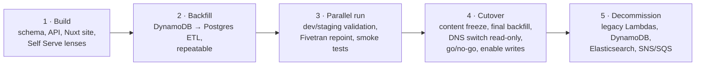

<!-- Copyright The Linux Foundation and each contributor to LFX. -->
<!-- SPDX-License-Identifier: MIT -->

# Mentorship Rewrite — 03: Migration Plan & Open Questions

Status: Proposal — for Architecture team review
Related: [01-current-system.md](./01-current-system.md), [02-target-architecture.md](./02-target-architecture.md)

Proposal-level plan, modeled on the Crowdfunding cutover ([lfx-crowdfunding/backend/docs/rewrite/05-migration-plan.md](https://github.com/linuxfoundation/lfx-crowdfunding/blob/main/backend/docs/rewrite/05-migration-plan.md)). Detailed runbooks are an implementation-phase deliverable.

## Data volume & risk

Mentorship data is small by database standards — thousands to low tens of thousands of rows across 8 DynamoDB tables (an exact per-table inventory is the first Build-phase task, as it was for Crowdfunding). The migration risk is **shape** (document → relational, nested program terms → rows), not volume. A full backfill runs in minutes and can be re-run freely until cutover.

## Phases

1. **Build.** In this repo: Postgres schema + migrations, Go API, Nuxt public site, Self Serve mentorship lenses (Milestone 1: [lfx-self-serve#1477](https://github.com/linuxfoundation/lfx-self-serve/issues/1477)). Deployed to dev/staging on the LFX v2 cluster from day one.
2. **Backfill.** One-shot, idempotent ETL: DynamoDB export → transform (un-nest program terms, map LFIDs, map every `project-members` row by member type) → Postgres. There is **no enrollment entity** — the application is the lifecycle object, so no application/enrollment split is performed (see [04](./04-authorization-model.md)). `project-members` holds three member types and **all three need a target**: `apprentice` rows become mentee application rows carrying the full `pending → accepted → graduated` lifecycle (no `active` — AQ-10 in [04](./04-authorization-model.md) dropped it, so historical in-progress mentees land on `accepted`) — but **not directly**: `project-members` is program-scoped and carries no term identity ([04 §no enrollment entity](./04-authorization-model.md)), while `applications.program_term_id` is `NOT NULL`, so each `apprentice` row must be **reconciled against the term-keyed `program-term-mentees` source** ([00](./00-current-authz-relations.md)), which is canonical for mentee lifecycle. Where a row matches, `program-term-mentees` supplies the term and the status; where it does not, the row is **reported, not imported** — synthesizing a term would attach a mentee to an arbitrary one, and importing both sources unreconciled would duplicate applications; `maintainer` rows become **program admin** membership rows; `mentor` rows are **partitioned by status**, since mentors can *apply* as well as be invited ([01](./01-current-system.md)). The partition must be mutually exclusive or mentor rows land in both targets or neither:

  | Legacy `mentor` row status | Target | Rationale |
  | --- | --- | --- |
  | `pending`, `declined`, `rejected` | `applications` row, `role = 'mentor'` — **not** a membership row. `pending` rows are subject to the open question below and are **reported, not imported**, until it is settled | An undecided or rejected mentor application confers no access; importing it as a membership would grant an effective mentor relation to someone who never got one. `rejected` is a distinct legacy value (see the vocabulary bullet below) and collapses to `declined` in the target. `pending` is the ambiguous case: legacy uses the same row for an outstanding *invitation*, which this mapping would silently reclassify. Note the target `applications.program_term_id` is `NOT NULL` (`backend/db/migrations/001_initial.up.sql`), so *every* status in this row — not just `pending` — needs a term to attach to before it can be imported; the ETL options below are what settle that |
  | `accepted` / `approved` | `program_members` row (`member_type = 'mentor'`, `status = 'active'`) | The membership is what grants access today. The target status is **`active`**, not `accepted`: `program_members_status_check` (`backend/db/migrations/001_initial.up.sql:161`) permits only `invited / requested / pending / active / declined / withdrawn`, so inserting `accepted` here fails the constraint — this is the same value-set divergence as `applications.status`, and the two enums must not be conflated. `active` is the current stored spelling of an accepted mentor; a follow-up migration renaming it to `accepted` (with `active` retained only as a possible display label) does not change this backfill target. `active` is not itself a legacy mentor status (AQ-10 in [04](./04-authorization-model.md)); it appears here only as the target spelling |
  | `withdrawn` | `program_members` row with `status = 'withdrawn'` | Preserves history without granting access, matching FR-022's withdraw-not-delete behavior |

  Whether an accepted mentor *also* gets a historical `applications` row is a deliberate choice, not an oversight: the recommendation is **no**, because legacy cannot distinguish "was invited" from "applied and was accepted" (both are one `accepted` row), so a synthesized application row would assert history that may be false. Mapping only mentee rows would silently drop mentor applications entirely — a parity feature per [02](./02-target-architecture.md).

  **This contract is not what the ETL on `main` currently implements, and adopting it means changing that script.** `backend/db/scripts/migrate_dynamo_to_postgres.py` predates this section and encodes a different mapping in three ways that matter:

  | Merged ETL behavior | Consequence under this contract |
  | --- | --- |
  | `migrate_program_members` sends **every** `project-members` row to `program_members` (`:1012`), with no partition by member type | Mentee and program-admin rows land in the membership table instead of their targets above |
  | `_VALID_MEMBER_TYPES = {"program_admin", "mentor"}` and `if member_type not in _VALID_MEMBER_TYPES: member_type = "mentor"` (`:671`, `:710-711`) | Legacy `apprentice` and `maintainer` are both unrecognized, so **every one of those rows becomes a mentor membership** — a false grant, and the most serious of the three: an apprentice would receive an effective mentor relation over the program |
  | `applications` are sourced only from `jobspring-prod-program-term-mentees` (`:1001`) | Mentor applications are never created, and mentee rows may be both duplicated (as memberships) and mis-keyed |

  The `apprentice → mentor` default is worth separating from the rest: it is a live defect in a script already on `main`, not merely a divergence from this proposal, and it should be fixed regardless of which mapping is finally adopted. Before this contract is adopted, that script must be updated to match it — or explicitly gated off (env flag / removed from the runbook) so it cannot be run against a real target. Shipping both leaves two contradictory backfills in the repo with no marker saying which is authoritative.

  **Open question — pending mentor rows are blocked twice, and the two blockers must be settled together.** The partition table above is the intended contract, but pending/declined mentor rows cannot currently be written as stated, for two independent reasons. Resolving only one leaves the ETL still blocked, so they are recorded as one decision.

  *(i) No term to key on.* `applications.program_term_id` is `NOT NULL` (`backend/db/migrations/001_initial.up.sql:171`), but [04](./04-authorization-model.md) describes mentors as applying to a *program*, and only mentee rows are term-keyed in legacy. These rows therefore cannot be inserted as applications at all without either inventing a term or changing the target model.

  *(ii) Invitation and application are indistinguishable in the source.* [04](./04-authorization-model.md) states that legacy uses **one `pending` row for either** an outstanding mentor invitation or a genuine mentor application, and the legacy data carries no discriminator to separate them: `ProjectMemberStatus` (`backend/project/project.go:1224-1248`) has no `invited` or `requested` value; the invite path (`sendMentorInvites`, `backend/project/service_project_member.go:1203`) only sends email and writes no marker to the row; and the `tokens` table (`backend/signing/signing.go:14-20`) holds no member or program reference, so it cannot be joined back to one. Mapping every `pending` row to an application therefore **silently reclassifies outstanding invitations**, losing their invite/token semantics. Because no discriminator exists to recover, the ETL must not assert the classification: unresolved `pending` mentor rows are **reported for manual triage**, not imported as applications. Whether the surviving invitations are then re-issued in the new system, imported into a distinct invite state, or dropped is the decision needed here.

  Three options, to be settled with the schema before the ETL is written: (a) map each mentor application to the program's term whose application window contains the row's `createdOn`, falling back to the earliest term — deterministic but occasionally arbitrary, and it does nothing for (ii); (b) make `program_term_id` nullable for `role = 'mentor'` rows, which matches the model in 04 but weakens the constraint for every row, and likewise leaves (ii) open; (c) keep mentor applications out of `applications` and give them their own program-scoped table — **the only option that addresses both**, since that table is free of the `NOT NULL` term constraint and can carry an explicit `origin` (`applied` / `invited`) column so the distinction is recorded going forward even though it cannot be recovered for existing rows. On that basis (c) is the recommendation. **Until this is decided, the claim that these rows survive the ETL is aspirational** — as written, the merged schema rejects them and the source cannot classify them. Field-level mapping dictionary as in Crowdfunding's `data-design_and_migration.md`. Re-runnable; validated with per-entity row-count reports, field-level source-to-target reconciliation (every source field maps to the expected target column), and referential-integrity checks (every un-nested child row resolves to the correct parent) — counts and spot checks alone are not sufficient for a document-to-relational transformation.
3. **Parallel run.** New stack live on dev/staging against migrated data. Fivetran Postgres connector runs alongside the DynamoDB one; `fivetran_mentorship_*` dbt models validated against both. Email templates exercised end-to-end through `lfx-v2-email-service` on dev, where its recipient-domain allowlist confines delivery to `linuxfoundation.org` addresses. Smoke-test checklist per user journey (discover → apply → approve → tasks → graduate).
4. **Cutover.** Staged so the go/no-go decision happens before the new stack takes any writes: short content freeze on prod writes → final S3 object copy → final backfill → point `mentorship.lfx.linuxfoundation.org` at the new frontend **in read-only mode** (writes rejected at the API) → verify journeys against production data → go/no-go → enable writes. The legacy stack stays read-only from the freeze onward.
5. **Decommission.** After a stability window: remove legacy Lambdas, DynamoDB tables, Elasticsearch indexes/cluster, SNS/SQS wiring, the Fivetran DynamoDB connector, and the `jobspring-prod-uploads` bucket (its referenced objects having been copied in Phase 4 — see **S3 objects** below). The bucket is declared in the serverless stack's CloudFormation (`jobspring/backend/serverless.yml`), and **CloudFormation cannot delete a non-empty bucket** — the copy deliberately leaves unreferenced objects behind (`jwks.json`, files dropped by the retention rule), so the runbook must inventory what remains, empty the bucket, and confirm it is empty before the stack delete runs. Skipping this fails the teardown mid-way. The leftovers are not archived: `jwks.json` is a regenerable artifact, and the files the retention rule dropped were dropped precisely because they are PII with no remaining purpose (see **S3 objects** below) — copying them to an archive would re-create the retention problem under a different key. The inventory exists to confirm nothing *referenced* was missed, not to salvage. **All** legacy DynamoDB tables are exported to S3 and the exports verified before any deletion, so records omitted or mistransformed by the backfill remain recoverable afterwards; the employers export is retained permanently, the rest per LF data-retention policy.

**Rollback:** the legacy stack remains intact until decommission, but rollback is only clean **while the new stack is read-only** — the verification window in Phase 4. During that window a DNS revert plus re-enabling legacy writes loses nothing, because Postgres cannot have acquired data DynamoDB lacks. This is why the write-enable step sits *after* the go/no-go decision rather than before it: the decision is made while rollback is still free. Once writes are enabled and new records land (applications, task updates, program changes), rolling back would require either a reverse sync (Postgres → DynamoDB) or accepting the loss of those writes. No reverse-sync tooling is built; past the read-only window, the remedy is fix-forward.

## Migration-specific tasks

- **Vocabulary normalization**: legacy `memberType: "apprentice"` maps to `mentee` and `memberType: "maintainer"` maps to **program admin** (the terms the UI already uses), and legacy status variants map onto `pending / accepted / declined / withdrawn / graduated`. There is **no target `active` application status** (AQ-10 in [04](./04-authorization-model.md) removed it, and `applications_status_check` does not permit it): legacy leaves an admitted mentee on `accepted` for the whole term, so historical in-progress mentees stay `accepted` and nothing is derived from the term's start date. Both mappings belong in the field-level dictionary; missing the first silently drops every mentee. The legacy enum (`project/project.go`, `ProjectMemberStatus`) also carries `approved` and `rejected`, which overlap `accepted` / `declined` — the dictionary must state which legacy value collapses into which target value. `hold` is not a valid status in the target model and is not mapped through — a paused mentorship is not represented as an application status. Legacy `hold` rows must be **reported, or assigned an explicit supported target state**, before the constraint is tightened by the follow-up migration that drops `hold` from `applications_status_check`.
- **`programs.project_uid`**: the column does not exist yet — the merged schema carries only `cii_project_id` (`backend/db/migrations/001_initial.up.sql:84`), which is a different identifier. Three parts, in order: (a) a migration adding `project_uid`, initially nullable; (b) an ETL mapping from legacy `lfProjectId` (`project/service.go:195` requires it on create, but programs predating that rule may lack it — legacy has `GetProgramsWithLFProjectID` precisely because it is not universally populated); (c) an **unmapped-program report**, since a program with no `project_uid` has no parent to inherit from and would be authorized only by its direct grants. Making the column `NOT NULL` is the forcing function and comes last, after the stragglers are resolved. This is the task [02](./02-target-architecture.md) refers to: without it the `mentorship_program#project@project:{uid}` tuple that inherited permissions depend on cannot be derived ([04](./04-authorization-model.md)).
- **`tasks.application_id`**: the column exists but is nullable, and the importer deliberately keeps legacy tasks it cannot match to an application (`(program_term_id, assignee_id)` lookup miss) with a NULL parent, counting them as `unresolved` (`backend/db/scripts/migrate_dynamo_to_postgres.py:899-901`). Task permissions inherit from the application ([04](./04-authorization-model.md)), so an orphan task has no parent to inherit from and no relation to check. Same shape as `project_uid`: an **unmapped-task report** listing the `unresolved` rows with their term and assignee so they can be matched by hand or deleted, then `NOT NULL` plus `ON DELETE CASCADE` as the forcing function once the count reaches zero.
- **S3 objects**: legacy uploads (program logos, profile logos and resumes, prerequisite-task submissions) live in `jobspring-prod-uploads`, a world-readable bucket, and are referenced by absolute URL in `programs.logoUrl`, `users.avatarUrl`, `user_profiles.logoUrl`, `user_profiles.profileLinks.resumeLink`, and `tasks.file`. **Crowdfunding's approach — leave legacy objects in place and store only new uploads the new way — does not transfer here**, for two reasons specific to Mentorship: CF's legacy objects are initiative logos, public either way, whereas Mentorship's include resumes and task submissions (PII) that the new design exists to make private; and CF's legacy bucket is not being torn down, whereas `jobspring-prod-uploads` is CloudFormation-managed by the serverless stack decommissioned in Phase 5, so "leave them" would mean retaining that stack's bucket indefinitely as an orphan. Objects are therefore copied into the new buckets and URLs rewritten during the backfill. The target contract — which bucket each file class lands in, and how its URL is served — is [02 §object storage](./02-target-architecture.md#object-storage), with the routes in [06](./06-route-matrix.md). Seven parts:
  - **Provisioning prerequisite.** The destination buckets do not exist yet and are not created by this repo: they are provisioned in [lfx-v2-opentofu](https://github.com/linuxfoundation/lfx-v2-opentofu) per [lfx-object-store-ops](https://github.com/linuxfoundation/lfx-skills/blob/main/skills/lfx-object-store-ops/SKILL.md), which is where the public/private split becomes real — CloudFront and its OAC bucket policy attach **only** to the public bucket, since a distribution over the private one would make every resume anonymously retrievable to anyone who knows the key. Versioning, SSE, lifecycle rules, the IRSA role, and the vanity DNS records come from the same place. This must land before the bulk copy runs. The `CDN_URL_PREFIX` it hands back is response-layer configuration, read at request time to compose the CDN URL — per [02 §object storage](./02-target-architecture.md#object-storage), columns store the key, never the prefix or a full URL, so nothing here is "written into" a column.
  - **Copy script** (one-off, idempotent): walks the URL columns above, extracts each key, and server-side `CopyObject`s it from the legacy bucket into the new public or private bucket per file class. Destination bucket is chosen by file class per [02 §object storage](./02-target-architecture.md#object-storage) — logos and avatars to the public bucket, resumes and submissions to the private one. The copy passes `MetadataDirective: REPLACE` to set `ContentType` and `Cache-Control` explicitly — `CopyObject` preserves source metadata by default, and the legacy bucket's values predate the public/private split, so inheriting them would carry a wrong or missing `Cache-Control` into the CDN-fronted bucket. New key is the legacy key under a class prefix (`logos/`, `avatars/`, `resumes/`, `submissions/`) — legacy keys are already UUID-unique (`jobspring/backend/upload/service.go`), so no new identifiers are minted. **Idempotent means skip, not re-copy.** The destination buckets are versioned, so reissuing `CopyObject` for an unchanged source would mint a new object version on every rerun — churn that the lifecycle rules then have to expire. The rerun consults the manifest and skips any row whose source is unchanged and whose destination key still exists; it copies only what is new or changed. Every actual copy requests `ChecksumAlgorithm: SHA256` so that the response carries a checksum to record — without that request S3 need not return one, and the validation below would be comparing against an absent value. The script emits a **manifest** of what it copied — legacy URL, destination key, and the `?v=` value — which the column rewrite below consumes; see there for why the ETL cannot derive that value itself. Only keys actually referenced by a retained row are copied; the legacy bucket also holds unrelated objects (it doubles as the store for `jwks.json`). The copy **applies the same content-type allowlist and 20 MB cap the upload routes enforce** ([06 §file routes](./06-route-matrix.md#file-routes)) and reports — rather than silently copying — any legacy object that fails either. The legacy bucket predates both rules, so without this the migration is a path around them: an oversized object, or an `image/svg+xml` logo that the SVG exclusion exists to keep out of a CDN-fronted bucket, would land in the new buckets unchecked.
  - **Column rewrite in the ETL**: a pure legacy-URL → new-value mapping applied in the existing transform (both public and private files to the **new S3 object key** — not a URL and not a route; the CDN URL and its `?v=` hint are composed at response time, so the manifest's `?v=` value is carried for validation rather than written into the column — dropped files to `NULL`), all three shapes defined in [02 §object storage](./02-target-architecture.md#object-storage).

    The `?v=` hint cannot be derived inside the ETL: it is a property of the S3 object, and the transform sees only the DynamoDB row. **The copy script therefore emits a manifest** — one row per copied object, mapping the legacy URL to its destination key and the `?v=` value the copy assigned (the source object's `LastModified` as a Unix timestamp, which is stable across reruns because it describes the source) — and the ETL reads that manifest rather than recomputing anything. This is the migration-time instance of the standing rule in [02 §object storage](./02-target-architecture.md#object-storage): the token is persisted **inside the stored URL**, never refetched from S3 on read. Migrated and freshly-uploaded rows therefore end up identical in shape — one `TEXT` column holding `{CDN_URL_PREFIX}/{key}?v={timestamp}` — which is why no schema change is needed. The copy writes the same deterministic key the upload path would (`program_logos/{program_uid}`, `avatars/{user_uid}`), so migrated objects self-heal like new ones. Coupling the copy to the ETL is deliberate: the alternative, a `HeadObject` per row, makes the transform depend on S3 being reachable and on the copy having already run for that key. The manifest also makes the freeze rerun safe, since the second pass reuses the first pass's `?v=` for unchanged objects. **The manifest is itself sensitive** — it maps user identities to private resume and submission keys, so it is a locator map for the PII this design exists to protect. Store it with the same care as the private bucket, never in a repo or a build artifact, and destroy it once the post-cutover validation below has passed and the retention reconcile no longer needs it. `tasks.submit_file` is deliberately **not** in this mapping: it is the `required`/unset template flag, not a file reference, despite the misleading schema comment on `001_initial.up.sql:219` (correction folded into [linuxfoundation/lfx-self-serve#1539](https://github.com/linuxfoundation/lfx-self-serve/issues/1539)). No schema change and no post-hoc `UPDATE` pass — `migrate_dynamo_to_postgres.py` is re-runnable and already carries these columns through verbatim.
  - **Retention filter.** The predicate runs on the **normalized** status, not the raw legacy string. `_APP_STATUS_MAP` (`backend/db/scripts/migrate_dynamo_to_postgres.py:262`) maps both `approved` **and** `active` to `accepted`, so a filter written against the raw legacy values must treat all three as successful — omitting `active` would delete submissions belonging to successful, enrolled mentees. Normalize first, then filter. **`hold` is the trap here**: `_VALID_APP_STATUSES` accepts it (`:259`) but `_APP_STATUS_MAP` does not touch it (`:262`), so it normalizes to itself — outside the keep-set, and therefore a delete. That is the wrong default for a status that means *paused*, not *failed*. Legacy `hold` rows must be dispositioned to an explicit supported state before this filter runs, per the vocabulary rule above; until they are, the filter must report them rather than drop their files. Not migrated: prerequisite-task files for applications whose **normalized** status is NOT IN (`accepted`, `graduated`) on terms that ended more than **2 years** before cutover — an application that never succeeded on a long-closed term is dead, and its attachments are PII with no remaining purpose. Everything else is migrated and retained indefinitely **for now** — files on accepted (including legacy `approved`/`active`) and graduated applications are program work product, and profile-level resumes are kept regardless of outcome, since scoping them to retained applications adds a join for marginal benefit. An explicit decision to revisit post-release under LF data-retention policy, not an oversight. The UI must render a clean "no file" state for a dropped attachment (see OQ-6 for who signs off the period).

    **The legacy task record carries no application identifier**, so the predicate cannot simply be read off it. `migrate_dynamo_to_postgres.py` recovers the link by building an index keyed `(program_term_id, assignee_id)` from the already-imported Postgres `applications` rows and looking each task up in it (`migrate_dynamo_to_postgres.py:854-855`, `:903`); a task whose pair is absent gets `application_id = NULL` and is imported `unresolved`. The retention filter therefore runs **after** that resolution, against the joined result, and must treat an unresolved task as *not* matching the keep-set rather than as a silent pass: those orphans have no application status to test and would otherwise fall through the filter by accident. Their files are copied with everything else and are resolved by the unmapped-task report, not by the retention rule.
  - **Lock the legacy bucket at cutover, not at decommission.** `jobspring-prod-uploads` is world-readable, so every migrated resume and task submission stays anonymously fetchable at its old URL for the whole Phase 5 stability window — as do the retention-excluded files, which the new system treats as deleted. Blocking that is a **Phase 4 cutover step**, not part of the Phase 5 drain: once the final copy completes, apply the public-access block. Nothing in the new system reads the legacy bucket, so this costs nothing operationally.

    **Blocking access and deleting are separate steps, and only the first happens at cutover.** The block is reversible — lifting it restores anonymous reads — so it does not compromise the clean-rollback guarantee above. Deleting the retention-excluded keys is not reversible, and doing it before go/no-go would break that guarantee: a rollback would restore DynamoDB rows whose legacy URLs point at objects that no longer exist. **Physical deletion of the retention-excluded keys therefore waits until after go/no-go**, and is folded into the Phase 5 bucket drain. Until then those files are unreachable but recoverable, which is the correct posture for a window whose whole purpose is being able to turn back.
  - **Reconcile the destination before cutover.** The bulk copy runs days before the retention predicate is finally evaluated, so an object can be copied while its application still qualifies, cross the 2-year cutoff before the freeze rerun, and then have its column rewritten to `NULL` — leaving the payload sitting in the new private bucket with nothing referencing it. That re-creates the retention problem at the destination, which is the one place it must not exist. The freeze rerun therefore ends by diffing the final retained key set against the manifest and **permanently removing every destination key no longer referenced** — all versions and delete markers, not a plain `DeleteObject`, which on a versioned bucket only adds a marker and leaves the payload retrievable.
  - **Timing and validation**: run the bulk copy days before cutover, then re-run it inside the Phase 4 content freeze — idempotent in the skip-unchanged sense above, so the second pass only picks up objects uploaded since — before the final backfill. No new cutover phase and no dual-read fallback in the application: after cutover nothing references the legacy bucket. Emptying it is a Phase 5 decommission step, not part of the copy — see Phase 5 above. Validated by (a) referenced-key count per class, post-filter, matching object count in the new buckets; (b) `Content-Length` equality source-to-destination — **the only direct source-to-destination comparison available, and a weak one**, since size equality is not byte equality. It is acceptable because server-side `CopyObject` never routes the bytes through the script and S3 validates the copy internally; deriving a true source digest would mean streaming every object through the migrator to hash it. The `ChecksumSHA256` requested via `ChecksumAlgorithm: SHA256` is **not** evidence of equivalence — it digests what S3 wrote at the *destination*, and legacy objects have no stored source digest to compare against. Record it as a **destination integrity baseline** instead: a stable digest that a later reread checks for post-copy corruption. **Not `ETag`**, which is only MD5 under some encryption modes and would flag a byte-identical copy as a mismatch if destination SSE differs from the legacy bucket's AES256; (c) a post-ETL `HeadObject` over every non-NULL file column in Postgres — both public and private columns hold the key directly, so the call is the same shape for either class; for the public class, the check additionally composes the CDN URL from the stored key and the environment's `CDN_URL_PREFIX` and confirms it is well-formed, rather than parsing a key back out of a stored URL. Must resolve 100%; (d) staging spot checks rendering a program logo, downloading a recent submission, **downloading a *migrated* resume through `GET /v1/applications/{uid}/resume`** — the one path that exercises a copied private-class object end to end, through the reviewer relation and the `Range`/`Content-Disposition` handling, none of which (a)–(c) touch — and confirming the dropped-attachment state.
- **Fivetran**: add Postgres connector, repoint `lf-dbt` bronze `fivetran_mentorship_*` sources, keep column compatibility or version the models.
- **Crowdfunding coordination**: two complementary flows, both retained — CF's `mentorship-sync` (program/beneficiary data **into** CF, via Snowflake) and the new `cf-funding-sync` (funding stats **out of** CF into Mentorship).
- **Auth0**: new resource server/audience + scopes for Mentorship (dev/staging/prod tenants), Self Serve silent-auth wiring — via [auth0-terraform](https://github.com/linuxfoundation/auth0-terraform).
- **Email**: stand up the `Notifier` implementation against `lfx-v2-email-service` (`lfx.email-service.send_email` via `pkg/api`) and render templates in this repo. Audit the legacy Mandrill inventory as a parity checklist, not a porting target: implement the notifications the rewrite actually declares, and retire the rest with the features they belong to. No Mandrill or direct-SES client is carried over.
- **Employers**: pre-decommission data check (row count, last-modified) to confirm the portal is unused; archive then drop.
- **Invitation tokens**: the legacy stack keeps issuing tokens (1-week expiry) right up to the content freeze, so announcing cutover ahead of time does not drain them. In-flight links are preserved by backfilling the `tokens` table and importing the legacy email-token signing key, so legacy-issued tokens verify in the new stack for their remaining lifetime; one week after cutover the grace path can be removed. (Fallback if key import proves problematic: disable invitation issuance at freeze start and accept a short gap.)

## Open questions for the Architecture team

| #    | Question                                                                                                                                                                                                                                                     | Proposed default                                                                                                  |
| ---- | ------------------------------------------------------------------------------------------------------------------------------------------------------------------------------------------------------------------------------------------------------------ | ----------------------------------------------------------------------------------------------------------------- |
| OQ-2 | ~~Source for CF's inbound program/beneficiary feed.~~ **Decided** — keep `mentorship-sync`: Mentorship Postgres → Fivetran → Snowflake → CF (`mentorship-sync` CronJob). Agreed by the Mentorship and Crowdfunding teams (same team). | Resolved. |
| OQ-3 | Final domains for the new public site (e.g. `mentorship.dev.lfx.dev` / `mentorship.linuxfoundation.org`) and whether the legacy prod domain is retained via redirect.                                                                                        | Follow CF's convention; permanent redirect from the legacy domain.                                                |
| OQ-4 | Sign-off on retiring Elasticsearch for mentorship (Postgres FTS at this data scale).                                                                                                                                                                         | Retire it.                                                                                                        |
| OQ-5 | Sign-off on dropping the employer portal (unreachable in prod UI).                                                                                                                                                                                           | Drop, with archived data.                                                                                         |
| OQ-6 | Sign-off on the S3 retention rule: drop prerequisite-task files for non-successful applications — normalized status not in (`accepted`, `graduated`), which covers legacy `approved` and `active` — on terms ended > 2 years before cutover; keep everything else indefinitely for now. The period and the indefinite retention are data-retention calls, not engineering ones.                                        | 2 years, as above; confirm with PM/legal under LF data-retention policy before the copy script runs.             |
