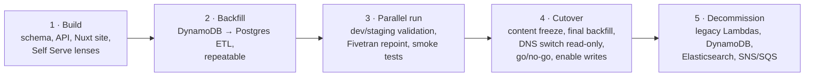

<!-- Copyright The Linux Foundation and each contributor to LFX. -->
<!-- SPDX-License-Identifier: MIT -->

# Mentorship Rewrite — 03: Migration Plan & Open Questions

Status: Proposal — for Architecture team review
Related: [01-current-system.md](./01-current-system.md), [02-target-architecture.md](./02-target-architecture.md)

Proposal-level plan, modeled on the Crowdfunding cutover ([lfx-crowdfunding/backend/docs/rewrite/05-migration-plan.md](https://github.com/linuxfoundation/lfx-crowdfunding/blob/main/backend/docs/rewrite/05-migration-plan.md)). Detailed runbooks are an implementation-phase deliverable.

## Data volume & risk

Mentorship data is small by database standards — thousands to low tens of thousands of rows across 8 DynamoDB tables (an exact per-table inventory is the first Build-phase task, as it was for Crowdfunding). The migration risk is **shape** (document → relational, nested program terms → rows), not volume. A full backfill runs in minutes and can be re-run freely until cutover.

## Phases

1. **Build.** In this repo: Postgres schema + migrations, Go API, Nuxt public site, Self Serve mentorship lenses (Milestone 1: [lfx-self-serve#1477](https://github.com/linuxfoundation/lfx-self-serve/issues/1477)). Deployed to dev/staging on the LFX v2 cluster from day one.
2. **Backfill.** One-shot, idempotent ETL: DynamoDB export → transform (un-nest program terms, map LFIDs, map every `project-members` row by member type) → Postgres. There is **no enrollment entity** — the application is the lifecycle object, so no application/enrollment split is performed (see [04](./04-authorization-model.md)). `project-members` holds three member types and **all three need a target**: `apprentice` rows become mentee application rows carrying the full `pending → accepted → graduated` lifecycle (no `active` — AQ-10 in [04](./04-authorization-model.md) dropped it, so historical in-progress mentees land on `accepted`) — but **not directly**: `project-members` is program-scoped and carries no term identity ([04 §no enrollment entity](./04-authorization-model.md)), while `applications.program_term_id` is `NOT NULL`, so each `apprentice` row must be **reconciled against the term-keyed `program-term-mentees` source** ([00](./00-current-authz-relations.md)), which is canonical for mentee lifecycle. Where a row matches, `program-term-mentees` supplies the term and the status; where it does not, the row is **reported, not imported** — synthesizing a term would attach a mentee to an arbitrary one, and importing both sources unreconciled would duplicate applications; `maintainer` rows become **program admin** membership rows; `mentor` rows are **partitioned by status**, since mentors can *apply* as well as be invited ([01](./01-current-system.md)). The partition must be mutually exclusive or mentor rows land in both targets or neither:

  | Legacy `mentor` row status | Target | Rationale |
  | --- | --- | --- |
  | `pending`, `declined`, `rejected` | `applications` row, `role = 'mentor'` — **not** a membership row. `pending` rows are subject to the open question below and are **reported, not imported**, until it is settled | An undecided or rejected mentor application confers no access; importing it as a membership would grant an effective mentor relation to someone who never got one. `rejected` is a distinct legacy value (see the vocabulary bullet below) and collapses to `declined` in the target. `pending` is the ambiguous case: legacy uses the same row for an outstanding *invitation*, which this mapping would silently reclassify. Note the target `applications.program_term_id` is `NOT NULL` (`backend/db/migrations/001_initial.up.sql`), so *every* status in this row — not just `pending` — needs a term to attach to before it can be imported; the ETL options below are what settle that |
  | `accepted` / `approved`, `active` | `program_members` row (`member_type = 'mentor'`, `status = 'active'`) | The membership is what grants access today. The target status is **`active`**, not `accepted`: `program_members_status_check` (`backend/db/migrations/001_initial.up.sql:161`) permits only `invited / requested / pending / active / declined / withdrawn`, so inserting `accepted` here fails the constraint — this is the same value-set divergence as `applications.status`, and the two enums must not be conflated. `active` is the current stored spelling of an accepted mentor; a follow-up migration renaming it to `accepted` (with `active` retained only as a possible display label) does not change this backfill target |
  | `withdrawn` | `program_members` row with `status = 'withdrawn'` | Preserves history without granting access, matching FR-022's withdraw-not-delete behavior |

  Whether an accepted mentor *also* gets a historical `applications` row is a deliberate choice, not an oversight: the recommendation is **no**, because legacy cannot distinguish "was invited" from "applied and was accepted" (both are one `accepted` row), so a synthesized application row would assert history that may be false. Mapping only mentee rows would silently drop mentor applications entirely — a parity feature per [02](./02-target-architecture.md).

  **This contract is not what the ETL on `main` currently implements, and adopting it means changing that script.** `backend/db/scripts/migrate_dynamo_to_postgres.py` predates this section and encodes a different mapping in three ways that matter:

  | Merged ETL behavior | Consequence under this contract |
  | --- | --- |
  | `migrate_program_members` sends **every** `project-members` row to `program_members` (`:1012`), with no partition by member type | Mentee and program-admin rows land in the membership table instead of their targets above |
  | `_VALID_MEMBER_TYPES = {"program_admin", "mentor"}` and `if member_type not in _VALID_MEMBER_TYPES: member_type = "mentor"` (`:671`, `:710-711`) | Legacy `apprentice` and `maintainer` are both unrecognized, so **every one of those rows becomes a mentor membership** — a false grant, and the most serious of the three: an apprentice would receive an effective mentor relation over the program |
  | `applications` are sourced only from `jobspring-prod-program-term-mentees` (`:1001`) | Mentor applications are never created, and mentee rows may be both duplicated (as memberships) and mis-keyed |

  The `apprentice → mentor` default is worth separating from the rest: it is a live defect in a script already on `main`, not merely a divergence from this proposal, and it should be fixed regardless of which mapping is finally adopted. Before this contract is adopted, that script must be updated to match it — or explicitly gated off (env flag / removed from the runbook) so it cannot be run against a real target. Shipping both leaves two contradictory backfills in the repo with no marker saying which is authoritative.

  **Open question — pending mentor rows are blocked twice, and the two blockers must be settled together.** The partition table above is the intended contract, but pending/declined mentor rows cannot currently be written as stated, for two independent reasons. Resolving only one leaves the ETL still blocked, so they are recorded as one decision.

  *(i) No term to key on.* `applications.program_term_id` is `NOT NULL` (`backend/db/migrations/001_initial.up.sql:171`), but [04](./04-authorization-model.md) describes mentors as applying to a *program*, and only mentee rows are term-keyed in legacy. These rows therefore cannot be inserted as applications at all without either inventing a term or changing the target model.

  *(ii) Invitation and application are indistinguishable in the source.* [04](./04-authorization-model.md) states that legacy uses **one `pending` row for either** an outstanding mentor invitation or a genuine mentor application, and the legacy data carries no discriminator to separate them: `ProjectMemberStatus` (`backend/project/project.go:1224-1248`) has no `invited` or `requested` value; the invite path (`sendMentorInvites`, `backend/project/service_project_member.go:1203`) only sends email and writes no marker to the row; and the `tokens` table (`backend/signing/signing.go:14-20`) holds no member or program reference, so it cannot be joined back to one. Mapping every `pending` row to an application therefore **silently reclassifies outstanding invitations**, losing their invite/token semantics. Because no discriminator exists to recover, the ETL must not assert the classification: unresolved `pending` mentor rows are **reported for manual triage**, not imported as applications. Whether the surviving invitations are then re-issued in the new system, imported into a distinct invite state, or dropped is the decision needed here.

  Three options, to be settled with the schema before the ETL is written: (a) map each mentor application to the program's term whose application window contains the row's `createdOn`, falling back to the earliest term — deterministic but occasionally arbitrary, and it does nothing for (ii); (b) make `program_term_id` nullable for `role = 'mentor'` rows, which matches the model in 04 but weakens the constraint for every row, and likewise leaves (ii) open; (c) keep mentor applications out of `applications` and give them their own program-scoped table — **the only option that addresses both**, since that table is free of the `NOT NULL` term constraint and can carry an explicit `origin` (`applied` / `invited`) column so the distinction is recorded going forward even though it cannot be recovered for existing rows. On that basis (c) is the recommendation. **Until this is decided, the claim that these rows survive the ETL is aspirational** — as written, the merged schema rejects them and the source cannot classify them. Field-level mapping dictionary as in Crowdfunding's `data-design_and_migration.md`. Re-runnable; validated with per-entity row-count reports, field-level source-to-target reconciliation (every source field maps to the expected target column), and referential-integrity checks (every un-nested child row resolves to the correct parent) — counts and spot checks alone are not sufficient for a document-to-relational transformation.
3. **Parallel run.** New stack live on dev/staging against migrated data. Fivetran Postgres connector runs alongside the DynamoDB one; `fivetran_mentorship_*` dbt models validated against both. Email templates exercised end-to-end through `lfx-v2-email-service` on dev, where its recipient-domain allowlist confines delivery to `linuxfoundation.org` addresses. Smoke-test checklist per user journey (discover → apply → approve → tasks → graduate).
4. **Cutover.** Staged so the go/no-go decision happens before the new stack takes any writes: short content freeze on prod writes → final backfill → point `mentorship.lfx.linuxfoundation.org` at the new frontend **in read-only mode** (writes rejected at the API) → verify journeys against production data → go/no-go → enable writes. The legacy stack stays read-only from the freeze onward.
5. **Decommission.** After a stability window: remove legacy Lambdas, DynamoDB tables, Elasticsearch indexes/cluster, SNS/SQS wiring, and the Fivetran DynamoDB connector. **All** legacy DynamoDB tables are exported to S3 and the exports verified before any deletion, so records omitted or mistransformed by the backfill remain recoverable afterwards; the employers export is retained permanently, the rest per LF data-retention policy.

**Rollback:** the legacy stack remains intact until decommission, but rollback is only clean **while the new stack is read-only** — the verification window in Phase 4. During that window a DNS revert plus re-enabling legacy writes loses nothing, because Postgres cannot have acquired data DynamoDB lacks. This is why the write-enable step sits *after* the go/no-go decision rather than before it: the decision is made while rollback is still free. Once writes are enabled and new records land (applications, task updates, program changes), rolling back would require either a reverse sync (Postgres → DynamoDB) or accepting the loss of those writes. No reverse-sync tooling is built; past the read-only window, the remedy is fix-forward.

## Migration-specific tasks

- **Vocabulary normalization**: legacy `memberType: "apprentice"` maps to `mentee` and `memberType: "maintainer"` maps to **program admin** (the terms the UI already uses), and legacy status variants map onto `pending / accepted / declined / withdrawn / graduated`. There is **no target `active` application status** (AQ-10 in [04](./04-authorization-model.md) removed it, and `applications_status_check` does not permit it): legacy leaves an admitted mentee on `accepted` for the whole term, so historical in-progress mentees stay `accepted` and nothing is derived from the term's start date. Both mappings belong in the field-level dictionary; missing the first silently drops every mentee. The legacy enum (`project/project.go`, `ProjectMemberStatus`) also carries `approved` and `rejected`, which overlap `accepted` / `declined` — the dictionary must state which legacy value collapses into which target value. `hold` is not a valid status in the target model and is not mapped through — a paused mentorship is not represented as an application status. Legacy `hold` rows must be **reported, or assigned an explicit supported target state**, before the constraint is tightened by the follow-up migration that drops `hold` from `applications_status_check`.
- **`programs.project_uid`**: the column does not exist yet — the merged schema carries only `cii_project_id` (`backend/db/migrations/001_initial.up.sql:84`), which is a different identifier. Three parts, in order: (a) a migration adding `project_uid`, initially nullable; (b) an ETL mapping from legacy `lfProjectId` (`project/service.go:195` requires it on create, but programs predating that rule may lack it — legacy has `GetProgramsWithLFProjectID` precisely because it is not universally populated); (c) an **unmapped-program report**, since a program with no `project_uid` has no parent to inherit from and would be authorized only by its direct grants. Making the column `NOT NULL` is the forcing function and comes last, after the stragglers are resolved. This is the task [02](./02-target-architecture.md) refers to: without it the `mentorship_program#project@project:{uid}` tuple that inherited permissions depend on cannot be derived ([04](./04-authorization-model.md)).
- **`tasks.application_id`**: the column exists but is nullable, and the importer deliberately keeps legacy tasks it cannot match to an application (`(program_term_id, assignee_id)` lookup miss) with a NULL parent, counting them as `unresolved` (`backend/db/scripts/migrate_dynamo_to_postgres.py:899-901`). Task permissions inherit from the application ([04](./04-authorization-model.md)), so an orphan task has no parent to inherit from and no relation to check. Same shape as `project_uid`: an **unmapped-task report** listing the `unresolved` rows with their term and assignee so they can be matched by hand or deleted, then `NOT NULL` plus `ON DELETE CASCADE` as the forcing function once the count reaches zero.
- **Fivetran**: add Postgres connector, repoint `lf-dbt` bronze `fivetran_mentorship_*` sources, keep column compatibility or version the models.
- **Crowdfunding coordination**: two complementary flows exist — CF's planned `mentorship-sync` (program/beneficiary data **into** CF) and the new `cf-funding-sync` (funding stats **out of** CF into Mentorship). The funding-stats pull is part of this proposal regardless; what needs deciding with the CF team is only the source for CF's inbound feed (see OQ-2).
- **Auth0**: new resource server/audience + scopes for Mentorship (dev/staging/prod tenants), Self Serve silent-auth wiring — via [auth0-terraform](https://github.com/linuxfoundation/auth0-terraform).
- **Email**: stand up the `Notifier` implementation against `lfx-v2-email-service` (`lfx.email-service.send_email` via `pkg/api`) and render templates in this repo. Audit the legacy Mandrill inventory as a parity checklist, not a porting target: implement the notifications the rewrite actually declares, and retire the rest with the features they belong to. No Mandrill or direct-SES client is carried over.
- **Employers**: pre-decommission data check (row count, last-modified) to confirm the portal is unused; archive then drop.
- **Invitation tokens**: the legacy stack keeps issuing tokens (1-week expiry) right up to the content freeze, so announcing cutover ahead of time does not drain them. In-flight links are preserved by backfilling the `tokens` table and importing the legacy email-token signing key, so legacy-issued tokens verify in the new stack for their remaining lifetime; one week after cutover the grace path can be removed. (Fallback if key import proves problematic: disable invitation issuance at freeze start and accept a short gap.)

## Open questions for the Architecture team

| #    | Question                                                                                                                                                                                                                                                     | Proposed default                                                                                                  |
| ---- | ------------------------------------------------------------------------------------------------------------------------------------------------------------------------------------------------------------------------------------------------------------ | ----------------------------------------------------------------------------------------------------------------- |
| OQ-1 | Confirm a separate `lfx-mentorship` repo + `mentorship` Postgres schema (vs. extending `lfx-crowdfunding`, whose schema already has mentorship-type initiatives).                                                                                            | Separate repo/schema; CF's mentorship-initiative tables remain CF's view of funding, keyed by `cf_initiative_id`. |
| OQ-2 | Source for CF's **inbound** program/beneficiary feed: keep the planned Snowflake→CF `mentorship-sync`, or a direct Mentorship API? (The CF→Mentorship funding-stats pull is retained either way — the flows are complementary directions, not alternatives.) | Decide with the CF team during Build.                                                                             |
| OQ-3 | Final domains for the new public site (e.g. `mentorship.dev.lfx.dev` / `mentorship.linuxfoundation.org`) and whether the legacy prod domain is retained via redirect.                                                                                        | Follow CF's convention; permanent redirect from the legacy domain.                                                |
| OQ-4 | Sign-off on retiring Elasticsearch for mentorship (Postgres FTS at this data scale).                                                                                                                                                                         | Retire it.                                                                                                        |
| OQ-5 | Sign-off on dropping the employer portal (unreachable in prod UI).                                                                                                                                                                                           | Drop, with archived data.                                                                                         |
