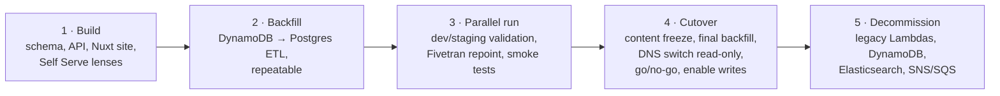

<!-- Copyright The Linux Foundation and each contributor to LFX. -->
<!-- SPDX-License-Identifier: MIT -->

# Mentorship Rewrite — 03: Migration Plan & Open Questions

Status: Proposal — for Architecture team review
Related: [01-current-system.md](./01-current-system.md), [02-target-architecture.md](./02-target-architecture.md)

Proposal-level plan, modeled on the Crowdfunding cutover ([lfx-crowdfunding/backend/docs/rewrite/05-migration-plan.md](https://github.com/linuxfoundation/lfx-crowdfunding/blob/main/backend/docs/rewrite/05-migration-plan.md)). Detailed runbooks are an implementation-phase deliverable.

## Development migration

Development and deployed environments apply migration 003 normally through the
Helm migration hook after versions 001 and 002. A schema reset is only a local
fallback for disposable databases; do not use it against an environment with
data. For a reset, export the database, recreate the Mentorship schema, run
`cmd/migrate`, and re-import through the migration scripts.

## Data volume & risk

Mentorship data is small by database standards — thousands to low tens of thousands of rows across 8 DynamoDB tables (an exact per-table inventory is the first Build-phase task, as it was for Crowdfunding). The migration risk is **shape** (document → relational, nested program terms → rows), not volume. A full backfill runs in minutes and can be re-run freely until cutover.

## Phases

```mermaid
flowchart LR
    P1["1 · Build<br/>schema, API, Nuxt site,<br/>Self Serve lenses"] --> P2["2 · Backfill<br/>DynamoDB → Postgres ETL,<br/>repeatable"]
    P2 --> P3["3 · Parallel run<br/>dev/staging validation,<br/>Fivetran repoint, smoke tests"]
    P3 --> P4["4 · Cutover<br/>content freeze, final backfill,<br/>DNS switch read-only,<br/>go/no-go, enable writes"]
    P4 --> P5["5 · Decommission<br/>legacy Lambdas, DynamoDB,<br/>Elasticsearch, SNS/SQS"]
```

1. **Build.** In this repo: Postgres schema + migrations, Go API, Nuxt public site, Self Serve mentorship lenses (Milestone 1: [lfx-self-serve#1477](https://github.com/linuxfoundation/lfx-self-serve/issues/1477)). Deployed to dev/staging on the LFX v2 cluster from day one.
2. **Backfill.** One-shot, idempotent ETL: DynamoDB export → transform (un-nest program terms, map LFIDs, map every `project-members` row by member type) → Postgres. There is **no enrollment entity** — the application is the lifecycle object, so no application/enrollment split is performed (see [04](./04-authorization-model.md)). `project-members` holds three member types and **all three need a target**: `apprentice` rows become mentee application rows carrying the full `pending → accepted → graduated` lifecycle (no `active` — AQ-10 in [04](./04-authorization-model.md) dropped it, so historical in-progress mentees land on `accepted`) — but **not directly**: `project-members` is program-scoped and carries no term identity ([04 §no enrollment entity](./04-authorization-model.md)), while `applications.program_term_id` is `NOT NULL`, so each `apprentice` row must be **reconciled against the term-keyed `program-term-mentees` source** ([00](./00-current-authz-relations.md)), which is canonical for mentee lifecycle. Where a row matches, `program-term-mentees` supplies the term and the status; where it does not, the row is **reported, not imported** — synthesizing a term would attach a mentee to an arbitrary one, and importing both sources unreconciled would duplicate applications; `maintainer` rows become **program admin** membership rows; `mentor` rows are **partitioned by status**, since mentors can *apply* as well as be invited ([01](./01-current-system.md)). The partition must be mutually exclusive or mentor rows land in both targets or neither:

  | Legacy `mentor` row status | Target | Rationale |
  | --- | --- | --- |
  | `pending`, `declined`, `rejected` | `applications` row, `role = 'mentor'` — **not** a membership row. `pending` rows are subject to the open question below and are **reported, not imported**, until it is settled | An undecided or rejected mentor application confers no access; importing it as a membership would grant an effective mentor relation to someone who never got one. `rejected` is a distinct legacy value (see the vocabulary bullet below) and collapses to `declined` in the target. `pending` is the ambiguous case: legacy uses the same row for an outstanding *invitation*, which this mapping would silently reclassify. Note the target `applications.program_term_id` is `NOT NULL` (`backend/db/migrations/001_initial.up.sql`), so *every* status in this row — not just `pending` — needs a term to attach to before it can be imported; the ETL options below are what settle that |
  | `accepted` / `approved` | `program_members` row (`member_type = 'mentor'`, `status = 'active'`) | The membership is what grants access today. The target status is **`active`**, not `accepted`: `program_members_status_check` (`backend/db/migrations/001_initial.up.sql:161`) permits only `invited / requested / pending / active / declined / withdrawn`, so inserting `accepted` here fails the constraint — this is the same value-set divergence as `applications.status`, and the two enums must not be conflated. `active` is the current stored spelling of an accepted mentor; a follow-up migration renaming it to `accepted` (with `active` retained only as a possible display label) does not change this backfill target. `active` is not itself a legacy mentor status (AQ-10 in [04](./04-authorization-model.md)); it appears here only as the target spelling |
  | `withdrawn` | `program_members` row with `status = 'withdrawn'` | Preserves history without granting access, matching FR-022's withdraw-not-delete behavior |

  Whether an accepted mentor *also* gets a historical `applications` row is a deliberate choice, not an oversight: the recommendation is **no**, because legacy cannot distinguish "was invited" from "applied and was accepted" (both are one `accepted` row), so a synthesized application row would assert history that may be false. Mapping only mentee rows would silently drop mentor applications entirely — a parity feature per [02](./02-target-architecture.md).

  **The ETL now implements the safe portion of this partition explicitly.**
  Legacy `maintainer` rows map to `program_admin`; approved/accepted mentors map
  to active mentor memberships; and term-scoped `apprentice`/`mentee` rows are
  skipped because `program-term-mentees` is their authoritative application
  source. Unknown member types and ambiguous pending/declined mentor rows are
  reported with their member, program, and user IDs instead of being converted
  into an access-granting membership. The importer therefore never defaults an
  unrecognized row to `mentor`.

  Mentor applications remain unresolved: `applications` are still sourced from
  `program-term-mentees`, because project-member rows have neither a reliable
  invitation/application discriminator nor a required term parent. The open
  question below must be resolved before those historical rows can be imported
  as applications.

  **Open question — pending mentor rows are blocked twice, and the two blockers must be settled together.** The partition table above is the intended contract, but pending/declined mentor rows cannot currently be written as stated, for two independent reasons. Resolving only one leaves the ETL still blocked, so they are recorded as one decision.

  *(i) No term to key on.* `applications.program_term_id` is `NOT NULL` (`backend/db/migrations/001_initial.up.sql:171`), but [04](./04-authorization-model.md) describes mentors as applying to a *program*, and only mentee rows are term-keyed in legacy. These rows therefore cannot be inserted as applications at all without either inventing a term or changing the target model.

  *(ii) Invitation and application are indistinguishable in the source.* [04](./04-authorization-model.md) states that legacy uses **one `pending` row for either** an outstanding mentor invitation or a genuine mentor application, and the legacy data carries no discriminator to separate them: `ProjectMemberStatus` (`backend/project/project.go:1224-1248`) has no `invited` or `requested` value; the invite path (`sendMentorInvites`, `backend/project/service_project_member.go:1203`) only sends email and writes no marker to the row; and the `tokens` table (`backend/signing/signing.go:14-20`) holds no member or program reference, so it cannot be joined back to one. Mapping every `pending` row to an application therefore **silently reclassifies outstanding invitations**, losing their invite/token semantics. Because no discriminator exists to recover, the ETL must not assert the classification: unresolved `pending` mentor rows are **reported for manual triage**, not imported as applications. Whether the surviving invitations are then re-issued in the new system, imported into a distinct invite state, or dropped is the decision needed here.

  Three options, to be settled with the schema before the ETL is written: (a) map each mentor application to the program's term whose application window contains the row's `createdOn`, falling back to the earliest term — deterministic but occasionally arbitrary, and it does nothing for (ii); (b) make `program_term_id` nullable for `role = 'mentor'` rows, which matches the model in 04 but weakens the constraint for every row, and likewise leaves (ii) open; (c) keep mentor applications out of `applications` and give them their own program-scoped table — **the only option that addresses both**, since that table is free of the `NOT NULL` term constraint and can carry an explicit `origin` (`applied` / `invited`) column so the distinction is recorded going forward even though it cannot be recovered for existing rows. On that basis (c) is the recommendation. **Until this is decided, the claim that these rows survive the ETL is aspirational** — as written, the merged schema rejects them and the source cannot classify them. Field-level mapping dictionary as in Crowdfunding's `data-design_and_migration.md`. Re-runnable; validated with per-entity row-count reports, field-level source-to-target reconciliation (every source field maps to the expected target column), and referential-integrity checks (every un-nested child row resolves to the correct parent) — counts and spot checks alone are not sufficient for a document-to-relational transformation.
3. **Parallel run.** New stack live on dev/staging against migrated data. Fivetran Postgres connector runs alongside the DynamoDB one; `fivetran_mentorship_*` dbt models validated against both. Email templates exercised end-to-end through `lfx-v2-email-service` on dev, where its recipient-domain allowlist confines delivery to `linuxfoundation.org` addresses. Smoke-test checklist per user journey (discover → apply → approve → tasks → graduate).
4. **Cutover.** Staged so the go/no-go decision happens before the new stack takes any writes: short content freeze on prod writes → final S3 object copy → final backfill → point `mentorship.lfx.linuxfoundation.org` at the new frontend **in read-only mode** (writes rejected at the API) → verify journeys against production data → go/no-go → enable writes. The legacy stack stays read-only from the freeze onward.
5. **Decommission.** After a stability window: remove legacy Lambdas, DynamoDB tables, Elasticsearch indexes/cluster, SNS/SQS wiring, the Fivetran DynamoDB connector, and the `jobspring-prod-uploads` bucket (its referenced objects having been copied in Phase 4 — see **S3 objects** below). The bucket is declared in the serverless stack's CloudFormation (`jobspring/backend/serverless.yml`), and **CloudFormation cannot delete a non-empty bucket** — the copy deliberately leaves unreferenced objects behind (`jwks.json`, every profile resume — not migrated by decision, see **S3 objects** below — and the orphan of every legacy replace, since legacy never reused a key), so the runbook must inventory what remains, empty the bucket, and confirm it is empty before the stack delete runs. Skipping this fails the teardown mid-way. The leftovers are not archived: `jwks.json` is a regenerable artifact, the resumes are dropped by decision ([02 §file classes](./02-target-architecture.md#file-classes)), and the orphans are superseded uploads that nothing has referenced since they were replaced. The inventory exists to confirm nothing *referenced* was missed, not to salvage. **All** legacy DynamoDB tables are exported to S3 and the exports verified before any deletion, so records omitted or mistransformed by the backfill remain recoverable afterwards; the employers export is retained permanently, the rest per LF data-retention policy.

**Rollback:** the legacy stack remains intact until decommission, but rollback is only clean **while the new stack is read-only** — the verification window in Phase 4. During that window a DNS revert, **lifting the legacy bucket's public-access block** (applied at cutover — see **S3 objects** below; leaving it on makes the legacy app serve 403s for every logo and avatar), and re-enabling legacy writes loses nothing, because Postgres cannot have acquired data DynamoDB lacks. This is why the write-enable step sits *after* the go/no-go decision rather than before it: the decision is made while rollback is still free. Once writes are enabled and new records land (applications, task updates, program changes), rolling back would require either a reverse sync (Postgres → DynamoDB) or accepting the loss of those writes. No reverse-sync tooling is built; past the read-only window, the remedy is fix-forward.

## Migration-specific tasks

- **Vocabulary normalization**: legacy `memberType: "apprentice"` maps to `mentee` and `memberType: "maintainer"` maps to **program admin** (the terms the UI already uses), and legacy status variants map onto `pending / accepted / declined / withdrawn / graduated`. There is **no target `active` application status** (AQ-10 in [04](./04-authorization-model.md) removed it, and `applications_status_check` does not permit it): legacy leaves an admitted mentee on `accepted` for the whole term, so historical in-progress mentees stay `accepted` and nothing is derived from the term's start date. Both mappings belong in the field-level dictionary; missing the first silently drops every mentee. The legacy enum (`project/project.go`, `ProjectMemberStatus`) also carries `approved` and `rejected`, which overlap `accepted` / `declined` — the dictionary must state which legacy value collapses into which target value. `hold` is not a valid status in the target model and is not mapped through — a paused mentorship is not represented as an application status. Legacy `hold` rows must be **reported, or assigned an explicit supported target state**, before the constraint is tightened by the follow-up migration that drops `hold` from `applications_status_check`.
- **`programs.project_uid`**: the column does not exist yet — the merged schema carries only `cii_project_id` (`backend/db/migrations/001_initial.up.sql:84`), which is a different identifier. Three parts, in order: (a) a migration adding `project_uid`, initially nullable; (b) an ETL mapping from legacy `lfProjectId` (`project/service.go:195` requires it on create, but programs predating that rule may lack it — legacy has `GetProgramsWithLFProjectID` precisely because it is not universally populated); (c) an **unmapped-program report**, since a program with no `project_uid` has no parent to inherit from and would be authorized only by its direct grants. Making the column `NOT NULL` is the forcing function and comes last, after the stragglers are resolved. This is the task [02](./02-target-architecture.md) refers to: without it the `mentorship_program#project@project:{uid}` tuple that inherited permissions depend on cannot be derived ([04](./04-authorization-model.md)).
- **`tasks.application_id`**: the column is `NOT NULL` (`backend/db/migrations/004_task_parent_required.up.sql:24-25`) and `ON DELETE CASCADE` (`002_authorization_foundation.up.sql:82-83`). Task permissions inherit from the application ([04](./04-authorization-model.md)), so a task with no parent has no relation to check and cannot live in `tasks`. The importer recovers the parent through an `(program_term_id, assignee_id)` lookup; a task whose pair misses is **quarantined, not imported and not fatal**: it is written to `quarantined_tasks` (same columns as `tasks`, plus `quarantine_reason`) and the run continues (`backend/db/scripts/migrate_dynamo_to_postgres.py:1085-1179`), logging each quarantined task with its term and assignee. That log is the **unmapped-task report**, and the quarantine table is the work queue. **Repair means making the pair resolve, not editing the quarantined row.** Each rerun rebuilds `quarantined_tasks` from the DynamoDB source and upserts every column (`:1085-1168`), so an `application_id` set by hand on a quarantined row is overwritten back to `NULL`. While the importer is still being rerun, an operator repairs a task by correcting its source — the task's `programTermId`/`assigneeId`, or the missing or mis-keyed mentee application the index is rebuilt from (`:962-964`) — or deletes it at source; the next rerun then imports it into `tasks` and drops it from quarantine (`:1171-1173`). After the final run there is no rerun to do this, so a later repair is a manual move: insert the row into `tasks` with an operator-chosen `application_id`, then delete it from `quarantined_tasks`. Quarantine does not block cutover by itself, but every row left in it at go/no-go must be explicitly accepted as dropped — see **S3 objects** below for what happens to its file.
- **S3 objects**: legacy uploads (program logos, profile logos, prerequisite-task submissions) live in `jobspring-prod-uploads`, a world-readable bucket, and are referenced by absolute URL in `programs.logoUrl`, `users.avatarUrl`, `user_profiles.logoUrl` and `tasks.file`. **Crowdfunding's approach — leave legacy objects in place — does not transfer**: Mentorship's objects include task submissions (PII) that the new design exists to make private, and `jobspring-prod-uploads` belongs to the serverless CloudFormation stack decommissioned in Phase 5. Objects are therefore copied into the new buckets and URLs rewritten during the backfill. **Every object keeps its legacy key**: legacy minted `{uuid}-{filename}` per upload and never reused a key (`jobspring/backend/upload/service.go:47-49`), the scheme the new service writes too ([02 §stored value and delivery](./02-target-architecture.md#stored-value-and-delivery)), so the copy is a same-key `CopyObject`, the ETL rewrite is a string substitution, and "migrated yet?" is a `HeadObject` on the destination. **Resumes are not migrated** ([02 §file classes](./02-target-architecture.md#file-classes)): the ETL drops `profile_links.resumeLink`, and the objects go with the bucket in Phase 5. The target contract is [02 §object storage](./02-target-architecture.md#object-storage); the routes are in [06](./06-route-matrix.md). Steps:
  1. **Provisioning**, in [lfx-v2-opentofu](https://github.com/linuxfoundation/lfx-v2-opentofu) per [lfx-object-store-ops](https://github.com/linuxfoundation/lfx-skills/blob/main/skills/lfx-object-store-ops/SKILL.md): one `public: true` store for logos and one private store for submissions, both on the schema defaults — no `cache_query_strings`, no `ttl` override, no version-scoped IAM grants ([02 §deleting the bytes](./02-target-architecture.md#deleting-the-bytes)) — and one IRSA entry scoped to both bucket ARNs. The backend chart switches to `serviceAccount.create: false` and references the ServiceAccount `lfx-v2-argocd` creates. The public store's CDN hostname becomes `LOGOS_CDN_URL_PREFIX`, which is written into the public columns, so changing it later is a prefix-rewrite pass. Lands before the bulk copy.
  2. **Copy script** (one-off, idempotent): walk the four columns above plus `quarantined_tasks.file`; for every value whose host is `jobspring-prod-uploads.s3.amazonaws.com`, take the URL path as the key (legacy wrote it unencoded, `upload/service.go:49`, so percent-decode only when the raw key is not found) and `CopyObject` it under the same key into the bucket its class dictates — logos to the public bucket, submissions to the private one. Skip keys whose destination `HeadObject` succeeds, so a rerun copies only what is new. Pass `MetadataDirective: REPLACE` to set `Content-Type` and `Cache-Control` explicitly, since `CopyObject` preserves the legacy values by default. Apply the upload routes' allowlist and size caps ([06 §file routes](./06-route-matrix.md#file-routes)) **to the bytes, not the stored `Content-Type`** — legacy uploads were presigned `PUT`s with client-chosen metadata — and **quarantine rather than destroy** a failing object: copy it to a `quarantine/` prefix in the private bucket and list it for disposition (an oversized logo, or an `image/svg+xml` one the SVG exclusion exists to keep out of a CDN-fronted bucket). Only referenced keys are copied.
  3. **Column rewrite in the ETL**: a string substitution in the existing transform, no lookup table. Public class: `https://jobspring-prod-uploads.s3.amazonaws.com/{key}` becomes `{LOGOS_CDN_URL_PREFIX}/{key}`, key percent-encoded. Private class (`tasks.file`, `quarantined_tasks.file`): becomes `{key}`. A quarantined object's column becomes `NULL`. **Values not pointing at `jobspring-prod-uploads` are carried through unchanged on the public columns and set to `NULL` on `tasks.file`**: `users.avatarUrl` systematically holds an Auth0/Gravatar/GitHub URL (set from the OIDC `picture` claim, `jobspring/backend/auth/handler.go:104`) and `programs.logoUrl` holds LF project-logo URLs on some rows, both fine as stored; a foreign value in `tasks.file` came through the ordinary update route, is not a key, and fetching it from a process holding AWS credentials is an SSRF path, so it is nulled and reported. The copy report counts carried-through, quarantined and nulled values per column. `tasks.submit_file` is not in the mapping — it is the `required`/unset flag, despite the comment on `001_initial.up.sql:219` (corrected by [linuxfoundation/lfx-self-serve#1539](https://github.com/linuxfoundation/lfx-self-serve/issues/1539)). `migrate_dynamo_to_postgres.py` is re-runnable, and the rewrite replaces the values it carries through verbatim today (`:321`, `:405`, `:413`, `:538`, `:1079`).
  4. **Lock the legacy bucket at cutover, not at decommission.** `jobspring-prod-uploads` is world-readable, so every migrated submission stays anonymously fetchable at its old URL until it is blocked. Once the final copy completes, apply the public-access block: nothing in the new system reads the legacy bucket, and the block is reversible, so rollback is unaffected. Nothing is deleted before go/no-go; emptying the bucket is the Phase 5 drain.
  5. **Timing and validation**: bulk copy days before cutover, rerun inside the Phase 4 freeze (skip-existing, so it copies only objects uploaded since), then the final backfill; no dual-read fallback, since nothing references the legacy bucket after cutover. Validate: (a) per class, distinct keys referenced from Postgres equal the destination object count, quarantine excluded; (b) `HeadObject` over every non-`NULL` file column resolves 100% — private columns hold the key, public columns are stripped of the prefix and decoded first, foreign URLs are skipped and reconciled against the copy report; (c) source-to-destination ETag equality, a true MD5 for these single-part SSE-S3 objects (`lfx-v2-opentofu/s3-object-stores.tf:93`); (d) staging spot checks: render a program logo, download a migrated submission through `GET /v1/tasks/{uid}/file-download`, and confirm the "no file" state for a quarantined one.
- **Fivetran**: add Postgres connector, repoint `lf-dbt` bronze `fivetran_mentorship_*` sources, keep column compatibility or version the models.
- **Crowdfunding coordination**: two complementary flows, both retained — CF's `mentorship-sync` (program/beneficiary data **into** CF, via Snowflake) and the new `cf-funding-sync` (funding stats **out of** CF into Mentorship).
- **Auth0**: new resource server/audience + scopes for Mentorship (dev/staging/prod tenants), Self Serve silent-auth wiring — via [auth0-terraform](https://github.com/linuxfoundation/auth0-terraform).
- **Email**: stand up the `Notifier` implementation against `lfx-v2-email-service` (`lfx.email-service.send_email` via `pkg/api`) and render templates in this repo. Audit the legacy Mandrill inventory as a parity checklist, not a porting target: implement the notifications the rewrite actually declares, and retire the rest with the features they belong to. No Mandrill or direct-SES client is carried over.
- **Employers**: pre-decommission data check (row count, last-modified) to confirm the portal is unused; archive then drop.
- **Invitation tokens**: the legacy stack keeps issuing tokens (1-week expiry) right up to the content freeze, so announcing cutover ahead of time does not drain them. In-flight links are preserved by backfilling the `tokens` table and importing the legacy email-token signing key, so legacy-issued tokens verify in the new stack for their remaining lifetime; one week after cutover the grace path can be removed. (Fallback if key import proves problematic: disable invitation issuance at freeze start and accept a short gap.)

## Open questions for the Architecture team

| #    | Question                                                                                                                                                                                                                                                     | Proposed default                                                                                                  |
| ---- | ------------------------------------------------------------------------------------------------------------------------------------------------------------------------------------------------------------------------------------------------------------ | ----------------------------------------------------------------------------------------------------------------- |
| OQ-2 | ~~Source for CF's inbound program/beneficiary feed.~~ **Decided** — keep `mentorship-sync`: Mentorship Postgres → Fivetran → Snowflake → CF (`mentorship-sync` CronJob). Agreed by the Mentorship and Crowdfunding teams (same team). | Resolved. |
| OQ-3 | Final domains for the new public site (e.g. `mentorship.dev.lfx.dev` / `mentorship.linuxfoundation.org`) and whether the legacy prod domain is retained via redirect.                                                                                        | Follow CF's convention; permanent redirect from the legacy domain.                                                |
| OQ-4 | Sign-off on retiring Elasticsearch for mentorship (Postgres FTS at this data scale).                                                                                                                                                                         | Retire it.                                                                                                        |
| OQ-5 | Sign-off on dropping the employer portal (unreachable in prod UI).                                                                                                                                                                                           | Drop, with archived data.                                                                                         |
