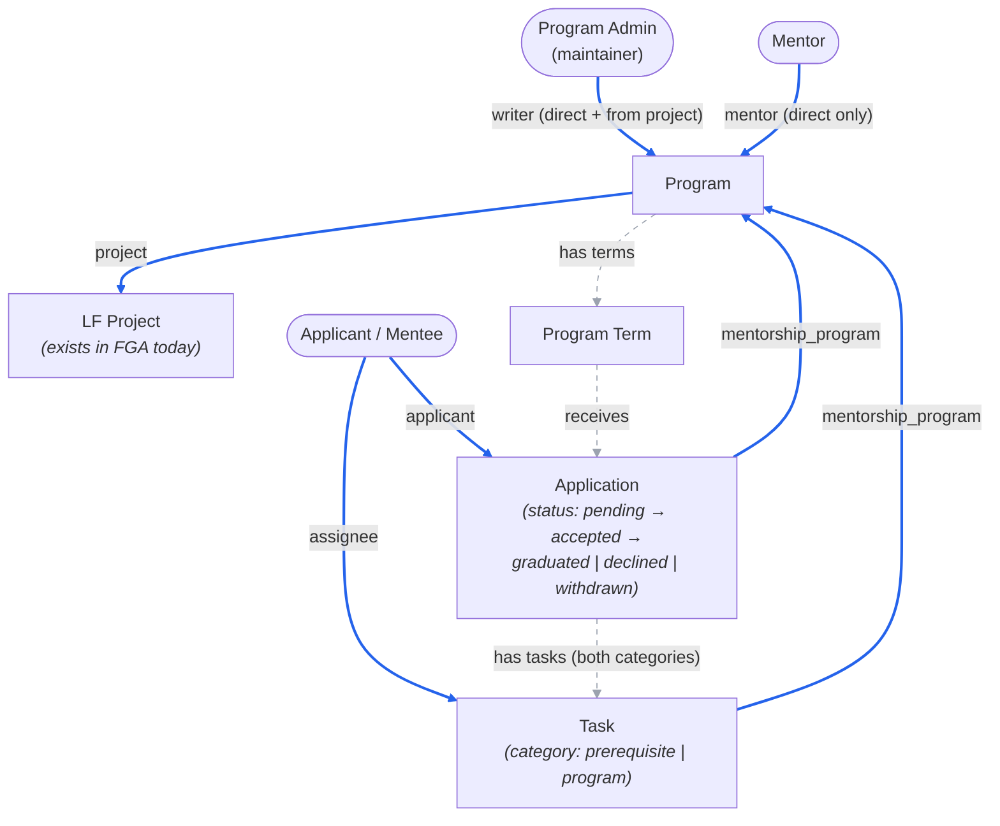

<!-- Copyright The Linux Foundation and each contributor to LFX. -->
<!-- SPDX-License-Identifier: MIT -->

# Mentorship Rewrite — 04: Authorization Model (FGA vs Postgres)

Status: Proposal — for Architecture team review
Related: [02-target-architecture.md](./02-target-architecture.md), [03-migration-plan.md](./03-migration-plan.md)

Follow-up to the Architecture-call feedback: Mentorship programs are always subordinated under LF projects, so the service goes **behind the v2 API Gateway** with Heimdall edge authorization and OpenFGA — the idiomatic v2 pattern — rather than Crowdfunding's interim standalone-API model. This doc proposes the FGA model and the Postgres/FGA split.

## Principle

**PostgreSQL is the system of record for all data — including memberships and ownership. OpenFGA holds a derived authorization index: only the relations Heimdall needs to answer "may this caller act on this object" at the edge.**

- The service publishes tuples to [fga-sync](https://github.com/linuxfoundation/lfx-v2-fga-sync) (`GenericFGAMessage` over NATS) **at state transitions**, and once as a bulk seed after the DynamoDB → Postgres backfill (re-runnable: `update_access` is a full-state sync per object).
- FGA is never queried by the Mentorship service and never holds business state (statuses, dates, categories, history).
- Backend services make **no authorization decisions**. The single residue is `/me/*` **list** endpoints ("my applications", "my tasks"), where the service filters rows by the JWT `sub` from Heimdall — data scoping on the caller's own records, not a grant/deny decision on an identified resource. Every route that carries a resource ID gets a Heimdall rule instead.

The test for what goes to FGA is **audience, not ownership**: an object with a single owner still needs FGA representation if a *second* party (a mentor reviewing a task) must be authorized on it at the edge. Only relations that never gate an edge decision stay Postgres-only.

## Relationship graph

Solid edges are mirrored to FGA (as well as stored in Postgres). Dashed edges exist **only in Postgres**.



**Legend:** ═══ blue = Postgres **and** FGA (via fga-sync) · - - - grey = Postgres only. Edge labels on blue edges are the FGA **relation names** — e.g. `mentee ==applicant==> application` is the direct tuple `mentorship_application:{uid}#applicant@user:{lfid}`, not an intermediate hop.

**Statuses**: mentee applications run pending/accepted/declined/graduated/withdrawn; declined mentor invitations use the same `declined` vocabulary. The backfill inventory maps any legacy status variants onto this set explicitly.

**Vocabulary**: the new model uses **mentee** throughout, including as the member-type value. Legacy's internal `apprentice` (never surfaced in the UI, which already says "mentee") is mapped to `mentee` by the backfill; it appears in these docs only when quoting legacy data.

**No enrollment entity.** In the legacy system the application *is* the lifecycle object: one `project-members` row (memberType `apprentice` → `mentee`, keyed by user + program term) whose status runs the full journey `pending → accepted → graduated`. Acceptance and graduation are status changes on that row, and mentors relate to the **program**, not to individual mentees (a mentee's "mentors" list is a cron-denormalized copy of the program's approved mentors). The rewrite keeps that shape — no `enrollments` table, no mentor-mentee assignment — and the ERD in [02](./02-target-architecture.md) will be corrected accordingly.

### FGA types and derived permissions (sketch)

Written in the platform's DSL conventions ([model.fga](https://github.com/linuxfoundation/lfx-v2-helm/blob/main/charts/lfx-platform/files/model.fga)): the parent relation is named after the parent *type*; each Heimdall rule checks a **single** relation; actions are documented as `@fgadoc:jtbd` annotations (from which `PERMISSIONS.md` is generated); and no relation is defined as a mere alias of another — per the model's own guidance on `vote_response`: *"we don't need to create a 'writer' relation that is defined as just 'owner': we just use the 'owner' relation in our access checks."* The closest existing analogs to applications/tasks are `vote_response` and `survey_response` (single owner + parent, owner-or-staff access).

```
type project
  # added to the existing type, mirroring meeting_coordinator / meetings_creator
  define mentorship_coordinator: [user]
  # @fgadoc:jtbd Create a mentorship program
  define mentorship_program_creator: writer or mentorship_coordinator

type mentorship_program
  relations
    define project: [project]
    # program admins: directly assigned AND inherited from the project
    # @fgadoc:jtbd Update & delete a mentorship program
    # @fgadoc:jtbd Manage program terms, mentors & settings
    define writer: [user] or writer from project
    # mentors are directly assigned only (via accepted invitation)
    define mentor: [user]
    # union helper (cf. meetings_creator, inviter): "may act on this program's children"
    define manager: writer or mentor
    # @fgadoc:jtbd View program settings & member lists
    define auditor: [user] or manager or auditor from project
    # @fgadoc:jtbd View & discover a mentorship program
    define viewer: [user:*] or auditor

type mentorship_application
  relations
    define mentorship_program: [mentorship_program]
    # @fgadoc:alias Applicant
    define applicant: [user]
    # @fgadoc:jtbd Evaluate, accept & decline an application
    define manager: manager from mentorship_program
    # @fgadoc:jtbd View & withdraw an application
    # withdraw covers the applicant and staff-assisted (white-glove) withdrawal
    define writer: applicant or manager

type mentorship_task
  relations
    define mentorship_program: [mentorship_program]
    # @fgadoc:alias Mentee
    # @fgadoc:jtbd Complete & submit a task
    define assignee: [user]
    # @fgadoc:jtbd Create, update & review tasks
    define manager: manager from mentorship_program
    # @fgadoc:jtbd View a task
    define auditor: assignee or manager
```

Submission checks `assignee` directly and review checks `manager` — no wrapper relations. On `viewer: [user:*] or auditor`: the wildcard is not "always public" — it is a **per-object tuple** written by fga-sync when the object carries `public: true`, so unpublished/archived programs simply don't get it.

Two tuples per application/task (owner + parent), a handful per program. At Mentorship's volumes (thousands of rows) this is trivial for FGA.

**Answers to the review questions on this sketch:**

- **Where `writer` on a program comes from**: **both** — directly assigned (the legacy `maintainer` who created the program) *and* inherited via `writer from project`, so project writers can administer their programs without a separate grant. `mentor` is **directly assigned only**, matching the invite flow.
- **Who creates a program**: `mentorship_program_creator` on the **project**, defined as `writer or mentorship_coordinator` — the same shape as `meetings_creator`. Project writers get it by default; the extra direct relation exists so LF staff can be granted program-creation on a project without full write access. Heimdall extracts the project ID from the POST payload and checks this relation.
- **Who creates applications and tasks**: **tasks** are created by `manager` on the parent program (mentors and admins). **Applications** are created by the applicant themselves — any authenticated user may apply to a program whose application window is open, so creation is authorized by authentication alone (window state is a Postgres business rule, not an access rule), with the applicant's LFID taken from the JWT rather than the payload.
- **Single-relation rules**: rather than have Heimdall evaluate "mentor from parent or writer from parent", the model defines **`manager`** on the program (`writer or mentor`) and children resolve `manager from mentorship_program`. Every child route checks exactly one relation.
- **Staff-assisted withdrawal**: yes, needed — support and program admins do withdraw applications on a mentee's behalf. Hence the application's `writer: applicant or manager` rather than applicant-only; the manager-only actions (accept/decline) check `manager` directly.
- **Business-rule boundary, confirmed by the platform model**: the `meeting.participant` comment notes committee members aren't automatically participants because that filtering "is managed by the backend services and therefore can't be a relationship in the authorization model" — the same line this proposal draws for application windows and graduation gates (Postgres state, not FGA).

## Deliberate modeling decisions

1. **No mentee→program relation.** "Accepted mentee" is a *state* of the application (Postgres), not an FGA relation. Every mentee-facing surface is already covered: their applications and tasks carry their own `applicant`/`assignee` tuples, program pages are public, and their dashboard is `/me`-scoped. No route needs "caller is an accepted mentee of program X" at the edge. If one appears (e.g. enrolled-only program content), acceptance is exactly the transition where a `participant` tuple would be emitted — deferred until a route requires it.
2. **Tasks: structural parent is the application; FGA parent is the program.** In Postgres, tasks belong to the mentee's application journey (prerequisite tasks gate whether the application is considered; program tasks gate graduation — same object, `category` distinguishes the phase, as in legacy `task.Category`). In FGA, the task's `mentorship_program` relation points at the **program**, because the reviewers (mentors/admins) hold their relations there — pointing it at the application would authorize nobody. One FGA type covers both categories.
3. **Workflow gates are business logic, not access rules.** "All prerequisite tasks submitted before the application is considered" and "all program tasks submitted to graduate" are state-machine checks in Postgres. FGA answers *who may touch*; the service answers *what is allowed given state*.
4. **Pending mentor invitations have no FGA presence.** A pending invitation is a Postgres row; the `mentor` tuple appears when it is accepted. Applications, by contrast, get their tuples on submission (`applicant` + `mentorship_program`) precisely so mentors can evaluate them while still pending.
5. **List routes are nested to reuse the program check.** `GET /programs/{uid}/applications` lets Heimdall authorize the caller's relation on the program straight from the path — no per-object listing problem, no mentor→application tuples.

## Lifecycle → FGA emissions

| Transition | Postgres | FGA (via fga-sync) |
| --- | --- | --- |
| Program approved/created | `programs` + `program_members` rows | `update_access`: writers, mentors, `project` reference |
| Mentor invite accepted | `program_members` row | `member_put` mentor→program |
| Application submitted | `applications` row | `update_access`: applicant + `mentorship_program` reference |
| Prerequisite/program task created | `tasks` row | `update_access`: assignee + `mentorship_program` reference |
| Application accepted | status change on the application row | — (none; see decision 1) |
| Graduation / gate checks | status change on the application row | — |
| Application withdrawn | status change on the application row | — (tuples stay: applicant and program mentors/admins can still view the record) |
| Mentor / admin removed from program | status change on the member row | `member_remove` (access ends; the Postgres row is kept as history) |
| Backfill (one-time) | DynamoDB → Postgres ETL | bulk seed: re-emit `update_access` for every object |

## Open questions for the Architecture team

| # | Question | Proposed default |
| --- | --- | --- |
| AQ-1 | Is the `/me/*` list-endpoint residue (service filters by JWT `sub`; no resource ID in path) acceptable, or should "my stuff" go through the query/indexer service with FGA access checks? | `/me` + sub-filtering for v1 |
| AQ-2 | Confirm per-object tuples for applications/tasks (parent + owner), vs. modeling only program-level relations and nesting *all* routes under `/programs/{uid}/…`. | **Keep the parent tuple.** Dropping it would force nested routes *and* a service-side "does this task belong to that program" guard — moving authorization logic back into the service. One extra tuple in an existing `update_access` message is cheaper, keeps routes flat (`GET /tasks/{uid}`), and gives every type the same shape. |
| AQ-3 | Storage: PostgreSQL (relational lifecycle data, FTS, Fivetran→Snowflake feed) as an explicit deviation from the NATS-KV idiom of native v2 services. | Keep Postgres, per [02](./02-target-architecture.md) |
| AQ-4 | The model adds two relations to the existing `project` type (`mentorship_program_creator`, `mentorship_coordinator`), mirroring `meetings_creator`/`meeting_coordinator`. Confirm that shape and whether the coordinator grant is wanted at launch. | Add both; coordinator lets LF staff be granted program creation without full project write |
| AQ-5 | Drop the HMAC email-approval links in favor of super-admins approving via a logged-in Self Serve page (super-admin as a platform-level FGA relation)? | Drop them — one authorization model |
| AQ-6 | Program creation policy: gate creation on `mentorship_program_creator` and drop super-admin approval, or keep legacy behavior (any authenticated user creates; approval publishes)? Most legacy creators are community maintainers who likely hold no FGA relation on their project, and approval is also an editorial/brand gate (product call), not just anti-spam. | Launch with parity: authenticated-only creation (program stays `pending`/non-public until approved). Keep the creator relations in the model as the lever for later permission-tiered auto-publish. |
