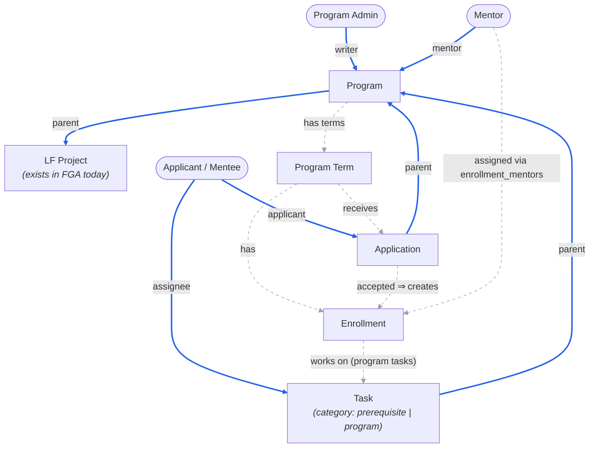

<!-- Copyright The Linux Foundation and each contributor to LFX. -->
<!-- SPDX-License-Identifier: MIT -->

# Mentorship Rewrite — 04: Authorization Model (FGA vs Postgres)

Status: Proposal — for Architecture team review
Related: [02-target-architecture.md](./02-target-architecture.md), [03-migration-plan.md](./03-migration-plan.md)

Follow-up to the Architecture-call feedback: Mentorship programs are always subordinated under LF projects, so the service goes **behind the v2 API Gateway** with Heimdall edge authorization and OpenFGA — the idiomatic v2 pattern — rather than Crowdfunding's interim standalone-API model. This doc proposes the FGA model and the Postgres/FGA split.

## Principle

**PostgreSQL is the system of record for all data — including memberships and ownership. OpenFGA holds a derived authorization index: only the relations Heimdall needs to answer "may this caller act on this object" at the edge.**

- The service publishes tuples to [fga-sync](https://github.com/linuxfoundation/lfx-v2-fga-sync) (`GenericFGAMessage` over NATS) **at state transitions**, and once as a bulk seed after the DynamoDB → Postgres backfill (re-runnable: `update_access` is a full-state sync per object).
- FGA is never queried by the Mentorship service and never holds business state (statuses, dates, categories, history).
- Backend services make **no authorization decisions**. The single residue is `/me/*` **list** endpoints ("my applications", "my tasks"), where the service filters rows by the JWT `sub` from Heimdall — data scoping on the caller's own records, not a grant/deny decision on an identified resource. Every route that carries a resource ID gets a Heimdall rule instead.

The test for what goes to FGA is **audience, not ownership**: an object with a single owner still needs FGA representation if a *second* party (a mentor reviewing a task) must be authorized on it at the edge. Only relations that never gate an edge decision stay Postgres-only.

## Relationship graph

Solid edges are mirrored to FGA (as well as stored in Postgres). Dashed edges exist **only in Postgres**.



**Legend:** ═══ blue = Postgres **and** FGA (via fga-sync) · - - - grey = Postgres only.

### FGA types and derived permissions (sketch)

```
type mentorship_program
  relations: parent (project), writer (user), mentor (user)
  # create-program checked against writer on the parent project (from POST payload)
  # program admin rights inherit to child applications/tasks via parent

type mentorship_application
  relations: parent (mentorship_program), applicant (user)
  view/withdraw  = applicant
  view/evaluate  = parent.mentor or parent.writer

type mentorship_task
  relations: parent (mentorship_program), assignee (user)
  view/submit    = assignee
  view/review    = parent.mentor or parent.writer
```

Two tuples per application/task (owner + parent), a handful per program. At Mentorship's volumes (thousands of rows) this is trivial for FGA.

## Deliberate modeling decisions

1. **No mentee→program relation.** "Accepted mentee" is a *state* of the application (Postgres), not an FGA relation. Every mentee-facing surface is already covered: their applications and tasks carry their own `applicant`/`assignee` tuples, program pages are public, and their dashboard is `/me`-scoped. No route needs "caller is an accepted mentee of program X" at the edge. If one appears (e.g. enrolled-only program content), acceptance is exactly the transition where a `participant` tuple would be emitted — deferred until a route requires it.
2. **Tasks parent to the program, not to applications or enrollments.** Matches the legacy data shape (owner + project + term) and the fact that tasks exist in both phases: prerequisite tasks are assigned to applicants, program tasks to enrolled mentees. Access is identical either way — assignee acts, program mentors/admins review — so one FGA type covers both categories.
3. **Workflow gates are business logic, not access rules.** "All prerequisite tasks submitted before the application is considered" and "all program tasks submitted to graduate" are state-machine checks in Postgres. FGA answers *who may touch*; the service answers *what is allowed given state*.
4. **Pending invitations/applications have no FGA presence.** A pending mentor invitation or mentee application is a Postgres row. Tuples appear when the relationship becomes effective (invite accepted → `mentor`; application submitted → `applicant` + `parent` so mentors can evaluate it).
5. **List routes are nested to reuse the parent check.** `GET /programs/{uid}/applications` lets Heimdall authorize the caller's relation on the program straight from the path — no per-object listing problem, no mentor→application tuples.

## Lifecycle → FGA emissions

| Transition | Postgres | FGA (via fga-sync) |
| --- | --- | --- |
| Program approved/created | `programs` + `program_members` rows | `update_access`: writers, mentors, `parent` project |
| Mentor invite accepted | `program_members` row | `member_put` mentor→program |
| Application submitted | `applications` row | `update_access`: applicant + parent program |
| Prerequisite/program task created | `tasks` row | `update_access`: assignee + parent program |
| Application accepted | status change + `enrollments` row | — (none; see decision 1) |
| Graduation / gate checks | status changes | — |
| Withdrawal / member removal | status change / row removal | `member_remove` / `delete_access` |
| Backfill (one-time) | DynamoDB → Postgres ETL | bulk seed: re-emit `update_access` for every object |

## Open questions for the Architecture team

| # | Question | Proposed default |
| --- | --- | --- |
| AQ-1 | Is the `/me/*` list-endpoint residue (service filters by JWT `sub`; no resource ID in path) acceptable, or should "my stuff" go through the query/indexer service with FGA access checks? | `/me` + sub-filtering for v1 |
| AQ-2 | Confirm per-object tuples for applications/tasks (vs. modeling only program-level relations and nesting *all* routes under `/programs/{uid}/…`). | Per-object tuples — single-resource routes (`GET /tasks/{uid}`) stay flat and edge-checked |
| AQ-3 | Storage: PostgreSQL (relational lifecycle data, FTS, Fivetran→Snowflake feed) as an explicit deviation from the NATS-KV idiom of native v2 services. | Keep Postgres, per [02](./02-target-architecture.md) |
| AQ-4 | Drop the HMAC email-approval links in favor of super-admins approving via a logged-in Self Serve page (super-admin as a platform-level FGA relation)? | Drop them — one authorization model |
