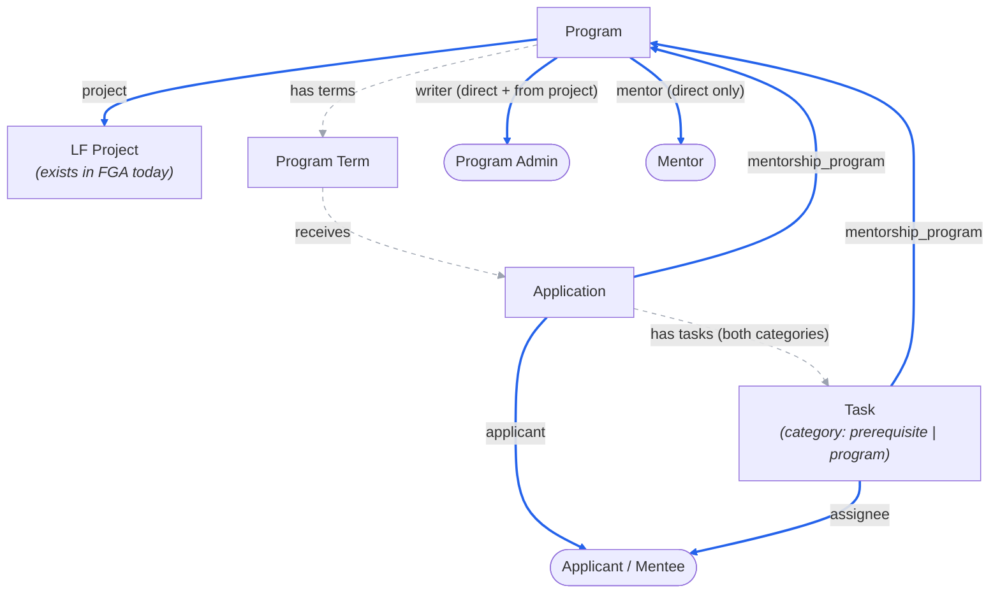

<!-- Copyright The Linux Foundation and each contributor to LFX. -->
<!-- SPDX-License-Identifier: MIT -->

# Mentorship Rewrite — 04: Authorization Model (FGA vs Postgres)

Status: Proposal — for Architecture team review
Related: [02-target-architecture.md](./02-target-architecture.md), [03-migration-plan.md](./03-migration-plan.md)

Follow-up to the Architecture-call feedback: Mentorship programs are always subordinated under LF projects, so the service goes **behind the v2 API Gateway** with Heimdall edge authorization and OpenFGA — the idiomatic v2 pattern — rather than Crowdfunding's interim standalone-API model. This doc proposes the FGA model and the Postgres/FGA split.

Positions carried over from the follow-up Architecture call are marked inline: the FGA-inclusion test and the `vote` precedent (below), no attribute-level access control (decision 6), one canonical route per object (AQ-1), direct grants vs. inheritance (AQ-2), and the storage deviation (AQ-3).

## Principle

**PostgreSQL is the system of record for all data — including memberships and ownership. OpenFGA holds a derived authorization index: only the relations Heimdall needs to answer "may this caller act on this object" at the edge.**

- The service publishes tuples to [fga-sync](https://github.com/linuxfoundation/lfx-v2-fga-sync) (`GenericFGAMessage` over NATS) **at state transitions**, and once as a bulk seed after the DynamoDB → Postgres backfill (re-runnable: `update_access` is a full-state sync per object).
- **Delivery is via a transactional outbox, not a bare publish.** A Postgres commit and a NATS publish cannot be made atomic — a process death between them loses a grant, or worse a revocation, leaving access live after removal. The transition therefore records the *intent to sync an object* in an `fga_outbox` table, in the same transaction as the state change; a relay then publishes and marks rows sent, retrying until acknowledged.
- **The relay builds each payload at send time, and never replays a stored one.** `update_access` is a full-state sync per object, which makes it idempotent only while it is still the newest state: the `GenericFGAMessage` envelope carries no object version or revision (verified against [fga-sync](https://github.com/linuxfoundation/lfx-v2-fga-sync) — only the NATS stream sequence, which is not a per-object version), so fga-sync applies whatever arrives last. A stale payload retried after a newer `member_remove` or unpublish would restore exactly the tuple that was revoked. Two requirements follow: the relay **re-derives** the payload from current Postgres state when it sends (the outbox row is a dirty-object marker, not a frozen message), and pending rows for the same object are **coalesced** so only one in-flight sync per object exists. On the same basis, the periodic reconciliation job re-derives expected relations from Postgres and re-emits where FGA has drifted. Revocation lag is the metric to alert on.
- FGA is never queried by the Mentorship service and never holds business state (statuses, dates, categories, history).
- Backend services make **no authorization decisions**. The single residue is `/me/*` **list** endpoints ("my applications", "my tasks"), where the service filters rows by the caller's LFID from the Heimdall-issued JWT — data scoping on the caller's own records, not a grant/deny decision on an identified resource. Every route that carries a resource ID gets a Heimdall rule instead, and `/me/*` never becomes a second way to fetch an individual object (see AQ-1). The identifier is the **`principal`** claim, which the platform's `create_jwt` finalizer populates from the subject's `username` attribute ([values.yaml](https://github.com/linuxfoundation/lfx-v2-helm/blob/main/charts/lfx-platform/values.yaml)); the upstream Auth0 `sub` is deliberately *not* forwarded to services, so `principal` is also the identity that must key the `user:{lfid}` tuples below.

### The test for what becomes an FGA type

Per the Architecture call, the test is **"do I need additional permissions that differ based on this object?"** — not ownership, and not merely "more than one party can see it". Two corollaries from that call:

- **A relation implies a type.** "You can't have a program admin relationship without a program entity type." Programs need their own type because access must differ *between two programs in the same project* — granting someone admin on one program must not grant it on the sibling.
- **There is a cost counterweight.** "Every single time we rely on FGA to do very small, one-off things, we're adding to latency and lookups." A type that exists only to express "the creator can revoke their own thing" is not worth an FGA round trip; that belongs in Postgres.

Applications sit on the interesting side of this line, and the call resolved them explicitly. The initial read was that a single-owner application needs no FGA type — correct, *if* the applicant were the only party. They aren't: program admins accept and decline applications, and mentors evaluate them, so the permissions genuinely differ by caller and the check has to happen at the edge. Applications get a type.

**Precedent: `vote`.** The architect's own analogy — a vote exists underneath a project but is its own type, and the user who submitted it can see it: *"we've already modeled this idea of going all the way down."* `vote_response` / `survey_response` (single owner + parent, owner-or-staff access) are therefore not just structurally similar, they are the sanctioned shape for what applications and tasks are doing here.

## Relationship graph

Solid edges are mirrored to FGA (as well as stored in Postgres). Dashed edges exist **only in Postgres**.



**Legend:** ═══ blue = Postgres **and** FGA (via fga-sync) · - - - grey = Postgres only. Blue edges read *object → relation → subject*, the same direction as the tuple: `application ==applicant==> mentee` is `mentorship_application:{uid}#applicant@user:{lfid}`.

**Statuses**: mentee applications run `pending → accepted → graduated`, or `declined` / `withdrawn`. A mentorship paused mid-term (`hold`) is a state of the accepted mentorship, not an application outcome — legacy keeps both in one `ProjectMemberStatus` column, and the backfill has to preserve it without conflating the two (see [03](./03-migration-plan.md)). None of this is visible to FGA either way: statuses are Postgres business state (decision 3).

**Applications carry an applicant type.** Mentors can *apply* to a program as well as be invited (legacy `project-members` uses one `pending` row for either, per `01`), so `mentorship_application` covers both and the row records whether the applicant is a prospective mentee or mentor. This does not change the FGA type — the `applicant` relation is the same either way — but it does change what acceptance *emits*, and it is why the accept route is `manager`-gated regardless of applicant type. See the lifecycle table.

**Vocabulary**: the new model uses **mentee** and **program admin** throughout, including as member-type values. Legacy's internal `apprentice` and `maintainer` (neither surfaced in the UI, which already says "mentee" and "project admin") are mapped by the backfill; they appear here only when quoting legacy data.

**No enrollment entity.** In the legacy system the application *is* the lifecycle object: one `project-members` row (legacy memberType `apprentice`, i.e. mentee, keyed by user + program term) whose status runs the full journey `pending → accepted → graduated`. Acceptance and graduation are status changes on that row, and mentors relate to the **program**, not to individual mentees (a mentee's "mentors" list is a cron-denormalized copy of the program's approved mentors). The rewrite keeps that shape — no `enrollments` table, no mentor-mentee assignment — and the ERD in [02](./02-target-architecture.md) reflects it.

### FGA types and derived permissions (sketch)

Written in the platform's DSL conventions ([model.fga](https://github.com/linuxfoundation/lfx-v2-helm/blob/main/charts/lfx-platform/files/model.fga)): the parent relation is named after the parent *type*; each Heimdall rule checks a **single** relation; actions are documented as `@fgadoc:jtbd` annotations (from which `PERMISSIONS.md` is generated); and no relation is defined as a mere alias of another — per the model's own guidance on `vote_response`: *"we don't need to create a 'writer' relation that is defined as just 'owner': we just use the 'owner' relation in our access checks."* The closest existing analogs to applications/tasks are `vote_response` and `survey_response` (single owner + parent, owner-or-staff access) — confirmed on the Architecture call as the intended precedent.

```
type project
  relations
    # added to the existing type, mirroring meeting_coordinator / meetings_creator
    define mentorship_coordinator: [user]
    # @fgadoc:jtbd Create a mentorship program
    define mentorship_program_creator: writer or mentorship_coordinator

type mentorship_program
  relations
    define project: [project]
    # program admins: directly assigned AND inherited from the project
    # @fgadoc:jtbd Update & delete a mentorship program
    # @fgadoc:jtbd Manage program terms, mentors & settings
    define writer: [user] or writer from project
    # mentors are directly assigned only (via accepted invitation)
    define mentor: [user]
    # LF staff who approve a pending program for publication (AQ-5/AQ-6).
    # Deliberately NOT part of `manager` — approving is not managing.
    # @fgadoc:jtbd Approve or reject a pending mentorship program
    define program_approver: [user]
    # union helper (cf. meetings_creator, inviter): "may act on this program's children"
    define manager: writer or mentor
    # @fgadoc:jtbd View program settings & member lists
    define auditor: [user] or manager or auditor from project
    # @fgadoc:jtbd View & discover a mentorship program
    define viewer: [user:*] or auditor

type mentorship_application
  relations
    define mentorship_program: [mentorship_program]
    # @fgadoc:alias Applicant
    define applicant: [user]
    # admins only — mentors cannot change application status (see decision 6)
    # @fgadoc:jtbd Accept, decline & update application status
    define manager: writer from mentorship_program
    # @fgadoc:jtbd Withdraw an application
    # the applicant, or staff-assisted (white-glove) withdrawal by an admin
    define writer: applicant or manager
    # @fgadoc:jtbd Evaluate an application
    # mentors and admins, but NOT the applicant — evaluation is a separate
    # route from viewing (no attribute-level access control; see decision 6)
    define reviewer: manager or mentor from mentorship_program
    # @fgadoc:jtbd View an application
    define auditor: writer or reviewer

type mentorship_task
  relations
    define mentorship_program: [mentorship_program]
    # @fgadoc:alias Mentee
    # @fgadoc:jtbd Complete & submit a task
    define assignee: [user]
    # @fgadoc:jtbd Create, update & review tasks
    define manager: manager from mentorship_program
    # @fgadoc:jtbd View a task
    define auditor: assignee or manager
```

Submission checks `assignee` directly and review checks `manager` — no wrapper relations. On `viewer: [user:*] or auditor`: the wildcard is not "always public" — it is a **per-object tuple** written by fga-sync when the object carries `public: true`, so unpublished/archived programs simply don't get it.

Two tuples per application/task (owner + parent), a handful per program. At Mentorship's volumes (thousands of rows) this is trivial for FGA.

**Notes on the sketch:**

- **Creation.** Programs: `mentorship_program_creator` on the **project** (`writer or mentorship_coordinator`, the `meetings_creator` shape) — whether the create route *checks* it at launch is AQ-6; defining it now makes tightening later a RuleSet change, not a model migration. Tasks: `manager` on the parent program. Applications: the applicant themselves, authorized by authentication alone — the application window is a Postgres business rule, and the applicant's LFID comes from the JWT, not the payload.
- **`program_approver` replaces the HMAC email links** — today an unauthenticated signed URL mailed to LF staff, a second authorization mechanism outside the model. A relation this service owns retires it without waiting on a platform-level super-admin (AQ-5). It stays out of `manager` deliberately: folding it in would let every program admin approve their own program. For the same reason the grant must be administered by LF staff, not self-served by `writer`.
- **Staff-assisted withdrawal** is a real requirement (support and admins withdraw on a mentee's behalf), hence `writer: applicant or manager` rather than applicant-only.
- **Business-rule boundary, confirmed by the platform model**: the `meeting.participant` comment notes committee members aren't automatically participants because that filtering "is managed by the backend services and therefore can't be a relationship in the authorization model" — the same line drawn here for application windows and graduation gates.
- **Legacy gap closed by construction**: the legacy approve/disapprove endpoints are wired without auth middleware. Under this model every status route carries a Heimdall rule.

## Deliberate modeling decisions

1. **No mentee→program relation.** "Accepted mentee" is a *state* of the application (Postgres), not an FGA relation. Every mentee-facing surface is already covered: their applications and tasks carry their own `applicant`/`assignee` tuples, program pages are public, and their dashboard is `/me`-scoped. No route needs "caller is an accepted mentee of program X" at the edge. If one appears (e.g. enrolled-only program content), acceptance is exactly the transition where a `participant` tuple would be emitted — deferred until a route requires it.
2. **Tasks: structural parent is the application; FGA parent is the program.** In Postgres, tasks belong to the mentee's application journey (prerequisite tasks gate whether the application is considered; program tasks gate graduation — same object, `category` distinguishes the phase, as in legacy `task.Category`). In FGA, the task's `mentorship_program` relation points at the **program**, because the reviewers (mentors/admins) hold their relations there — pointing it at the application would authorize nobody. One FGA type covers both categories.
3. **Workflow gates are business logic, not access rules.** "All prerequisite tasks submitted before the application is considered" and "all program tasks submitted to graduate" are state-machine checks in Postgres. FGA answers *who may touch*; the service answers *what is allowed given state*.
4. **Pending mentor *invitations* have no FGA presence.** A pending invitation is a Postgres row; the `mentor` tuple appears when it is accepted. Applications, by contrast, get their tuples on submission (`applicant` + `mentorship_program`) precisely so mentors can evaluate them while still pending — "pending" describes the application's *status*, not an absence of tuples; only unsubmitted drafts (if the UI keeps any) would have none. This distinction matters because mentors reach a program by **either** route: a mentor *application* is an ordinary `mentorship_application` with tuples and an admin-gated accept (`manager`), whereas an *invitation* has no tuple at accept time and so no relation for Heimdall to check — that narrower gap is AQ-7.
5. **List routes are nested to reuse the program check.** `GET /programs/{uid}/applications` lets Heimdall authorize the caller's relation on the program straight from the path — no per-object listing problem, no mentor→application tuples.
6. **No attribute-level access control → split the endpoints.** Heimdall authorizes a *route*, not a field: per the Architecture call, *"if you want to have different attributes requiring different relationship checks, you'll want to actually split those across two different REST endpoints."* Mentorship hits this immediately, because mentors may evaluate an application but not change its status. So there is no single `PATCH /applications/{uid}` accepting an arbitrary field set. Instead:

   | Route | Relation checked | Who |
   | --- | --- | --- |
   | `PATCH /applications/{uid}/status` | `manager` | admins only (accept / decline) |
   | `POST /applications/{uid}/withdraw` | `writer` | applicant, or admin (staff-assisted) |
   | `PUT /applications/{uid}/evaluation` | `reviewer` | mentors and admins — **not** the applicant |
   | `PATCH /tasks/{uid}/submission` | `assignee` | the mentee |
   | `PATCH /tasks/{uid}/review` | `manager` | mentors and admins |

   The same rule applies to reads: any field that only admins may see (private review notes, internal scores) needs its own sub-resource rather than a conditionally-populated field on the main payload, since the service cannot make that call itself.

   **The admin-only status rule is parity; the legacy API gap is not.** The product states the rule on the mentees tab — *"project admin gets notified via email to review the submission and make the admission decision. Mentors can assign tasks and milestones to accepted mentees"* — and it holds in practice: a mentor-only user sees the status as a static badge, verified on dev. The legacy **API** does not enforce it (`UpdateMenteeStatus` matches any `mentor` or `maintainer` row), so the rule lives in the frontend alone. `manager: writer from mentorship_program` reproduces the behavior users have and closes the gap. Reading the service layer alone gives the opposite answer, which is why this is called out rather than assumed.

## Lifecycle → FGA emissions

| Transition | Postgres | FGA (via fga-sync) |
| --- | --- | --- |
| Program created (pending) | `programs` + `program_members` rows | `update_access`: writers, mentors, approvers, `project` reference — **not** public |
| Program approved / unpublished / archived | `programs.status` change | `update_access` with the new `public` value — approval is what first emits `viewer@user:*`. The tuple is per-object, so without re-emitting on the way back down an archived program stays publicly authorized |
| Mentor **or admin** added (invite accepted, or admin granted later) | `program_members` row | `member_put` mentor→program / writer→program |
| Application submitted | `applications` row | `update_access`: applicant + `mentorship_program` reference |
| Prerequisite/program task created | `tasks` row | `update_access`: assignee + `mentorship_program` reference |
| **Mentee** application accepted | status change on the application row | — (none; see decision 1) |
| **Mentor** application accepted | status change + `program_members` row | `member_put` mentor→program — a mentor who applied rather than being invited becomes a mentor on acceptance, so this is the same grant as the invite-accept path, not a no-op |
| Graduation / gate checks | status change on the application row | — |
| Application withdrawn / declined | status change on the application row | — (tuples stay: applicant and program mentors/admins can still view the record) |
| Mentor / admin removed from program | status change on the member row | `member_remove` **naming the relation** being removed (`mentor` or `writer`) |
| Program deleted | `programs` row + children deleted | `delete_access` for the program **and** for every application and task under it — otherwise their tuples are orphaned in FGA |
| Application / task deleted | row deleted | `delete_access` for that object |
| Backfill (one-time) | DynamoDB → Postgres ETL | bulk seed: re-emit `update_access` for every object |

**`member_remove` must name the relation.** With an empty relations array fga-sync deletes *every* direct relation the user holds on that object; with a populated array it deletes only the named ones (verified in [fga-sync](https://github.com/linuxfoundation/lfx-v2-fga-sync) `handler_generic.go`). Because this model lets one user be both `mentor` and a direct `writer` on the same program, removing one role must not silently strip the other — so the emission always names the relation. Note also that this revokes only the *direct* tuple: a user who still holds `writer from project` remains authorized, correctly, so removal from a program is not the same as "access ends".

**Deletion needs its own transition.** The sketch grants `writer` the ability to delete a program, and fga-sync exposes `delete_access` for exactly this. Without it a hard delete leaves the program's tuples — and every child application/task tuple — live in OpenFGA, pointing at rows that no longer exist. If deletion is implemented as a soft delete instead, the object must at minimum lose its `public` flag and its member relations, which is an `update_access` with the reduced state.

Because removed mentors and admins are kept in `program_members` as history, **every full-state emission — the backfill seed and the reconciliation job alike — must select only currently effective membership rows.** A seed that rebuilds relations from all historical rows would restore exactly the access that `member_remove` revoked. The same applies to the `public` flag: it is derived from current program status, not from whether the program was ever published.

## Implementation path

The model lands in three PRs rather than one, so that each is separately reviewable and nothing depends on a model that has not merged yet:

| PR | Contents | Depends on |
| --- | --- | --- |
| 1 | `model.fga` types and relations + `tests.yaml` scenarios, in [lfx-v2-helm](https://github.com/linuxfoundation/lfx-v2-helm) | — |
| 2 | Heimdall RuleSets, one rule per route (the decision-6 table) | PR 1 merged |
| 3 | Service-side emission: `fga_outbox`, the relay, and the transitions in the lifecycle table | PR 1 merged |

PRs 2 and 3 are independent of each other and can land in parallel. The ordering matters in one direction only: a RuleSet referencing a relation that does not exist fails closed, so the model must be in place first.

**`tests.yaml` is the merge gate.** The platform model ships with an OpenFGA test suite, and every relation added here needs scenarios in it — the merge criterion for PR 1 is that they pass, not that the DSL parses. Two categories are worth writing explicitly because they are where this model could go wrong quietly:

- **Negative cases**, which are the whole point of the exercise: a mentor is *denied* `manager` on an application (decision 6 — the legacy API gap, encoded as a test so it cannot regress); a program admin is denied `program_approver` on their own program; a `writer` on project A is denied `writer` on project B's program; an applicant is denied `reviewer` on their own application.
- **Inheritance cases**, since `manager from mentorship_program` is the hop AQ-2 proposes to keep: a project `writer` reaches a task two levels down; revoking a direct program `writer` does *not* revoke access for someone who still holds it via the project.

Porting the scenarios from the existing `vote_response` / `survey_response` tests is the fastest start — they are the same single-owner-plus-parent shape.

**Validate locally before pushing.** The model and its tests run against a local OpenFGA in Docker, so relation changes are checked in seconds without a cluster deploy — worth doing per-change during PR 1, since a mis-scoped relation fails *open*.

## Open questions for the Architecture team

| # | Question | Proposed default |
| --- | --- | --- |
| AQ-1 | **One canonical route per object (Route 1), with `/me/*` as lists only.** The call framed it as a choice: (1) applications are a real FGA type with one `GET /applications/{uid}` for every authorized caller, or (2) a `/my-applications` endpoint that backdoors the object via a service-side filter — "easier… faster… but not necessarily better", and *"choose one"*, not both. Confirm the reading opposite. | **Route 1** (Jordan endorsed it on the call). One ID-addressed route per object, Heimdall-checked; `/me/*` exists only as collections, never as a second path to an individual object — following a result to `GET /applications/{uid}` hits the same route an admin would. This is the V1 mistake avoided: two ways to fetch one object by ID. **Open sub-question:** should `/me` collections be served by the **query service** (FGA-aware, platform-consistent) rather than by Mentorship filtering on `principal`? |
| AQ-2 | Confirm per-object tuples for applications/tasks (parent + owner), vs. program-level relations only with *all* routes nested under `/programs/{uid}/…`. Related: Jordan raised **stamping admins/mentors directly onto each child** instead of resolving `manager from mentorship_program` — "much, much more efficient" for listing. | **Keep the parent tuple** and resolve `manager` through it. Dropping it would force nested routes *and* a service-side "does this task belong to that program" guard — authorization logic back in the service. Direct grants trade write amplification (every admin change rewrites every child) for read speed; it is the same denormalization the platform is weighing for project trees. At our volumes the parent hop is not a bottleneck, so start with inheritance — but follow the platform if it standardizes on flattening. |
| AQ-3 | Storage: PostgreSQL (relational lifecycle data, FTS, Fivetran→Snowflake feed) as an explicit deviation from the NATS-KV idiom of native v2 services. | **Keep Postgres**, per [02](./02-target-architecture.md) — a smaller deviation than first framed. The call was explicit that Goa and NATS-KV are *"patterns and recommendations, but not the only way to build things"*, and that Heimdall-fronted with NATS notifications is what makes a service idiomatic: *"it doesn't mean a rewrite from scratch."* The trade is velocity now against homogeneity later (shared tooling, SDK/MCP generation). Crowdfunding is heading for the same shape, so this is not a one-off. |
| AQ-4 | The model adds two relations to the existing `project` type (`mentorship_program_creator`, `mentorship_coordinator`), mirroring `meetings_creator`/`meeting_coordinator`. Confirm that shape and whether the coordinator grant is wanted at launch. **Ownership constraint:** project-service emits full-state `update_access` for `project` objects, so whichever service does not own a relation cannot durably write it — a tuple written independently by Mentorship would be deleted by the next project update. Adding the relation to `model.fga` is therefore necessary but not sufficient. | Add both; coordinator lets LF staff be granted program creation without full project write. **Project-service must own and emit `mentorship_coordinator`** (as it already does for `meeting_coordinator`) — or, if that is unwanted, the relation belongs on `mentorship_program` instead of `project` and program creation is authorized some other way. Needs an explicit owner before implementation. |
| AQ-5 | Drop the HMAC email-approval links in favor of LF staff approving via a logged-in Self Serve page, gated on **`program_approver`**? Confirm the relation belongs on `mentorship_program` (owned and emitted by this service) rather than as a platform-level super-admin. | Drop them — one authorization model, and no cross-team prerequisite. The open part is administration: the LF-staff grant should come from a project-level or platform group tuple, not user-by-user writes on every program. |
| AQ-6 | Program creation policy: gate creation on `mentorship_program_creator` and drop the approval step, or keep legacy behavior (any authenticated user creates; approval publishes)? Most legacy creators are community maintainers who likely hold no FGA relation on their project, and approval is also an editorial/brand gate (product call), not just anti-spam. | Launch with parity: authenticated-only creation (program stays `pending`/non-public until approved), with approval gated on `program_approver`. Keep the creator relations in the model as the lever for later permission-tiered auto-publish. The two questions are separable — creation policy can tighten later without touching the approval gate. |
| AQ-7 | **How is the invite-accept route authorized?** Decision 4 keeps pending invitations out of FGA, so at accept time Heimdall has no relation to check — and `allow_all` would let any authenticated caller accept a known invitation ID. Options: (a) emit an `invitee` tuple when the invitation is created (a `mentorship_invite` type mirroring `committee_invite` in the platform model) and have Heimdall check it; or (b) treat the signed invitation token as the credential and document it as an explicit, narrowly-scoped exception to "no service-side authorization decisions". | (a) — `mentorship_invite` with `invitee: [user]` keeps the no-exceptions rule intact, has direct platform precedent, and costs one tuple per pending invite. Worth an explicit call, since it trades pattern purity against emitting tuples for not-yet-accepted state. |
