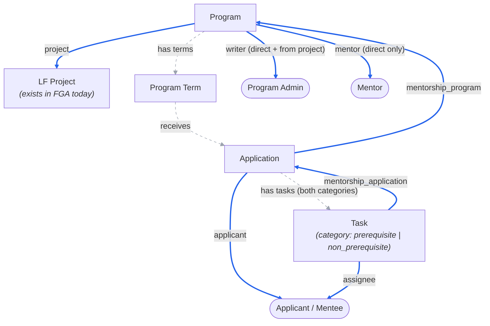

<!-- Copyright The Linux Foundation and each contributor to LFX. -->
<!-- SPDX-License-Identifier: MIT -->

# Mentorship Rewrite — 04: Authorization Model (FGA vs Postgres)

Status: Proposal — for Architecture team review
Related: [02-target-architecture.md](./02-target-architecture.md), [03-migration-plan.md](./03-migration-plan.md)

Follow-up to the Architecture-call feedback: Mentorship programs are always subordinated under LF projects, so the service goes **behind the v2 API Gateway** with Heimdall edge authorization and OpenFGA — the idiomatic v2 pattern — rather than Crowdfunding's interim standalone-API model. This doc proposes the FGA model and the Postgres/FGA split.

Positions carried over from the follow-up Architecture call are marked inline: the FGA-inclusion test and the `vote` precedent (below), no attribute-level access control (decision 6), one canonical route per object (AQ-1), direct grants vs. inheritance (AQ-2), and the storage deviation (AQ-3).

A second Architecture review then validated a standalone OpenFGA model (`model.fga` + `tuples.yaml` + `tests.yaml`, checked with the `fga` CLI) built from this proposal. Three of its outcomes supersede the first draft and are folded in below: program **approval is a global team-membership check** on the platform's existing `team` type, not a per-program relation (AQ-5, resolved); the project-level `mentorship_program_admin` relation grants **management of every program in the project**, not only creation; and the task's FGA parent is the **application**, completing one inheritance chain project → program → application → task. The standalone model's `can_*` vocabulary maps onto the platform's relation idiom — see the mapping table after the sketch.

## Principle

**PostgreSQL is the system of record for all data — including memberships and ownership. OpenFGA holds a derived authorization index: only the relations Heimdall needs to answer "may this caller act on this object" at the edge.**

- The service publishes tuples to [fga-sync](https://github.com/linuxfoundation/lfx-v2-fga-sync) (`GenericFGAMessage` over NATS) **at state transitions**, and once as a bulk seed after the DynamoDB → Postgres backfill (re-runnable: `update_access` is a full-state sync per object).
- **Delivery is via a transactional outbox, not a bare publish.** A Postgres commit and a NATS publish cannot be made atomic — a process death between them loses a grant, or worse a revocation, leaving access live after removal. The transition therefore records the *intent to sync an object* in an `fga_outbox` table, in the same transaction as the state change; a relay then publishes and marks rows sent, retrying until the publish is acknowledged by JetStream. The fga-sync mutation subjects are fire-and-forget (publishers must not use request/reply), so the durable-handoff criterion is the JetStream publish ack, not a reply from fga-sync — the outbox guarantees the message reaches the stream, not that it has been applied. Convergence after that point is the reconciliation job's responsibility.

  **This leaves a read-after-write window that the API contract has to address explicitly.** Because the ack means "queued", not "applied", every successful create has an interval in which the object exists in Postgres but its tuples do not yet exist in FGA — so the creator's very next UID-addressed read or mutation is denied *at the edge*, before the service is reached. The naive remedy does not work: a client cannot retry on `403`, because `403` is also the genuine authorization-denied response, and a client that retries it cannot distinguish "not converged yet" from "you may never do this" — it would loop on real denials. Three usable options, to be settled when the API is specified: (a) **creates return the complete resource representation**, so the client needs no follow-up read to render the result — this removes the common case without any convergence guarantee; (b) expose a **distinct signal for non-convergence** (a dedicated status or error code that Heimdall emits when the object is absent from FGA but the caller holds a parent relation) so only that response is retryable; (c) **hold the create response until convergence is observable**, which means the write path waits on FGA and costs the latency the outbox was introduced to decouple. The recommendation is (a) as the default, with (b) for the routes where a follow-up call is unavoidable; (c) is listed for completeness but conflicts with the fire-and-forget publish model. What is not acceptable is leaving it unstated, which is what makes clients invent retry-on-403.
- **The relay builds each payload at send time, and never replays a stored one.** `update_access` is a full-state sync per object, which makes it idempotent only while it is still the newest state: the `GenericFGAMessage` envelope carries no object version or revision (verified against [fga-sync](https://github.com/linuxfoundation/lfx-v2-fga-sync) — only the NATS stream sequence, which is not a per-object version), so fga-sync applies whatever arrives last. A stale payload retried after a newer `member_remove` or unpublish would restore exactly the tuple that was revoked. Two requirements follow: the relay **re-derives** the payload from current Postgres state when it sends (the outbox row is a dirty-object marker, not a frozen message), and pending rows for the same object are **coalesced** so only one in-flight sync per object exists.

  Coalescing alone still leaves a lost-marker race: the relay reads state S1, a transaction commits S2 and re-dirties the same object while S1 is in flight, and the S1 publish ack then clears the coalesced row — so S2 never reaches FGA until reconciliation, which for a revocation means access stays live in the meantime. The claim must therefore be **generation-guarded**: the relay claims the object's pending rows at a recorded generation, and the ack clears them only if that generation is still current, leaving anything dirtied mid-flight pending for the next pass. (Equivalently: keep a separate pending row while one is in flight.) Without this the outbox provides ordering but not the delivery guarantee it exists for. On the same basis, the periodic reconciliation job re-derives expected relations from Postgres and re-emits them. It re-emits unconditionally rather than diffing against FGA — the "no FGA reads" rule constrains the **request path**, where Heimdall is the only component that queries FGA; an offline job may read FGA, but a blind full re-emit is simpler and `update_access` is idempotent. Note this repairs drift only for objects Postgres still knows about; a lost `delete_access` for a hard-deleted row leaves an orphan tuple that no Postgres-driven scan can discover, which is a further reason deletion needs the explicit transition described below. Revocation lag is the metric to alert on.
- FGA is never queried by the Mentorship service and never holds business state (statuses, dates, categories, history).
- Backend services make **no authorization decisions**. The single residue is `/me/*` **list** endpoints ("my applications", "my tasks"), where the service filters rows by the caller's LFID from the Heimdall-issued JWT — data scoping on the caller's own records, not a grant/deny decision on an identified resource. Every route that carries a resource ID gets a Heimdall rule instead, and `/me/*` never becomes a second way to fetch an individual object (see AQ-1). The identifier is the **`principal`** claim, which the platform's `create_jwt` finalizer populates from the subject's `username` attribute ([values.yaml](https://github.com/linuxfoundation/lfx-v2-helm/blob/main/charts/lfx-platform/values.yaml)); the upstream Auth0 `sub` is deliberately *not* forwarded to services, so `principal` is also the identity that must key the `user:{lfid}` tuples below.

### The test for what becomes an FGA type

Per the Architecture call, the test is **"do I need additional permissions that differ based on this object?"** — not ownership, and not merely "more than one party can see it". Two corollaries from that call:

- **A relation implies a type.** "You can't have a program admin relationship without a program entity type." Programs need their own type because access must differ *between two programs in the same project* — granting someone admin on one program must not grant it on the sibling.
- **There is a cost counterweight.** "Every single time we rely on FGA to do very small, one-off things, we're adding to latency and lookups." A type that exists only to express "the creator can revoke their own thing" is not worth an FGA round trip; that belongs in Postgres.

Applications sit on the interesting side of this line, and the call resolved them explicitly. The initial read was that a single-owner application needs no FGA type — correct, *if* the applicant were the only party. They aren't: program admins accept and decline applications, and mentors evaluate them, so the permissions genuinely differ by caller and the check has to happen at the edge. Applications get a type.

**Precedent: `vote`.** The architect's own analogy — a vote exists underneath a project but is its own type, and the user who submitted it can see it: *"we've already modeled this idea of going all the way down."* `vote_response` / `survey_response` (single owner + parent, owner-or-staff access) are therefore not just structurally similar, they are the sanctioned shape for what applications and tasks are doing here.

## Relationship graph

Solid edges are mirrored to FGA (as well as stored in Postgres). Dashed edges exist **only in Postgres**.



**Legend:** ═══ blue = Postgres **and** FGA (via fga-sync) · - - - grey = Postgres only. Blue edges read *object → relation → subject*, the same direction as the tuple: `application ==applicant==> mentee` is `mentorship_application:{uid}#applicant@user:{lfid}`.

**Statuses**: mentee applications run `pending → accepted → active → graduated`, or `declined` / `withdrawn`. `accepted` is the admission decision; `active` is the mentorship running once the term starts.

One deliberate divergence from the merged schema: `applications_status_check` (`backend/db/migrations/001_initial.up.sql:184`) currently also permits **`hold`**, and this proposal recommends it should not. A paused mentorship is a state of an *accepted* mentee, not an application outcome — an application is never "on hold" while pending — so it belongs in its own field rather than the status enum ([03](./03-migration-plan.md)). Adopting that recommendation means a follow-up migration dropping `hold` from the constraint; leaving the schema as-is means the two documents should instead be reconciled the other way. This needs an explicit decision before the ETL contract is finalized, and is called out rather than papered over. A mentorship paused mid-term (`hold`) is a state of the accepted mentorship, not an application outcome — legacy keeps both in one `ProjectMemberStatus` column, and the backfill has to preserve it without conflating the two (see [03](./03-migration-plan.md)). None of this is visible to FGA either way: statuses are Postgres business state (decision 3).

**Applications carry an applicant type.** Mentors can *apply* to a program as well as be invited (legacy `project-members` uses one `pending` row for either, per `01`), so `mentorship_application` covers both and the row records whether the applicant is a prospective mentee or mentor. This does not change the FGA type — the `applicant` relation is the same either way — but it does change what acceptance *emits*, and it is why the accept route is `manager`-gated regardless of applicant type. See the lifecycle table.

**Vocabulary**: the new model uses **mentee** and **program admin** throughout, including as member-type values. Legacy's internal `apprentice` and `maintainer` (neither surfaced in the UI, which already says "mentee" and "project admin") are mapped by the backfill; they appear here only when quoting legacy data.

**No enrollment entity.** In the legacy system the application *is* the lifecycle object: one `project-members` row (legacy memberType `apprentice`, i.e. mentee, keyed by user + program term) whose status runs the full journey `pending → accepted → active → graduated`. Acceptance and graduation are status changes on that row, and mentors relate to the **program**, not to individual mentees (a mentee's "mentors" list is a cron-denormalized copy of the program's approved mentors). The rewrite keeps that shape — no `enrollments` table, no mentor-mentee assignment — and the ERD in [02](./02-target-architecture.md) reflects it.

### FGA types and derived permissions (sketch)

Written in the platform's DSL conventions ([model.fga](https://github.com/linuxfoundation/lfx-v2-helm/blob/main/charts/lfx-platform/files/model.fga)): the parent relation is named after the parent *type*; each Heimdall rule checks a **single** relation; actions are documented as `@fgadoc:jtbd` annotations (from which `PERMISSIONS.md` is generated); and no relation is defined as a mere alias of another — per the model's own guidance on `vote_response`: *"we don't need to create a 'writer' relation that is defined as just 'owner': we just use the 'owner' relation in our access checks."* The closest existing analogs to applications/tasks are `vote_response` and `survey_response` (single owner + parent, owner-or-staff access) — confirmed on the Architecture call as the intended precedent.

```
# type team — exists in the platform model today (member: [user]); no change
# needed. Program approval is a membership check on a single global team
# object, whose ID is assigned at provisioning (AQ-8) — see decision 6.

type project
  relations
    # added to the existing type; a cross-program admin manages every program
    # in the project (and creates new ones) without holding project writer
    define mentorship_program_admin: [user]
    # @fgadoc:jtbd Create a mentorship program
    define mentorship_program_creator: writer or mentorship_program_admin

type mentorship_program
  relations
    define project: [project]
    # program admins: directly assigned, inherited from project writers, and
    # the project's cross-program mentorship admins
    # @fgadoc:jtbd Update & delete a mentorship program
    # @fgadoc:jtbd Create & manage program terms
    # @fgadoc:jtbd Invite mentors & manage program settings
    define writer: [user] or writer from project or mentorship_program_admin from project
    # mentors are directly assigned only (via accepted invitation)
    define mentor: [user]
    # union helper (cf. meetings_creator, inviter): "may act on this program's
    # children" — task assignment, not term creation (which is writer-only)
    define manager: writer or mentor
    # @fgadoc:jtbd View program settings & member lists
    # [team#member] lets the approver team read a submitted, non-public program
    # in order to review it — but not manage it. How that grant is written is
    # AQ-9: per-program stamp at creation vs. a ROOT-scoped cascade.
    define auditor: [user, team#member] or manager or auditor from project
    # @fgadoc:jtbd View & discover a mentorship program
    define viewer: [user:*] or auditor

type mentorship_application
  relations
    define mentorship_program: [mentorship_program]
    # @fgadoc:alias Applicant
    define applicant: [user]
    # admins only — mentors cannot change application status (see decision 6)
    # @fgadoc:jtbd Accept, decline & update application status
    define manager: writer from mentorship_program
    # @fgadoc:jtbd Withdraw an application
    # the applicant, or staff-assisted (white-glove) withdrawal by an admin
    define writer: applicant or manager
    # @fgadoc:jtbd Evaluate an application
    # mentors and admins, but NOT the applicant — evaluation is a separate
    # route from viewing (no attribute-level access control; see decision 6)
    define reviewer: manager or mentor from mentorship_program
    # @fgadoc:jtbd View an application
    define auditor: writer or reviewer

type mentorship_task
  relations
    define mentorship_application: [mentorship_application]
    # @fgadoc:alias Mentee
    # @fgadoc:jtbd Complete & submit a task
    define assignee: [user]
    # @fgadoc:jtbd Create, update & review tasks
    # resolves through the application: the parent program's admins and mentors
    define manager: reviewer from mentorship_application
    # @fgadoc:jtbd View a task
    define auditor: assignee or manager
```

Submission checks `assignee` directly and review checks `manager` — no wrapper relations. On `viewer: [user:*] or auditor`: the wildcard is not "always public" — it is a **per-object tuple** written by fga-sync when the object carries `public: true`, so unpublished/archived programs simply don't get it.

Two tuples per application/task (owner + parent), a handful per program. At Mentorship's volumes (thousands of rows) this is trivial for FGA.

**Notes on the sketch:**

- **Creation.** Programs: `mentorship_program_creator` on the **project** (`writer or mentorship_program_admin`, the `meetings_creator` shape) — whether the create route *checks* it at launch is AQ-6; defining it now makes tightening later a RuleSet change, not a model migration. Tasks: `reviewer` on the parent application (decision 7). Applications: the applicant themselves, authorized by authentication alone — the application window is a Postgres business rule, and the applicant's LFID comes from the JWT, not the payload.
- **Approval is a global team check, and it replaces the HMAC email links** — today an unauthenticated signed URL mailed to LF staff, a second authorization mechanism outside the model. Per the second Architecture review, approval is not a relation on the program at all: the decision route checks `member` on a single global team object, using the platform's **existing `team` type** — the same static-object guard the platform already uses for global capabilities (the SurveyMonkey template team, cited on the call). It stays outside `writer`/`manager` deliberately: folding approval into the program's own relations would let every program admin approve their own program. Two things this doc does *not* settle, because the platform does not settle them either: which team object ID the guard names (AQ-8) and how the approvers' read access to non-public programs is granted (AQ-9). Approvers need that read access — the decision is made by opening the program via its canonical route (AQ-1) — but the mechanism is an open question, not a resolved design.
- **Staff-assisted withdrawal** is a real requirement (support and admins withdraw on a mentee's behalf), hence `writer: applicant or manager` rather than applicant-only.
- **Business-rule boundary, confirmed by the platform model**: the `meeting.participant` comment notes committee members aren't automatically participants because that filtering "is managed by the backend services and therefore can't be a relationship in the authorization model" — the same line drawn here for application windows and graduation gates.
- **Legacy gap closed by construction**: the legacy approve/disapprove endpoints are wired without auth middleware. Under this model every status route carries a Heimdall rule.

### Mapping from the reviewed standalone model

The model validated at the second Architecture review was written with self-describing `can_*` relations and a dedicated approver type. The platform model does not use that idiom — actions are `@fgadoc:jtbd` annotations on noun relations, and no relation is a mere alias — so the sketch above expresses the **same resolved permission sets** in the platform's vocabulary:

| Standalone model (as reviewed) | This sketch | Note |
| --- | --- | --- |
| `mentorship_approver_team` type; `member` / `can_approve_program` | existing platform `team` type; decision route checks `member` on the approver team object | no new type — the platform's `team` already exists for exactly this global-guard shape (object ID: AQ-8) |
| `project.mentorship_program_admin`; `can_create_program`, `can_admin_programs` | same relation name; `mentorship_program_creator`; `mentorship_program_admin from project` in the program's `writer` | `mentorship_program_creator` is a pure computed union — no tuples of its own |
| program `admin`; `can_edit`, `can_submit`, `can_invite_mentor` | `writer` | |
| program `can_create_term` (admin **or mentor**) | `writer` | **deliberate correction**: term creation is Program-Admin-only. The reviewed model granted it to mentors as well (and `tests.yaml` asserts it), which does not match the product — the FGA PR must land it as admin-only and drop that assertion |
| program `can_add_task` / `can_add_prerequisite_task` (admin or mentor) | `manager` (`writer or mentor`) | same set — mentors do assign tasks |
| program `can_view` | `auditor` / `viewer` | |
| application `mentee` | `applicant` | **deliberate divergence**: mentors apply too (see "Applications carry an applicant type" above), so the owner relation is role-neutral |
| application `can_decide` | `manager` | admins only, mentors excluded — identical in both models |
| application `can_withdraw` **and** `can_reapply` (mentee or admin) | `writer` (`applicant or manager`) | one relation covers both — each is an ownership-gated write on the application, never a mentor acting alone |
| application `can_evaluate` / `can_view` | `reviewer` / `auditor` | |
| task `admin`/`mentor` from application; `can_update` | `manager: reviewer from mentorship_application`; `auditor: assignee or manager` | same chain, same resolved sets |

## Deliberate modeling decisions

1. **No mentee→program relation.** "Accepted mentee" is a *state* of the application (Postgres), not an FGA relation. Every mentee-facing surface is already covered: their applications and tasks carry their own `applicant`/`assignee` tuples, program pages are public, and their dashboard is `/me`-scoped. No route needs "caller is an accepted mentee of program X" at the edge. If one appears (e.g. enrolled-only program content), acceptance is exactly the transition where a `participant` tuple would be emitted — deferred until a route requires it.
2. **Tasks: the application is the parent in Postgres *and* in FGA.** Tasks belong to the mentee's application journey (`prerequisite` tasks gate whether the application is considered; `non_prerequisite` tasks gate graduation — same object, `category` distinguishes the phase, as in legacy `task.Category`; the values match the `tasks_category_check` constraint in `backend/db/migrations/001_initial.up.sql`). The FGA parent is the same: `mentorship_task.mentorship_application` points at the application, and reviewers resolve through the chain — the task's `manager` is the application's `reviewer`, which reaches the program's admins and mentors, which in turn reaches the project's writers and cross-program admins. One inheritance chain, project → program → application → task, confirmed at the second Architecture review. (An earlier draft parented tasks on the program on the mistaken ground that the application "would authorize nobody" — wrong, since the application itself chains to the program; parenting on the application keeps FGA congruent with Postgres.) One FGA type covers both categories.
3. **Workflow gates are business logic, not access rules.** "All prerequisite tasks submitted before the application is considered" and "all non-prerequisite tasks submitted to graduate" are state-machine checks in Postgres. FGA answers *who may touch*; the service answers *what is allowed given state*.
4. **Pending mentor *invitations* have no FGA presence.** A pending invitation is a Postgres row; the `mentor` tuple appears when it is accepted. Applications, by contrast, get their tuples on submission (`applicant` + `mentorship_program`) precisely so mentors can evaluate them while still pending — "pending" describes the application's *status*, not an absence of tuples; only unsubmitted drafts (if the UI keeps any) would have none. This distinction matters because mentors reach a program by **either** route: a mentor *application* is an ordinary `mentorship_application` with tuples and an admin-gated accept (`manager`), whereas an *invitation* has no tuple at accept time and so no relation for Heimdall to check — that narrower gap is AQ-7.
5. **List routes are nested to reuse the program check.** `GET /programs/{uid}/applications` lets Heimdall authorize the caller's relation on the program straight from the path — no per-object listing problem, no mentor→application tuples.
6. **No attribute-level access control → split the endpoints.** Heimdall authorizes a *route*, not a field: per the Architecture call, *"if you want to have different attributes requiring different relationship checks, you'll want to actually split those across two different REST endpoints."* Mentorship hits this immediately, because mentors may evaluate an application but not change its status. So there is no single `PATCH /applications/{uid}` accepting an arbitrary field set. Instead:

   | Route | Relation checked | Who |
   | --- | --- | --- |
   | `PATCH /applications/{uid}/status` | `manager` | admins only (accept / decline) |
   | `POST /applications/{uid}/withdraw` | `writer` | applicant, or admin (staff-assisted) |
   | `POST /applications/{uid}/reapply` | `writer` | same set as withdraw — an ownership-gated write, never a mentor |
   | `PUT /applications/{uid}/evaluation` | `reviewer` | mentors and admins — **not** the applicant |
   | `PATCH /tasks/{uid}/submission` | `assignee` | the mentee |
   | `PATCH /tasks/{uid}/review` | `manager` | mentors and admins |
   | `POST /programs/{uid}/submit` | `writer` | program admins (`draft → submitted`) |
   | `POST /programs/{uid}/decision` | `member` on `team:{approvers-team-id}` (static object) | LF staff (`submitted → published \| rejected`) |
   | `PATCH /programs/{uid}` | `writer` | program admins — **metadata only, must reject `status`** |

   **Program moderation is the same split, and the current API does not have it.** `ProgramUpdateInput` accepts `Status` alongside every metadata field (`backend/internal/domain/models/program.go:86`), so one route carries both "edit this program" and "publish this program". A single edge relation cannot express that: gating `PATCH /programs/{uid}` on `writer` would let a program admin publish their own program, defeating the separation of duties that is the whole point of holding approval outside the program's own relations — and no program relation *could* gate the decision correctly, because approval is a team membership, not a program grant. Hence the three rows above; the decision route is the one rule in the matrix whose checked object is **static** (`team:{approvers-team-id}`) rather than extracted from the path — the shape the platform already uses for global-capability guards. And the generic metadata route must reject a `status` field in the payload rather than silently ignoring it, so an attempt to smuggle a transition through it fails loudly.

   The same rule applies to reads: any field that only admins may see (private review notes, internal scores) needs its own sub-resource rather than a conditionally-populated field on the main payload, since the service cannot make that call itself.

   **The admin-only status rule is parity; the legacy API gap is not.** The product states the rule on the mentees tab — *"project admin gets notified via email to review the submission and make the admission decision. Mentors can assign tasks and milestones to accepted mentees"* — and it holds in practice: a mentor-only user sees the status as a static badge, verified on dev. The legacy **API** does not enforce it (`UpdateMenteeStatus` matches any `mentor` or `maintainer` row), so the rule lives in the frontend alone. `manager: writer from mentorship_program` reproduces the behavior users have and closes the gap. Reading the service layer alone gives the opposite answer, which is why this is called out rather than assumed.

7. **A route with no checkable object cannot be edge-authorized — three shapes in the current API need reshaping.** Heimdall extracts an object UID from the path and checks one relation against it. Where the path carries no UID of a type in the model, there is nothing to check, and the rule degrades to `allow_all` — authentication only. Three groups hit this:

   | Current shape | Problem | Reshape |
   | --- | --- | --- |
   | `PATCH`/`DELETE /v1/users/{id}`, `/v1/user-profiles/{id}` | `user` has no relations of its own, so any authenticated caller could target another user's ID | Serve as `/me` routes. No target ID means no check is needed — `principal` settles it in the service, the same data-scoping residue `/me` collections already are |
   | `PATCH`/`DELETE /v1/program-terms/{id}`, plus the bulk, export, and past-mentee routes | Terms are not an FGA type, and the path exposes no program UID to inherit from | Nest under the parent: `/v1/programs/{uid}/terms/{id}`, with the service validating the parent-child association. Giving `program_term` a type purely to reach its parent adds a type and a tuple per term for no access distinction of its own |
   | `PATCH /v1/programs/{id}` | One route carries both ordinary metadata edits and the moderation decision — `ProgramUpdateInput.Status` sits alongside `Name`, `Description`, and the rest (`internal/domain/models/program.go:83-103`) | Split the moderation transition onto its own route (`POST /v1/programs/{id}/decision`, or approve/reject routes) checking `member` on `team:{approvers-team-id}`, and leave `PATCH` checking `writer`. A single check cannot separate them, and approval is deliberately held **outside** the program's relations so that admins cannot approve their own programs — routing both through one `writer` check hands every program admin the approval they were excluded from. Attribute-level checks are ruled out by decision 6, so the split has to be at the route |
   | `POST /v1/applications/{id}/tasks` | Carries the application UID, not the program UID | Check `reviewer` on the **application** — the existing UID suffices and no nesting is needed. **Not `manager`**: `mentorship_application.manager` is `writer from mentorship_program`, which excludes mentors, but assigning tasks to an accepted mentee is a mentor capability ([01](./01-current-system.md)). `reviewer` (`manager or mentor from mentorship_program`) matches who may actually create a task — and it is the same set `mentorship_task.manager` resolves to once the task exists (`reviewer from mentorship_application`). The application's own `manager` is the narrower, admins-only set, so the relation to check still depends on whether the path carries the application or the task |

   The first two are API changes, not model changes, and are cheapest to make before the routes are public. They are the reason the gateway cutover ([05](./05-heimdall-gateway.md), GW-5/GW-6) cannot be a pure configuration change.

   **Parent-authorized routes need a parent-child invariant in the service.** Wherever Heimdall checks a relation on a *parent* object while the mutation targets a *child* by its own ID, the service must verify the child belongs to that parent — otherwise the edge check authorized a different object than the one being mutated. This is not hypothetical in the current API: `ProgramMemberHandler.Update` / `.Delete` act on `{memberId}` and discard the program `{id}` (`backend/internal/handler/program_member_handler.go:84,107`), and `ProgramHandler.DeleteSkill` mutates by `{skillId}` alone (`program_handler.go:251`). With a RuleSet checking `mentorship_program:{id}`, a `writer` on program A would pass the edge check and then delete a member or skill belonging to program B. The invariant applies to **every** parent-authorized route — the nested term routes above, the member and skill routes, and any child resource added later. It is a referential-integrity check on the request, not an access decision, which is why it stays in the service: FGA holds no tuple expressing "this member row belongs to that program."

## Lifecycle → FGA emissions

| Transition | Postgres | FGA (via fga-sync) |
| --- | --- | --- |
| Program created (`draft`) | `programs` + `program_members` rows | `update_access` with `writer`, `mentor`, and `project` (the parent reference) — **not** `viewer`, which is what the public wildcard grants. These are `relations` keys on `GenericFGAMessage` and must match the model's relation names exactly. Whether this emission also carries the approver-team `auditor` userset depends on AQ-9 |
| Submitted for approval (`draft → submitted`) | `programs.status` change | No tuple change — the program is still non-public, and the approver team's read access does not depend on status. Listed because it is a real authorization transition (only a `writer` may submit; only an approver-team member may then decide), not because it emits |
| Approved (`submitted → published`) | `programs.status` change | `update_access` **with** `public` — this is the only transition that first emits `viewer@user:*` |
| Rejected (`submitted → rejected`) | `programs.status` change | No tuple change — never public, so nothing to revoke |
| Unpublished / archived / hidden (`published → archived \| hidden`) | `programs.status` change | `update_access` **without** `public`. The wildcard tuple is per-object, so without re-emitting on the way back down an archived or hidden program stays publicly authorized |
| Mentor **or admin** added (invite accepted, or admin granted later) | `program_members` row | `member_put` mentor→program / writer→program |
| Application submitted | `applications` row | `update_access`: applicant + `mentorship_program` reference |
| Task created (either category) | `tasks` row | `update_access`: assignee + `mentorship_application` reference |
| **Mentee** application accepted | status change on the application row | — (none; see decision 1) |
| **Mentor** application accepted | status change + `program_members` row | `member_put` mentor→program — a mentor who applied rather than being invited becomes a mentor on acceptance, so this is the same grant as the invite-accept path, not a no-op |
| Graduation / gate checks | status change on the application row | — |
| Application withdrawn / declined | status change on the application row | — (tuples stay: applicant and program mentors/admins can still view the record) |
| Mentor / admin removed from program | status change on the member row | `member_remove` **naming the relation** being removed (`mentor` or `writer`) |
| Program deleted | `programs` row + children deleted | `delete_access` for the program **and** for every application and task under it — otherwise their tuples are orphaned in FGA |
| Application / task deleted | row deleted | `delete_access` for that object — an application deletion also emits `delete_access` for its tasks (the task's parent is the application), or their tuples are orphaned |
| Backfill (one-time) | DynamoDB → Postgres ETL | bulk seed: re-emit `update_access` for every object |

**Which statuses are public**: `published` alone emits `viewer@user:*`. `draft`, `submitted`, `rejected`, `archived` and `hidden` do not — so `public` is derived as `status == 'published'`, and every transition into or out of that one value must re-emit. Approvers reach a non-public program through the approver-team `auditor` userset, not through the wildcard — see AQ-9 for how that userset is written.

**`member_remove` must name the relation.** With an empty relations array fga-sync deletes *every* direct relation the user holds on that object; with a populated array it deletes only the named ones (verified in [fga-sync](https://github.com/linuxfoundation/lfx-v2-fga-sync) `handler_generic.go`). Because this model lets one user be both `mentor` and a direct `writer` on the same program, removing one role must not silently strip the other — so the emission always names the relation. Note also that this revokes only the *direct* tuple: a user who still holds `writer from project` remains authorized, correctly, so removal from a program is not the same as "access ends".

**Deletion needs its own transition.** The sketch grants `writer` the ability to delete a program, and fga-sync exposes `delete_access` for exactly this. Without it a hard delete leaves the program's tuples — and every child application/task tuple — live in OpenFGA, pointing at rows that no longer exist. If deletion is implemented as a soft delete instead, the object must at minimum lose its `public` flag and its member relations, which is an `update_access` with the reduced state.

Because removed mentors and admins are kept in `program_members` as history, **every full-state emission — the backfill seed and the reconciliation job alike — must select only currently effective membership rows.** A seed that rebuilds relations from all historical rows would restore exactly the access that `member_remove` revoked. The same applies to the `public` flag: it is derived from current program status, not from whether the program was ever published.

## Implementation path

The model lands in four PRs rather than one, so that each is separately reviewable and nothing depends on a model that has not merged yet:

| PR | Contents | Depends on |
| --- | --- | --- |
| 1 | `model.fga` types and relations + `tests.yaml` scenarios, in [lfx-v2-helm](https://github.com/linuxfoundation/lfx-v2-helm) | — |
| 2 | Register the service and its object types in [lfx-v2-fga-sync](https://github.com/linuxfoundation/lfx-v2-fga-sync)'s `docs/fga-protected-types.md` services table, pointing at this repo's `docs/fga-contract.md` (delivered by PR 4) | PR 1 merged |
| 3 | Heimdall RuleSets, one rule per route (the decision-6 table) | PR 1 merged |
| 4 | Service-side emission: `fga_outbox`, the relay, the transitions in the lifecycle table, and `docs/fga-contract.md` documenting what this service emits | PR 1 merged |

PRs 2–4 are independent of each other and can land in parallel. The ordering matters in one direction only: a RuleSet referencing a relation that does not exist fails closed, so the model must be in place first. (PR 2 is documentation — fga-sync applies whatever `GenericFGAMessage` arrives regardless — but the platform convention is that every tuple-emitting service is listed in the protected-types registry with a contract doc, and that registry is where reviewers of the shared model look first.)

**`tests.yaml` is the merge gate.** The platform model ships with an OpenFGA test suite, and every relation added here needs scenarios in it — the merge criterion for PR 1 is that they pass, not that the DSL parses. Two categories are worth writing explicitly because they are where this model could go wrong quietly:

- **Negative cases**, which are the whole point of the exercise: a mentor is *denied* `manager` on an application (decision 6 — the legacy API gap, encoded as a test so it cannot regress); a program `writer` is denied `member` on `team:{approvers-team-id}` (admins cannot approve their own programs); a `writer` on project A is denied `writer` on project B's program; an applicant is denied `reviewer` on their own application.
- **Inheritance cases**, since the parent hops are what AQ-2 proposes to keep: a project `writer` reaches a task three levels down (project → program → application → task); a project `mentorship_program_admin` holds `writer` on every program in the project; revoking a direct program `writer` does *not* revoke access for someone who still holds it via the project.

Porting the scenarios from the existing `vote_response` / `survey_response` tests is the fastest start — they are the same single-owner-plus-parent shape.

**Validate locally before pushing.** The model and its tests run against a local OpenFGA in Docker, so relation changes are checked in seconds without a cluster deploy — worth doing per-change during PR 1, since a mis-scoped relation fails *open*.

## Open questions for the Architecture team

| # | Question | Proposed default |
| --- | --- | --- |
| AQ-1 | **One canonical route per object (Route 1), with `/me/*` as lists only.** The call framed it as a choice: (1) applications are a real FGA type with one `GET /applications/{uid}` for every authorized caller, or (2) a `/my-applications` endpoint that backdoors the object via a service-side filter — "easier… faster… but not necessarily better", and *"choose one"*, not both. Confirm that reading. | **Route 1** (Jordan endorsed it on the call). One ID-addressed route per object, Heimdall-checked; `/me/*` exists only as collections, never as a second path to an individual object — following a result to `GET /applications/{uid}` hits the same route an admin would. This is the V1 mistake avoided: two ways to fetch one object by ID. **Open sub-question:** should `/me` collections be served by the **query service** (FGA-aware, platform-consistent) rather than by Mentorship filtering on `principal`? |
| AQ-2 | Confirm per-object tuples for applications/tasks (parent + owner), vs. program-level relations only with *all* routes nested under `/programs/{uid}/…`. Related: Jordan raised **stamping admins/mentors directly onto each child** instead of resolving the parent hops (`… from mentorship_program`, `… from mentorship_application`) — "much, much more efficient" for listing. | **Keep the parent tuple** and resolve `manager` through it. Dropping it would force nested routes *and* a service-side "does this task belong to that program" guard — authorization logic back in the service. Direct grants trade write amplification (every admin change rewrites every child) for read speed; it is the same denormalization the platform is weighing for project trees. At our volumes the parent hop is not a bottleneck, so start with inheritance — but follow the platform if it standardizes on flattening. |
| AQ-3 | Storage: PostgreSQL (relational lifecycle data, FTS, Fivetran→Snowflake feed) as an explicit deviation from the NATS-KV idiom of native v2 services. | **Keep Postgres**, per [02](./02-target-architecture.md) — a smaller deviation than first framed. The call was explicit that Goa and NATS-KV are *"patterns and recommendations, but not the only way to build things"*, and that Heimdall-fronted with NATS notifications is what makes a service idiomatic: *"it doesn't mean a rewrite from scratch."* The trade is velocity now against homogeneity later (shared tooling, SDK/MCP generation). Crowdfunding is heading for the same shape, so this is not a one-off. |
| AQ-4 | The model adds two relations to the existing `project` type (`mentorship_program_creator`, `mentorship_program_admin`), mirroring `meetings_creator`/`meeting_coordinator` — with `mentorship_program_admin` also inherited into every program's `writer`, since the second Architecture review confirmed a cross-program admin manages all of the project's programs, not just creates new ones. Confirm that shape and whether the grant is wanted at launch. **Ownership constraint:** project-service emits full-state `update_access` for `project` objects, so whichever service does not own a relation cannot durably write it — a tuple written independently by Mentorship would be deleted by the next project update. Adding the relation to `model.fga` is therefore necessary but not sufficient. | Add both; `mentorship_program_admin` lets someone administer a project's mentorship programs without full project write. (`mentorship_program_creator` is a pure computed union and needs no tuples of its own, so the ownership constraint bites only the admin relation.) **Project-service must own and emit `mentorship_program_admin`** (as it already does for `meeting_coordinator`) — or, if that is unwanted, the relation belongs on `mentorship_program` instead of `project` and cross-program administration is authorized some other way. Needs an explicit owner before implementation. |
| AQ-5 | ~~Where does the approval grant live?~~ **Shape resolved at the second Architecture review**: approval is a global LF-staff capability, not a per-program relation — the decision route checks `member` on the platform's existing `team` type, and the HMAC email links are retired in favor of logged-in approval in Self Serve. | Confirmed. Two mechanism questions were split out of this row rather than assumed: which team object the guard names (AQ-8) and how approvers get read access to non-public programs (AQ-9). |
| AQ-6 | Program creation policy: gate creation on `mentorship_program_creator` and drop the approval step, or keep legacy behavior (any authenticated user creates; approval publishes)? Most legacy creators are community maintainers who likely hold no FGA relation on their project, and approval is also an editorial/brand gate (product call), not just anti-spam. | Launch with parity: authenticated-only creation (program stays `draft`/`submitted` and non-public until approved), with the decision gated on the approver team. Keep the creator relations in the model as the lever for later permission-tiered auto-publish. The two questions are separable — creation policy can tighten later without touching the approval gate. |
| AQ-7 | **How is the invite-accept route authorized?** Decision 4 keeps pending invitations out of FGA, so at accept time Heimdall has no relation to check — and `allow_all` would let any authenticated caller accept a known invitation ID. Options: (a) emit an `invitee` tuple when the invitation is created (a `mentorship_invite` type mirroring `committee_invite` in the platform model) and have Heimdall check it; or (b) treat the signed invitation token as the credential and document it as an explicit, narrowly-scoped exception to "no service-side authorization decisions". | (a) — `mentorship_invite` with `invitee: [user]` keeps the no-exceptions rule intact, has direct platform precedent, and costs one tuple per pending invite. Worth an explicit call, since it trades pattern purity against emitting tuples for not-yet-accepted state. |
| AQ-8 | **Which `team` object does the approval guard name, and who provisions it?** The RuleSet has to interpolate a concrete object ID. The platform's convention is an opaque team ID (`team:<teamID>`, per [lfx-v2-helm `docs/openfga.md`](https://github.com/linuxfoundation/lfx-v2-helm/blob/main/docs/openfga.md)), not a readable slug, and today global team tuples are hand-written with the OpenFGA CLI: there is no admin UI (LFXV2-1760 unshipped) and no service syncs them (LFXV2-2233 cancelled, LFXV2-2234 not started), with LF Staff Support named as owner. So the ID is an operational input this proposal cannot invent. | Request one approver-team object per environment through LF Staff Support, record the IDs alongside the other per-env Heimdall values in [lfx-v2-argocd](https://github.com/linuxfoundation/lfx-v2-argocd), and template the RuleSet on it rather than hardcoding a name. Confirm whether a readable ID is acceptable — a hand-provisioned object has no ID-generation constraint, and a readable one makes the RuleSet reviewable. Also confirm the roster is genuinely manual, since "no owner re-checks that a global tuple still exists" is a live operational risk for the one guard protecting publication. |
| AQ-9 | **How do approvers get read access to a submitted, non-public program?** They decide by opening the program (AQ-1), so `member` on the team authorizes the decision route but not the read. Options: (a) this service stamps the `auditor` userset `team:<teamID>#member` on every program at creation — the per-object shape `b2b_org.global_org_admin: [team#member]` uses; (b) a single ROOT-scoped cascade tuple, which is how the platform actually grants an existing global team role (`marketing_ops` on `project:ROOT`, cascading via `marketing_ops from parent`); or (c) approvers read through a separate non-FGA surface. | Lean (b) — it matches the only global-team precedent the platform actually operates, costs one tuple instead of one per program, and keeps this service out of the business of writing usersets it does not own. (a) is listed because it is the more familiar per-object shape, but it needs a prerequisite verified first: that `GenericFGAMessage` can express a **userset** subject (`team:X#member`) at all, rather than only `user:{lfid}` subjects — unconfirmed against [fga-sync](https://github.com/linuxfoundation/lfx-v2-fga-sync), and if it cannot, (a) is not implementable as written. Whichever is chosen, `auditor: [user, team#member]` in the sketch supports both. |
