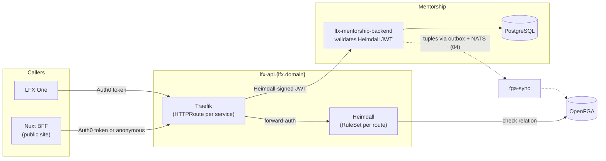
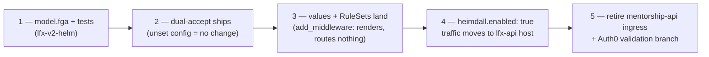

<!-- Copyright The Linux Foundation and each contributor to LFX. -->
<!-- SPDX-License-Identifier: MIT -->

# Mentorship Rewrite — 05: Heimdall Gateway Architecture

Status: Proposal — for Architecture team review
Related: [04-authorization-model.md](./04-authorization-model.md) (what FGA holds and which relation each route checks), [02-target-architecture.md](./02-target-architecture.md)

[04](./04-authorization-model.md) proposes the FGA model. This doc covers the edge that consumes it: how requests reach the service through the v2 API gateway, what Heimdall does per request, which hostnames exist before and after, and how we cut over from today's standalone deployment. The template throughout is Crowdfunding's in-flight Heimdall onboarding — [lfx-crowdfunding#252](https://github.com/linuxfoundation/lfx-crowdfunding/pull/252) (dual-accept) and [lfx-v2-argocd#1410](https://github.com/linuxfoundation/lfx-v2-argocd/pull/1410) (values shape) — and `lfx-v2-meeting-service`, the reference for the chart resources.

## Today vs target

Today ([lfx-mentorship#141](https://github.com/linuxfoundation/lfx-mentorship/pull/141) / [lfx-v2-argocd#1453](https://github.com/linuxfoundation/lfx-v2-argocd/pull/1453)) the service runs Crowdfunding's interim shape: its own public API hostname, Auth0 JWTs validated in-process, no edge authorization. The Auth0 side is already merged ([auth0-terraform#364](https://github.com/linuxfoundation/auth0-terraform/pull/364): `lfx_mentorship_api` resource server, `lfx_mentorship` web client).

| | Today (interim) | Target (this proposal) |
| --- | --- | --- |
| Public site | `mentorship.dev.lfx.dev` | unchanged |
| API host | `mentorship-api.dev.lfx.dev` (own ingress) | `lfx-api.dev.v2.cluster.linuxfound.info` — the shared gateway host, service claims a path prefix |
| Token validated by service | Auth0 (`aud: https://mentorship-api.dev.lfx.dev`) | Heimdall-signed (`aud: lfx-mentorship-backend`, `iss: heimdall`) |
| Authorization | none beyond authentication | per-route OpenFGA check in Heimdall (the [04 §decision 6](./04-authorization-model.md) table) |
| Identity claim | Auth0 `sub` | `principal` (LFID username; Auth0 `sub` never reaches the service) |

Hostname pattern per environment follows Crowdfunding exactly: site `mentorship.{env-domain}`, and `lfx.domain` = `dev.v2.cluster.linuxfound.info` / `staging.v2.cluster.linuxfound.info` / `v2.cluster.lfx.dev`. The `mentorship-api.*` hostname is retired at cutover — it exists only for the interim.

## Request flow



Per request, Heimdall runs the platform's standard pipeline — the same four steps every v2 service uses:

```mermaid
sequenceDiagram
    participant C as Caller
    participant T as Traefik
    participant H as Heimdall
    participant F as OpenFGA
    participant S as Backend

    C->>T: PATCH /mentorship/v1/applications/{uid}/status<br/>Authorization: Bearer (Auth0)
    T->>H: forward-auth (heimdall-forward-body middleware)
    H->>H: authenticate — Auth0 JWKS, gateway audience;<br/>subject = lfx username claim (fallback: sub)
    H->>F: check: manager on mentorship_application:{uid}
    F-->>H: allowed
    H->>H: finalizer create_jwt — mint JWT<br/>(principal, aud: lfx-mentorship-backend)
    H-->>T: 200 + new Authorization header
    T->>S: request with Heimdall-signed JWT
    S->>S: validate against Heimdall JWKS (cluster-internal)
    S-->>C: 200
```

An unauthenticated request falls through to the `anonymous_authenticator` (subject `_anonymous`) and still hits the FGA check — public reads pass because published programs carry the `viewer@user:*` wildcard tuple ([04 §lifecycle](./04-authorization-model.md)); everything non-public is denied at the edge. No separate "public" code path in the service.

## Two token shapes

| | Auth0 token (in front of Heimdall) | Heimdall token (behind, seen by the service) |
| --- | --- | --- |
| Issuer | `https://linuxfoundation-dev.auth0.com/` (per env) | `heimdall` |
| Audience | `https://lfx-api.{lfx.domain}/` | `lfx-mentorship-backend` |
| Identity | `http://lfx.dev/claims/username`, fallback `sub` | `principal` |
| JWKS | Auth0 (public internet) | `lfx-platform-heimdall.lfx.svc.cluster.local:4457` (cluster-internal) |

Consequences worth calling out:

- **The service trusts the gateway, not Auth0.** Its only validation is the Heimdall signature + audience; authorization already happened. The `/me/*` list endpoints filter by `principal` — the one service-side residue, per [04](./04-authorization-model.md).
- **LFX One gets simpler.** [auth0-terraform#364](https://github.com/linuxfoundation/auth0-terraform/pull/364) grants LFX One a silent secondary auth for the Mentorship audience; behind Heimdall it calls with the gateway-audience token it already holds for every other v2 service, and that grant can eventually be retired.
- **The Nuxt BFF changes one URL.** `NUXT_API_BASE_URL` moves from the backend's cluster-local Service to the gateway, so its calls get the same edge checks as everyone else's. Anonymous catalog reads keep working via the wildcard tuple.

## What changes where

| Repo | Change | Precedent |
| --- | --- | --- |
| [lfx-v2-helm](https://github.com/linuxfoundation/lfx-v2-helm) | `model.fga` types + `tests.yaml` (PR 1 of [04 §implementation path](./04-authorization-model.md)) | `vote_response` / `survey_response` |
| lfx-mentorship (backend chart) | `ruleset.yaml` (one rule per route, checking the [04 §decision 6](./04-authorization-model.md) relation), `httproute.yaml` on `lfx-api.{lfx.domain}` with a `/mentorship/` path prefix, `heimdall-middleware.yaml` — all gated on `heimdall.enabled` | `lfx-v2-meeting-service` templates |
| lfx-mentorship (backend) | dual-accept Heimdall JWTs alongside Auth0, config-gated: `HEIMDALL_JWKS_URL` / `HEIMDALL_JWT_AUDIENCE` / `HEIMDALL_JWT_ISSUER`, all-or-nothing | port of [lfx-crowdfunding#252](https://github.com/linuxfoundation/lfx-crowdfunding/pull/252) |
| [lfx-v2-argocd](https://github.com/linuxfoundation/lfx-v2-argocd) | per-env `HEIMDALL_*` config + `lfx.domain`; `heimdall.add_middleware: true` (renders objects, routes nothing); later `heimdall.enabled: true` per env | [lfx-v2-argocd#1410](https://github.com/linuxfoundation/lfx-v2-argocd/pull/1410) |
| [auth0-terraform](https://github.com/linuxfoundation/auth0-terraform) | frontend requests tokens with the gateway audience instead of `lfx_mentorship_api` | CF's LFXV2-3354 equivalent |

The `/mentorship/` path prefix is required by the shared host: the API's routes (`/v1/users`, `/v1/programs`, …) are too generic to claim at the root of `lfx-api.*` alongside project-service's `/projects/*` and meeting-service's `/itx/*`. Full shape: `https://lfx-api.{lfx.domain}/mentorship/v1/...`.

## Cutover

Same sequencing as Crowdfunding, with one material difference: **Mentorship has no production users yet**, so the dual-accept window carries no live-traffic risk — we keep it anyway because it decouples the four PRs above (each merges and deploys independently, in any environment order) and keeps the two rewrites on one pattern.



Steps 1–3 are individually inert. Step 4 is the cutover and is per-environment — dev first, soak, then staging/prod when those exist. Rollback at step 4 is `heimdall.enabled: false`, which restores the interim routing with no code change; step 5 happens only after cutover is confirmed everywhere, and is the point where the interim hostname and the standalone Auth0 audience disappear.

## Open questions for the Architecture team

| # | Question | Proposed default |
| --- | --- | --- |
| GW-1 | Confirm the `/mentorship/` path prefix on the shared host (the service's own resource names are too generic to claim at the root). Should the service strip the prefix at the router, or should Traefik rewrite it? | Service mounts its router under `/mentorship` — keeps the gateway config dumb and the URL visible in service logs. |
| GW-2 | Public catalog reads: authorize anonymously at the edge via the `viewer@user:*` wildcard check (one model for everything), or `allow_all` on the handful of catalog routes with the service filtering to published (Crowdfunding-style)? | Wildcard check — it is what [04](./04-authorization-model.md) already emits tuples for, and it keeps "who may see this" out of the service entirely. |
| GW-3 | Should the Nuxt BFF call the gateway via the public hostname or a cluster-internal route to the gateway? Public is simpler and matches LFX One; internal saves a hairpin. | Public hostname first; optimize later if latency says so. |
| GW-4 | Timing: does the Heimdall cutover gate the public launch, or does Mentorship launch on the interim model (as deployed by #141/#1453) and cut over after? | Launch interim, cut over after — the interim model is exactly what Crowdfunding runs in production today, and blocking launch on four cross-repo PRs buys no user-visible safety while nothing is live to migrate. |
