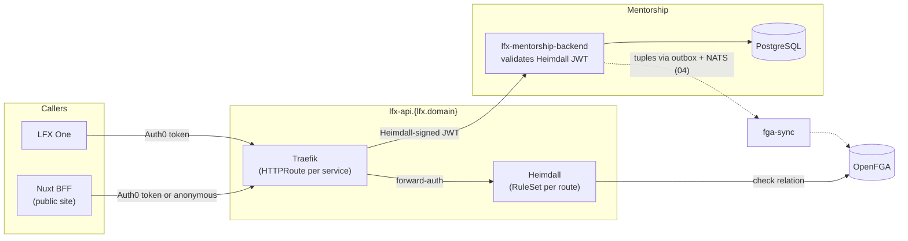
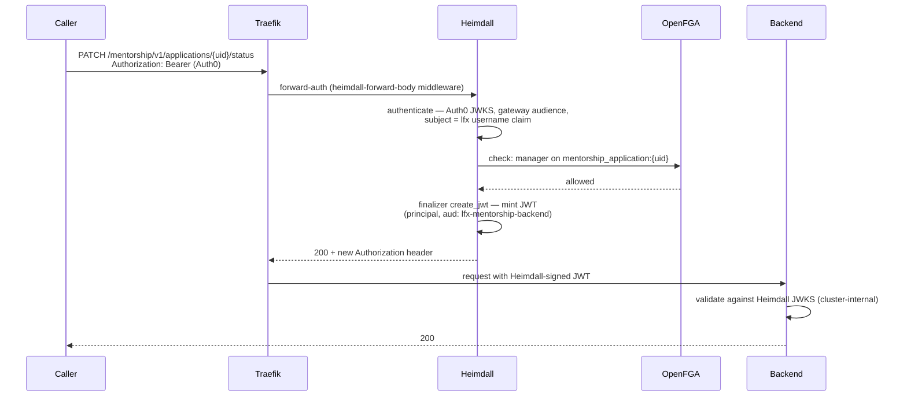
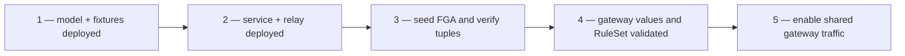

<!-- Copyright The Linux Foundation and each contributor to LFX. -->
<!-- SPDX-License-Identifier: MIT -->

# Mentorship Rewrite — 05: Heimdall Gateway Architecture

Status: Proposal — for Architecture team review
Related: [04-authorization-model.md](./04-authorization-model.md) (what FGA holds and which relation each route checks), [06-route-matrix.md](./06-route-matrix.md) (the per-route mapping), [02-target-architecture.md](./02-target-architecture.md)

[04](./04-authorization-model.md) proposes the FGA model. This doc covers the edge that consumes it: how requests reach the service through the v2 API gateway, what Heimdall does per request, and the environment evidence required before traffic is enabled. Mentorship is gateway-only; there is no supported standalone Auth0 API path.

> **Platform collection decision:** The earlier GW-2 service-owned collection
> shape is superseded. Query Service holds all resource objects and serves
> collections. Caller-owned initiative views use
> `GET /query/resources?v=1&type=<resource-type>&filter_grants=direct`; identity comes
> from the bearer token. The Mentorship RuleSet retains only the public
> slug-to-UID resolver and UID-addressed resource routes.

## Today vs target

| Surface | Gateway-only deployment |
| --- | --- |
| Public site | `mentorship.{env-domain}` |
| API host | `lfx-api.{lfx.domain}` with `/mentorship/v1/...` |
| Token validated by service | Heimdall-signed (`aud: lfx-mentorship-backend`, `iss: heimdall`) |
| Authorization | Per-route OpenFGA check in Heimdall |
| Identity claim | `principal` (LFID username) |

There is no supported `mentorship-api.*` standalone hostname. Environment
values must route the frontend/BFF and all API traffic through the shared
gateway host.

## Request flow

Per request, Heimdall runs the platform's standard pipeline — the same four steps every v2 service uses:

An unauthenticated request falls through to the `anonymous_authenticator` (subject `_anonymous`) and still hits the FGA check — public reads pass because published programs carry the `viewer@user:*` wildcard tuple ([04 §lifecycle](./04-authorization-model.md)); everything non-public is denied at the edge. No separate "public" code path in the service.

## Two token shapes

| | Auth0 token (in front of Heimdall) | Heimdall token (behind, seen by the service) |
| --- | --- | --- |
| Issuer | `https://linuxfoundation-dev.auth0.com/` (per env) | `heimdall` — a bare string, not a URL |
| Audience | `https://lfx-api.{lfx.domain}/` | `lfx-mentorship-backend` |
| Identity | `http://lfx.dev/claims/username` | `principal` |
| Algorithm | RS256 | PS256 (the platform signer is a 2048-bit RSA key) |
| JWKS | Auth0 (public internet) | `http://lfx-platform-heimdall.lfx.svc.cluster.local:4457/.well-known/jwks` (cluster-internal) |

**`principal` is never the Auth0 `sub`.** The platform finalizer sets it to the subject's `username` for human callers, `client_id@clients` for M2M, or `_anonymous`; the Auth0 `sub` is not forwarded to services at all. The platform config is explicit that client IDs can collide with usernames, so `sub` must not be relied on downstream. This is the identity that must key every `user:{lfid}` tuple in [04](./04-authorization-model.md) and every `/me/*` lookup — keying them off `sub` would check FGA against an identity Heimdall never sends.

Consequences worth calling out:

- **The service trusts the gateway, not Auth0.** It performs no authorization — that already happened at the edge — but it still fully validates the token: signature against the Heimdall JWKS, `aud: lfx-mentorship-backend`, `iss: heimdall`, `exp`/`nbf`, and a pinned `PS256` algorithm. Audience and signature alone are not sufficient: without an issuer check a token minted by another issuer trusted by the same key material would pass, without temporal claims an expired token would, and without algorithm pinning the token's own `alg` header decides how it is verified. This is why `HEIMDALL_JWT_ISSUER` is a required config key below. The `/me/*` list endpoints filter by `principal` — the one service-side residue, per [04](./04-authorization-model.md).
- **LFX One gets simpler.** [auth0-terraform#364](https://github.com/linuxfoundation/auth0-terraform/pull/364) grants LFX One a silent secondary auth for the Mentorship audience; behind Heimdall it calls with the gateway-audience token it already holds for every other v2 service, and that grant can eventually be retired.
- **The Nuxt BFF changes one URL.** `NUXT_API_BASE_URL` moves from the backend's cluster-local Service to the gateway, so its calls get the same edge checks as everyone else's. Anonymous catalog reads keep working via the wildcard tuple.

## What changes where

| Repo | Change | Precedent |
| --- | --- | --- |
| [lfx-v2-helm](https://github.com/linuxfoundation/lfx-v2-helm) | `model.fga` types + `tests.yaml` (PR 1 of [04 §implementation path](./04-authorization-model.md)) | `vote_response` / `survey_response` |
| [lfx-v2-fga-sync](https://github.com/linuxfoundation/lfx-v2-fga-sync) | register the mentorship object types in `docs/fga-protected-types.md` (PR 2 of [04 §implementation path](./04-authorization-model.md)) | the existing services registry |
| lfx-mentorship (backend chart) | `ruleset.yaml` (one rule per route, checking the [04 §decision 6](./04-authorization-model.md) relation — see the route-matrix note below), `httproute.yaml` on `lfx-api.{lfx.domain}` with a `/mentorship/` path prefix, `heimdall-middleware.yaml` — all gated on `heimdall.enabled` | `lfx-v2-meeting-service` templates |
| lfx-mentorship (backend) | Heimdall JWT validation using `HEIMDALL_JWKS_URL` / `HEIMDALL_JWT_AUDIENCE` / `HEIMDALL_JWT_ISSUER`; **resolve `principal` to the local user record** and keep workflow invariants separate from edge authorization | `lfx-v2-meeting-service` gateway pattern |
| [lfx-v2-argocd](https://github.com/linuxfoundation/lfx-v2-argocd) | per-env `HEIMDALL_*` config + `lfx.domain`; `heimdall.add_middleware: true` (renders objects, routes nothing); later `heimdall.enabled: true` per env | [lfx-v2-argocd#1410](https://github.com/linuxfoundation/lfx-v2-argocd/pull/1410) |
| [lfx-v2-project-service](https://github.com/linuxfoundation/lfx-v2-project-service) | Target owner of `project#mentorship_program_admin` storage, management API, and FGA emission. PR #127 implements the project-scoped mentorship admin role in project-service; the remaining step is verification and cutover of the live environment, not the long-term ownership decision itself. | `meeting_coordinator` |
| [auth0-terraform](https://github.com/linuxfoundation/auth0-terraform) | frontend requests tokens with the gateway audience instead of `lfx_mentorship_api` | CF's LFXV2-3354 equivalent |

Five implementation notes that are easy to get wrong:

**The route matrix is a deliverable of the RuleSets PR (PR 3 in [04 §implementation path](./04-authorization-model.md)), not of this document — it is now written up as [06-route-matrix.md](./06-route-matrix.md).** "One rule per route" states the shape, not a mapping this proposal supplies: [04 §decision 6](./04-authorization-model.md) settles the five split application/task mutation routes, and [04 §decision 7](./04-authorization-model.md) settles the route shapes that carry no checkable object UID. The remaining program, member, term, list/read, invite and internal routes are not individually mapped here. Before the RuleSets are written, `backend/cmd/mentorship-api/server.go` has to be walked route by route into an explicit authenticator / authorizer / object-extraction / relation table — that table is the implementation contract, and writing it is where any further decision-7-shaped exception will surface. One class still needs deciding there rather than assumed: the internal routes, which should not be exposed on the gateway host at all. The invite routes are already settled — AQ-7 in [04](./04-authorization-model.md) keeps the signed token as the credential, so both `mentor-invites` routes are `allow_all` at the edge with the service rejecting any principal that does not match the user named in the token. Note this is *not* the AQ-5 treatment: the approval HMAC links are retired in favor of logged-in approval, whereas the invitation token survives as a documented, narrowly-scoped exception.

**The service validates Heimdall tokens natively.** The issuer is the literal
string `heimdall`, the cluster JWKS endpoint may use `http://`, the signature is
PS256, and identity arrives in `principal` rather than `sub`. The service uses a
Heimdall-specific validator and rejects other algorithms, issuers, audiences,
and unsigned or expired tokens.

**The service owns only the platform prefix.** `/v1/users`, `/v1/programs` and friends are too generic to claim at the root of `lfx-api.*`, so the backend serves only `https://lfx-api.{lfx.domain}/mentorship/v1/...`. There is no second `/v1` mount and no standalone ingress to preserve.

**Heimdall `principal` is an LFID, while workflow code uses local user IDs.**
The gateway middleware stores the Heimdall `principal`; authenticated human
requests are resolved to `users.id` by LFID before handlers run. Public
anonymous and M2M principals are exempt from that local-user lookup.

The resolver fails closed for a human principal with no local user. Bootstrap is
the one exception: `PUT /mentorship/v1/me` receives the validated principal
without a lookup so it can create that local user.

**Every FGA-checked route must be UID-only — including the public ones.** `program_handler.go` resolves `{id}` as a UUID *or* a slug, but the tuples in [04](./04-authorization-model.md) are keyed by UID. A RuleSet built from the raw `{id}` capture would check `mentorship_program:{slug}`, find no tuple, and deny a valid URL before the service could resolve it. Note that "slugs stay on public reads" is **not** an escape hatch here: GW-2 resolves that ID-addressed public reads keep the `viewer@user:*` wildcard check, so a slug on `GET /v1/programs/{slug}` is checked as `mentorship_program:{slug}` and denied exactly like a protected mutation — the check does not care that the route is public, only that it interpolates an object ID. The constraint is therefore the union of both: slug resolution happens *ahead* of any check, via a public slug-to-UID resolver route as the platform does for projects, and every route that feeds `{id}` into an `openfga_check` accepts UIDs only. The only routes that may take a slug are ones with no object-level check at all (`allow_all` collection reads and the resolver itself).

## Cutover

Mentorship is not released on a standalone API host. The shared gateway is the
only supported traffic path, so the rollout must prove the complete chain before
enabling traffic.

**Steps 3 and 4 are the ones that cannot be skipped.** Heimdall fails closed: with the model, the validator and the RuleSets in place but no tuples in FGA, every protected request is denied. So emission has to be live *before* the seed (or the seed races new writes), and the seed has to be complete and verified *before* traffic moves. Verification means an explicit check that every program, application and task in Postgres has its expected tuples — not just that the relay ran without errors.

The rollout is per-environment — dev first, soak, then staging and production
when those environments exist.

**Step 5 also depends on a prerequisite outside this repo's five steps.** [lfx-v2-project-service](https://github.com/linuxfoundation/lfx-v2-project-service) owning and emitting `mentorship_program_admin` (line 108 above; PR 5 of [04 §implementation path](./04-authorization-model.md)) is "not optional" per that document — without it, `mentorship_program.writer` inherits through a relation with no durable tuples, and every cross-program admin check fails closed (AQ-4). That work is not one of the five rollout steps and is not represented in the flowchart above because it ships in a different repo on its own timeline; it must still be rolled out and its tuples verified in FGA before step 5 runs in an environment, or cross-program admins silently lose access the moment gateway traffic is enabled. Treat it as a prerequisite check alongside step 4's coverage verification, not merely as a parallel dependency to track.

**Gateway activation and rollback are configuration changes.** Set the BFF API
base URL and gateway audience together with the gateway route and Heimdall
configuration. Rollback means disabling shared-gateway traffic and reverting
those values; there is no standalone Mentorship API path to leave active.

## Open questions for the Architecture team

| # | Question | Resolution |
| --- | --- | --- |
| GW-1 | The shared host needs a `/mentorship/` prefix. Does Traefik strip the prefix, or does the service serve it natively? | **Resolved: the service serves `/mentorship/v1/...` natively.** No Traefik rewrite or standalone `/v1` mount is supported. The HTTPRoute forwards the platform prefix unmodified, matching the `lfx-v2-meeting-service` and `lfx-v2-newsletter-service` pattern. |
| GW-2 | Public catalog reads: `viewer@user:*` wildcard check everywhere, or `allow_all` plus the service's published filter for the collection routes? | **Resolved: split by route shape and pin collection status.** `GET /v1/programs` and `GET /v1/programs/catalog` are collections with no object UID to put in an `openfga_check`, so they use unguarded `allow_all` and their handlers pin `status = published`. ID-addressed public reads keep the wildcard check. The RuleSets must distinguish genuinely public `allow_all` from a local-development fallback branch, which would silently drop a required check when OpenFGA is enabled. |
| GW-3 | Should the Nuxt BFF call the gateway via the public hostname or a cluster-internal route? | **Resolved: cluster-internal.** No v2 service routes server-side traffic out to a public hostname. `lfx-crowdfunding` — the explicit template for this rewrite — sets `NUXT_API_BASE_URL: "http://lfx-crowdfunding-backend.crowdfunding-backend.svc.cluster.local"`, and `lfx-self-serve` uses the internal cluster hostname `https://lfx-api.dev.v2.cluster.linuxfound.info` rather than the public `.lfx.dev`. Server-side calls stay in-cluster; only the browser uses the public host. Note: the crowdfunding example above targets that service's own backend Service directly, matching its interim (pre-Heimdall) model — Mentorship's post-cutover target is the gateway's cluster-internal address (line 97), not the backend's own Service, or the BFF forwards an Auth0 token to a backend expecting Heimdall JWTs. |
| GW-4 | Does the gateway cutover gate the public launch? | **Resolved: yes.** The gateway is the only supported API path and the cutover gates launch. Mentorship does not ship a standalone Auth0 API deployment; per-object authorization is provided by Heimdall/OpenFGA from the first release. |
| GW-5 | Self-service writes are ID-addressed (`PATCH/DELETE /v1/users/{id}`, `/v1/user-profiles/{id}`) but neither object has an FGA type, so authentication alone would let one user target another's ID. Add owner types, or redesign these as `/me` routes? | **Resolved: redesign as `/me` routes.** A `user` FGA type whose only relation is "is yourself" is exactly the one-off [04](./04-authorization-model.md) says not to model — and no edge check of any kind can express "self" here anyway: the path `{id}` is the `users.id` UUID while the token carries `principal`, identifiers the edge cannot map to each other (the mismatch documented above), so only the service can resolve the caller to its local row. `/me` writes carry no target ID; `principal` settles it in the service. The ID-addressed write routes are **deleted, not admin-gated** (done in [lfx-mentorship#153](https://github.com/linuxfoundation/lfx-mentorship/pull/153), which also removes the unbound `POST` routes and the RM-1 collection reads) — no admin flow that edits another user's account has been named, and keeping them would require the `user` type this row declines to model; reintroduce them if the product ever asks. `GET /v1/users/{userId}/applications` joins the reshape as `GET /me/applications` (its IDOR guard compares the same mismatched identifiers). |
| GW-6 | Term-scoped routes (`PATCH/DELETE /v1/program-terms/{id}`, the *public* `GET /v1/program-terms/{id}` (`backend/cmd/mentorship-api/server.go:153`), plus `GET /v1/program-terms/{id}/tasks`, `GET /v1/program-terms/{id}/applications`, and the bulk, export and past-mentee routes — `backend/cmd/mentorship-api/server.go:139-189`) expose no program UID, and terms have no FGA type. How are they edge-authorized? | **Resolved: carry the program UID in the path** (`/v1/programs/{uid}/terms/{id}`) and have the service validate the parent-child association ([04 §decision 7](./04-authorization-model.md)) — with that validation made structural. The alternative — giving `program_term` a type purely to reach its parent — adds a type, a tuple per term with relay create/delete lifecycle, and step-4 seed-verification surface, for no access distinction of its own: a term's permissions are exactly its program's. The term-scoped *list* routes (tasks, applications) need this most: they span every application in the term, so there is no single child object whose relation could stand in. One asymmetry decides how the validation is built: a missing tuple fails **closed** (Heimdall denies), but a missing parent-child check fails **open** — a caller authorized on program A could pass `programs/{A}/terms/{termOfB}`, the edge approves against A, and the service acts on B's term. Six routes each needing an ad-hoc handler check is six chances at that bug, so the guard lives in one place: the repository query takes both IDs (`WHERE program_id = $1 AND id = $2`, returning `ErrProgramTermNotFound` on mismatch), making the safe path the only path. `POST /v1/applications/{id}/tasks` raises the same question but needs no route change — see GW-7. |
| GW-7 | `POST /v1/applications/{id}/tasks` carries the application UID. Which relation? | **Resolved: `reviewer` on the application**, not `manager`. `mentorship_application.manager` is `writer from mentorship_program` (admins only), but assigning tasks to an accepted mentee is a mentor capability — [04's parity table](./04-authorization-model.md) maps `can_add_task` to admin-or-mentor, and 04 §deliberate modeling decisions already records task creation as `reviewer` on the parent application — so a `manager` check would deny mentors the thing the product says they do. `reviewer` is `manager or mentor from mentorship_program`. Watch the collision: `mentorship_task.manager` *does* include mentors (it resolves to `reviewer from mentorship_application` — the same set), so the correct relation name differs depending on whether the object in the path is the task or the application; the route matrix must state both names explicitly. One fact the RuleSet inherits: `TaskService.Create` performs no authorization today (input validation only), so the edge check is the *first* authorization this route has ever had — satisfied before launch by GW-4's ordering, but in the dev window after [lfx-mentorship#148](https://github.com/linuxfoundation/lfx-mentorship/pull/148) deploys, any authenticated caller can create tasks on any application. |
| GW-8 | Eight reads sit in the unauthenticated group (`backend/cmd/mentorship-api/server.go:126-131` and `:157-159`) that no decision above covers: `GET /v1/applications/{id}`, `/v1/applications/{id}/tasks`, `/v1/tasks/{id}`, and the user/profile reads — both the collections (`/v1/users`, `/v1/user-profiles`) and the ID-addressed ones (`/v1/users/{id}`, `/v1/user-profiles/{id}`, `/v1/user-profiles/slug/{slug}`). GW-5 settled the ID-addressed *writes* on users and profiles and GW-6 the term-scoped *lists*, but the direct reads were never stated. Are these intentionally public, or simply not yet gated? | **Resolved: not yet gated — gate them, and gate rather than redact.** The application and task reads contradict a decision already recorded in [04 §relationship graph](./04-authorization-model.md): applications are visible to the applicant, Program Admins, and mentors only. Anonymous `GET /v1/applications/{id}` hands an application to anyone holding a UID. These take the same `auditor` check as their parent, so they need no new relation — only moving out of the public group. The user and profile reads turn out not to be a product question after all: the frontend never calls `/v1/users` or `/v1/user-profiles` — the public directory pages go through `/v1/mentors` and `/v1/mentees`, which already select an allowlist (`user_id`, name, avatar, introduction, skills) — while `GET /v1/users` serves `Email` and `LFID` for every user to anonymous callers, a bulk-harvest surface with zero consumers. So all five user/profile reads leave the public group too, and **no redaction machinery is built** for routes nothing public consumes: the redacted public surface already exists, and it is the catalog routes. If a public profile page ever ships, it gets a purpose-built allowlist DTO the way the mentor catalog does, not a field-stripped raw row — blocklist redaction rots the first time a column is added. Their end-state shape (owner reads via `/me`, admin and mentor access through application-scoped views) falls out of the GW-5 reshape and the route matrix rather than needing a decision here. **Sequencing:** the group moves are a one-file `server.go` change, shippable immediately and independent of the Heimdall chain — worth landing before the [lfx-mentorship#148](https://github.com/linuxfoundation/lfx-mentorship/pull/148) dev deployment serves emails to anonymous callers. The edge `auditor` checks then replace an interim guard rather than introduce the first one. |
| GW-9 | `GET /v1/programs/{id}/members` is the one route in that set with PII already flowing: `ProgramMember.Email` is populated (`programMemberCols` selects the column) and served to anonymous callers. Fixed in the handler by redacting the field on the public read ([lfx-mentorship#144](https://github.com/linuxfoundation/lfx-mentorship/pull/144)), but should the route itself stay public once the edge is in place? | **Public, with email redacted — the fix already applied.** The public program page lists mentors, so the membership roster is a legitimate public read, matching the mentee list resolved by GW-2. What was not legitimate is the email. Redaction in the handler is the right layer rather than removing the field: create and update both accept an email, and the column is a legacy invite artifact. Once edge authorization lands this becomes an ID-addressed public read under the same `viewer@user:*` wildcard as `GET /v1/programs/{id}/mentees`. Worth revisiting only if the product decides mentor identities are not public. **What the roster returns is specified once, in [04 §deliberate modeling decisions](./04-authorization-model.md)** — accepted mentors, accepted plus graduated mentees, gated on `program.status = published` alone — rather than restated here, so the two documents cannot drift. The status gap it exposed is also fixed in the same PR: the route previously passed the `status` query param straight through and defaulted to unfiltered, serving `pending`, `declined` and `withdrawn` members to anonymous callers. The handler now **pins** `status = 'active'` rather than merely defaulting it, so a caller cannot widen the public roster with `?status=pending`. **This leaves a known gap, so GW-9 is resolved for the public read only.** Because this is the *only* member-list route and the pin is unconditional, no caller — Program Admins included — can list `invited`, `requested` or `pending` members, and email is redacted for everyone; invitation management therefore has no read path today. Under the no-attribute-level-authorization rule ([04](./04-authorization-model.md)) the fix cannot be a role-conditional filter on this route: it needs a separate `writer`-gated management endpoint. That endpoint's shape is **not decided here** — it is pre-launch work alongside the `member_type` pin above. Note the predicate is `active`, not `accepted` — the latter is not a valid `program_members` status today; `active` is the stored value for an accepted mentor (a future rename tracks the vocabulary, not this route's behavior), and this is a different column from the application status AQ-10 removed.

The interim public-roster gaps are now closed in the backend: `ProgramMemberHandler.List`
requires `program.status = published`, pins `member_type = mentor` and
`status = active`, and strips email addresses. The corresponding RuleSet route
is implemented in the chart. Live gateway activation and anonymous/denied smoke
coverage remain cutover evidence, not additional handler work.
