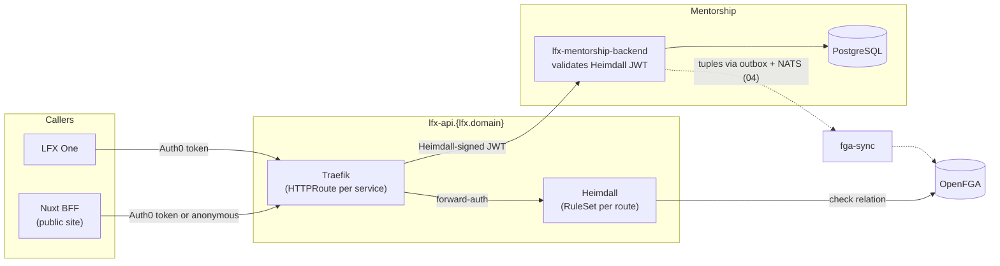
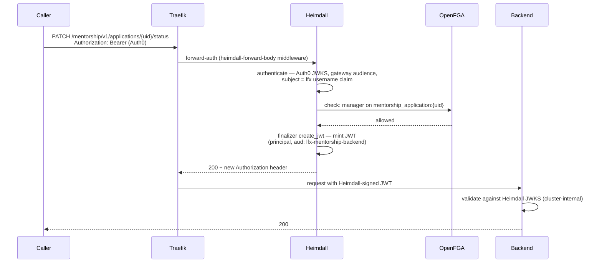
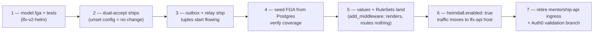

<!-- Copyright The Linux Foundation and each contributor to LFX. -->
<!-- SPDX-License-Identifier: MIT -->

# Mentorship Rewrite — 05: Heimdall Gateway Architecture

Status: Proposal — for Architecture team review
Related: [04-authorization-model.md](./04-authorization-model.md) (what FGA holds and which relation each route checks), [02-target-architecture.md](./02-target-architecture.md)

[04](./04-authorization-model.md) proposes the FGA model. This doc covers the edge that consumes it: how requests reach the service through the v2 API gateway, what Heimdall does per request, which hostnames exist before and after, and how we cut over from today's standalone deployment. The template throughout is Crowdfunding's in-flight Heimdall onboarding — [lfx-crowdfunding#252](https://github.com/linuxfoundation/lfx-crowdfunding/pull/252) (dual-accept) and [lfx-v2-argocd#1410](https://github.com/linuxfoundation/lfx-v2-argocd/pull/1410) (values shape) — and `lfx-v2-meeting-service`, the reference for the chart resources.

## Today vs target

Today ([lfx-mentorship#141](https://github.com/linuxfoundation/lfx-mentorship/pull/141) / [lfx-v2-argocd#1453](https://github.com/linuxfoundation/lfx-v2-argocd/pull/1453)) the service runs Crowdfunding's interim shape: its own public API hostname, Auth0 JWTs validated in-process, no edge authorization. The Auth0 side is already merged ([auth0-terraform#364](https://github.com/linuxfoundation/auth0-terraform/pull/364): `lfx_mentorship_api` resource server, `lfx_mentorship` web client).

| | Today (interim) | Target (this proposal) |
| --- | --- | --- |
| Public site | `mentorship.dev.lfx.dev` | unchanged |
| API host | `mentorship-api.dev.lfx.dev` (own ingress) | `lfx-api.dev.v2.cluster.linuxfound.info` — the shared gateway host, service claims a path prefix |
| Token validated by service | Auth0 (`aud: https://mentorship-api.dev.lfx.dev`) | Heimdall-signed (`aud: lfx-mentorship-backend`, `iss: heimdall`) |
| Authorization | none beyond authentication | per-route OpenFGA check in Heimdall (the [04 §decision 6](./04-authorization-model.md) table) |
| Identity claim | Auth0 `sub` | `principal` (LFID username; Auth0 `sub` never reaches the service) |

Hostname pattern per environment follows Crowdfunding exactly: site `mentorship.{env-domain}`, and `lfx.domain` = `dev.v2.cluster.linuxfound.info` / `staging.v2.cluster.linuxfound.info` / `v2.cluster.lfx.dev`. The `mentorship-api.*` hostname is retired at cutover — it exists only for the interim.

## Request flow

Per request, Heimdall runs the platform's standard pipeline — the same four steps every v2 service uses:

An unauthenticated request falls through to the `anonymous_authenticator` (subject `_anonymous`) and still hits the FGA check — public reads pass because published programs carry the `viewer@user:*` wildcard tuple ([04 §lifecycle](./04-authorization-model.md)); everything non-public is denied at the edge. No separate "public" code path in the service.

## Two token shapes

| | Auth0 token (in front of Heimdall) | Heimdall token (behind, seen by the service) |
| --- | --- | --- |
| Issuer | `https://linuxfoundation-dev.auth0.com/` (per env) | `heimdall` — a bare string, not a URL |
| Audience | `https://lfx-api.{lfx.domain}/` | `lfx-mentorship-backend` |
| Identity | `http://lfx.dev/claims/username` | `principal` |
| Algorithm | RS256 | PS256 (the platform signer is a 2048-bit RSA key) |
| JWKS | Auth0 (public internet) | `http://lfx-platform-heimdall.lfx.svc.cluster.local:4457/.well-known/jwks` (cluster-internal) |

**`principal` is never the Auth0 `sub`.** The platform finalizer sets it to the subject's `username` for human callers, `client_id@clients` for M2M, or `_anonymous`; the Auth0 `sub` is not forwarded to services at all. The platform config is explicit that client IDs can collide with usernames, so `sub` must not be relied on downstream. This is the identity that must key every `user:{lfid}` tuple in [04](./04-authorization-model.md) and every `/me/*` lookup — keying them off `sub` would check FGA against an identity Heimdall never sends.

Consequences worth calling out:

- **The service trusts the gateway, not Auth0.** It performs no authorization — that already happened at the edge — but it still fully validates the token: signature against the Heimdall JWKS, `aud: lfx-mentorship-backend`, `iss: heimdall`, `exp`/`nbf`, and a pinned `PS256` algorithm. Audience and signature alone are not sufficient: without an issuer check a token minted by another issuer trusted by the same key material would pass, without temporal claims an expired token would, and without algorithm pinning the token's own `alg` header decides how it is verified. This is why `HEIMDALL_JWT_ISSUER` is a required config key below. The `/me/*` list endpoints filter by `principal` — the one service-side residue, per [04](./04-authorization-model.md).
- **LFX One gets simpler.** [auth0-terraform#364](https://github.com/linuxfoundation/auth0-terraform/pull/364) grants LFX One a silent secondary auth for the Mentorship audience; behind Heimdall it calls with the gateway-audience token it already holds for every other v2 service, and that grant can eventually be retired.
- **The Nuxt BFF changes one URL.** `NUXT_API_BASE_URL` moves from the backend's cluster-local Service to the gateway, so its calls get the same edge checks as everyone else's. Anonymous catalog reads keep working via the wildcard tuple.

## What changes where

| Repo | Change | Precedent |
| --- | --- | --- |
| [lfx-v2-helm](https://github.com/linuxfoundation/lfx-v2-helm) | `model.fga` types + `tests.yaml` (PR 1 of [04 §implementation path](./04-authorization-model.md)) | `vote_response` / `survey_response` |
| [lfx-v2-fga-sync](https://github.com/linuxfoundation/lfx-v2-fga-sync) | register the mentorship object types in `docs/fga-protected-types.md` (PR 2 of [04 §implementation path](./04-authorization-model.md)) | the existing services registry |
| lfx-mentorship (backend chart) | `ruleset.yaml` (one rule per route, checking the [04 §decision 6](./04-authorization-model.md) relation — see the route-matrix note below), `httproute.yaml` on `lfx-api.{lfx.domain}` with a `/mentorship/` path prefix, `heimdall-middleware.yaml` — all gated on `heimdall.enabled` | `lfx-v2-meeting-service` templates |
| lfx-mentorship (backend) | dual-accept Heimdall JWTs alongside Auth0, config-gated: `HEIMDALL_JWKS_URL` / `HEIMDALL_JWT_AUDIENCE` / `HEIMDALL_JWT_ISSUER`, all-or-nothing | [lfx-crowdfunding#252](https://github.com/linuxfoundation/lfx-crowdfunding/pull/252) — **adapt, do not port verbatim** (below) |
| [lfx-v2-argocd](https://github.com/linuxfoundation/lfx-v2-argocd) | per-env `HEIMDALL_*` config + `lfx.domain`; `heimdall.add_middleware: true` (renders objects, routes nothing); later `heimdall.enabled: true` per env | [lfx-v2-argocd#1410](https://github.com/linuxfoundation/lfx-v2-argocd/pull/1410) |
| [auth0-terraform](https://github.com/linuxfoundation/auth0-terraform) | frontend requests tokens with the gateway audience instead of `lfx_mentorship_api` | CF's LFXV2-3354 equivalent |

Four implementation notes that are easy to get wrong:

**The route matrix is a deliverable of the RuleSets PR (PR 3 in [04 §implementation path](./04-authorization-model.md)), not of this document.** "One rule per route" states the shape, not a mapping this proposal supplies: [04 §decision 6](./04-authorization-model.md) settles the five split application/task mutation routes, and [04 §decision 7](./04-authorization-model.md) settles the route shapes that carry no checkable object UID. The remaining program, member, term, list/read, invite and internal routes are not individually mapped here. Before the RuleSets are written, `backend/cmd/mentorship-api/server.go` has to be walked route by route into an explicit authenticator / authorizer / object-extraction / relation table — that table is the implementation contract, and writing it is where any further decision-7-shaped exception will surface. Two classes need deciding there rather than assumed: the internal routes (which should not be exposed on the gateway host at all) and the invite routes (whose legacy HMAC-link flow is retired the same way the approval links are — AQ-7 in [04](./04-authorization-model.md)).

**The Crowdfunding validator needs adapting, not copying.** Its `newJWKSValidator` requires the issuer to parse as an absolute URL and to pass a secure-URL check, and the Auth0 claims type expects a `sub`. The platform token has none of those properties: the issuer is the literal string `heimdall`, the JWKS endpoint is plain `http://` inside the cluster, the signature is PS256, and identity arrives as `principal` with no `sub`. Ported verbatim, the service fails at startup — and relaxing only the URL check still rejects every real token. The second validator branch has to be Heimdall-native, and its tests need a genuine finalizer-shaped token rather than a hand-rolled Auth0 one.

**The path prefix must not break the interim host.** The shared host needs a prefix — `/v1/users`, `/v1/programs` and friends are too generic to claim at the root of `lfx-api.*` alongside project-service's `/projects/*` and meeting-service's `/itx/*` — giving `https://lfx-api.{lfx.domain}/mentorship/v1/...`. But the interim hostname serves `/v1/...` today, so remounting the router under `/mentorship` in step 2 breaks every existing client, while leaving it unmounted 404s the gateway path. Either serve both mounts until step 5, or have Traefik strip the prefix so the service keeps serving `/v1` unchanged (see GW-1).

**Every FGA-checked route must be UID-only — including the public ones.** `program_handler.go` resolves `{id}` as a UUID *or* a slug, but the tuples in [04](./04-authorization-model.md) are keyed by UID. A RuleSet built from the raw `{id}` capture would check `mentorship_program:{slug}`, find no tuple, and deny a valid URL before the service could resolve it. Note that "slugs stay on public reads" is **not** an escape hatch here: GW-2 resolves that ID-addressed public reads keep the `viewer@user:*` wildcard check, so a slug on `GET /v1/programs/{slug}` is checked as `mentorship_program:{slug}` and denied exactly like a protected mutation — the check does not care that the route is public, only that it interpolates an object ID. The constraint is therefore the union of both: slug resolution happens *ahead* of any check, via a public slug-to-UID resolver route as the platform does for projects, and every route that feeds `{id}` into an `openfga_check` accepts UIDs only. The only routes that may take a slug are ones with no object-level check at all (`allow_all` collection reads and the resolver itself).

## Cutover

Same sequencing as Crowdfunding, with one material difference in what the dual-accept window is protecting. **Mentorship has no production users at the time of writing**, so if the cutover happened before launch the window would carry no live-traffic risk. GW-4 resolves the timing the other way — launch on the interim model, cut over after — which means by step 6 there *will* be live traffic and the window is load-bearing exactly as it is for Crowdfunding. It also decouples the PRs above (each merges and deploys independently, in any environment order) and keeps the two rewrites on one pattern.

**Steps 3 and 4 are the ones that cannot be skipped.** Heimdall fails closed: with the model, the validator and the RuleSets in place but no tuples in FGA, every protected request is denied. So emission has to be live *before* the seed (or the seed races new writes), and the seed has to be complete and verified *before* traffic moves. Verification means an explicit check that every program, application and task in Postgres has its expected tuples — not just that the relay ran without errors.

Steps 1–5 are individually inert. Step 6 is the cutover and is per-environment — dev first, soak, then staging and prod when those exist.

**Step 6 is not a single flag, and neither is its rollback.** Moving traffic to the `lfx-api` host also repoints the Nuxt BFF (`NUXT_API_BASE_URL`) and changes the Auth0 audience the frontend requests, since the gateway issues its own token for a different audience than the one the interim ingress validates. Rolling back means reverting `heimdall.enabled`, the BFF base URL, and the audience together — still configuration-only, no code change and no redeploy of the Go service, but three values in two repos rather than one. They must move as a set: reverting the route while the frontend still requests the gateway audience leaves the interim ingress rejecting every token. Step 7 is what makes rollback impossible, which is why it waits until cutover is confirmed everywhere: it retires the interim hostname, the standalone Auth0 audience, and the fallback path.

## Open questions for the Architecture team

| # | Question | Proposed default |
| --- | --- | --- |
| GW-1 | The shared host needs a `/mentorship/` prefix, but the interim host serves `/v1/...`. Does Traefik strip the prefix, or does the service serve both mounts until step 7? | **Traefik strips it.** The service keeps serving `/v1` throughout, so no client breaks and the one-flag rollback stays honest. Mounting the service under `/mentorship` instead would make step 6 a code change rather than a config flip. |
| GW-2 | Public catalog reads: `viewer@user:*` wildcard check everywhere, or `allow_all` plus the service's published filter for the collection routes? | **Split by route shape.** `GET /v1/programs/catalog` is a collection with no object UID to put in an `openfga_check`, so the wildcard cannot express it; that route gets `allow_all` and keeps the service's existing `status = published` filter. ID-addressed public reads keep the wildcard check. |
| GW-3 | Should the Nuxt BFF call the gateway via the public hostname or a cluster-internal route? | Public hostname first; optimize later if latency says so. |
| GW-4 | Timing: does the Heimdall cutover gate the public launch, or does Mentorship launch on the interim model (as deployed by #141/#1453) and cut over after? | Launch interim, cut over after — the interim model is exactly what Crowdfunding runs in production today, and blocking launch on cross-repo PRs buys no user-visible safety while nothing is live to migrate. |
| GW-5 | Self-service writes are ID-addressed (`PATCH/DELETE /v1/users/{id}`, `/v1/user-profiles/{id}`) but neither object has an FGA type, so authentication alone would let one user target another's ID. Add owner types, or redesign these as `/me` routes? | **Redesign as `/me` routes.** A `user` FGA type whose only relation is "is yourself" is exactly the one-off [04](./04-authorization-model.md) says not to model; `/me` writes carry no target ID, so `principal` settles it in the service with no edge check. |
| GW-6 | Term-scoped routes (`PATCH/DELETE /v1/program-terms/{id}`, plus `GET /v1/program-terms/{id}/tasks`, `GET /v1/program-terms/{id}/applications`, and the bulk, export and past-mentee routes — `backend/cmd/mentorship-api/server.go:139-189`) expose no program UID, and terms have no FGA type. How are they edge-authorized? | **Carry the program UID in the path** (`/v1/programs/{uid}/terms/{id}`) and have the service validate the parent-child association ([04 §decision 7](./04-authorization-model.md)). The alternative — giving `program_term` a type purely to reach its parent — adds a type and a tuple per term for no access distinction of its own. The term-scoped *list* routes (tasks, applications) need this most: they span every application in the term, so there is no single child object whose relation could stand in. `POST /v1/applications/{id}/tasks` raises the same question but needs no route change — see GW-7. |
| GW-7 | `POST /v1/applications/{id}/tasks` carries the application UID. Which relation? | **`reviewer` on the application**, not `manager`. `mentorship_application.manager` is `writer from mentorship_program` (admins only), but assigning tasks to an accepted mentee is a mentor capability, so a `manager` check would deny mentors the thing the product says they do. `reviewer` is `manager or mentor from mentorship_program`. Watch the collision: `mentorship_task.manager` *does* include mentors (it resolves to `reviewer from mentorship_application` — the same set), so the correct relation name differs depending on whether the object in the path is the task or the application. |
| GW-8 | Six reads sit in the unauthenticated group (`backend/cmd/mentorship-api/server.go:113-145`) that no decision above covers: `GET /v1/applications/{id}`, `/v1/applications/{id}/tasks`, `/v1/tasks/{id}`, `/v1/users`, `/v1/user-profiles`, and `/v1/programs/{id}/members`. GW-5 settled the ID-addressed *writes* on users and profiles and GW-6 the term-scoped *lists*, but the direct reads were never stated. Are these intentionally public, or simply not yet gated? | **Not yet gated — gate them.** The application and task reads contradict a decision already recorded in [04 §relationship graph](./04-authorization-model.md): applications are visible to the applicant, Program Admins, and mentors only, and comments are admin/mentor-only. Anonymous `GET /v1/applications/{id}` hands an application to anyone holding a UID. These take the same `auditor` check as their parent, so they need no new relation — only moving out of the public group. The user and profile collection reads are a product question (a public people directory may be intended), but they should be an explicit `allow_all` decision rather than an unstated default. |
| GW-9 | `GET /v1/programs/{id}/members` is the one route in that set with PII already flowing: `ProgramMember.Email` is populated (`programMemberCols` selects the column) and served to anonymous callers. Fixed in the handler by redacting the field on the public read ([lfx-mentorship#144](https://github.com/linuxfoundation/lfx-mentorship/pull/144)), but should the route itself stay public once the edge is in place? | **Public, with email redacted — the fix already applied.** The public program page lists mentors, so the membership roster is a legitimate public read, matching the mentee list resolved by GW-2. What was not legitimate is the email. Redaction in the handler is the right layer rather than removing the field: create and update both accept an email, and the column is a legacy invite artifact. Once edge authorization lands this becomes an ID-addressed public read under the same `viewer@user:*` wildcard as `GET /v1/programs/{id}/mentees`. Worth revisiting only if the product decides mentor identities are not public. **What these routes return**: accepted mentors, and accepted **plus graduated** mentees ([00](./00-current-authz-relations.md), decision 1), gated on `program.status = published` alone — never on term or application-window state, which is a deliberate divergence from legacy's `showAcceptedMentees`. That single predicate is what makes the wildcard a complete authorization; a time-varying gate could not be expressed as a tuple and would leave the service re-filtering a request the edge had already allowed. Do not restore it from the legacy frontend. |
