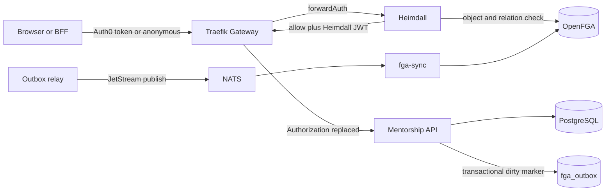
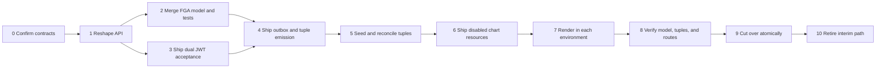

<!-- Copyright The Linux Foundation and each contributor to LFX. -->
<!-- SPDX-License-Identifier: MIT -->

# Mentorship Rewrite - 07: Traefik, Heimdall, and OpenFGA Implementation Guide

Status: Implementation guide - the reviewed FGA permission sets are accepted as design input; enforcement remains dependent on the operational blockers below

Related: [04-authorization-model.md](./04-authorization-model.md), [05-heimdall-gateway.md](./05-heimdall-gateway.md), [06-route-matrix.md](./06-route-matrix.md), [02-target-architecture.md](./02-target-architecture.md)

## Purpose

This is the ordered implementation runbook for moving LFX Mentorship behind the shared LFX v2 API Gateway. It applies the platform pattern already used by Meeting Service and being adopted by Crowdfunding:

1. Traefik accepts traffic on the shared gateway host and delegates authentication and authorization to Heimdall with `forwardAuth`.
2. Heimdall authenticates the incoming Auth0 token, checks one OpenFGA relation for the route, and replaces the request's `Authorization` header with a short-lived, service-audience JWT.
3. The Mentorship backend validates the Heimdall JWT and consumes its `principal` claim. It does not query OpenFGA or repeat relation checks.
4. PostgreSQL remains the source of truth. Mentorship sends derived relationship changes to `lfx-v2-fga-sync` through NATS JetStream using a transactional outbox.

This document says **how and in what order** to implement the design. Document 04 remains authoritative for the relation model. The canonical route catalog in section 1.6 combines the current API, required URL adjustments, and routes implied by accepted product workflows. Copy that complete catalog into document 06 before treating it as the RuleSet inventory.

### Source precedence

The Architecture-reviewed standalone model described in the Mentorship FGA PDF validates the actor permission sets and the project -> program -> application -> task inheritance chain. Production integration follows the newer platform decisions recorded in documents 04-06 where the artifacts differ:

- Use the platform's noun relations (`writer`, `manager`, `reviewer`, `auditor`, `assignee`, `mentee`, `viewer`, and `member`) in RuleSets. The PDF's `can_*` names describe equivalent permissions but are not the production relation vocabulary.
- Heimdall performs ID-addressed authorization at the edge. Do **not** implement the PDF's earlier proposal to replace service checks with request/reply calls to `lfx.access_check.request`; that subject remains for query/list filtering.
- Withdrawing or declining an application does not delete its tuples. The applicant and program reviewers retain access to the historical record. `delete_access` is for actual object deletion.
- Pending mentor invitations have no FGA tuple. Emit the `mentor` relation only when an invitation or mentor application is accepted.
- Program creation remains authenticated `allow_all` at launch. The computed project permission exists for a later policy change but is not checked by the initial create route.

When this guide and the PDF disagree on transport, relation naming, tuple lifecycle, or endpoint shape, documents 04-06 and this guide control production implementation.

## Desired request and data flows



The write-side flow is asynchronous. A NATS JetStream publish acknowledgement proves that the message is durably queued, not that fga-sync has applied it to OpenFGA.

## Repository ownership

| Repository | Owns |
| --- | --- |
| `linuxfoundation/lfx-v2-helm` | Shared `model.fga`, model version, OpenFGA tests, generated permissions documentation |
| `linuxfoundation/lfx-mentorship` | API shape, Heimdall JWT validation, Postgres source data, outbox/relay, FGA emission contract, RuleSet, HTTPRoute, Traefik Middleware, chart defaults |
| `linuxfoundation/lfx-v2-fga-sync` | Generic FGA message contract and protected-types registry; no new handler is required for model-defined Mentorship types |
| `linuxfoundation/lfx-v2-project-service` | Preservation of the externally managed `project#mentorship_program_admin` relation during project full-state sync |
| `linuxfoundation/lfx-v2-argocd` | Per-environment values, image/chart pins, gateway activation, frontend API base URL |
| `linuxfoundation/auth0-terraform` | Gateway audience/client configuration before Heimdall |
| `linuxfoundation/lfx-self-serve` and this repo's Nuxt frontend | Clients of the shared gateway URL and the reshaped API |

Do not put deployed values in `lfx-v2-helm`, shared model changes in this service chart, or environment credentials in this repository.

## Hard prerequisites and unresolved blockers

Do not enable gateway traffic until every item in this section is resolved.

### Architecture approval

- The reviewed actor permission sets must be represented by the noun-relation model in document 04 and merged into the platform model.
- The canonical route catalog in section 1.6 must be approved and copied into document 06. A RuleSet is not the place to decide a route's permission.
- AQ-8 must name the platform authority allowed to administer `mentorship_approver_team:global`. Program admins must never be able to add themselves.

### Project relation ownership

Mentorship writes and removes direct `project:{uid}#mentorship_program_admin@user:{lfid}` tuples, and project-service excludes `mentorship_program_admin` from its full-state `project` sync (`exclude_relations`) so that sync does not delete them — document 04's design, and document 05's "own and emit" summary names the same one-field exclusion, not a competing ownership model.

- Mentorship owns the roster and emits `member_put` / `member_remove` against `project`.
- Project-service preserves, but does not derive, `mentorship_program_admin`.

Add a Mentorship-owned `mentorship_program_admins` Postgres table keyed by `(project_uid, user_id)`. Manage it through an LF-staff-authorized API, retain removal history or an outbox tombstone, and derive `project:{uid}#mentorship_program_admin@user:{lfid}` from it for seed and reconciliation. The existing `program_members` table cannot represent this project-wide roster because every row is scoped to one program.

The real blocker is delivery, not design: project-service has to actually ship the `exclude_relations` PR (PR 5 of [04 §implementation path](./04-authorization-model.md); see also [05](./05-heimdall-gateway.md)). Do not enable enforcement until that field is live and the relation has been seeded and reconciled — without it, `mentorship_program.writer` inherits through a relation with no durable tuples and every cross-program admin check fails closed (AQ-4).

### Data invariants

- Add nullable `programs.project_uid`, populate it from the legacy LF project identifier, report and repair unmapped rows, then make it `NOT NULL` before tuple emission. The current initial schema has no such column, so this is a required migration rather than an assumption.
- Every task must have an application parent.
- `tasks.application_id` must become `NOT NULL` with `ON DELETE CASCADE` after unresolved backfill rows are repaired. Today the column is `ON DELETE SET NULL` (`backend/db/migrations/001_initial.up.sql:208`), so deleting an application currently orphans its tasks rather than removing them; run that orphan repair *before* the `NOT NULL` migration, since the project → program → application → task inheritance chain hangs off this column.
- Every parent-authorized route must verify the path's child belongs to that parent.
- All IDs interpolated into FGA checks must be canonical UIDs, never slugs.

### No launch on the interim authorization model

The interim standalone hostname authenticates Auth0 tokens but provides no object-level authorization. Per GW-4, Heimdall cutover gates the public launch.

## Delivery plan at a glance



Model, JWT, and route-shape work can proceed in parallel after the contract is fixed. Enforcement cannot.

## Step 0: Freeze the implementation contracts

Before changing code:

1. Export the current route inventory from `backend/cmd/mentorship-api/server.go`.
2. Export every route requirement from the public Nuxt calls, Self Serve calls, mock-backed responses, form submissions, and `MentorshipComingSoonService` actions.
3. Reconcile all evidence into the canonical route catalog in section 1.6. Account for every current, removed, moved, new, and deferred route.
4. Confirm the exact OpenFGA object type and relation for every route.
5. Record which routes are:
   - authenticated and FGA-checked;
   - anonymous-capable and FGA-checked;
   - authenticated `allow_all` because no object exists;
   - anonymous `allow_all` collection reads;
   - cluster-only and absent from the gateway.
6. Confirm object IDs and the source from which Heimdall extracts them.
7. Confirm the service owns all FGA source data it proposes to emit.
8. Copy every accepted route from section 1.6 into document 06 before writing `ruleset.yaml`.

The acceptance test for this step is broader than the current server: there must be no route in `server.go`, client call, mock-backed response, or coming-soon action without either a corresponding canonical route or an explicit deferred decision. No RuleSet permission may still be described as an open product decision.

## Step 1: Reshape the API before adding enforcement

Make the API edge-authorizable before writing RuleSets.

### 1.1 Mount the platform prefix

Temporarily serve both route trees:

- interim: `/v1/...`
- gateway: `/mentorship/v1/...`

Mount the same handlers under both prefixes. Do not configure a Traefik `StripPrefix` or `URLRewrite`; established v2 services serve their platform prefix natively. Drop the bare `/v1` mount when the interim ingress is retired.

### 1.2 Add a public slug resolver

Harden the existing `GET /v1/programs/resolve/{id}` route (and its prefixed equivalent) so `{id}` may be a UUID or slug and the response contains the canonical program UID. Keep the `{id}` capture name because `ResolveID` already reads it. It must resolve only publicly visible programs. All FGA-checked routes then accept UIDs only.

Test the exact response and not-found mapping because a Heimdall contextualizer or client redirect depends on that contract. Do not emit tuples keyed by slugs.

### 1.3 Reshape routes with no checkable object

Implement document 06 in full:

- Move self-service identity operations to `/v1/me` and `/v1/me/profile`.
- Move `GET /v1/users/{userId}/applications` to `/v1/me/applications`.
- Nest all term routes under `/v1/programs/{program_uid}/terms/{term_id}`.
- Add the split program, application, and task transition routes.
- Keep reviewer notes on their own `reviewer`-gated route.
- Require authentication on both mentor-invite acceptance and decline, and compare the signed token's subject to the caller on both routes.

### 1.4 Remove attribute-level authorization

Generic metadata routes must reject protected state fields:

- `PATCH /programs/{uid}` rejects `status`.
- `PATCH /applications/{uid}` rejects `status` and reviewer-note fields.
- `PATCH /tasks/{uid}` rejects submission and review state.

Transitions occur only on the dedicated routes in document 06. A rejected field is preferable to silently ignoring an attempted privilege escalation.

### 1.5 Add structural parent-child checks

Repository methods for nested resources must take both parent and child IDs. Use queries shaped like:

```sql
SELECT ...
FROM program_terms
WHERE program_id = $1 AND id = $2;
```

Return the existing per-entity not-found sentinel on mismatch. Apply this to terms, members, skills, and every future parent-authorized child route.

### 1.6 Canonical route catalog

This is one route contract. A route is not a "backend route" or a "frontend route": current handlers, client calls, mock-backed workflows, and reviewed product requirements are all evidence for the same service API. The **State** column records delivery work without dividing the catalog by source:

- **existing**: the canonical URL and payload shape already exist; add the declared edge rule;
- **adjust**: a current route must move, split, or change authentication;
- **new**: the accepted workflow needs a route that does not exist;
- **remove**: the current route has no safe target contract;
- **blocked**: the route shape is proposed, but an authority or storage decision must land first.

All canonical paths are service paths under `/v1`. During migration they are also mounted under `/mentorship/v1`; RuleSets use the `/mentorship/v1/...` form and `:name` captures. BFF-local `/api/...` paths are adapters to this catalog, not a second API taxonomy.

Rules for every table below:

1. A collection spanning independently authorized objects uses a self-scoped query or the FGA-aware query service; it never checks a fabricated wildcard object.
2. A parent-authorized child route verifies the parent-child association in PostgreSQL.
3. Every ID interpolated into an FGA object is a canonical UID.
4. Public, management, applicant, and reviewer DTOs remain separate when their admitted relations differ.
5. Every accepted row is copied to document 06 and becomes one explicit RuleSet before enforcement.

#### Platform and public discovery

| State | Method and canonical path | RuleSet check | Contract |
| --- | --- | --- | --- |
| existing | `GET /livez`, `/healthz`, `/readyz` | none; not gateway-routed | Kubernetes probes only. |
| existing | `GET /v1/programs` | anonymous `allow_all` | Published-only collection; reject or ignore non-public status filters. |
| existing | `GET /v1/programs/catalog` | anonymous `allow_all` | Published catalog collection. |
| adjust | `GET /v1/programs/resolve/{id}` | anonymous `allow_all` | Accept slug or UID and return a canonical UID only for publicly visible programs. |
| existing | `GET /v1/programs/{uid}` | program `viewer` | Canonical program representation; UID only. |
| existing | `GET /v1/programs/{uid}/catalog` | program `viewer` | Public catalog detail. |
| existing | `GET /v1/programs/{uid}/skills` | program `viewer` | Public skill list. |
| existing | `GET /v1/programs/{uid}/mentees` | program `viewer` | Accepted and graduated mentees only; public allowlist DTO. |
| adjust | `GET /v1/programs/{uid}/members` | program `viewer` | Effective mentors only; redact email and exclude program admins. |
| existing | `GET /v1/programs/{uid}/funding-stats` | program `viewer` | Cached funding totals. |
| existing | `GET /v1/programs/{uid}/transactions` | program `viewer` | Public transaction contract only. |
| existing | `GET /v1/programs/{uid}/sponsors` | program `viewer` | Public sponsor cards. |
| existing | `GET /v1/programs/{uid}/terms` | program `viewer` | Public term representation only. |
| existing | `GET /v1/mentees`, `/v1/mentees/summary`, `/v1/mentors`, `/v1/mentors/summary`, `/v1/summary`, `/v1/funding-stats/total` | anonymous `allow_all` | Published-scope directory and aggregate queries. |
| existing | `GET /v1/mentees/{id}`, `/v1/mentors/{id}` | anonymous `allow_all` | Purpose-built public profile DTOs, not raw user rows. |

#### Caller identity and cross-object collections

| State | Method and canonical path | RuleSet check | Contract |
| --- | --- | --- | --- |
| new | `PUT /v1/me` | authenticated `allow_all` | Bootstrap or refresh the local user from validated `principal`; this runs before ordinary local-user resolution. |
| adjust | `GET`, `PATCH`, `DELETE /v1/me` | authenticated `allow_all` | Resolve the target from `principal`; no user ID in path or body. |
| new | `GET /v1/me/profiles` | authenticated `allow_all` | Return presence and summary for mentor and mentee profiles. |
| new | `GET`, `PUT`, `PATCH`, `DELETE /v1/me/profiles/{profileType}` | authenticated `allow_all` | `{profileType}` is `mentor` or `mentee`; target user comes from `principal`. Keep persona payloads distinct. |
| adjust | `GET /v1/me/applications?role=...&status=...&limit=...&offset=...` | authenticated `allow_all` | Self-scoped applications and mentor requests; item links use canonical application UIDs. |
| new | `GET /v1/me/mentor-programs?limit=...&offset=...` | authenticated `allow_all` | Effective mentor memberships with current-term and review-work counts. |
| new | `GET /v1/me/managed-programs?status=...&search=...&limit=...&offset=...` | authenticated self-scoped collection with per-result program `writer` filtering | Cross-project admin cards, including non-public programs. Implement the result selection through the FGA-aware query service; a local member query would omit inherited project writers and cross-program admins. |
| remove | `GET /v1/users`, `GET /v1/user-profiles` | none | Raw identity/profile collections have no checkable object or legitimate consumer. |
| remove | `POST /v1/users`, `POST /v1/user-profiles` | none | Replaced by self-scoped `PUT /v1/me` and typed profile routes. |
| remove | `PATCH`, `DELETE /v1/users/{id}` and `/v1/user-profiles/{id}` | none | Replaced by `/me`; no admin-by-ID requirement exists. |
| adjust | `GET /v1/users/{id}`, `/v1/user-profiles/{id}`, `/v1/user-profiles/slug/{slug}` | authenticated `allow_all` temporarily | Retain only until purpose-built self/public-directory contracts replace raw profile reads; authentication alone does not make all fields safe. |

#### Programs, members, and administration

| State | Method and canonical path | RuleSet check | Contract |
| --- | --- | --- | --- |
| new | `GET /v1/programs/name-availability?name=...` | authenticated `allow_all` | Advisory validation only; the database unique constraint remains authoritative. |
| adjust | `POST /v1/programs` | authenticated `allow_all` at launch | Atomically create the draft, initial direct program admin, terms, skills, and prerequisite templates; return the complete representation. |
| adjust | `PATCH /v1/programs/{uid}` | program `writer` | Metadata only; reject `status`. |
| new | `POST /v1/programs/{uid}/submit` | program `writer` | `draft -> submitted`. |
| new | `POST /v1/programs/{uid}/decision` | `member` on `mentorship_approver_team:global` | `submitted -> published` or `submitted -> rejected`; static authorization object. |
| existing | `DELETE /v1/programs/{uid}` | program `writer` | Emit deletion for the program and all application/task descendants. |
| existing | `POST /v1/programs/{uid}/skills` | program `writer` | Add normalized skill. |
| existing | `DELETE /v1/programs/{uid}/skills/{skillId}` | program `writer` | Verify skill belongs to program. |
| new | `GET /v1/programs/{uid}/management-summary` | program `manager` | Counts only: mentees, applicants, mentors, terms; no notes, email, or submission data. |
| new | `GET /v1/programs/{uid}/applications?term_id=...&status=...&search=...&limit=...&offset=...` | program `manager` | Program-wide applications and prerequisite progress; no reviewer notes or cross-program application details. |
| new | `GET /v1/programs/{uid}/applications/export?term_id=...&status=...` | program `manager` | Server-side export for applicant/current/historical views. |
| new | `GET /v1/programs/{uid}/member-management?status=...&search=...&limit=...&offset=...` | program `writer` | Administrative roster including pending/history rows, invitation metadata, profile state, and permitted contact fields. |
| existing | `POST /v1/programs/{uid}/members` | program `writer` | Invite or add a member; mentor tuple appears only when membership becomes effective. |
| existing | `PATCH /v1/programs/{uid}/members/{memberId}` | program `writer` | Verify parent; apply explicit lifecycle transition and tuple change. |
| existing | `DELETE /v1/programs/{uid}/members/{memberId}` | program `writer` | Verify parent; remove only the effective named relation. |
| adjust | `POST /v1/mentor-invites/{token}/accept`, `/decline` | authenticated `allow_all` | Signed token subject must equal caller on both routes. |
| blocked | `GET`, `POST`, `DELETE /v1/admin/approver-team/members` | platform LF-staff authority | AQ-8 must define an authority not satisfiable by a Mentorship relation. |
| blocked | `GET`, `POST`, `DELETE /v1/projects/{projectUid}/mentorship-program-admins` | platform LF-staff/project authority to be agreed | Requires one approved owner for the project-wide roster and its tuple lifecycle. |

#### Program terms and nested collections

| State | Method and canonical path | RuleSet check | Contract |
| --- | --- | --- | --- |
| existing | `POST /v1/programs/{programUid}/terms` | program `writer` | Create a term for the program. |
| adjust | `GET /v1/programs/{programUid}/terms/{termId}` | program `viewer` | Verify term belongs to program. |
| adjust | `PATCH`, `DELETE /v1/programs/{programUid}/terms/{termId}` | program `writer` | Verify term belongs to program. |
| new | `GET /v1/programs/{programUid}/term-management` | program `writer` | Term rows with pending, declined, accepted, graduated counts and action eligibility. |
| new | `POST /v1/programs/{programUid}/terms/{termId}/close`, `/reopen` | program `writer` | Verify parent and enforce date/blocking-application rules. |
| adjust | `GET /v1/programs/{programUid}/terms/{termId}/applications` | program `manager` | Verify parent; paginated term applications. |
| adjust | `GET /v1/programs/{programUid}/terms/{termId}/applications/export` | program `manager` | Verify parent; term-scoped export. |
| adjust | `POST /v1/programs/{programUid}/terms/{termId}/applications/bulk-decline` | program `writer` | Verify parent; affect only the contract's pending set. |
| adjust | `GET /v1/programs/{programUid}/terms/{termId}/past-mentees` | program `manager` | Verify parent. |
| adjust | `GET /v1/programs/{programUid}/terms/{termId}/tasks` | program `manager` | Verify parent. |
| adjust | `POST /v1/programs/{programUid}/terms/{termId}/applications` | program `viewer` plus required authentication | Bind applicant to `principal`; enforce visibility, role, term, application window, eligibility, and duplicate rules. |

#### Applications and reviewer data

| State | Method and canonical path | RuleSet check | Contract |
| --- | --- | --- | --- |
| existing | `GET /v1/applications/{uid}` | application `auditor` | Applicant/admin/mentor-readable representation; excludes reviewer note. |
| adjust | `PATCH /v1/applications/{uid}` | application `writer` | Applicant-editable content only; reject status, evaluation, and note fields. |
| new | `PATCH /v1/applications/{uid}/status` | application `manager` | Admin decision and graduation transitions. |
| new | `POST /v1/applications/{uid}/withdraw` | application `mentee` | Applicant self-withdrawal; pending-only workflow rule. |
| new | `POST /v1/applications/{uid}/withdraw-for-mentee` | application `manager` | Staff-assisted withdrawal under its distinct workflow rules. |
| new | `POST /v1/applications/{uid}/reapply` | application `mentee` | Applicant-owned reapplication under valid-state rules. |
| new | `PUT /v1/applications/{uid}/evaluation` | application `reviewer` | Reviewer evaluation, never applicant-readable. |
| new | `GET`, `PUT /v1/applications/{uid}/note` | application `reviewer` | Private note remains off every `auditor` DTO. |
| existing | `DELETE /v1/applications/{uid}` | application `manager` | Hard delete only; emit deletion for application and tasks. Withdrawal does not delete tuples. |
| existing | `GET /v1/applications/{uid}/tasks?category=...&status=...` | application `auditor` | Paginated or bounded task list without embedding tasks in application collections. |
| existing | `POST /v1/applications/{uid}/tasks` | application `reviewer` | Require accepted application where product workflow requires it. |

#### Tasks and submission artifacts

| State | Method and canonical path | RuleSet check | Contract |
| --- | --- | --- | --- |
| existing | `GET /v1/tasks/{uid}` | task `auditor` | Assignee and reviewers. |
| adjust | `PATCH /v1/tasks/{uid}` | task `manager` | Task content only; reject submission and review fields. |
| new | `PATCH /v1/tasks/{uid}/submission` | task `assignee` | Record submission object key/text and transition under workflow rules. |
| new | `PATCH /v1/tasks/{uid}/review` | task `manager` | Reviewer-only state. |
| existing | `DELETE /v1/tasks/{uid}` | task `manager` | Delete task and its tuples. |
| new | `POST /v1/tasks/{uid}/submission-upload-url` | task `assignee` | If S3 evidence is in launch scope, return a bounded presigned upload URL. |
| new | `POST /v1/tasks/{uid}/submission-download-url` | task `auditor` | Return a separately authorized short-lived download URL. |

Validate upload content type, size, object-key prefix, and expiry. Do not store presigned URLs. Resume and program-logo upload routes remain deferred until ownership, scanning, retention, and reader authorization are defined; a filename field alone is not sufficient evidence for a storage API.

#### Contract composition and unresolved product points

- The production client composes the management summary and selected tab from the same canonical routes above. Do not reproduce an all-in-one response containing metadata, lists, tasks, private notes, emails, and counts because those fields require different relations.
- The "Other Active Applications" requirement is blocked. A reviewer on program A is not authorized to see applications to program B. Remove it, reduce it to non-sensitive aggregate text, or use an FGA-filtered query that checks every referenced application.
- Program cards and links use canonical UIDs. The public resolver cannot disclose non-public program slugs. If non-public slug deep links remain required, implement an authenticated contextualizer that resolves the slug and then checks the resulting program relation.
- Mentor applications use the same term-scoped application route with `role=mentor`. The product must add term selection or define a deterministic current-term choice because the relational model requires `program_term_id`.
- LF-project selection and CII badge lookup remain integrations with their owning services, not Mentorship passthrough routes.
- Client display states such as `open`, `pending-review`, `completed`, and `active-term` map explicitly from backend states. They do not alter the service enums.
- Clients may keep local `/api/...` adapters, but those adapters forward to this catalog, request the shared gateway audience, load only required data, and block writes during impersonation in addition to edge authorization.

### 1.7 Map the reviewed PDF permissions to production relations

| Reviewed PDF permission | Production RuleSet check |
| --- | --- |
| `can_create_program` | no FGA check at launch; authenticated `POST /programs` |
| `can_approve_program` | `member` on `mentorship_approver_team:global` |
| program `can_view` | program `viewer` |
| `can_invite_mentor`, `can_create_term` | program `writer` |
| `can_view_applications`, `can_add_task`, `can_add_prerequisite_task` | program `manager` for nested lists; application `reviewer` when the application UID is the path object |
| `can_decide_application` / application `can_decide` | application `manager` |
| application `can_view` | application `auditor` |
| `can_withdraw` | applicant route checks `mentee`; staff-assisted route checks application `manager` |
| `can_reapply` | application `mentee` |
| `can_add_note`, `can_view_notes` | application `reviewer` on the separate note routes |
| task `can_view` | task `auditor` |
| task `can_update_status` | submission route checks `assignee`; review route checks task `manager` |

This mapping preserves the reviewed actor sets while allowing Heimdall to authorize one relation per endpoint. In particular, the PDF's combined withdraw and task-update permissions become separate routes because the admitted actors have different workflow rights.

### 1.8 Validate this phase

From `backend/` run:

```bash
make build
make test
make lint
make license-check
```

Add handler tests showing both route mounts reach the same behavior, slug input is rejected on UID-only routes, protected fields are rejected, and a child from program B cannot be accessed through program A's nested path. Add contract tests for every canonical route, including pagination/filter forwarding, management/public DTO separation, selective response composition, and denial of cross-program application details.

## Step 2: Add the shared OpenFGA model

This work belongs in `linuxfoundation/lfx-v2-helm`.

### 2.1 Edit the source model

Edit `charts/lfx-platform/files/model.fga`. Add:

- `mentorship_approver_team`
- `mentorship_program`
- `mentorship_application`
- `mentorship_task`
- `project#mentorship_program_admin`
- computed `project#mentorship_program_creator`

Use the exact definitions from document 04. Do not redeclare existing `project` relations.

The model's current documentation says not to hand-add `@fgadoc:jtbd` annotations in the model PR; use the repository's `populate-jtbds` and `render-permissions` workflows so RuleSets and API descriptions remain the source for generated permission text.

### 2.2 Bump the authorization model version

Update `charts/lfx-platform/templates/openfga/model.yaml` in the same PR. Follow its current versioning rules:

- major: add, remove, or modify a type;
- minor: add or remove a relation;
- patch: modify a `define` expression.

Adding the four Mentorship types requires a major bump. The chart version in `Chart.yaml` is release-managed and must not be manually changed for this model edit.

### 2.3 Add executable model fixtures

Port the reviewed standalone suite (14 scenarios and 87 checks) into the platform repository's fixture layout, adapting its `can_*` assertions to the noun-relation mapping in section 1.7. Add or extend `tests.yaml` so it covers at least:

Positive cases:

- A direct program writer can manage that program.
- A project writer inherits program writer.
- A project `mentorship_program_admin` manages every Mentorship program in that project.
- A program mentor can review applications and manage tasks.
- An applicant can view and withdraw their own application.
- A task assignee can submit their task.
- A published program is visible to a concrete user through `user:*`.
- An approver-team member can read a non-public program through its stamped `auditor` userset and can pass the static team membership check.

Negative cases:

- A mentor cannot change application status.
- An applicant cannot read or write the reviewer note.
- A program writer is not automatically an approver-team member.
- A project auditor with no program role cannot list applications.
- A writer on project A cannot manage project B's program.
- An unpublished program has no public viewer grant.

Inheritance cases:

- A project writer reaches a task through project -> program -> application -> task.
- Removing a direct program writer does not remove inherited project-writer access.
- Removing the project relation does not remove an independent direct program grant.

Run the exact model-test command documented by the current `lfx-v2-helm` checkout. The expected CLI operation is `fga model test` against the repository's test fixture; do not merge merely because the DSL parses.

Also run the chart's documented checks:

```bash
helm lint charts/lfx-platform
helm template lfx-platform charts/lfx-platform \
  --values charts/lfx-platform/values.local.yaml > /tmp/lfx-platform.yaml
```

### 2.4 Merge and deploy the model first

Wait for the new `AuthorizationModelRequest` to reconcile. Verify the deployed model version and ID before publishing Mentorship tuples. A RuleSet that references an absent type or relation fails closed.

## Step 3: Make the backend accept Heimdall JWTs

Follow Crowdfunding PR #252 for the rollout shape, but use Mentorship's Heimdall-native contract from document 05.

### 3.1 Add all-or-nothing configuration

Add these optional settings alongside the existing Auth0 settings:

```text
HEIMDALL_JWKS_URL
HEIMDALL_JWT_AUDIENCE
HEIMDALL_JWT_ISSUER
```

Rules:

- all three are set or all three are empty;
- the Heimdall issuer must differ from the Auth0 issuer;
- unset means Auth0-only behavior with no change to the deployed service;
- the intended deployed values are audience `lfx-mentorship-backend`, issuer `heimdall`, and the cluster-internal Heimdall JWKS URL supplied by platform values.

Never copy the current Auth0 validator assumptions into the Heimdall branch. Heimdall uses:

| Property | Required value |
| --- | --- |
| Signature algorithm | `PS256`, pinned |
| Issuer | literal `heimdall`, not an absolute URL |
| Audience | `lfx-mentorship-backend` |
| Identity claim | `principal` |
| JWKS | cluster-internal HTTP endpoint |

Validate signature, issuer, audience, `exp`, `nbf`, and algorithm. Parsing the unverified `iss` claim is allowed only to select a validator; it is not an authentication decision.

### 3.2 Model Heimdall claims separately

Use a dedicated claims type containing at least:

```go
type HeimdallClaims struct {
	Principal string `json:"principal"`
	Email     string `json:"email,omitempty"`
}
```

Require a non-empty `principal` for a successfully authenticated gateway request. Do not require Auth0 `sub`; Heimdall does not forward it.

### 3.3 Resolve human principals to local users

Heimdall's `principal` is an LFID username, while application foreign keys use `users.id`. Resolve a human LFID through the unique local LFID column and place both the LFID and local user UUID on the request principal.

- Fail closed with `401` when an authenticated human LFID has no local user on routes that require an existing local user.
- Exempt the `PUT /v1/me` profile-sync bootstrap route from that precondition. It validates the Heimdall token, uses `principal` as the LFID, and atomically creates or refreshes the local user before returning it. Otherwise a first-time user could never create the row needed by the resolver.
- Do not resolve `_anonymous`.
- Do not resolve M2M principals ending in `@clients` unless a route explicitly requires a local human user.
- Prefer applying resolution only to routes that need a local user if that keeps the exemption logic smaller.

After Heimdall supplies object authorization, remove service role/ownership checks that duplicate a RuleSet rather than translating them to LFIDs. Keep workflow checks, parent-child invariants, `/me` self-scoping, create-body binding to `principal`, and the invite accept/decline signed-token subject comparison: those are documented residues the edge cannot express.

### 3.4 Handle both route mounts during migration

- Bare `/v1` keeps the current Auth0/public behavior until retirement.
- `/mentorship/v1` requires and validates the Heimdall-issued token, including for anonymous gateway requests (`principal = _anonymous`).
- Remove the old optional-auth visibility branch after the gateway's `viewer` relation owns hidden/public visibility.

### 3.5 Test the actual token contract

Tests must include:

- all-or-nothing config validation;
- duplicate issuer rejection;
- Auth0 and Heimdall token routing;
- PS256 acceptance and non-PS256 rejection;
- bare-string Heimdall issuer and HTTP JWKS acceptance;
- wrong issuer, wrong audience, expired, not-yet-valid, malformed, and cross-signed token rejection;
- `principal` extraction without `sub`;
- missing `principal` rejection;
- human local-user resolution, unknown-human rejection, `_anonymous`, and M2M behavior.

## Step 4: Implement durable FGA tuple emission

Do not publish directly from a request transaction. PostgreSQL and NATS cannot commit atomically.

### 4.1 Add NATS and outbox configuration

Add the platform NATS URL and bounded relay settings to code, chart values, and `validate.yaml`. Use secret references only where credentials are required. Never add them to `.env.example` as real values.

Use the shared fga-sync package types where practical:

```go
github.com/linuxfoundation/lfx-v2-fga-sync/pkg/types
```

Subject constants should be centralized locally or imported from the shared package; do not repeat subject strings across call sites.

### 4.2 Add generation-guarded object and membership outboxes

Create an `fga_outbox` migration with two logical marker shapes:

1. **Whole-object marker**, keyed by `(object_type, object_uid)`, for `update_access` and `delete_access`.
2. **Membership marker**, keyed by `(object_type, object_uid, relation, username)`, for `member_put` and `member_remove`.

Each state transaction upserts the affected marker and increments a generation. A membership marker is a dirty relation-member key, not a frozen message: at send time the relay checks the owning roster to decide whether the tuple currently should exist (`member_put`) or be absent (`member_remove`). Keeping `relation` and `username` in the key means a deleted roster row remains reconstructible as a removal and changes for different people are never coalesced together.

Whole-object deletion still needs durable delete intent after the source row is gone, but no `update_access` payload is stored frozen.

The row needs, at minimum:

- marker kind, object type, and UID;
- relation and username for membership markers;
- desired whole-object operation (`sync` or `delete`); membership operation is derived at send time from roster presence;
- monotonically increasing generation;
- pending/in-flight state or claim metadata;
- retry count, next-attempt time, last error, and timestamps.

In the same Postgres transaction as each authorization-relevant write:

1. mutate business state;
2. upsert the affected object or membership marker and increment its generation;
3. commit both together.

### 4.3 Build the relay

The relay must:

1. claim a bounded batch with row locking that permits concurrent workers;
2. record the claimed generation;
3. re-read current Postgres state or the relevant owned roster membership;
4. derive a fresh full-state object payload or the current membership put/remove operation;
5. publish to the appropriate fga-sync JetStream subject and wait for the JetStream publish acknowledgement;
6. clear the row only when its generation still equals the claimed generation;
7. leave a mid-flight newer generation pending;
8. retry transient failures with bounded backoff and observable error state.

For a deleted object, emit the stored delete intent. For a removed member, derive `member_remove` from the absent roster row plus the marker's relation and username. Preserve ordering per marker and allow only one in-flight generation for that key, so an older put cannot arrive after a newer remove. For an object or membership that changed while an older sync was in flight, never clear the newer generation.

The source rosters required by this design are:

- `program_members` for direct program `writer` and `mentor` grants;
- `mentorship_program_admins` for project `mentorship_program_admin` grants;
- `mentorship_approver_team_members` for `mentorship_approver_team:global#member`.

Both global/project-wide roster APIs must be restricted to the platform authority agreed under AQ-8, not to program admins.

### 4.4 Use the generic fga-sync contract

The four subjects are asynchronous, ordered, at-least-once JetStream mutations and send no application reply:

```text
lfx.fga-sync.update_access
lfx.fga-sync.delete_access
lfx.fga-sync.member_put
lfx.fga-sync.member_remove
```

The `operation` field must match the subject suffix. A representative program full sync is:

```json
{
  "object_type": "mentorship_program",
  "operation": "update_access",
  "data": {
    "uid": "<program-uid>",
    "public": true,
    "relations": {
      "writer": ["<program-admin-lfid>"],
      "mentor": ["<effective-mentor-lfid>"]
    },
    "references": {
      "project": ["<project-uid>"],
      "auditor": ["mentorship_approver_team:global#member"]
    }
  }
}
```

Important encoding rules:

- `relations` values are LFIDs; fga-sync prefixes them with `user:`.
- Parent objects and usersets belong in `references`.
- A full `type:uid` or `type:uid#relation` reference is passed through.
- `references.auditor` above is a relation on `mentorship_program`, not a parent reference — it belongs in `references` anyway because its value is a userset (`mentorship_approver_team:global#member`), not an LFID. Moving it into `relations` would have fga-sync prefix it with `user:`, producing the malformed `user:mentorship_approver_team:global#member` and silently breaking the approver read path (AQ-9 in [04](./04-authorization-model.md)).
- `public: true` creates the per-object `viewer@user:*` grant expected by the model.
- `update_access` is a full sync: omitted publisher-managed relations are removed.
- `member_remove` must name the precise relation: `mentor` or `writer` on a program, `mentorship_program_admin` on a project, and `member` on `mentorship_approver_team:global`. An empty relation list removes every direct relation that user holds on the object and is forbidden for these flows.

Application sync:

```json
{
  "object_type": "mentorship_application",
  "operation": "update_access",
  "data": {
    "uid": "<application-uid>",
    "public": false,
    "relations": {"mentee": ["<applicant-lfid>"]},
    "references": {"mentorship_program": ["<program-uid>"]}
  }
}
```

Task sync:

```json
{
  "object_type": "mentorship_task",
  "operation": "update_access",
  "data": {
    "uid": "<task-uid>",
    "public": false,
    "relations": {"assignee": ["<assignee-lfid>"]},
    "references": {"mentorship_application": ["<application-uid>"]}
  }
}
```

### 4.5 Wire every lifecycle transition

Implement the complete table from document 04, including often-missed revocations:

- program create and every transition into or out of `published`;
- direct admin/mentor grants becoming effective and their removal;
- application submission;
- mentor-application acceptance, which creates a program mentor grant;
- task creation;
- approver-team membership insertion/removal;
- program, application, and task deletion, including descendants.

Select only effective membership rows. Historical withdrawn or declined members must never return in a full-state payload.

### 4.6 Document the producer contract

Add `docs/fga-contract.md` in this repository with:

- object types;
- operation and subject per transition;
- exact relation/reference keys;
- public derivation rule;
- deletion cascade behavior;
- reconciliation behavior;
- source Postgres tables and effective-row predicates.

Then add Mentorship and that contract link to `lfx-v2-fga-sync/docs/fga-protected-types.md`. No fga-sync handler change is needed unless the generic envelope itself changes.

### 4.7 Address read-after-write behavior

Creates should return the complete resource representation so clients do not immediately perform an FGA-gated read. For workflows that still require a follow-up call, agree with Heimdall owners on a distinct non-convergence response before teaching clients to retry.

Never retry an undifferentiated `403`; it also represents a real denial.

## Step 5: Seed and reconcile OpenFGA

### 5.1 Seed only after live emission is deployed

Deploy the outbox and relay before starting the seed. Otherwise writes committed during the seed can be missed.

The seed command must be idempotent and enqueue dirty markers rather than publishing snapshots directly. Cover every:

- program;
- application;
- task;
- effective direct program role;
- approver-team member;
- project `mentorship_program_admin` grant, under the ownership decision above.

Report and fail on missing project UIDs, missing task parents, unknown LFIDs, or invalid statuses. Do not silently produce partial inheritance chains.

### 5.2 Add periodic reconciliation

Run a scheduled reconciliation that derives expected access from current PostgreSQL state and re-enqueues full-state syncs. It may re-emit unconditionally; request-path code must not read OpenFGA.

Reconciliation cannot discover tuples for hard-deleted rows, so deletion transitions remain mandatory.

### 5.3 Verify coverage, not merely relay success

For each object class, compare Postgres counts and sampled expected tuples with OpenFGA using higher consistency. Verify restrictive relations such as `writer`, `reviewer`, and `manager`; a public `viewer` check alone does not prove owner or parent tuples exist.

Required checks include:

- direct program writer;
- inherited project writer;
- program mentor;
- application applicant and parent reference;
- task assignee and application reference;
- global approver membership and per-program approver userset;
- published wildcard present;
- non-published wildcard absent;
- removed member relation absent;
- deleted object and descendant tuples absent.

Alert on oldest pending outbox age, publish failures, retry exhaustion, relay throughput, reconciliation mismatch count, and estimated revocation lag.

## Step 6: Add disabled-by-default service chart resources

Add these files under `backend/charts/lfx-mentorship-backend/templates/`:

```text
ruleset.yaml
httproute.yaml
heimdall-middleware.yaml
```

Extend `values.yaml` with environment-neutral placeholders:

```yaml
app:
  audience: lfx-mentorship-backend

lfx:
  domain: ""

traefik:
  gateway:
    name: ""
    namespace: ""

heimdall:
  enabled: false
  add_middleware: false
  url: ""

openfga:
  enabled: false
```

Semantics:

- `heimdall.add_middleware=true` renders the Traefik Middleware but routes no traffic.
- `heimdall.enabled=true` renders the RuleSet and HTTPRoute.
- `openfga.enabled=true` renders real `openfga_check` authorizers.
- defaults are all false, making the initial chart change inert.

For a deployed Mentorship environment, `validate.yaml` must reject `heimdall.enabled=true` when `openfga.enabled=false`. An `allow_all` fallback for an FGA-protected route is acceptable only for an explicitly local test render, never as a production migration stage.

Also fail rendering when an enabled feature lacks its required gateway name/namespace, LFX domain, Heimdall URL, audience, or Heimdall JWT config.

## Step 7: Implement Traefik and Heimdall resources

### 7.1 Traefik Middleware

Use the established forward-auth shape:

```yaml
apiVersion: traefik.io/v1alpha1
kind: Middleware
metadata:
  name: heimdall
spec:
  forwardAuth:
    address: "<heimdall-authorize-url-from-values>"
    authResponseHeaders:
      - Authorization
```

`authResponseHeaders` is essential: it forwards Heimdall's replacement service JWT to the backend.

Do not enable body forwarding unless a reviewed RuleSet contextualizer actually reads the request body. Traefik already forwards the original request body to the backend after authorization.

### 7.2 Gateway API HTTPRoute

Create a `gateway.networking.k8s.io/v1` `HTTPRoute` that:

- references the shared Traefik `Gateway` by values-driven name and namespace;
- claims only `lfx-api.<lfx.domain>`;
- matches `PathPrefix: /mentorship/`;
- applies the `heimdall` Middleware with an `ExtensionRef`;
- forwards to the chart's existing backend `Service` and service port;
- does not expose `/livez`, `/healthz`, or `/readyz` through the shared host;
- performs no prefix rewrite.

### 7.3 Heimdall RuleSet

Create a `heimdall.dadrus.github.com/v1alpha4` `RuleSet`. Add one rule per accepted route in the canonical catalog after copying it into document 06. Set `allow_encoded_slashes: "off"` and use explicit methods so a newly added method cannot inherit a neighboring permission.

Representative protected UID rule:

```yaml
- id: "rule:lfx:lfx-mentorship-backend:applications:get"
  allow_encoded_slashes: "off"
  match:
    methods: [GET]
    routes:
      - path: /mentorship/v1/applications/:uid
  execute:
    - authenticator: oidc
    - authorizer: openfga_check
      config:
        values:
          object: 'mentorship_application:{{ "{{- .Request.URL.Captures.uid -}}" }}'
          relation: auditor
    - finalizer: create_jwt
      config:
        values:
          aud: lfx-mentorship-backend
```

Representative anonymous-capable public object rule:

```yaml
execute:
  - authenticator: oidc
  - authenticator: anonymous_authenticator
  - authorizer: openfga_check
    config:
      values:
        object: 'mentorship_program:{{ "{{- .Request.URL.Captures.uid -}}" }}'
        relation: viewer
  - finalizer: create_jwt
    config:
      values:
        aud: lfx-mentorship-backend
```

Try `oidc` before `anonymous_authenticator` on public routes so signed-in callers keep their real `principal`; anonymous fallback should produce `_anonymous`.

Representative static-object rule:

```yaml
execute:
  - authenticator: oidc
  - authorizer: openfga_check
    config:
      values:
        object: mentorship_approver_team:global
        relation: member
  - finalizer: create_jwt
    config:
      values:
        aud: lfx-mentorship-backend
```

Collection routes with no checkable object use `allow_all` only where document 06 says so. Their Postgres published-only filter is security-relevant and must have tests.

Do not synthesize backend scopes in `create_jwt` unless the RuleSet has first verified an equivalent incoming client capability. Mentorship should prefer the `principal` contract and relation checks rather than retaining Auth0 scope checks that Heimdall cannot safely reproduce.

### 7.4 Deny omissions

Do not rely on Heimdall's environment-specific default rule. Explicitly list every gateway route. Validate in staging-like configuration where an unmatched route denies.

## Step 8: Add environment configuration without moving traffic

In `linuxfoundation/lfx-v2-argocd`, add per-environment values for:

- `lfx.domain`;
- shared Gateway name and namespace;
- Heimdall forward-auth URL;
- `HEIMDALL_JWKS_URL`;
- `HEIMDALL_JWT_AUDIENCE=lfx-mentorship-backend`;
- `HEIMDALL_JWT_ISSUER=heimdall`;
- internal NATS URL;
- `heimdall.add_middleware=true`;
- `heimdall.enabled=false`;
- `openfga.enabled=false` until tuple verification is complete.

Render and inspect the application. At this point the Middleware may exist, but no HTTPRoute claims traffic.

Separately update the frontend/BFF configuration ready for cutover:

- browser audience: shared gateway audience;
- browser API URL: public shared gateway host plus `/mentorship`;
- Nuxt server-side API URL: the gateway's cluster-internal address plus `/mentorship`, not the backend Service and not an external round trip.

Do not flip those client values yet.

## Step 9: Pre-cutover verification

All gates below must be green in the target environment.

### Platform and model

- The expected model version and ID are active.
- Every Mentorship type and relation exists.
- Model tests pass.
- Project-service preserves `mentorship_program_admin` across a project update.

### Data plane

- Outbox backlog is empty or within the agreed small threshold.
- Seed reports no unresolved parent or identity data.
- Reconciliation completes successfully.
- OpenFGA samples prove all positive, negative, inheritance, revocation, and public-state cases from Step 5.

### Service and chart

From `backend/`:

```bash
make build
make test
make lint
make license-check
helm lint charts/lfx-mentorship-backend
```

Render at least these configurations:

1. defaults: no gateway resources;
2. middleware only: Middleware exists, no HTTPRoute or RuleSet;
3. full local/staging-like values: Middleware, RuleSet, and HTTPRoute exist and every protected route contains `openfga_check`;
4. invalid enforcement: `heimdall.enabled=true`, `openfga.enabled=false` fails rendering.

Inspect rendered YAML for unresolved Helm/Heimdall template braces, duplicate rule IDs, duplicate method/path pairs, wrong API versions, and a path prefix other than `/mentorship/`.

### End-to-end authorization matrix

Test with real finalizer-shaped tokens through Traefik, not by calling the backend directly:

- anonymous published-program read succeeds;
- anonymous hidden-program read fails at the edge;
- program writer can edit metadata but cannot approve;
- approver can read submitted program and decide it;
- mentor can review but cannot decide an application;
- applicant can read and withdraw pending application but cannot read the note;
- task assignee can submit but cannot review;
- mentor can create/review a task but cannot submit as the assignee;
- user from project A cannot act on project B;
- slug is resolved before a UID-based check;
- malformed, wrong-audience, wrong-issuer, wrong-algorithm, and expired Heimdall JWTs are rejected by the backend;
- unmatched gateway routes deny.

Capture Traefik, Heimdall, backend, relay, fga-sync, and OpenFGA correlation identifiers for a successful and denied request so production debugging has a known trace.

## Step 10: Cut over one environment atomically

Perform dev first, then staging, then production. For each environment:

1. Confirm the external project-service prerequisite and tuple coverage again.
2. Set `openfga.enabled=true` and `heimdall.enabled=true` while clients remain on the interim host.
3. Confirm the HTTPRoute is accepted by the shared Gateway, its backend reference resolves, and direct gateway smoke tests pass with both authenticated and anonymous callers.
4. Point the Nuxt BFF and Self Serve clients to the shared gateway path and change the requested Auth0 audience in the same client deployment.
5. Run the complete end-to-end smoke matrix through normal clients.
6. Watch edge denials, backend `401`s, outbox lag, fga-sync retry/terminal counters, and latency.

Gateway activation is additive while the backend accepts both token types: enable and verify it first. The BFF base URL and browser audience are the atomic client change set; splitting those two strands clients with a token or URL the receiving side does not accept.

Because the interim hostname bypasses Heimdall, disable its ingress and Auth0-only path in the same launch window. Do not leave a known authorization bypass available as a loosely scheduled cleanup.

## Step 11: Retire migration-only behavior

After the environment is stable:

- remove the bare `/v1` route mount;
- remove the standalone API ingress and DNS when the normal deprecation window permits;
- remove the Auth0 validator branch and `HEIMDALL_*` naming indirection, making Heimdall the only backend token contract;
- remove `OptionalMiddleware` and hidden-owner visibility logic superseded by FGA;
- retire the Mentorship-specific Auth0 API audience and silent-secondary-auth grant;
- keep the outbox, relay, seed command, reconciliation job, and FGA contract permanently.

Repeat cutover and retirement per environment; do not remove dual acceptance globally while an earlier environment still uses it.

## Rollback

Rollback before retirement is configuration-driven but must also be atomic:

1. Re-enable and smoke-test the interim ingress and Auth0 validation branch while the gateway remains available.
2. Restore the client's interim API base URL and standalone Auth0 audience in one client deployment.
3. Confirm normal client traffic is using the interim host successfully.
4. Disable the gateway HTTPRoute/RuleSet only after traffic has moved.

Do not roll back the shared OpenFGA model or delete tuples during an application rollback. They are inert while no RuleSet checks them, and preserving them avoids destructive authorization-data churn.

Do not roll back the outbox relay when revocations are pending. Stop enforcement only after understanding whether reverting would restore an unprotected path.

## Operational troubleshooting

| Symptom | First checks |
| --- | --- |
| Every protected request returns `403` | Model deployed? Seed complete? Correct object type/UID? RuleSet relation exists? |
| Slug URL returns `403` | Raw slug reached `openfga_check`; use resolver and canonical UID |
| Gateway allows, backend returns `401` | Heimdall JWT audience/issuer/algorithm/JWKS mismatch; missing `principal`; unknown human LFID |
| Public caller gets backend `401` | `_anonymous` was incorrectly sent through local-user resolution |
| Removed user still has access | Outbox generation race, relay lag, empty/wrong `member_remove` relations, or inherited project grant remains |
| Added user has no access | Terminal fga-sync validation failure, wrong LFID, relation omitted by later full sync, or model not active |
| Cross-program admin loses access after project update | Project-service did not preserve `mentorship_program_admin` in `exclude_relations` |
| Archived program remains public | Transition failed to re-emit `update_access` with `public: false` |
| Old state reappears | Relay replayed a frozen payload or cleared a newer dirty generation |
| New object immediately returns `403` | Expected convergence window; return full create representation and inspect relay/fga-sync lag |
| Request reaches wrong service path | HTTPRoute prefix or backend mount mismatch; no prefix rewrite is expected |

## Definition of done

- Shared model and tests are merged and deployed.
- All routes match document 06 and all FGA object captures are UIDs.
- Every current handler, client call, mock-backed read, registration form, and coming-soon action is either backed by an accepted canonical route in document 06 or explicitly recorded as deferred.
- Backend validates PS256 Heimdall JWTs and resolves human `principal` safely.
- Every authorization transition is transactionally represented in the outbox.
- Seed and reconciliation prove complete tuple coverage.
- `docs/fga-contract.md` exists and fga-sync's protected-types registry links to it.
- Service chart renders a Middleware, RuleSet, and HTTPRoute only under explicit gates.
- Protected routes cannot render as `allow_all` in deployed environments.
- Project-service preserves the cross-program admin relation.
- End-to-end positive and negative authorization tests pass through Traefik.
- Cutover and rollback are rehearsed with the BFF URL and audience included.
- Interim ingress and Auth0-only backend access are retired in the launch window.
- Dashboards and alerts cover outbox age, revocation lag, fga-sync failures, edge denials, and backend token failures.


## Security note

Examples in this guide contain placeholders only. Keep Auth0 credentials, AWS credentials, database passwords, API keys, HMAC secrets, and session tokens in 1Password/AWS Secrets Manager and inject them through External Secrets. Never place them in committed `.env`, Helm values, fixtures, logs, or troubleshooting output.