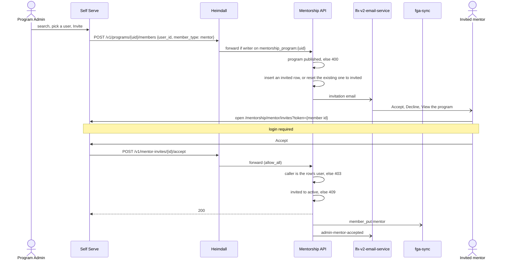
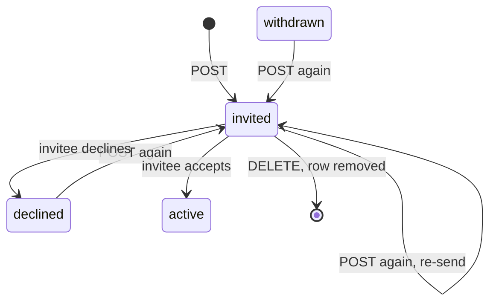

<!-- Copyright The Linux Foundation and each contributor to LFX. -->
<!-- SPDX-License-Identifier: MIT -->

# Mentorship Rewrite — 08: Mentor Invitations

Status: Draft — under discussion (see Decision log)
Related: [04-authorization-model.md](./04-authorization-model.md) (decision 4, AQ-7), [06-route-matrix.md](./06-route-matrix.md) (invite routes), [07-email-delivery.md](./07-email-delivery.md) (email rail, `Notifier`), [01-current-system.md](./01-current-system.md) (legacy platform)
Decision ticket: [linuxfoundation/lfx-self-serve#2187](https://github.com/linuxfoundation/lfx-self-serve/issues/2187)

A Program Admin picks an existing user and invites them to mentor a published program; the mentor accepts or declines from the email. This doc is the design and its decision record; the ticket stays the tracker.

In short:

- The flow `main` already has stays: a `program_members` mentor row in `invited`, matched to the caller by user id, published programs only.
- `main` changes in a few places: the link carries the member row id instead of a signed token, nothing expires, a repeat invite re-sends, the email gets Accept, Decline and View links, and the Program Admin gets a user search to pick from.
- [lfx-v2-invite-service](https://github.com/linuxfoundation/lfx-v2-invite-service) is not used: every invitee already has an account, which is the case it exists for.

## Requirement

One email, three links:

> Michal invited you to join the mentorship program **XXX** as a mentor.
> [Accept the invitation] · [Decline] · [View the program]

- Sent to an **existing user**: anyone with a `users` row, that is, anyone who has signed in to LFX Mentorship or was migrated from legacy.
- Nobody becomes a mentor without explicitly accepting.
- **View the program** links the public program page.
- Feature parity with legacy, plus only the changes under [Deliberate divergences from legacy](#deliberate-divergences-from-legacy).

## Legacy baseline

Source: [jobspring](https://github.com/linuxfoundation/jobspring) (backend) and [lfx-mentorship-upgrade](https://github.com/linuxfoundation/lfx-mentorship-upgrade) (frontend).

| Step | Legacy behaviour | Where |
| --- | --- | --- |
| Invite UI | Mentors tab on the program page: a user picker over the LF-wide user directory (`GET /users/search`, proxied to LF user-service, limited to owners of an approved program to stop PII enumeration, MENV2-1606) plus "+ Invite", disabled until a user is picked. | `src/app/pages/projects/project-detail/mentors-tab/`; `backend/user/service.go` `SearchUsers` |
| Invite API | `POST /projects/{id}/invite-mentors` `{mentors: [{name, email}]}`, program owner only. | `backend/project/transport_http.go`; `backend/project/service.go` `InviteMentorsToProject` |
| Existing mentor profile | Found by `GetProfilesByEmail(email, "mentor")`; the member row is created **already `Approved`**, with no consent step. | `InviteMentorsToProject` |
| No mentor profile | A pending member row is created **by email**, with no user id. | `CreateProjectMemberRecordByEmail` |
| Email | Mandrill `mentor-project-invite`: admin and program names, `CREATE_URL` (`/participate/mentor`, create a mentor profile) and `EDIT_URL`. **No accept or decline link.** The helper that builds `/participate/mentor/join/{id}?token=` and `/decline/{id}?token=` has zero callers. | `backend/email/service.go` `SendMentorInviteEmail`, `getMentorAcceptRejectLink` |
| Accept / decline | `GET /projects/{id}/member/mentor/status?token=` and `.../decline?token=`: login required, signed single-use token, member row found **by the caller's email**, owner emailed (`admin-mentor-accepted` / `admin-mentor-declined`). The member row had no expiry. | `backend/project/transport_http.go`; `backend/project/service_project_member.go` `UpdateProjectMemberByProjectID`; `backend/signing/` |
| Accept / decline pages | `participate/mentor/join/:projectId` and `.../decline/:projectId` read `?token=`, bounce to `/` if not logged in, show the mentor-profile form when the caller has none, then call the routes above. Approval never depended on the profile. | `MentorJoinComponent`, `MentorDeclineComponent` |
| Remove / re-invite | `POST /projects/{id}/remove-mentor` (owner only) deletes the row. No re-send: inviting again created a second pending row and another email. Owners could invite before the program was approved. | `RemoveProgramMentor`; `CreateProjectMemberRecordByEmail`; `InviteMentorsToProject` |

So parity means: the Program Admin picks an **existing account** from a search; login is required to respond; no mentor profile is required to accept; remove exists; nothing expires. Two legacy behaviours are **not** carried over:

- Auto-approving anyone who already had a mentor profile. It contradicts the requirement.
- The email without accept and decline links. The consent flow was built at both ends and never wired; the rewrite wires it.

## Why not lfx-v2-invite-service

[lfx-v2-invite-service](https://github.com/linuxfoundation/lfx-v2-invite-service) exists for invitees without an account: a signed link, sign-up through Auth0 universal login, then a redirect. Every invitee here already has an account. The service also cannot send this email (it sends its own one-link template and does not return the link) and has no decline, so it would add a second rail without removing any Mentorship code. lfx-v2-committee-service, its main consumer, keeps its own invite state, accept, decline and revoke as well.

## Design

### Starting point: `main`

| Area | `main` today | This design |
| --- | --- | --- |
| Invitee | Existing user, by `user_id` | Same |
| Record | `program_members` row, `member_type = mentor`, `status = invited` | Same |
| Program status | `published` only, otherwise 400 | Same |
| Invite route | `POST /v1/programs/{uid}/members` | Same; a repeat call re-sends |
| List | `GET /v1/programs/{uid}/member-management` lists every mentor row, `invited` included | Same |
| Remove | `DELETE /v1/programs/{uid}/members/{memberId}` | Same |
| Finding the invitee | Self Serve picker on a mock BFF route | `GET /v1/programs/{uid}/invitable-users` |
| Link | HMAC token over `(programID, userID)`, 7 days, `MENTOR_INVITE_SECRET` | The member row id; no expiry |
| Accept and decline | Caller must be the user in the token; the row is found by scanning the first 100 members | Caller must be the row's `user_id`; the row is read by id |
| Second invite | Fails on the unique key | Re-sends |
| Unknown invitation | 400 | 404 |
| Consent | A `status` in the create body, or an admin `PATCH` from `invited` to `active`, skips it | Only the invitee moves `invited` to `active` |
| Email | One link, "You have been added as a mentor" | Accept, Decline and View links |
| RuleSet | `mentor-invites/:token/*` | `mentor-invites/:id/*` |

What already matches: accept and decline require login and are `allow_all` at Heimdall with the ownership check in the service (04 AQ-7); accept goes through `UpdateIfStatus`, which queues the `member_put` and the program index refresh; `NotifyAdminMentorAccepted` and `NotifyAdminMentorDeclined` exist; Self Serve's invitee page exists.

### Flow



Decline takes the same path to `declined`, with no tuple, then `admin-mentor-declined`.

### Data

No new table. An invitation is a `program_members` row with `member_type = mentor` and `status = invited`; it has no FGA tuple and no indexer emission (04 decision 4). The unique key `(program_id, user_id, member_type)` allows one row per mentor and program, so a re-invite reuses the row.



`active` becomes `approved` once [linuxfoundation/lfx-mentorship#221](https://github.com/linuxfoundation/lfx-mentorship/pull/221) lands.

### Link

The link carries the member row id (a v4 UUID), not a signed token. Accept and decline already require login and check that the caller is the invited user, so a signature proves nothing the row does not; the status change makes the link single-use. The HMAC helper (`internal/infrastructure/auth/invite_token.go`), `MENTOR_INVITE_SECRET` (chart `values.yaml`, `validate.yaml`) and the service's `inviteSecret` go away. The rewrite is not in production, so links already sent on dev simply stop working; a re-send issues a new one.

There is no expiry. Legacy's member row never expired, an invitation to a program that has since closed cannot be accepted (see API), and the Program Admin can remove an invitation at any time.

### API

| Route | Edge | Does |
| --- | --- | --- |
| `GET /v1/programs/{uid}/invitable-users?search=` | `writer` | New. Users to pick from |
| `POST /v1/programs/{uid}/members` `{user_id, member_type: mentor}` | `writer` | Invite or re-send |
| `GET /v1/programs/{uid}/member-management` | unchanged | Mentor rows, `invited` included |
| `DELETE /v1/programs/{uid}/members/{memberId}` | unchanged | Remove an invitation |
| `POST /v1/mentor-invites/{id}/accept` | `allow_all` | Accept |
| `POST /v1/mentor-invites/{id}/decline` | `allow_all` | Decline |

- **Invitable users.** The program must be `published`, the same check as invite, so only Program Admins of a live program can search, which is the guard legacy added against PII enumeration (MENV2-1606). `search` is required and at least 3 characters; it matches `users.name`, `users.email` and `users.lfid` with `ILIKE`, as `ListMentorManagement` already does, and is paginated with `limit` and `offset`. Each result is `{id, name, email, avatar_url}`, the shape Self Serve's `MentorshipInvitableUser` already expects.
- **Invite.** `user_id` is required (400). A `status` in the body for a mentor is 400: a mentor row is always created as `invited`. `program_admin` rows are unchanged. By the existing mentor row:
  - none: insert as `invited`, then send;
  - `invited`: re-send (07's send is fire-and-forget, so a lost email is a real case);
  - `declined` or `withdrawn`: back to `invited` with `UpdateIfStatus`, then send;
  - `requested` or `pending`: 409, since the mentor already asked to join and the Program Admin approves that request instead;
  - `active`: 409.
- **Consent.** `memberTransitions` drops `invited → active` and `invited → pending`, so a Program Admin's `PATCH` cannot make an invited user a mentor. An admin can still remove the row, or move it to `declined`.
- **Accept and decline.** The row is read by id. No row, or a row that is not a mentor row, is 404 (`ErrProgramMemberNotFound`, as `WithdrawMine` does); this includes a malformed id and an invitation the Program Admin removed. A caller who is not the row's `user_id` is 403. A row no longer `invited` is 409 (`ErrInvalidStateTransition`).
  - **Accept** also needs the program to be `published` (409 otherwise), then `UpdateIfStatus` from `invited` to `active`, where zero rows is 409 (the race guard); the existing update queues `member_put` and the program index refresh. Then `NotifyAdminMentorAccepted`.
  - **Decline** works in any program status, since it creates nothing: `invited` to `declined`, then `NotifyAdminMentorDeclined`.

Each changed route keeps its RuleSet rule; the new search route ships with its rule in the same PR. The chart's single `/mentorship/` HTTPRoute already covers the paths.

### Frontend

Both sides live in Self Serve: [02](./02-target-architecture.md) gives it the authenticated Program Admin and mentor experiences. The Nuxt site only serves the public program page behind the View link.

- **Invitee page.** It already exists: `/mentorship/mentor/invites?token=` ([linuxfoundation/lfx-self-serve#3171](https://github.com/linuxfoundation/lfx-self-serve/pull/3171)), Accept and Decline on one page; both email links open it. `token` now carries the member row id, so [`isMentorshipMentorInviteToken`](https://github.com/linuxfoundation/lfx-self-serve/blob/main/packages/shared/src/utils/mentorship.utils.ts), which only accepts a two-part `header.signature` token, and its tests change to accept a UUID. The page already maps a 403 to "This invitation is for a different account" and a 400 or 409 to "expired or already answered"; a 404 joins the latter. Accept and decline are `POST`s from the page, so mail-client link prefetchers cannot trigger them. After accept: the mentor profile setup page when the user has none, otherwise the mentor dashboard.
- **Program Admin side.** The mentors tab's picker and Invite button exist on a mock `invitable-users` BFF route; the BFF calls the backend search with the program uid instead. Invite calls `POST …/members`. Invited mentors already appear in the tab's list from `member-management`; Resend is the same `POST` for that user and Remove the existing `DELETE`.

### Email

Rendered in this repo and sent through lfx-v2-email-service, per [07](./07-email-delivery.md), to the invitee's `users.email`. That field is caller-writable through `PUT /v1/me`, which does not matter here: it is the invitee's own address, and acceptance is matched by user id, not by address.

```text
Subject: {Inviter} invited you to mentor {Program}

Hi {Name},

{Inviter} invited you to join the mentorship program {Program} as a mentor.

Accept the invitation: {accept_url}
Decline: {decline_url}
View the program: {program_url}

Please log in with the username {LFID} to respond.
```

`{accept_url}` and `{decline_url}` are both `/mentorship/mentor/invites?token={member id}` on Self Serve; `{program_url}` is the public Nuxt program page, always present because only `published` programs can invite. The LFID line exists today and stays, since the invitee must sign in as the invited user.

`Notifier` changes: `NotifyMentorInvited` takes the member row id instead of the token, plus the inviter's user id for the greeting. Accept and decline keep `NotifyAdminMentorAccepted` (`admin-mentor-accepted`) and `NotifyAdminMentorDeclined` (`admin-mentor-declined`).

### Legacy invitations

Not migrated and not re-sent. The legacy email had no accept or decline link, so no outstanding invitation could be acted on, and the source cannot tell a pending invitation from a pending mentor application ([03](./03-migration-plan.md), open question on pending mentor rows). The ETL keeps skipping these rows (`UNMAPPED_MENTOR_MEMBER`) into the triage report 03 requires, and Program Admins re-invite. Every legacy user is migrated to `users`, so a legacy mentor can be found and re-invited.

## Answers to the ticket

| # | Question in [#2187](https://github.com/linuxfoundation/lfx-self-serve/issues/2187) | Answer |
| --- | --- | --- |
| 1 | Pending-invite representation | A `program_members` mentor row in `invited`, with no FGA tuple or indexer emission (04 decision 4), listed in Self Serve's mentors tab, not in Pending Actions. See Data. |
| 2 | Accept authorization | `allow_all` at Heimdall; the service checks the row is an `invited` mentor row whose `user_id` is the caller (AQ-7 as written). See API. |
| 3 | Account-less invitees | Not supported. Only existing users are invited; someone new to LFX Mentorship signs in once, then the Program Admin can find them. |

## Follow-up changes once approved

- **03**: the open question on pending mentor rows: the invitation half is settled here (see Legacy invitations); classifying genuine mentor applications stays open.
- **04**: AQ-7 wording, "user named in the signed invitation token" → "user on the invitation row"; "signed token" → "member row id". Decision 4 and the lifecycle table are unchanged.
- **05**: the invite-routes note: the link carries the member row id, and the invitation token no longer survives as an exception.
- **06**: invite routes: `{token}` → `{id}`, the check compares the caller with the row's `user_id`; add `GET /v1/programs/{uid}/invitable-users` (`writer`); `POST /v1/programs/{uid}/members` re-sends on a repeat call.
- **07**: `mentor-project-invite` row: three links, the link carries the member row id.
- **Spec 001** ([`specs/001-mentorship-core-workflow/spec.md`](../../specs/001-mentorship-core-workflow/spec.md)): scenarios 10 and 11 and FR-019: the link carries the member row id, a repeat invite re-sends; the edge case on an expired token is answered: invitations do not expire.
- **Backend chart**: drop `MENTOR_INVITE_SECRET` from `values.yaml` and `validate.yaml`; RuleSet paths `mentor-invites/:token/*` → `:id`; add the `invitable-users` rule.
- **Self Serve**: `isMentorshipMentorInviteToken` and its tests accept a UUID; the invite page shows a 404 as "expired or already answered"; the `invitable-users` BFF route calls the backend with the program uid.

## Deliberate divergences from legacy

- No auto-approval of existing mentors. Everyone accepts.
- Only users of LFX Mentorship can be invited. Legacy's picker searched every LF account; v2 has no directory search, so someone with an LF account who has never used Mentorship signs in once first. Every legacy user is migrated, so nobody who used legacy is affected.
- Published programs only. Legacy let owners invite before approval; since anyone can create a program, that would let anyone email any user.
- No signed token. The link carries the member row id; login plus the user id check is the guard.
- In-place re-send. Legacy created a second row and another email.
- Outstanding legacy invitations are dropped at cutover (see Legacy invitations).

## Open questions

- Does any program need mentors attached before it is approved? Legacy allowed it; this design does not. If yes, revisit published-only for invites.

## Decision log

| Date | Event |
| --- | --- |
| 2026-09-04 | [#2187](https://github.com/linuxfoundation/lfx-self-serve/issues/2187) opened. Recommended direction at the time: own the invite resource, reuse the rails (`mentorship_invite` FGA type mirroring `committee_invite`, LFID invite JWT for the account leg). |
| 2026-09-14 | AQ-7 resolved in [04](./04-authorization-model.md) ([ca701d0](https://github.com/linuxfoundation/lfx-mentorship/commit/ca701d0)): `allow_all` plus signed token; `mentorship_invite` FGA type rejected. Contradicts the ticket's recommended direction; the ticket was not updated. |
| 2026-09-22 | [07](./07-email-delivery.md) approved ([#2188](https://github.com/linuxfoundation/lfx-self-serve/issues/2188)): email via lfx-v2-email-service, templates owned here. |
| 2026-09-24 | This doc opened. Legacy flow researched in jobspring and lfx-mentorship-upgrade. Requirement fixed as the three-link email. lfx-v2-invite-service evaluated: cannot produce the email or a decline; set aside. Option C recorded. Status: Draft. |
| 2026-09-30 | Reviewed against the platform rules, the legacy code, lfx-v2-invite-service, lfx-v2-committee-service and Self Serve. Changes: no signed token, the link carries the invitation id; caller email from the Heimdall `email` claim with a stored-row fallback, no `email_verified` (none exists downstream); a repeat `POST` is the re-send, `DELETE` is remove, `revoked` dropped; conditional update as the race guard; email normalised at creation; both pages move to Self Serve, one invitee page; the management list stays service-side as a nested edge-authorised list; legacy baseline corrected (`admin-mentor-declined`, profile never gated approval, no expiry or re-send). Open questions resolved. |
| 2026-10-01 | Review on [linuxfoundation/lfx-mentorship#177](https://github.com/linuxfoundation/lfx-mentorship/pull/177). Changes: the `users.email` fallback is replaced by an lfx-v2-auth-service lookup, because `PUT /v1/me` lets the caller set that field; `GET /v1/mentor-invites/{id}` runs the email check; an `accepted` invitation blocks a new one only while that user is an active mentor; `POST /v1/programs/{uid}/members` accepts only `program_admin`; the existing `NotifyAdminMentorAccepted` and `NotifyAdminMentorDeclined` are reused; Self Serve's existing invite page ([linuxfoundation/lfx-self-serve#3171](https://github.com/linuxfoundation/lfx-self-serve/pull/3171)) is reused with the invitation id in `token`, and the `?action=` preselect is dropped; the `mentor-invites` rule enables the OIDC contextualizer, so a just-registered invitee who is not yet in lfx-v2-auth-service can still accept. |
| 2026-10-02 | Doc tightened for readability; no design change beyond two review fixes on [linuxfoundation/lfx-mentorship#177](https://github.com/linuxfoundation/lfx-mentorship/pull/177): `DELETE` matches `program_id` as well as `id` (04's parent-child invariant), and Self Serve's `isMentorshipMentorInviteToken` must accept a UUID, since the page's other parts stay. Added why extending lfx-v2-invite-service costs more than the Mentorship-owned design. Resolved open questions folded into the design. |
| 2026-10-02 | Second review round on [linuxfoundation/lfx-mentorship#177](https://github.com/linuxfoundation/lfx-mentorship/pull/177). `GET /v1/mentor-invites/{id}` dropped: Self Serve's invite page never calls it and already handles every outcome after the click. Accept sets `accepted_user_id` and both responses set `responded_at`; `status` gets a CHECK constraint; create rejects a missing name or invalid email with 400; the self-request path and `member-management` are named alongside the new routes; no HTTPRoute per route (the chart has one prefix route); spec 001 added to the follow-ups; timestamps follow the schema convention (`created_on`, `updated_on` with the shared trigger). Flow and status diagrams added; accept also queues the program index refresh, as every active-mentor change does. |
| 2026-10-02 | Third review round on [linuxfoundation/lfx-mentorship#177](https://github.com/linuxfoundation/lfx-mentorship/pull/177). Create and accept return 409 for a `rejected` or `archived` program; decline works in any status. Accept or decline of an unknown or removed invitation is 404 (`ErrMentorInvitationNotFound`), a malformed id 400, and Self Serve shows the 404 as expired. Create and re-send are one `INSERT … ON CONFLICT` on the partial index, so concurrent first sends converge. Stated that Self Serve's BFF already provisions a new invitee's `users` row (`PUT /v1/me` on the not-provisioned 401, then a retry). Legacy pending invitations are dropped, neither migrated nor re-sent; 03 and 05 added to the follow-ups. Line references replaced by symbols. The accepted mentor row is stored as `active` until [linuxfoundation/lfx-mentorship#221](https://github.com/linuxfoundation/lfx-mentorship/pull/221) renames it `approved`. |
| 2026-10-05 | Simplified after [Lewis Ojile's comparison with `main`](https://linuxfoundation.slack.com/archives/C0BK7NQ3Q6Q/p1791217342576309) and a parity re-check of jobspring and lfx-mentorship-upgrade: legacy's picker only offered existing LF accounts, so invitations go to existing users by `user_id`, as `main` already does. Dropped: the `mentor_invitations` table (back to the `program_members` row in `invited`), invitation by email and the caller-identity design (Heimdall `email` claim, OIDC contextualizer, lfx-v2-auth-service fallback), expiry (legacy rows never expired), and inviting before `published` (anyone can create a program). Kept from earlier rounds: an id instead of an HMAC token in the link (now the member row id), re-send by repeating the `POST`, 404 for an unknown invitation, the three-link email. Added: `GET /v1/programs/{uid}/invitable-users` for the picker; only the invitee moves `invited` to `active`. |
