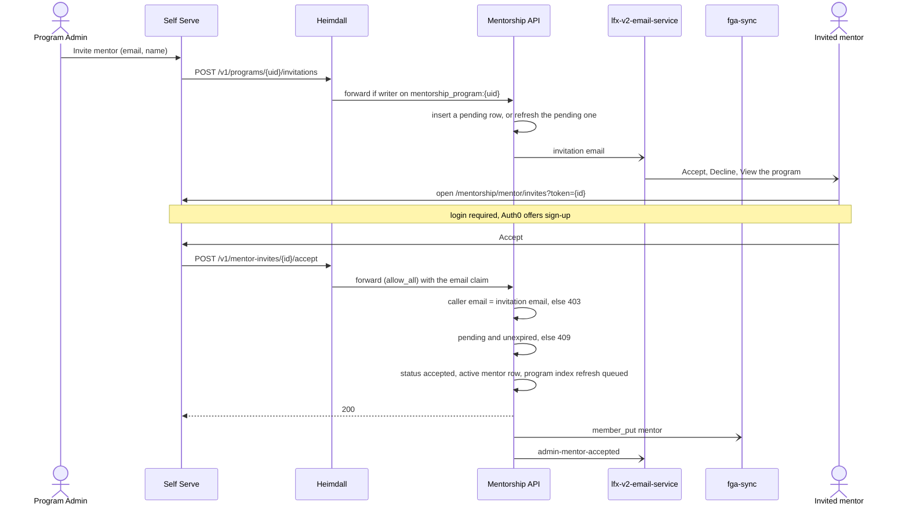
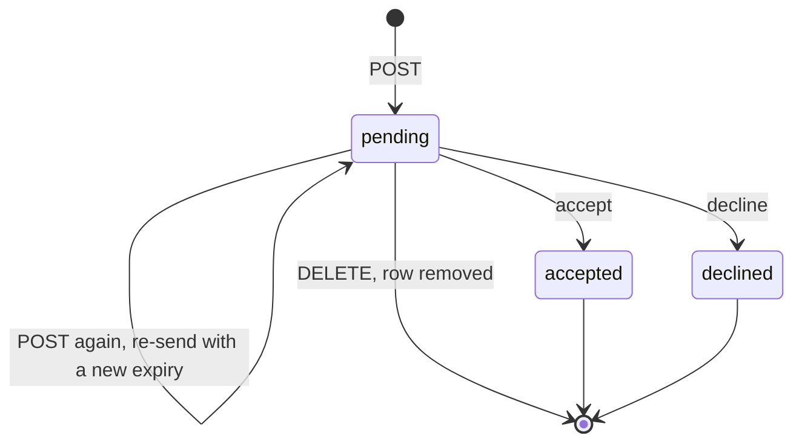

<!-- Copyright The Linux Foundation and each contributor to LFX. -->
<!-- SPDX-License-Identifier: MIT -->

# Mentorship Rewrite — 08: Mentor Invitations

Status: Draft — under discussion (see Decision log)
Related: [04-authorization-model.md](./04-authorization-model.md) (decision 4, AQ-7), [06-route-matrix.md](./06-route-matrix.md) (invite routes), [07-email-delivery.md](./07-email-delivery.md) (email rail, `Notifier`), [01-current-system.md](./01-current-system.md) (legacy platform)
Decision ticket: [linuxfoundation/lfx-self-serve#2187](https://github.com/linuxfoundation/lfx-self-serve/issues/2187)

A Program Admin invites a mentor by email, and the mentor accepts or declines from that email. This doc is the design and its decision record; the ticket stays the tracker.

In short:

- Mentorship owns the flow: a `mentor_invitations` row, an email sent through lfx-v2-email-service, and Self Serve's existing invitee page.
- The email link carries the invitation id. Accept and decline require login and a match between the caller's email and the invitation.
- [lfx-v2-invite-service](https://github.com/linuxfoundation/lfx-v2-invite-service) is not used. It cannot send this email or record a decline, and extending it costs more than this design.

## Requirement

One email, three links:

> Michal invited you to join the mentorship program **XXX** as a mentor.
> [Accept the invitation] · [Decline] · [View the program]

- Sent to an **email address**. The invitee need not have an LFX account or have ever used Mentorship.
- Nobody becomes a mentor without explicitly accepting.
- **View the program** links the public program page and appears only when the program is `published`.
- Feature parity with legacy, plus only the changes under [Deliberate divergences from legacy](#deliberate-divergences-from-legacy).

## Legacy baseline

Source: [jobspring](https://github.com/linuxfoundation/jobspring) (backend) and [lfx-mentorship-upgrade](https://github.com/linuxfoundation/lfx-mentorship-upgrade) (frontend).

| Step | Legacy behaviour | Where |
| --- | --- | --- |
| Invite UI | Mentors tab on the program page: a user picker (`GET /users/search`, limited to owners of an approved program to stop PII enumeration, MENV2-1606) plus "+ Invite", sending `{name, email}` per mentor. | `src/app/pages/projects/project-detail/mentors-tab/`; `backend/user/service.go` `SearchUsers` |
| Invite API | `POST /projects/{id}/invite-mentors` `{mentors: [{name, email}]}`, program owner only. | `backend/project/transport_http.go`; `backend/project/service.go` `InviteMentorsToProject` |
| Existing mentor profile | Found by `GetProfilesByEmail(email, "mentor")`; the member row is created **already `Approved`**, with no consent step. | `InviteMentorsToProject` |
| No mentor profile | A pending member row is created **by email**, with no user id. | `CreateProjectMemberRecordByEmail` |
| Email | Mandrill `mentor-project-invite`: admin and program names, `CREATE_URL` (`/participate/mentor`, create a mentor profile) and `EDIT_URL`. **No accept or decline link.** The helper that builds `/participate/mentor/join/{id}?token=` and `/decline/{id}?token=` has zero callers. | `backend/email/service.go` `SendMentorInviteEmail`, `getMentorAcceptRejectLink` |
| Accept / decline | `GET /projects/{id}/member/mentor/status?token=` and `.../decline?token=`: login required, signed single-use token, member row found **by the caller's email**, owner emailed (`admin-mentor-accepted` / `admin-mentor-declined`). The member row had no expiry. | `backend/project/transport_http.go`; `backend/project/service_project_member.go` `UpdateProjectMemberByProjectID`; `backend/signing/` |
| Accept / decline pages | `participate/mentor/join/:projectId` and `.../decline/:projectId` read `?token=`, bounce to `/` if not logged in, show the mentor-profile form when the caller has none, then call the routes above. Approval never depended on the profile. | `MentorJoinComponent`, `MentorDeclineComponent` |
| Remove / re-invite | `POST /projects/{id}/remove-mentor` (owner only) deletes the row. No re-send: inviting again created a second pending row and another email. Owners could invite before the program was approved. | `RemoveProgramMentor`; `CreateProjectMemberRecordByEmail`; `InviteMentorsToProject` |

So parity means: invite by **email**, since the recipient may have no account; login plus an **email match** on accept and decline, with a single-use link; no mentor profile required to accept; remove exists, while re-send, revoke and expiry did not. Two legacy behaviours are **not** carried over:

- Auto-approving anyone who already had a mentor profile. It contradicts the requirement.
- The email without accept and decline links. The consent flow was built at both ends and never wired; the rewrite wires it.

## Where the rewrite stands

- `POST /v1/programs/{uid}/members` with `member_type=mentor` creates a `program_members` row with status `invited`, mints an HMAC token over `(programID, userID)` (`internal/infrastructure/auth/invite_token.go`, 7-day TTL, `MENTOR_INVITE_SECRET`) and calls `Notifier.NotifyMentorInvited`. That sends `mentor-project-invite` through lfx-v2-email-service when NATS is configured (`NewServer` in `cmd/mentorship-api/server.go`, `email.Notifier`) and only logs it otherwise (`NewLogNotifier`).
- `POST /v1/mentor-invites/{token}/accept|decline` (`mentorInviteH` in `server.go`) validate the token and require the caller to be the `userID` it names (`ProgramMemberService.AcceptInvite`, `DeclineInvite`).
- **Blocker:** `program_members.user_id` is `NOT NULL REFERENCES users` (`001_initial.up.sql`), and `ProgramMemberService.Create` rejects a missing `user_id`. A `users` row exists only after a person's first `PUT /v1/me` (`UserService.Bootstrap`); until then the `requireGatewayPrincipal` middleware answers every other route with 401 "local user is not provisioned". v2 has no user directory or search. The current flow can only invite people who already used the new platform, so it cannot send a real invitation.
- [04](./04-authorization-model.md) decision 4 and AQ-7 (resolved 2026-09-14, [ca701d0](https://github.com/linuxfoundation/lfx-mentorship/commit/ca701d0)) settled that pending invitations have no FGA presence, and that accept is `allow_all` at the edge with a service-side ownership check; a `mentorship_invite` FGA type mirroring `committee_invite` was rejected. The ticket's recommended direction (that FGA type plus the LFID invite JWT) predates this; this doc follows 04.

## Why not lfx-v2-invite-service

[lfx-v2-invite-service](https://github.com/linuxfoundation/lfx-v2-invite-service) is the platform rail the ticket points at. It gives a signed, expiring link (HS256 JWT, 30 days by default, 90 at most) and handles the account-less invitee (Self Serve's `/invite?token=` requires login, Auth0 universal login offers sign-up, then it redirects to `return_url`). It cannot:

- **Send our email.** It sends its own fixed one-link template ("Accept invitation: {ReturnURL}"), and `send_invite` returns `{uid, email, expires_at}`, not the link.
- **Decline, revoke or re-send.** Statuses are `pending` and `accepted` only; the `InviteRevokedSubject` constant is never published.
- **Show the invitee their invitation.** The generic `/invite` route only redirects; the pending-invitations view is committee-only.

- **A — use it as it is.** The invitee gets the generic one-link email, logs in, and lands on a Mentorship page with Accept, Decline and View: two clicks, email copy we do not own, and Decline still needs our own invitation row and routes.
- **B — use it only to mint the link.** Needs an invite-service change (return the link, suppress its email) and leaves two token formats and an `lfx.invite.accepted` subscription, all for one link.
- **C — Mentorship-owned.** One invitation row, one email via lfx-v2-email-service, one page in Self Serve.

**Extending it costs more than building here.** It would need decline, revoke, re-send, list-by-resource and a returned link or caller-owned email, built as generic platform features in a service another team owns, with cross-team review and two deploys per change. Its main consumer does not lean on it for this either: lfx-v2-committee-service keeps invite state, accept, decline, revoke and expiry itself, and uses the invite service only for the email and the `lfx.invite-service.invite_accepted` event that reports a new LFID ([invite-application-invariants.md](https://github.com/linuxfoundation/lfx-v2-committee-service/blob/main/.claude/skills/committee-service-dev/references/invite-application-invariants.md)). C is one table, five routes and one template in this repo, changed and deployed together. Revisit if the platform adds decline and custom templates, or a second product needs the same flow.

**Decision: C.** The account-less leg needs nothing from the invite service: our page requires login and Auth0 universal login handles sign-up, as Self Serve's committee invite page does. The costs: Mentorship keeps its own invitation table, and mentorship invitations do not appear in Self Serve's Pending Actions widget (today only committee invitations do).

## Design

### Flow



Decline takes the same path: `status = 'declined'`, no `program_members` row, then `admin-mentor-declined`. lfx-v2-invite-service is not involved.

### Data

New table `mentor_invitations`:

| Column | Notes |
| --- | --- |
| `id` | UUID v4; also the credential in the email link (see Link) |
| `program_id` | FK `programs` `ON DELETE CASCADE`, as `program_members` |
| `email`, `name` | `email` trimmed and lower-cased; `name` as entered by the Program Admin |
| `invited_by` | FK `users` (the Program Admin) |
| `status` | `pending` \| `accepted` \| `declined`, with a matching CHECK constraint; a named string type with `IsValid()`, per Code Style |
| `expires_at` | 30 days from creation; a repeat invite refreshes it |
| `accepted_user_id` | FK `users`, set on accept |
| `created_on`, `updated_on` | As every table; the shared `set_updated_on` trigger maintains `updated_on`, so it also records re-sends |
| `responded_at` | Set on accept or decline |



Expired is not a status: a `pending` row past `expires_at` cannot be accepted or declined (409) until a re-send refreshes it.

A partial unique index on `(program_id, email) WHERE status = 'pending'` allows one open invitation per address per program. Only `pending` rows are indexed, so `declined` and `accepted` rows never block at this level; the `accepted` rule belongs to Create (see API), and the next `POST` refreshes an expired `pending` row in place.

**Why not `program_members.status = 'invited'` plus its `email` column:** `user_id NOT NULL REFERENCES users` is the constraint that makes the current flow unusable. Loosening it would make every roster query handle null users and stop the unique key deduplicating invites. `program_members` stays "people in the program"; an invitation is a proposal to join, with no FGA tuple and no indexer emission (04 decision 4). `program_members.status = 'invited'` becomes unused; dropping it from the CHECK constraint is a follow-up.

### Link

The link carries the invitation `id`, not a signed token. Accept and decline already require login and an email match, so a signature would prove nothing the row does not. A v4 UUID is not guessable, expiry lives on the row, and the status change makes the link single-use; lfx-v2-committee-service's accept route takes the invite UID the same way. The HMAC helper (`internal/infrastructure/auth/invite_token.go`) and `MENTOR_INVITE_SECRET` (chart `values.yaml`, `validate.yaml`) go away. TTL is 30 days, the invite service's default; the current 7 days is short for a volunteer mentor. The rewrite is not in production, so no HMAC link has to keep working: links already sent on dev stop working, and dev's `invited` rows are deleted when `invited` leaves the CHECK constraint.

### API

All routes require login. The three program routes check `writer` on `mentorship_program:{uid}` at Heimdall. The two invitee routes are `allow_all` at the edge and run the email check in the service.

| Route | Edge | Does |
| --- | --- | --- |
| `POST /v1/programs/{uid}/invitations` `{email, name}` | `writer` | Create or re-send |
| `GET /v1/programs/{uid}/invitations` | `writer` | Management list |
| `DELETE /v1/programs/{uid}/invitations/{id}` | `writer` | Remove a `pending` invitation (legacy `remove-mentor`) |
| `POST /v1/mentor-invites/{id}/accept` | `allow_all` | Accept |
| `POST /v1/mentor-invites/{id}/decline` | `allow_all` | Decline |

- **Create or re-send**, by the trimmed, lower-cased email. A missing `name` or an invalid address is 400 (`ErrInvalidInput`), since the send is fire-and-forget and such a row could never be delivered or accepted. A `rejected` or `archived` program is 409 (`ErrInvalidStateTransition`). Then:
  - an `accepted` row whose `accepted_user_id` is still an active mentor of the program: 409;
  - otherwise one statement, `INSERT … ON CONFLICT (program_id, email) WHERE status = 'pending' DO UPDATE SET expires_at = …, name = EXCLUDED.name, invited_by = EXCLUDED.invited_by`, then send. With no `pending` row it inserts; with one it refreshes the row and re-sends, which also revives an expired invitation and is needed from day one because 07's send is fire-and-forget. Two concurrent first `POST`s converge on one row instead of one getting a 409.

  Inviting before the program is `published` is allowed, as in legacy; the email then omits the View link.
- **Mentor entry points.** `POST /v1/programs/{uid}/members` accepts only `member_type=program_admin` and returns 400 for `mentor`. A mentor joins only with their consent: an accepted invitation, an accepted mentor application, or a self-request (`POST /v1/me/program-memberships`) that a Program Admin approves, which is unchanged.
- **List.** A nested, edge-authorised list stays service-side, like `GET /v1/programs/{uid}/members`; the Query Service rule in [06](./06-route-matrix.md) covers caller-owned collections. It returns invitations only. `GET /v1/programs/{uid}/member-management` keeps listing the program's mentor rows (requested, active and so on); `invited` rows drop out of it because none are written any more.
- **Remove.** `DELETE … WHERE id = $id AND program_id = $uid AND status = 'pending'`. Matching on `program_id` is 04's parent-child invariant: the edge checked `writer` on the program in the path, so a `writer` on one program must not reach another program's invitation. Zero rows: 404 when the program has no invitation with that id, 409 when it is no longer `pending`.
- **Unknown invitation** (accept and decline). No row with that id, including one a Program Admin removed, is 404 (`ErrMentorInvitationNotFound`, a new per-entity sentinel mapped in `respond.go`); an id that is not a UUID is 400.
- **Email check** (accept and decline). The caller's email (see Caller identity) must equal `row.email`, case-insensitively, or the route returns 403.
- **Accept.** 409 (`ErrInvalidStateTransition`) when the program is `rejected` or `archived`. Then, in one transaction: `UPDATE … SET status = 'accepted', accepted_user_id = $caller, responded_at = now() WHERE id = $1 AND status = 'pending' AND expires_at > now()`, where zero rows is 409 (the race guard); upsert the `program_members` mentor row as `active` (same path as `ensureAcceptedMentorMembership`, `application_repository.go:660`); emit `member_put` for `mentor`; queue the program index refresh (`enqueueProgramIndexByID`), as every active-mentor change does. Then `NotifyAdminMentorAccepted`.
- **Decline.** The same conditional update with `status = 'declined', responded_at = now()`, then `NotifyAdminMentorDeclined`. Allowed in any program status, since it creates nothing.

Each new route ships with its RuleSet rule in the same PR. The chart's single `/mentorship/` HTTPRoute already covers the paths.

### Caller identity

The AQ-7 shape stays (`allow_all` at the edge, ownership in the service), but the subject is the email on the row, not a `userID`, because there is no user at invite time. The caller's email comes from:

1. **The Heimdall `email` claim.** Heimdall fills it only from a verified source, and no `email_verified` claim exists downstream, so there is nothing more to check (platform rule). The claim is present only when the rule runs the OIDC contextualizer, so the `mentor-invites` rule enables `oidc_contextualizer` behind a chart value, as lfx-v2-committee-service does (`app.use_oidc_contextualizer`). It matters most for a just-registered invitee, who can take a while to reach lfx-v2-auth-service.
2. **lfx-v2-auth-service, when the claim is missing** (an environment without the contextualizer): the principal's primary email, over the NATS connection the service already holds.

Never `users.email`, which the caller can set through `PUT /v1/me`. lfx-v2-committee-service's `resolveCallerEmail` uses the same two sources in the other order: auth-service first, the claim when auth-service does not know the user yet.

### Frontend

Both sides live in Self Serve: [02](./02-target-architecture.md) gives it the authenticated Program Admin and mentor experiences, and it already hosts mentor profile registration ([linuxfoundation/lfx-self-serve#3148](https://github.com/linuxfoundation/lfx-self-serve/pull/3148)) and the committee invite page. The Nuxt site only serves the public program page behind the View link.

- **Invitee page.** It already exists: `/mentorship/mentor/invites?token=` ([linuxfoundation/lfx-self-serve#3171](https://github.com/linuxfoundation/lfx-self-serve/pull/3171)), with Accept and Decline on one page; both email links open it. The `token` parameter now carries the invitation id. The page, its BFF routes and the telemetry redaction of `token=` stay; [`isMentorshipMentorInviteToken`](https://github.com/linuxfoundation/lfx-self-serve/blob/main/packages/shared/src/utils/mentorship.utils.ts), which only accepts a two-part `header.signature` token, and its tests change to accept a UUID. Login required; Auth0 universal login offers sign-up. The page reads nothing before the click: the email names the program, and it already maps a 403 and a 400 or 409 to its "different account" and "expired or already answered" states, so there is no `GET` for the invitation. A 404, an invitation the Program Admin removed, falls to the page's generic error today and moves to "expired or already answered".
- **Provisioning.** The page's BFF calls go through `proxyMentorshipRequest`, which answers the "local user is not provisioned" 401 by calling `PUT /v1/me` and retrying once. A just-registered invitee therefore has a `users` row before accept or decline runs, which `accepted_user_id`, the mentor row and the admin emails need. A 401 that survives the retry shows the generic error state, never "different account".
- Accept and decline are `POST`s from the page, so mail-client link prefetchers cannot trigger them.
- A 403 shows the page's existing "This invitation is for a different account" state, which asks the invitee to sign in with the invited address, plus a new sign-out link. The page never shows the invited address.
- After accept: the mentor profile setup page when the user has none, otherwise the mentor dashboard. As in legacy, approval does not depend on the profile.
- **Program Admin side.** The mentors tab of the admin program-detail page replaces its user-picker placeholder (and the mock `invitable-users` BFF route behind it) with an "Invite mentor" form (email, name) and, beside the mentor list it loads from `member-management`, a pending-invitations list with Resend (the same `POST`) and Remove (`DELETE`).

### Email

Rendered in this repo and sent through lfx-v2-email-service, per [07](./07-email-delivery.md).

```text
Subject: {Inviter} invited you to mentor {Program}

Hi {Name},

{Inviter} invited you to join the mentorship program {Program} as a mentor.

Accept the invitation: {accept_url}
Decline: {decline_url}
View the program: {program_url}          ← only when the program is published

This invitation expires on {expires_at}.
```

`{accept_url}` and `{decline_url}` are both the Self Serve invitation page, `/mentorship/mentor/invites?token={id}`; `{program_url}` is the public Nuxt program page.

`Notifier` changes: `NotifyMentorInvited(ctx, invitation)` replaces `(ctx, programID, userID, token)` and takes over the legacy `mentor-project-invite` slot in 07's mapping. Accept and decline call the existing `NotifyAdminMentorAccepted` (`admin-mentor-accepted`) and `NotifyAdminMentorDeclined` (`admin-mentor-declined`); no new method.

### Legacy invitations

Not migrated and not re-sent. The legacy email had no accept or decline link, so no outstanding invitation could be acted on, and the source cannot tell a pending invitation from a pending mentor application ([03](./03-migration-plan.md), open question on pending mentor rows). The ETL keeps skipping these rows (`UNMAPPED_MENTOR_MEMBER`) into the triage report 03 requires, and Program Admins re-invite from the new form. Re-sending automatically would email people who applied as well as people who were invited.

## Answers to the ticket

| # | Question in [#2187](https://github.com/linuxfoundation/lfx-self-serve/issues/2187) | Answer |
| --- | --- | --- |
| 1 | Pending-invite representation | A `mentor_invitations` row with no FGA type or indexer emission (04 decision 4), listed in Self Serve's mentors tab, not in Pending Actions. See Data. |
| 2 | Accept authorization | `allow_all` at Heimdall; the service checks the row is `pending`, unexpired and addressed to the caller's email. See API and Caller identity. |
| 3 | Account-less invitees | Login-required Self Serve page; Auth0 universal login handles sign-up. See Frontend. |

## Follow-up changes once approved

- **03**: the open question on pending mentor rows: the invitation half is settled here (see Legacy invitations); classifying genuine mentor applications stays open.
- **04**: decision 4 and AQ-7 wording, "user named in the signed invitation token" → "email recorded on the invitation", "signed token" → "invitation id". Lifecycle table unchanged (`member_put` on accept).
- **06**: invite routes section: the two `{token}` routes become the two `{id}` routes above; add the three `programs/{uid}/invitations` routes; `POST /v1/programs/{uid}/members` accepts only `member_type=program_admin` (400 for `mentor`).
- **05**: the invite-routes note in the route-matrix paragraph: the service rejects a caller whose email does not match the invitation, not one the token does not name, and the invitation token no longer survives as an exception; the link carries the invitation id.
- **07**: `Notifier` mapping — `NotifyMentorInvited(invitation)` → this email, its link now `/mentorship/mentor/invites?token={id}`; `NotifyAdminMentorAccepted` and `NotifyAdminMentorDeclined` move to the `{id}` routes unchanged.
- **Spec 001** ([`specs/001-mentorship-core-workflow/spec.md`](../../specs/001-mentorship-core-workflow/spec.md)): rewrite scenarios 10 and 11 to this flow (invite by email and name in any program status except `rejected` and `archived`, a `mentor_invitations` row, accept or decline through the invitation). Scenario 12, the self-request, is unchanged.
- **Backend chart**: drop `MENTOR_INVITE_SECRET` from `values.yaml` and `validate.yaml`; RuleSet paths `mentor-invites/:token/*` → `:id`; the `mentor-invites` rule gains `oidc_contextualizer` behind a chart value.
- **Self Serve**: `isMentorshipMentorInviteToken` and its tests accept a UUID; the invite page's forbidden state gains a sign-out link, and a 404 shows its "expired or already answered" state; the mentor programs list stops marking invited programs from `invited` membership rows (`invitedProgramIds`), since those rows are no longer written.

## Deliberate divergences from legacy

- No auto-approval of existing mentors. Everyone accepts.
- No user picker. Legacy's mentors tab searched existing users (`GET /users/search`); the Program Admin now types an email and name, which also reaches invitees with no account. v2 has no user directory to search.
- No signed token. The link carries the invitation id; login plus email match is the guard.
- Outstanding legacy invitations are dropped at cutover (see Legacy invitations).
- 30-day expiry and in-place re-send. Legacy had neither; re-inviting created a second row. Current rewrite code: 7 days.
- The match is against one address: the Heimdall claim, or the auth-service primary email when the claim is absent. Matching any of an account's addresses is a follow-up; until then the Program Admin re-invites the address the mentor signs in with.

## Open questions

None. The three raised on 2026-09-24 were resolved on 2026-09-30 and are in the design: strict email match with a sign-out link, as in legacy; re-send and remove in the first cut, with no `revoked` status; inviting before `published` allowed, without the View link.

## Decision log

| Date | Event |
| --- | --- |
| 2026-09-04 | [#2187](https://github.com/linuxfoundation/lfx-self-serve/issues/2187) opened. Recommended direction at the time: own the invite resource, reuse the rails (`mentorship_invite` FGA type mirroring `committee_invite`, LFID invite JWT for the account leg). |
| 2026-09-14 | AQ-7 resolved in [04](./04-authorization-model.md) ([ca701d0](https://github.com/linuxfoundation/lfx-mentorship/commit/ca701d0)): `allow_all` plus signed token; `mentorship_invite` FGA type rejected. Contradicts the ticket's recommended direction; the ticket was not updated. |
| 2026-09-22 | [07](./07-email-delivery.md) approved ([#2188](https://github.com/linuxfoundation/lfx-self-serve/issues/2188)): email via lfx-v2-email-service, templates owned here. |
| 2026-09-24 | This doc opened. Legacy flow researched in jobspring and lfx-mentorship-upgrade. Requirement fixed as the three-link email. lfx-v2-invite-service evaluated: cannot produce the email or a decline; set aside. Option C recorded. Status: Draft. |
| 2026-09-30 | Reviewed against the platform rules, the legacy code, lfx-v2-invite-service, lfx-v2-committee-service and Self Serve. Changes: no signed token, the link carries the invitation id; caller email from the Heimdall `email` claim with a stored-row fallback, no `email_verified` (none exists downstream); a repeat `POST` is the re-send, `DELETE` is remove, `revoked` dropped; conditional update as the race guard; email normalised at creation; both pages move to Self Serve, one invitee page; the management list stays service-side as a nested edge-authorised list; legacy baseline corrected (`admin-mentor-declined`, profile never gated approval, no expiry or re-send). Open questions resolved. |
| 2026-10-01 | Review on [linuxfoundation/lfx-mentorship#177](https://github.com/linuxfoundation/lfx-mentorship/pull/177). Changes: the `users.email` fallback is replaced by an lfx-v2-auth-service lookup, because `PUT /v1/me` lets the caller set that field; `GET /v1/mentor-invites/{id}` runs the email check; an `accepted` invitation blocks a new one only while that user is an active mentor; `POST /v1/programs/{uid}/members` accepts only `program_admin`; the existing `NotifyAdminMentorAccepted` and `NotifyAdminMentorDeclined` are reused; Self Serve's existing invite page ([linuxfoundation/lfx-self-serve#3171](https://github.com/linuxfoundation/lfx-self-serve/pull/3171)) is reused with the invitation id in `token`, and the `?action=` preselect is dropped; the `mentor-invites` rule enables the OIDC contextualizer, so a just-registered invitee who is not yet in lfx-v2-auth-service can still accept. |
| 2026-10-02 | Doc tightened for readability; no design change beyond two review fixes on [linuxfoundation/lfx-mentorship#177](https://github.com/linuxfoundation/lfx-mentorship/pull/177): `DELETE` matches `program_id` as well as `id` (04's parent-child invariant), and Self Serve's `isMentorshipMentorInviteToken` must accept a UUID, since the page's other parts stay. Added why extending lfx-v2-invite-service costs more than the Mentorship-owned design. Resolved open questions folded into the design. |
| 2026-10-02 | Second review round on [linuxfoundation/lfx-mentorship#177](https://github.com/linuxfoundation/lfx-mentorship/pull/177). `GET /v1/mentor-invites/{id}` dropped: Self Serve's invite page never calls it and already handles every outcome after the click. Accept sets `accepted_user_id` and both responses set `responded_at`; `status` gets a CHECK constraint; create rejects a missing name or invalid email with 400; the self-request path and `member-management` are named alongside the new routes; no HTTPRoute per route (the chart has one prefix route); spec 001 added to the follow-ups; timestamps follow the schema convention (`created_on`, `updated_on` with the shared trigger). Flow and status diagrams added; accept also queues the program index refresh, as every active-mentor change does. |
| 2026-10-02 | Third review round on [linuxfoundation/lfx-mentorship#177](https://github.com/linuxfoundation/lfx-mentorship/pull/177). Create and accept return 409 for a `rejected` or `archived` program; decline works in any status. Accept or decline of an unknown or removed invitation is 404 (`ErrMentorInvitationNotFound`), a malformed id 400, and Self Serve shows the 404 as expired. Create and re-send are one `INSERT … ON CONFLICT` on the partial index, so concurrent first sends converge. Stated that Self Serve's BFF already provisions a new invitee's `users` row (`PUT /v1/me` on the not-provisioned 401, then a retry). Legacy pending invitations are dropped, neither migrated nor re-sent; 03 and 05 added to the follow-ups. Line references replaced by symbols. |
